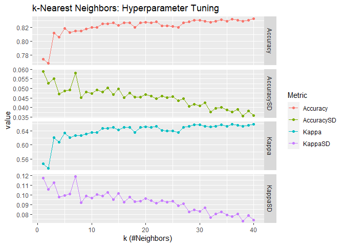
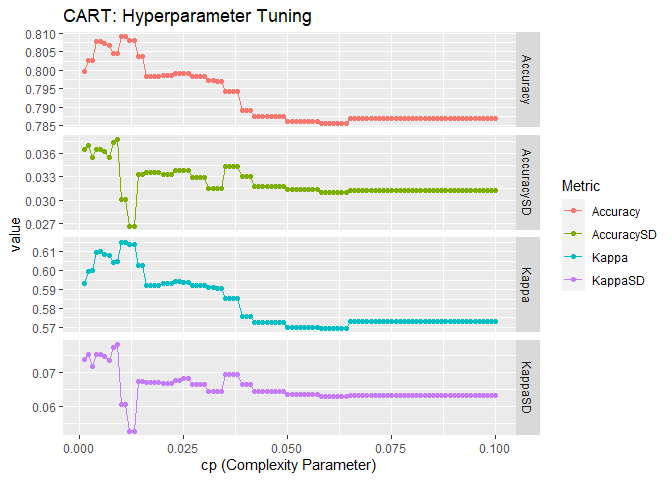
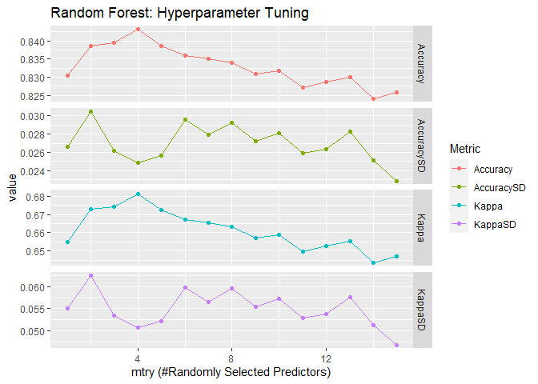

\# KNN and Tree Based Ensemble Models
================
Chien-Lan Hsueh
2022-07-04

- [Project Goal](#project-goal)
- [Set up: Packages and Helper
  Functions](#set-up-packages-and-helper-functions)
- [Data](#data)
- [Split the Data](#split-the-data)
- [Part 1: kNN](#part-1-knn)
- [Part 2: Ensemble](#part-2-ensemble)
- [Comparison](#comparison)

## Project Goal

In this report, we conduct an exploratory data analysis (EDA) on the
[Heart Failure Prediction
Dataset](https://www.kaggle.com/datasets/fedesoriano/heart-failure-prediction).
Then we fit KNN and ensemble models with repeated cross-validation on
training data Test the models by finding the confusion matrix on the
test data:

- K-Nearest Neighbors (KNN)
- Ensemble Models
  - Classification Tree
  - Bagged Tree
  - Random Forests
  - Generalized Boosted Regression Models

## Set up: Packages and Helper Functions

In this task, we will use the following packages:

- `here`: enables easy file referencing and builds file paths in a
  OS-independent way
- `stats`: loads this before loading `tidyverse` to avoid masking some
  `tidyverse` functions
- `tidyverse`: includes collections of useful packages like `dplyr`
  (data manipulation), `tidyr` (tidying data), `ggplots` (creating
  graphs), etc.
- `glue`: embeds and evaluates R expressions into strings to be printed
  as messages
- `scales`: formats and labels scales nicely for better visualization
- `caret`: training and plotting classification and regression models
- `rpart`: recursive partitioning for classification, regression and
  survival trees.
- `randomForest`: classification and regression based on a forest of
  trees using random inputs.
- `gbm`: generalized boosted regression models

First, we define a helper functions to reduce repeating codes. This
function trains models with cross validation to tune parameters and
apply the best model on test set to see its performance.

> Arguments:
>
> - `form`: formula
> - `df_train`: training set
> - `df_test`: test set
> - `method`: classification or regression model to use
> - `trControl`: a list of values that define how train acts
> - `tuneGrid`: a data frame with possible tuning values
> - `plot`: whether to plot parameter and metric
> - `...`: arguments passed to the classification or regression routine
>
> Returned Value: a confusion matrix

``` r
fit_model <- function(form, df_train, df_test, method, trControl, tuneGrid = NULL, plot = T, ...) {
  # train model
  fit <- train(
    form = form,
    data = df_train,
    method = method,
    preProcess = c("center", "scale"),
    trControl = trControl,
    tuneGrid = tuneGrid, ...)
  
  # print the best tune if there is a tuning parameter
  if(is.null(tuneGrid)){
    print("No tuning parameter")
  } else {
    # print the best tune 
    print("The best tune is found with:")
    print(glue("\t{names(fit$bestTune)} = {fit$bestTune[1,]}"))
  
    if(plot){
      # get model info
      model <- fit$modelInfo$label
      parameter <- fit$modelInfo$parameters$parameter
      description <- fit$modelInfo$parameters$label
      
      # plot parameter vs metrics
      p <- fit$results %>% 
        rename_at(1, ~"x") %>% 
        pivot_longer(cols = -1, names_to = "Metric") %>% 
        ggplot(aes(x, value, color = Metric)) +
        geom_point() +
        geom_line() +
        facet_grid(rows = vars(Metric), scales = "free_y") +
        labs(
          title = glue("{model}: Hyperparameter Tuning"),
          x = glue("{parameter} ({description})")
        )
      print(p)
    }
  }
  
  # make prediction on test set
  pred <- predict(fit, newdata = df_test)

  # confusion matrix
  cfm <- confusionMatrix(df_test[,1] %>% as_vector(), pred)
  
  # print confusion matrix and accuracy
  print("Confusion table:")
  print(cfm$table)
  print(glue("Accuracy = {cfm$overall['Accuracy']}"))

  # return the confusion matrix
  return(cfm)
}
```

## Data

The [Heart Failure Prediction
Dataset](https://www.kaggle.com/datasets/fedesoriano/heart-failure-prediction)
gives information about whether or not someone has heart disease along
with different measurements about that person’s health. A local copy is
saved in the `data` folder. Since the original column names contain
space and special characters, and are long as well, we rename the
columns when we read the data in.

``` r
df_raw <- read_csv(here("data", "heart.csv"))
```

    ## Rows: 918 Columns: 12
    ## ── Column specification ────────────────────────────────────────────────────────
    ## Delimiter: ","
    ## chr (5): Sex, ChestPainType, RestingECG, ExerciseAngina, ST_Slope
    ## dbl (7): Age, RestingBP, Cholesterol, FastingBS, MaxHR, Oldpeak, HeartDisease
    ## 
    ## ℹ Use `spec()` to retrieve the full column specification for this data.
    ## ℹ Specify the column types or set `show_col_types = FALSE` to quiet this message.

``` r
# show the raw data
df_raw
```

<div class="kable-table">

| Age | Sex | ChestPainType | RestingBP | Cholesterol | FastingBS | RestingECG | MaxHR | ExerciseAngina | Oldpeak | ST_Slope | HeartDisease |
|----:|:----|:--------------|----------:|------------:|----------:|:-----------|------:|:---------------|--------:|:---------|-------------:|
|  40 | M   | ATA           |       140 |         289 |         0 | Normal     |   172 | N              |     0.0 | Up       |            0 |
|  49 | F   | NAP           |       160 |         180 |         0 | Normal     |   156 | N              |     1.0 | Flat     |            1 |
|  37 | M   | ATA           |       130 |         283 |         0 | ST         |    98 | N              |     0.0 | Up       |            0 |
|  48 | F   | ASY           |       138 |         214 |         0 | Normal     |   108 | Y              |     1.5 | Flat     |            1 |
|  54 | M   | NAP           |       150 |         195 |         0 | Normal     |   122 | N              |     0.0 | Up       |            0 |
|  39 | M   | NAP           |       120 |         339 |         0 | Normal     |   170 | N              |     0.0 | Up       |            0 |
|  45 | F   | ATA           |       130 |         237 |         0 | Normal     |   170 | N              |     0.0 | Up       |            0 |
|  54 | M   | ATA           |       110 |         208 |         0 | Normal     |   142 | N              |     0.0 | Up       |            0 |
|  37 | M   | ASY           |       140 |         207 |         0 | Normal     |   130 | Y              |     1.5 | Flat     |            1 |
|  48 | F   | ATA           |       120 |         284 |         0 | Normal     |   120 | N              |     0.0 | Up       |            0 |
|  37 | F   | NAP           |       130 |         211 |         0 | Normal     |   142 | N              |     0.0 | Up       |            0 |
|  58 | M   | ATA           |       136 |         164 |         0 | ST         |    99 | Y              |     2.0 | Flat     |            1 |
|  39 | M   | ATA           |       120 |         204 |         0 | Normal     |   145 | N              |     0.0 | Up       |            0 |
|  49 | M   | ASY           |       140 |         234 |         0 | Normal     |   140 | Y              |     1.0 | Flat     |            1 |
|  42 | F   | NAP           |       115 |         211 |         0 | ST         |   137 | N              |     0.0 | Up       |            0 |
|  54 | F   | ATA           |       120 |         273 |         0 | Normal     |   150 | N              |     1.5 | Flat     |            0 |
|  38 | M   | ASY           |       110 |         196 |         0 | Normal     |   166 | N              |     0.0 | Flat     |            1 |
|  43 | F   | ATA           |       120 |         201 |         0 | Normal     |   165 | N              |     0.0 | Up       |            0 |
|  60 | M   | ASY           |       100 |         248 |         0 | Normal     |   125 | N              |     1.0 | Flat     |            1 |
|  36 | M   | ATA           |       120 |         267 |         0 | Normal     |   160 | N              |     3.0 | Flat     |            1 |
|  43 | F   | TA            |       100 |         223 |         0 | Normal     |   142 | N              |     0.0 | Up       |            0 |
|  44 | M   | ATA           |       120 |         184 |         0 | Normal     |   142 | N              |     1.0 | Flat     |            0 |
|  49 | F   | ATA           |       124 |         201 |         0 | Normal     |   164 | N              |     0.0 | Up       |            0 |
|  44 | M   | ATA           |       150 |         288 |         0 | Normal     |   150 | Y              |     3.0 | Flat     |            1 |
|  40 | M   | NAP           |       130 |         215 |         0 | Normal     |   138 | N              |     0.0 | Up       |            0 |
|  36 | M   | NAP           |       130 |         209 |         0 | Normal     |   178 | N              |     0.0 | Up       |            0 |
|  53 | M   | ASY           |       124 |         260 |         0 | ST         |   112 | Y              |     3.0 | Flat     |            0 |
|  52 | M   | ATA           |       120 |         284 |         0 | Normal     |   118 | N              |     0.0 | Up       |            0 |
|  53 | F   | ATA           |       113 |         468 |         0 | Normal     |   127 | N              |     0.0 | Up       |            0 |
|  51 | M   | ATA           |       125 |         188 |         0 | Normal     |   145 | N              |     0.0 | Up       |            0 |
|  53 | M   | NAP           |       145 |         518 |         0 | Normal     |   130 | N              |     0.0 | Flat     |            1 |
|  56 | M   | NAP           |       130 |         167 |         0 | Normal     |   114 | N              |     0.0 | Up       |            0 |
|  54 | M   | ASY           |       125 |         224 |         0 | Normal     |   122 | N              |     2.0 | Flat     |            1 |
|  41 | M   | ASY           |       130 |         172 |         0 | ST         |   130 | N              |     2.0 | Flat     |            1 |
|  43 | F   | ATA           |       150 |         186 |         0 | Normal     |   154 | N              |     0.0 | Up       |            0 |
|  32 | M   | ATA           |       125 |         254 |         0 | Normal     |   155 | N              |     0.0 | Up       |            0 |
|  65 | M   | ASY           |       140 |         306 |         1 | Normal     |    87 | Y              |     1.5 | Flat     |            1 |
|  41 | F   | ATA           |       110 |         250 |         0 | ST         |   142 | N              |     0.0 | Up       |            0 |
|  48 | F   | ATA           |       120 |         177 |         1 | ST         |   148 | N              |     0.0 | Up       |            0 |
|  48 | F   | ASY           |       150 |         227 |         0 | Normal     |   130 | Y              |     1.0 | Flat     |            0 |
|  54 | F   | ATA           |       150 |         230 |         0 | Normal     |   130 | N              |     0.0 | Up       |            0 |
|  54 | F   | NAP           |       130 |         294 |         0 | ST         |   100 | Y              |     0.0 | Flat     |            1 |
|  35 | M   | ATA           |       150 |         264 |         0 | Normal     |   168 | N              |     0.0 | Up       |            0 |
|  52 | M   | NAP           |       140 |         259 |         0 | ST         |   170 | N              |     0.0 | Up       |            0 |
|  43 | M   | ASY           |       120 |         175 |         0 | Normal     |   120 | Y              |     1.0 | Flat     |            1 |
|  59 | M   | NAP           |       130 |         318 |         0 | Normal     |   120 | Y              |     1.0 | Flat     |            0 |
|  37 | M   | ASY           |       120 |         223 |         0 | Normal     |   168 | N              |     0.0 | Up       |            0 |
|  50 | M   | ATA           |       140 |         216 |         0 | Normal     |   170 | N              |     0.0 | Up       |            0 |
|  36 | M   | NAP           |       112 |         340 |         0 | Normal     |   184 | N              |     1.0 | Flat     |            0 |
|  41 | M   | ASY           |       110 |         289 |         0 | Normal     |   170 | N              |     0.0 | Flat     |            1 |
|  50 | M   | ASY           |       130 |         233 |         0 | Normal     |   121 | Y              |     2.0 | Flat     |            1 |
|  47 | F   | ASY           |       120 |         205 |         0 | Normal     |    98 | Y              |     2.0 | Flat     |            1 |
|  45 | M   | ATA           |       140 |         224 |         1 | Normal     |   122 | N              |     0.0 | Up       |            0 |
|  41 | F   | ATA           |       130 |         245 |         0 | Normal     |   150 | N              |     0.0 | Up       |            0 |
|  52 | F   | ASY           |       130 |         180 |         0 | Normal     |   140 | Y              |     1.5 | Flat     |            0 |
|  51 | F   | ATA           |       160 |         194 |         0 | Normal     |   170 | N              |     0.0 | Up       |            0 |
|  31 | M   | ASY           |       120 |         270 |         0 | Normal     |   153 | Y              |     1.5 | Flat     |            1 |
|  58 | M   | NAP           |       130 |         213 |         0 | ST         |   140 | N              |     0.0 | Flat     |            1 |
|  54 | M   | ASY           |       150 |         365 |         0 | ST         |   134 | N              |     1.0 | Up       |            0 |
|  52 | M   | ASY           |       112 |         342 |         0 | ST         |    96 | Y              |     1.0 | Flat     |            1 |
|  49 | M   | ATA           |       100 |         253 |         0 | Normal     |   174 | N              |     0.0 | Up       |            0 |
|  43 | F   | NAP           |       150 |         254 |         0 | Normal     |   175 | N              |     0.0 | Up       |            0 |
|  45 | M   | ASY           |       140 |         224 |         0 | Normal     |   144 | N              |     0.0 | Up       |            0 |
|  46 | M   | ASY           |       120 |         277 |         0 | Normal     |   125 | Y              |     1.0 | Flat     |            1 |
|  50 | F   | ATA           |       110 |         202 |         0 | Normal     |   145 | N              |     0.0 | Up       |            0 |
|  37 | F   | ATA           |       120 |         260 |         0 | Normal     |   130 | N              |     0.0 | Up       |            0 |
|  45 | F   | ASY           |       132 |         297 |         0 | Normal     |   144 | N              |     0.0 | Up       |            0 |
|  32 | M   | ATA           |       110 |         225 |         0 | Normal     |   184 | N              |     0.0 | Up       |            0 |
|  52 | M   | ASY           |       160 |         246 |         0 | ST         |    82 | Y              |     4.0 | Flat     |            1 |
|  44 | M   | ASY           |       150 |         412 |         0 | Normal     |   170 | N              |     0.0 | Up       |            0 |
|  57 | M   | ATA           |       140 |         265 |         0 | ST         |   145 | Y              |     1.0 | Flat     |            1 |
|  44 | M   | ATA           |       130 |         215 |         0 | Normal     |   135 | N              |     0.0 | Up       |            0 |
|  52 | M   | ASY           |       120 |         182 |         0 | Normal     |   150 | N              |     0.0 | Flat     |            1 |
|  44 | F   | ASY           |       120 |         218 |         0 | ST         |   115 | N              |     0.0 | Up       |            0 |
|  55 | M   | ASY           |       140 |         268 |         0 | Normal     |   128 | Y              |     1.5 | Flat     |            1 |
|  46 | M   | NAP           |       150 |         163 |         0 | Normal     |   116 | N              |     0.0 | Up       |            0 |
|  32 | M   | ASY           |       118 |         529 |         0 | Normal     |   130 | N              |     0.0 | Flat     |            1 |
|  35 | F   | ASY           |       140 |         167 |         0 | Normal     |   150 | N              |     0.0 | Up       |            0 |
|  52 | M   | ATA           |       140 |         100 |         0 | Normal     |   138 | Y              |     0.0 | Up       |            0 |
|  49 | M   | ASY           |       130 |         206 |         0 | Normal     |   170 | N              |     0.0 | Flat     |            1 |
|  55 | M   | NAP           |       110 |         277 |         0 | Normal     |   160 | N              |     0.0 | Up       |            0 |
|  54 | M   | ATA           |       120 |         238 |         0 | Normal     |   154 | N              |     0.0 | Up       |            0 |
|  63 | M   | ASY           |       150 |         223 |         0 | Normal     |   115 | N              |     0.0 | Flat     |            1 |
|  52 | M   | ATA           |       160 |         196 |         0 | Normal     |   165 | N              |     0.0 | Up       |            0 |
|  56 | M   | ASY           |       150 |         213 |         1 | Normal     |   125 | Y              |     1.0 | Flat     |            1 |
|  66 | M   | ASY           |       140 |         139 |         0 | Normal     |    94 | Y              |     1.0 | Flat     |            1 |
|  65 | M   | ASY           |       170 |         263 |         1 | Normal     |   112 | Y              |     2.0 | Flat     |            1 |
|  53 | F   | ATA           |       140 |         216 |         0 | Normal     |   142 | Y              |     2.0 | Flat     |            0 |
|  43 | M   | TA            |       120 |         291 |         0 | ST         |   155 | N              |     0.0 | Flat     |            1 |
|  55 | M   | ASY           |       140 |         229 |         0 | Normal     |   110 | Y              |     0.5 | Flat     |            0 |
|  49 | F   | ATA           |       110 |         208 |         0 | Normal     |   160 | N              |     0.0 | Up       |            0 |
|  39 | M   | ASY           |       130 |         307 |         0 | Normal     |   140 | N              |     0.0 | Up       |            0 |
|  52 | F   | ATA           |       120 |         210 |         0 | Normal     |   148 | N              |     0.0 | Up       |            0 |
|  48 | M   | ASY           |       160 |         329 |         0 | Normal     |    92 | Y              |     1.5 | Flat     |            1 |
|  39 | F   | NAP           |       110 |         182 |         0 | ST         |   180 | N              |     0.0 | Up       |            0 |
|  58 | M   | ASY           |       130 |         263 |         0 | Normal     |   140 | Y              |     2.0 | Flat     |            1 |
|  43 | M   | ATA           |       142 |         207 |         0 | Normal     |   138 | N              |     0.0 | Up       |            0 |
|  39 | M   | NAP           |       160 |         147 |         1 | Normal     |   160 | N              |     0.0 | Up       |            0 |
|  56 | M   | ASY           |       120 |          85 |         0 | Normal     |   140 | N              |     0.0 | Up       |            0 |
|  41 | M   | ATA           |       125 |         269 |         0 | Normal     |   144 | N              |     0.0 | Up       |            0 |
|  65 | M   | ASY           |       130 |         275 |         0 | ST         |   115 | Y              |     1.0 | Flat     |            1 |
|  51 | M   | ASY           |       130 |         179 |         0 | Normal     |   100 | N              |     0.0 | Up       |            0 |
|  40 | F   | ASY           |       150 |         392 |         0 | Normal     |   130 | N              |     2.0 | Flat     |            1 |
|  40 | M   | ASY           |       120 |         466 |         1 | Normal     |   152 | Y              |     1.0 | Flat     |            1 |
|  46 | M   | ASY           |       118 |         186 |         0 | Normal     |   124 | N              |     0.0 | Flat     |            1 |
|  57 | M   | ATA           |       140 |         260 |         1 | Normal     |   140 | N              |     0.0 | Up       |            0 |
|  48 | F   | ASY           |       120 |         254 |         0 | ST         |   110 | N              |     0.0 | Up       |            0 |
|  34 | M   | ATA           |       150 |         214 |         0 | ST         |   168 | N              |     0.0 | Up       |            0 |
|  50 | M   | ASY           |       140 |         129 |         0 | Normal     |   135 | N              |     0.0 | Up       |            0 |
|  39 | M   | ATA           |       190 |         241 |         0 | Normal     |   106 | N              |     0.0 | Up       |            0 |
|  59 | F   | ATA           |       130 |         188 |         0 | Normal     |   124 | N              |     1.0 | Flat     |            0 |
|  57 | M   | ASY           |       150 |         255 |         0 | Normal     |    92 | Y              |     3.0 | Flat     |            1 |
|  47 | M   | ASY           |       140 |         276 |         1 | Normal     |   125 | Y              |     0.0 | Up       |            0 |
|  38 | M   | ATA           |       140 |         297 |         0 | Normal     |   150 | N              |     0.0 | Up       |            0 |
|  49 | F   | NAP           |       130 |         207 |         0 | ST         |   135 | N              |     0.0 | Up       |            0 |
|  33 | F   | ASY           |       100 |         246 |         0 | Normal     |   150 | Y              |     1.0 | Flat     |            1 |
|  38 | M   | ASY           |       120 |         282 |         0 | Normal     |   170 | N              |     0.0 | Flat     |            1 |
|  59 | F   | ASY           |       130 |         338 |         1 | ST         |   130 | Y              |     1.5 | Flat     |            1 |
|  35 | F   | TA            |       120 |         160 |         0 | ST         |   185 | N              |     0.0 | Up       |            0 |
|  34 | M   | TA            |       140 |         156 |         0 | Normal     |   180 | N              |     0.0 | Flat     |            1 |
|  47 | F   | NAP           |       135 |         248 |         1 | Normal     |   170 | N              |     0.0 | Flat     |            1 |
|  52 | F   | NAP           |       125 |         272 |         0 | Normal     |   139 | N              |     0.0 | Up       |            0 |
|  46 | M   | ASY           |       110 |         240 |         0 | ST         |   140 | N              |     0.0 | Up       |            0 |
|  58 | F   | ATA           |       180 |         393 |         0 | Normal     |   110 | Y              |     1.0 | Flat     |            1 |
|  58 | M   | ATA           |       130 |         230 |         0 | Normal     |   150 | N              |     0.0 | Up       |            0 |
|  54 | M   | ATA           |       120 |         246 |         0 | Normal     |   110 | N              |     0.0 | Up       |            0 |
|  34 | F   | ATA           |       130 |         161 |         0 | Normal     |   190 | N              |     0.0 | Up       |            0 |
|  48 | F   | ASY           |       108 |         163 |         0 | Normal     |   175 | N              |     2.0 | Up       |            0 |
|  54 | F   | ATA           |       120 |         230 |         1 | Normal     |   140 | N              |     0.0 | Up       |            0 |
|  42 | M   | NAP           |       120 |         228 |         0 | Normal     |   152 | Y              |     1.5 | Flat     |            0 |
|  38 | M   | NAP           |       145 |         292 |         0 | Normal     |   130 | N              |     0.0 | Up       |            0 |
|  46 | M   | ASY           |       110 |         202 |         0 | Normal     |   150 | Y              |     0.0 | Flat     |            1 |
|  56 | M   | ASY           |       170 |         388 |         0 | ST         |   122 | Y              |     2.0 | Flat     |            1 |
|  56 | M   | ASY           |       150 |         230 |         0 | ST         |   124 | Y              |     1.5 | Flat     |            1 |
|  61 | F   | ASY           |       130 |         294 |         0 | ST         |   120 | Y              |     1.0 | Flat     |            0 |
|  49 | M   | NAP           |       115 |         265 |         0 | Normal     |   175 | N              |     0.0 | Flat     |            1 |
|  43 | F   | ATA           |       120 |         215 |         0 | ST         |   175 | N              |     0.0 | Up       |            0 |
|  39 | M   | ATA           |       120 |         241 |         0 | ST         |   146 | N              |     2.0 | Up       |            0 |
|  54 | M   | ASY           |       140 |         166 |         0 | Normal     |   118 | Y              |     0.0 | Flat     |            1 |
|  43 | M   | ASY           |       150 |         247 |         0 | Normal     |   130 | Y              |     2.0 | Flat     |            1 |
|  52 | M   | ASY           |       160 |         331 |         0 | Normal     |    94 | Y              |     2.5 | Flat     |            1 |
|  50 | M   | ASY           |       140 |         341 |         0 | ST         |   125 | Y              |     2.5 | Flat     |            1 |
|  47 | M   | ASY           |       160 |         291 |         0 | ST         |   158 | Y              |     3.0 | Flat     |            1 |
|  53 | M   | ASY           |       140 |         243 |         0 | Normal     |   155 | N              |     0.0 | Up       |            0 |
|  56 | F   | ATA           |       120 |         279 |         0 | Normal     |   150 | N              |     1.0 | Flat     |            1 |
|  39 | M   | ASY           |       110 |         273 |         0 | Normal     |   132 | N              |     0.0 | Up       |            0 |
|  42 | M   | ATA           |       120 |         198 |         0 | Normal     |   155 | N              |     0.0 | Up       |            0 |
|  43 | F   | ATA           |       120 |         249 |         0 | ST         |   176 | N              |     0.0 | Up       |            0 |
|  50 | M   | ATA           |       120 |         168 |         0 | Normal     |   160 | N              |     0.0 | Up       |            0 |
|  54 | M   | ASY           |       130 |         603 |         1 | Normal     |   125 | Y              |     1.0 | Flat     |            1 |
|  39 | M   | ATA           |       130 |         215 |         0 | Normal     |   120 | N              |     0.0 | Up       |            0 |
|  48 | M   | ATA           |       100 |         159 |         0 | Normal     |   100 | N              |     0.0 | Up       |            0 |
|  40 | M   | ATA           |       130 |         275 |         0 | Normal     |   150 | N              |     0.0 | Up       |            0 |
|  55 | M   | ASY           |       120 |         270 |         0 | Normal     |   140 | N              |     0.0 | Up       |            0 |
|  41 | M   | ATA           |       120 |         291 |         0 | ST         |   160 | N              |     0.0 | Up       |            0 |
|  56 | M   | ASY           |       155 |         342 |         1 | Normal     |   150 | Y              |     3.0 | Flat     |            1 |
|  38 | M   | ASY           |       110 |         190 |         0 | Normal     |   150 | Y              |     1.0 | Flat     |            1 |
|  49 | M   | ASY           |       140 |         185 |         0 | Normal     |   130 | N              |     0.0 | Up       |            0 |
|  44 | M   | ASY           |       130 |         290 |         0 | Normal     |   100 | Y              |     2.0 | Flat     |            1 |
|  54 | M   | ATA           |       160 |         195 |         0 | ST         |   130 | N              |     1.0 | Up       |            0 |
|  59 | M   | ASY           |       140 |         264 |         1 | LVH        |   119 | Y              |     0.0 | Flat     |            1 |
|  49 | M   | ASY           |       128 |         212 |         0 | Normal     |    96 | Y              |     0.0 | Flat     |            1 |
|  47 | M   | ATA           |       160 |         263 |         0 | Normal     |   174 | N              |     0.0 | Up       |            0 |
|  42 | M   | ATA           |       120 |         196 |         0 | Normal     |   150 | N              |     0.0 | Up       |            0 |
|  52 | F   | ATA           |       140 |         225 |         0 | Normal     |   140 | N              |     0.0 | Up       |            0 |
|  46 | M   | TA            |       140 |         272 |         1 | Normal     |   175 | N              |     2.0 | Flat     |            1 |
|  50 | M   | ASY           |       140 |         231 |         0 | ST         |   140 | Y              |     5.0 | Flat     |            1 |
|  48 | M   | ATA           |       140 |         238 |         0 | Normal     |   118 | N              |     0.0 | Up       |            0 |
|  58 | M   | ASY           |       135 |         222 |         0 | Normal     |   100 | N              |     0.0 | Up       |            0 |
|  58 | M   | NAP           |       140 |         179 |         0 | Normal     |   160 | N              |     0.0 | Up       |            0 |
|  29 | M   | ATA           |       120 |         243 |         0 | Normal     |   160 | N              |     0.0 | Up       |            0 |
|  40 | M   | NAP           |       140 |         235 |         0 | Normal     |   188 | N              |     0.0 | Up       |            0 |
|  53 | M   | ATA           |       140 |         320 |         0 | Normal     |   162 | N              |     0.0 | Up       |            0 |
|  49 | M   | NAP           |       140 |         187 |         0 | Normal     |   172 | N              |     0.0 | Up       |            0 |
|  52 | M   | ASY           |       140 |         266 |         0 | Normal     |   134 | Y              |     2.0 | Flat     |            1 |
|  43 | M   | ASY           |       140 |         288 |         0 | Normal     |   135 | Y              |     2.0 | Flat     |            1 |
|  54 | M   | ASY           |       140 |         216 |         0 | Normal     |   105 | N              |     1.5 | Flat     |            1 |
|  59 | M   | ATA           |       140 |         287 |         0 | Normal     |   150 | N              |     0.0 | Up       |            0 |
|  37 | M   | NAP           |       130 |         194 |         0 | Normal     |   150 | N              |     0.0 | Up       |            0 |
|  46 | F   | ASY           |       130 |         238 |         0 | Normal     |    90 | N              |     0.0 | Up       |            0 |
|  52 | M   | ASY           |       130 |         225 |         0 | Normal     |   120 | Y              |     2.0 | Flat     |            1 |
|  51 | M   | ATA           |       130 |         224 |         0 | Normal     |   150 | N              |     0.0 | Up       |            0 |
|  52 | M   | ASY           |       140 |         404 |         0 | Normal     |   124 | Y              |     2.0 | Flat     |            1 |
|  46 | M   | ASY           |       110 |         238 |         0 | ST         |   140 | Y              |     1.0 | Flat     |            0 |
|  54 | F   | ATA           |       160 |         312 |         0 | Normal     |   130 | N              |     0.0 | Up       |            0 |
|  58 | M   | NAP           |       160 |         211 |         1 | ST         |    92 | N              |     0.0 | Flat     |            1 |
|  58 | M   | ATA           |       130 |         251 |         0 | Normal     |   110 | N              |     0.0 | Up       |            0 |
|  41 | M   | ASY           |       120 |         237 |         1 | Normal     |   138 | Y              |     1.0 | Flat     |            1 |
|  50 | F   | ASY           |       120 |         328 |         0 | Normal     |   110 | Y              |     1.0 | Flat     |            0 |
|  53 | M   | ASY           |       180 |         285 |         0 | ST         |   120 | Y              |     1.5 | Flat     |            1 |
|  46 | M   | ASY           |       180 |         280 |         0 | ST         |   120 | N              |     0.0 | Up       |            0 |
|  50 | M   | ATA           |       170 |         209 |         0 | ST         |   116 | N              |     0.0 | Up       |            0 |
|  48 | M   | ATA           |       130 |         245 |         0 | Normal     |   160 | N              |     0.0 | Up       |            0 |
|  45 | M   | NAP           |       135 |         192 |         0 | Normal     |   110 | N              |     0.0 | Up       |            0 |
|  41 | F   | ATA           |       125 |         184 |         0 | Normal     |   180 | N              |     0.0 | Up       |            0 |
|  62 | F   | TA            |       160 |         193 |         0 | Normal     |   116 | N              |     0.0 | Up       |            0 |
|  49 | M   | ASY           |       120 |         297 |         0 | Normal     |   132 | N              |     1.0 | Flat     |            0 |
|  42 | M   | ATA           |       150 |         268 |         0 | Normal     |   136 | N              |     0.0 | Up       |            0 |
|  53 | M   | ASY           |       120 |         246 |         0 | Normal     |   116 | Y              |     0.0 | Flat     |            1 |
|  57 | F   | TA            |       130 |         308 |         0 | Normal     |    98 | N              |     1.0 | Flat     |            0 |
|  47 | M   | TA            |       110 |         249 |         0 | Normal     |   150 | N              |     0.0 | Up       |            0 |
|  46 | M   | NAP           |       120 |         230 |         0 | Normal     |   150 | N              |     0.0 | Up       |            0 |
|  42 | M   | NAP           |       160 |         147 |         0 | Normal     |   146 | N              |     0.0 | Up       |            0 |
|  31 | F   | ATA           |       100 |         219 |         0 | ST         |   150 | N              |     0.0 | Up       |            0 |
|  56 | M   | ATA           |       130 |         184 |         0 | Normal     |   100 | N              |     0.0 | Up       |            0 |
|  50 | M   | ASY           |       150 |         215 |         0 | Normal     |   140 | Y              |     0.0 | Up       |            0 |
|  35 | M   | ATA           |       120 |         308 |         0 | LVH        |   180 | N              |     0.0 | Up       |            0 |
|  35 | M   | ATA           |       110 |         257 |         0 | Normal     |   140 | N              |     0.0 | Flat     |            1 |
|  28 | M   | ATA           |       130 |         132 |         0 | LVH        |   185 | N              |     0.0 | Up       |            0 |
|  54 | M   | ASY           |       125 |         216 |         0 | Normal     |   140 | N              |     0.0 | Flat     |            1 |
|  48 | M   | ASY           |       106 |         263 |         1 | Normal     |   110 | N              |     0.0 | Flat     |            1 |
|  50 | F   | NAP           |       140 |         288 |         0 | Normal     |   140 | Y              |     0.0 | Flat     |            1 |
|  56 | M   | NAP           |       130 |         276 |         0 | Normal     |   128 | Y              |     1.0 | Up       |            0 |
|  56 | F   | NAP           |       130 |         219 |         0 | ST         |   164 | N              |     0.0 | Up       |            0 |
|  47 | M   | ASY           |       150 |         226 |         0 | Normal     |    98 | Y              |     1.5 | Flat     |            1 |
|  30 | F   | TA            |       170 |         237 |         0 | ST         |   170 | N              |     0.0 | Up       |            0 |
|  39 | M   | ASY           |       110 |         280 |         0 | Normal     |   150 | N              |     0.0 | Flat     |            1 |
|  54 | M   | NAP           |       120 |         217 |         0 | Normal     |   137 | N              |     0.0 | Up       |            0 |
|  55 | M   | ATA           |       140 |         196 |         0 | Normal     |   150 | N              |     0.0 | Up       |            0 |
|  29 | M   | ATA           |       140 |         263 |         0 | Normal     |   170 | N              |     0.0 | Up       |            0 |
|  46 | M   | ASY           |       130 |         222 |         0 | Normal     |   112 | N              |     0.0 | Flat     |            1 |
|  51 | F   | ASY           |       160 |         303 |         0 | Normal     |   150 | Y              |     1.0 | Flat     |            1 |
|  48 | F   | NAP           |       120 |         195 |         0 | Normal     |   125 | N              |     0.0 | Up       |            0 |
|  33 | M   | NAP           |       120 |         298 |         0 | Normal     |   185 | N              |     0.0 | Up       |            0 |
|  55 | M   | ATA           |       120 |         256 |         1 | Normal     |   137 | N              |     0.0 | Up       |            0 |
|  50 | M   | ASY           |       145 |         264 |         0 | Normal     |   150 | N              |     0.0 | Flat     |            1 |
|  53 | M   | NAP           |       120 |         195 |         0 | Normal     |   140 | N              |     0.0 | Up       |            0 |
|  38 | M   | ASY           |        92 |         117 |         0 | Normal     |   134 | Y              |     2.5 | Flat     |            1 |
|  41 | M   | ATA           |       120 |         295 |         0 | Normal     |   170 | N              |     0.0 | Up       |            0 |
|  37 | F   | ASY           |       130 |         173 |         0 | ST         |   184 | N              |     0.0 | Up       |            0 |
|  37 | M   | ASY           |       130 |         315 |         0 | Normal     |   158 | N              |     0.0 | Up       |            0 |
|  40 | M   | NAP           |       130 |         281 |         0 | Normal     |   167 | N              |     0.0 | Up       |            0 |
|  38 | F   | ATA           |       120 |         275 |         0 | Normal     |   129 | N              |     0.0 | Up       |            0 |
|  41 | M   | ASY           |       112 |         250 |         0 | Normal     |   142 | N              |     0.0 | Up       |            0 |
|  54 | F   | ATA           |       140 |         309 |         0 | ST         |   140 | N              |     0.0 | Up       |            0 |
|  39 | M   | ATA           |       120 |         200 |         0 | Normal     |   160 | Y              |     1.0 | Flat     |            0 |
|  41 | M   | ASY           |       120 |         336 |         0 | Normal     |   118 | Y              |     3.0 | Flat     |            1 |
|  55 | M   | TA            |       140 |         295 |         0 | Normal     |   136 | N              |     0.0 | Flat     |            1 |
|  48 | M   | ASY           |       160 |         355 |         0 | Normal     |    99 | Y              |     2.0 | Flat     |            1 |
|  48 | M   | ASY           |       160 |         193 |         0 | Normal     |   102 | Y              |     3.0 | Flat     |            1 |
|  55 | M   | ATA           |       145 |         326 |         0 | Normal     |   155 | N              |     0.0 | Up       |            0 |
|  54 | M   | ASY           |       200 |         198 |         0 | Normal     |   142 | Y              |     2.0 | Flat     |            1 |
|  55 | M   | ATA           |       160 |         292 |         1 | Normal     |   143 | Y              |     2.0 | Flat     |            1 |
|  43 | F   | ATA           |       120 |         266 |         0 | Normal     |   118 | N              |     0.0 | Up       |            0 |
|  48 | M   | ASY           |       160 |         268 |         0 | Normal     |   103 | Y              |     1.0 | Flat     |            1 |
|  54 | M   | TA            |       120 |         171 |         0 | Normal     |   137 | N              |     2.0 | Up       |            0 |
|  54 | M   | NAP           |       120 |         237 |         0 | Normal     |   150 | Y              |     1.5 | Flat     |            1 |
|  48 | M   | ASY           |       122 |         275 |         1 | ST         |   150 | Y              |     2.0 | Down     |            1 |
|  45 | M   | ASY           |       130 |         219 |         0 | ST         |   130 | Y              |     1.0 | Flat     |            1 |
|  49 | M   | ASY           |       130 |         341 |         0 | Normal     |   120 | Y              |     1.0 | Flat     |            1 |
|  44 | M   | ASY           |       135 |         491 |         0 | Normal     |   135 | N              |     0.0 | Flat     |            1 |
|  48 | M   | ASY           |       120 |         260 |         0 | Normal     |   115 | N              |     2.0 | Flat     |            1 |
|  61 | M   | ASY           |       125 |         292 |         0 | ST         |   115 | Y              |     0.0 | Up       |            0 |
|  62 | M   | ATA           |       140 |         271 |         0 | Normal     |   152 | N              |     1.0 | Up       |            0 |
|  55 | M   | ASY           |       145 |         248 |         0 | Normal     |    96 | Y              |     2.0 | Flat     |            1 |
|  53 | F   | NAP           |       120 |         274 |         0 | Normal     |   130 | N              |     0.0 | Up       |            0 |
|  55 | F   | ATA           |       130 |         394 |         0 | LVH        |   150 | N              |     0.0 | Up       |            0 |
|  36 | M   | NAP           |       150 |         160 |         0 | Normal     |   172 | N              |     0.0 | Up       |            0 |
|  51 | F   | NAP           |       150 |         200 |         0 | Normal     |   120 | N              |     0.5 | Up       |            0 |
|  55 | F   | ATA           |       122 |         320 |         0 | Normal     |   155 | N              |     0.0 | Up       |            0 |
|  46 | M   | ATA           |       140 |         275 |         0 | Normal     |   165 | Y              |     0.0 | Up       |            0 |
|  54 | F   | ATA           |       120 |         221 |         0 | Normal     |   138 | N              |     1.0 | Up       |            0 |
|  46 | M   | ASY           |       120 |         231 |         0 | Normal     |   115 | Y              |     0.0 | Flat     |            1 |
|  59 | M   | ASY           |       130 |         126 |         0 | Normal     |   125 | N              |     0.0 | Flat     |            1 |
|  47 | M   | NAP           |       140 |         193 |         0 | Normal     |   145 | Y              |     1.0 | Flat     |            1 |
|  54 | M   | ATA           |       160 |         305 |         0 | Normal     |   175 | N              |     0.0 | Up       |            0 |
|  52 | M   | ASY           |       130 |         298 |         0 | Normal     |   110 | Y              |     1.0 | Flat     |            1 |
|  34 | M   | ATA           |        98 |         220 |         0 | Normal     |   150 | N              |     0.0 | Up       |            0 |
|  54 | M   | ASY           |       130 |         242 |         0 | Normal     |    91 | Y              |     1.0 | Flat     |            1 |
|  47 | F   | NAP           |       130 |         235 |         0 | Normal     |   145 | N              |     2.0 | Flat     |            0 |
|  45 | M   | ASY           |       120 |         225 |         0 | Normal     |   140 | N              |     0.0 | Up       |            0 |
|  32 | F   | ATA           |       105 |         198 |         0 | Normal     |   165 | N              |     0.0 | Up       |            0 |
|  55 | M   | ASY           |       140 |         201 |         0 | Normal     |   130 | Y              |     3.0 | Flat     |            1 |
|  55 | M   | NAP           |       120 |         220 |         0 | LVH        |   134 | N              |     0.0 | Up       |            0 |
|  45 | F   | ATA           |       180 |         295 |         0 | Normal     |   180 | N              |     0.0 | Up       |            0 |
|  59 | M   | NAP           |       180 |         213 |         0 | Normal     |   100 | N              |     0.0 | Up       |            0 |
|  51 | M   | NAP           |       135 |         160 |         0 | Normal     |   150 | N              |     2.0 | Flat     |            1 |
|  52 | M   | ASY           |       170 |         223 |         0 | Normal     |   126 | Y              |     1.5 | Flat     |            1 |
|  57 | F   | ASY           |       180 |         347 |         0 | ST         |   126 | Y              |     0.8 | Flat     |            0 |
|  54 | F   | ATA           |       130 |         253 |         0 | ST         |   155 | N              |     0.0 | Up       |            0 |
|  60 | M   | NAP           |       120 |         246 |         0 | LVH        |   135 | N              |     0.0 | Up       |            0 |
|  49 | M   | ASY           |       150 |         222 |         0 | Normal     |   122 | N              |     2.0 | Flat     |            1 |
|  51 | F   | NAP           |       130 |         220 |         0 | Normal     |   160 | Y              |     2.0 | Up       |            0 |
|  55 | F   | ATA           |       110 |         344 |         0 | ST         |   160 | N              |     0.0 | Up       |            0 |
|  42 | M   | ASY           |       140 |         358 |         0 | Normal     |   170 | N              |     0.0 | Up       |            0 |
|  51 | F   | NAP           |       110 |         190 |         0 | Normal     |   120 | N              |     0.0 | Up       |            0 |
|  59 | M   | ASY           |       140 |         169 |         0 | Normal     |   140 | N              |     0.0 | Up       |            0 |
|  53 | M   | ATA           |       120 |         181 |         0 | Normal     |   132 | N              |     0.0 | Up       |            0 |
|  48 | F   | ATA           |       133 |         308 |         0 | ST         |   156 | N              |     2.0 | Up       |            0 |
|  36 | M   | ATA           |       120 |         166 |         0 | Normal     |   180 | N              |     0.0 | Up       |            0 |
|  48 | M   | NAP           |       110 |         211 |         0 | Normal     |   138 | N              |     0.0 | Up       |            0 |
|  47 | F   | ATA           |       140 |         257 |         0 | Normal     |   135 | N              |     1.0 | Up       |            0 |
|  53 | M   | ASY           |       130 |         182 |         0 | Normal     |   148 | N              |     0.0 | Up       |            0 |
|  65 | M   | ASY           |       115 |           0 |         0 | Normal     |    93 | Y              |     0.0 | Flat     |            1 |
|  32 | M   | TA            |        95 |           0 |         1 | Normal     |   127 | N              |     0.7 | Up       |            1 |
|  61 | M   | ASY           |       105 |           0 |         1 | Normal     |   110 | Y              |     1.5 | Up       |            1 |
|  50 | M   | ASY           |       145 |           0 |         1 | Normal     |   139 | Y              |     0.7 | Flat     |            1 |
|  57 | M   | ASY           |       110 |           0 |         1 | ST         |   131 | Y              |     1.4 | Up       |            1 |
|  51 | M   | ASY           |       110 |           0 |         1 | Normal     |    92 | N              |     0.0 | Flat     |            1 |
|  47 | M   | ASY           |       110 |           0 |         1 | ST         |   149 | N              |     2.1 | Up       |            1 |
|  60 | M   | ASY           |       160 |           0 |         1 | Normal     |   149 | N              |     0.4 | Flat     |            1 |
|  55 | M   | ATA           |       140 |           0 |         0 | ST         |   150 | N              |     0.2 | Up       |            0 |
|  53 | M   | ASY           |       125 |           0 |         1 | Normal     |   120 | N              |     1.5 | Up       |            1 |
|  62 | F   | ASY           |       120 |           0 |         1 | ST         |   123 | Y              |     1.7 | Down     |            1 |
|  51 | M   | ASY           |        95 |           0 |         1 | Normal     |   126 | N              |     2.2 | Flat     |            1 |
|  51 | F   | ASY           |       120 |           0 |         1 | Normal     |   127 | Y              |     1.5 | Up       |            1 |
|  55 | M   | ASY           |       115 |           0 |         1 | Normal     |   155 | N              |     0.1 | Flat     |            1 |
|  53 | M   | ATA           |       130 |           0 |         0 | ST         |   120 | N              |     0.7 | Down     |            0 |
|  58 | M   | ASY           |       115 |           0 |         1 | Normal     |   138 | N              |     0.5 | Up       |            1 |
|  57 | M   | ASY           |        95 |           0 |         1 | Normal     |   182 | N              |     0.7 | Down     |            1 |
|  65 | M   | ASY           |       155 |           0 |         0 | Normal     |   154 | N              |     1.0 | Up       |            0 |
|  60 | M   | ASY           |       125 |           0 |         1 | Normal     |   110 | N              |     0.1 | Up       |            1 |
|  41 | M   | ASY           |       125 |           0 |         1 | Normal     |   176 | N              |     1.6 | Up       |            1 |
|  34 | M   | ASY           |       115 |           0 |         1 | Normal     |   154 | N              |     0.2 | Up       |            1 |
|  53 | M   | ASY           |        80 |           0 |         0 | Normal     |   141 | Y              |     2.0 | Down     |            0 |
|  74 | M   | ATA           |       145 |           0 |         1 | ST         |   123 | N              |     1.3 | Up       |            1 |
|  57 | M   | NAP           |       105 |           0 |         1 | Normal     |   148 | N              |     0.3 | Flat     |            1 |
|  56 | M   | ASY           |       140 |           0 |         1 | Normal     |   121 | Y              |     1.8 | Up       |            1 |
|  61 | M   | ASY           |       130 |           0 |         1 | Normal     |    77 | N              |     2.5 | Flat     |            1 |
|  68 | M   | ASY           |       145 |           0 |         1 | Normal     |   136 | N              |     1.8 | Up       |            1 |
|  59 | M   | NAP           |       125 |           0 |         1 | Normal     |   175 | N              |     2.6 | Flat     |            1 |
|  63 | M   | ASY           |       100 |           0 |         1 | Normal     |   109 | N              |    -0.9 | Flat     |            1 |
|  38 | F   | ASY           |       105 |           0 |         1 | Normal     |   166 | N              |     2.8 | Up       |            1 |
|  62 | M   | ASY           |       115 |           0 |         1 | Normal     |   128 | Y              |     2.5 | Down     |            1 |
|  46 | M   | ASY           |       100 |           0 |         1 | ST         |   133 | N              |    -2.6 | Flat     |            1 |
|  42 | M   | ASY           |       105 |           0 |         1 | Normal     |   128 | Y              |    -1.5 | Down     |            1 |
|  45 | M   | NAP           |       110 |           0 |         0 | Normal     |   138 | N              |    -0.1 | Up       |            0 |
|  59 | M   | ASY           |       125 |           0 |         1 | Normal     |   119 | Y              |     0.9 | Up       |            1 |
|  52 | M   | ASY           |        95 |           0 |         1 | Normal     |    82 | Y              |     0.8 | Flat     |            1 |
|  60 | M   | ASY           |       130 |           0 |         1 | ST         |   130 | Y              |     1.1 | Down     |            1 |
|  60 | M   | NAP           |       115 |           0 |         1 | Normal     |   143 | N              |     2.4 | Up       |            1 |
|  56 | M   | ASY           |       115 |           0 |         1 | ST         |    82 | N              |    -1.0 | Up       |            1 |
|  38 | M   | NAP           |       100 |           0 |         0 | Normal     |   179 | N              |    -1.1 | Up       |            0 |
|  40 | M   | ASY           |        95 |           0 |         1 | ST         |   144 | N              |     0.0 | Up       |            1 |
|  51 | M   | ASY           |       130 |           0 |         1 | Normal     |   170 | N              |    -0.7 | Up       |            1 |
|  62 | M   | TA            |       120 |           0 |         1 | LVH        |   134 | N              |    -0.8 | Flat     |            1 |
|  72 | M   | NAP           |       160 |           0 |         0 | LVH        |   114 | N              |     1.6 | Flat     |            0 |
|  63 | M   | ASY           |       150 |           0 |         1 | ST         |   154 | N              |     3.7 | Up       |            1 |
|  63 | M   | ASY           |       140 |           0 |         1 | LVH        |   149 | N              |     2.0 | Up       |            1 |
|  64 | F   | ASY           |        95 |           0 |         1 | Normal     |   145 | N              |     1.1 | Down     |            1 |
|  43 | M   | ASY           |       100 |           0 |         1 | Normal     |   122 | N              |     1.5 | Down     |            1 |
|  64 | M   | ASY           |       110 |           0 |         1 | Normal     |   114 | Y              |     1.3 | Down     |            1 |
|  61 | M   | ASY           |       110 |           0 |         1 | Normal     |   113 | N              |     1.4 | Flat     |            1 |
|  52 | M   | ASY           |       130 |           0 |         1 | Normal     |   120 | N              |     0.0 | Flat     |            1 |
|  51 | M   | ASY           |       120 |           0 |         1 | Normal     |   104 | N              |     0.0 | Flat     |            1 |
|  69 | M   | ASY           |       135 |           0 |         0 | Normal     |   130 | N              |     0.0 | Flat     |            1 |
|  59 | M   | ASY           |       120 |           0 |         0 | Normal     |   115 | N              |     0.0 | Flat     |            1 |
|  48 | M   | ASY           |       115 |           0 |         1 | Normal     |   128 | N              |     0.0 | Flat     |            1 |
|  69 | M   | ASY           |       137 |           0 |         0 | ST         |   104 | Y              |     1.6 | Flat     |            1 |
|  36 | M   | ASY           |       110 |           0 |         1 | Normal     |   125 | Y              |     1.0 | Flat     |            1 |
|  53 | M   | ASY           |       120 |           0 |         1 | Normal     |   120 | N              |     0.0 | Flat     |            1 |
|  43 | M   | ASY           |       140 |           0 |         0 | ST         |   140 | Y              |     0.5 | Up       |            1 |
|  56 | M   | ASY           |       120 |           0 |         0 | ST         |   100 | Y              |    -1.0 | Down     |            1 |
|  58 | M   | ASY           |       130 |           0 |         0 | ST         |   100 | Y              |     1.0 | Flat     |            1 |
|  55 | M   | ASY           |       120 |           0 |         0 | ST         |    92 | N              |     0.3 | Up       |            1 |
|  67 | M   | TA            |       145 |           0 |         0 | LVH        |   125 | N              |     0.0 | Flat     |            1 |
|  46 | M   | ASY           |       115 |           0 |         0 | Normal     |   113 | Y              |     1.5 | Flat     |            1 |
|  53 | M   | ATA           |       120 |           0 |         0 | Normal     |    95 | N              |     0.0 | Flat     |            1 |
|  38 | M   | NAP           |       115 |           0 |         0 | Normal     |   128 | Y              |     0.0 | Flat     |            1 |
|  53 | M   | NAP           |       105 |           0 |         0 | Normal     |   115 | N              |     0.0 | Flat     |            1 |
|  62 | M   | NAP           |       160 |           0 |         0 | Normal     |    72 | Y              |     0.0 | Flat     |            1 |
|  47 | M   | ASY           |       160 |           0 |         0 | Normal     |   124 | Y              |     0.0 | Flat     |            1 |
|  56 | M   | NAP           |       155 |           0 |         0 | ST         |    99 | N              |     0.0 | Flat     |            1 |
|  56 | M   | ASY           |       120 |           0 |         0 | ST         |   148 | N              |     0.0 | Flat     |            1 |
|  56 | M   | NAP           |       120 |           0 |         0 | Normal     |    97 | N              |     0.0 | Flat     |            0 |
|  64 | F   | ASY           |       200 |           0 |         0 | Normal     |   140 | Y              |     1.0 | Flat     |            1 |
|  61 | M   | ASY           |       150 |           0 |         0 | Normal     |   117 | Y              |     2.0 | Flat     |            1 |
|  68 | M   | ASY           |       135 |           0 |         0 | ST         |   120 | Y              |     0.0 | Up       |            1 |
|  57 | M   | ASY           |       140 |           0 |         0 | Normal     |   120 | Y              |     2.0 | Flat     |            1 |
|  63 | M   | ASY           |       150 |           0 |         0 | Normal     |    86 | Y              |     2.0 | Flat     |            1 |
|  60 | M   | ASY           |       135 |           0 |         0 | Normal     |    63 | Y              |     0.5 | Up       |            1 |
|  66 | M   | ASY           |       150 |           0 |         0 | Normal     |   108 | Y              |     2.0 | Flat     |            1 |
|  63 | M   | ASY           |       185 |           0 |         0 | Normal     |    98 | Y              |     0.0 | Up       |            1 |
|  59 | M   | ASY           |       135 |           0 |         0 | Normal     |   115 | Y              |     1.0 | Flat     |            1 |
|  61 | M   | ASY           |       125 |           0 |         0 | Normal     |   105 | Y              |     0.0 | Down     |            1 |
|  73 | F   | NAP           |       160 |           0 |         0 | ST         |   121 | N              |     0.0 | Up       |            1 |
|  47 | M   | NAP           |       155 |           0 |         0 | Normal     |   118 | Y              |     1.0 | Flat     |            1 |
|  65 | M   | ASY           |       160 |           0 |         1 | ST         |   122 | N              |     1.2 | Flat     |            1 |
|  70 | M   | ASY           |       140 |           0 |         1 | Normal     |   157 | Y              |     2.0 | Flat     |            1 |
|  50 | M   | ASY           |       120 |           0 |         0 | ST         |   156 | Y              |     0.0 | Up       |            1 |
|  60 | M   | ASY           |       160 |           0 |         0 | ST         |    99 | Y              |     0.5 | Flat     |            1 |
|  50 | M   | ASY           |       115 |           0 |         0 | Normal     |   120 | Y              |     0.5 | Flat     |            1 |
|  43 | M   | ASY           |       115 |           0 |         0 | Normal     |   145 | Y              |     2.0 | Flat     |            1 |
|  38 | F   | ASY           |       110 |           0 |         0 | Normal     |   156 | N              |     0.0 | Flat     |            1 |
|  54 | M   | ASY           |       120 |           0 |         0 | Normal     |   155 | N              |     0.0 | Flat     |            1 |
|  61 | M   | ASY           |       150 |           0 |         0 | Normal     |   105 | Y              |     0.0 | Flat     |            1 |
|  42 | M   | ASY           |       145 |           0 |         0 | Normal     |    99 | Y              |     0.0 | Flat     |            1 |
|  53 | M   | ASY           |       130 |           0 |         0 | LVH        |   135 | Y              |     1.0 | Flat     |            1 |
|  55 | M   | ASY           |       140 |           0 |         0 | Normal     |    83 | N              |     0.0 | Flat     |            1 |
|  61 | M   | ASY           |       160 |           0 |         1 | ST         |   145 | N              |     1.0 | Flat     |            1 |
|  51 | M   | ASY           |       140 |           0 |         0 | Normal     |    60 | N              |     0.0 | Flat     |            1 |
|  70 | M   | ASY           |       115 |           0 |         0 | ST         |    92 | Y              |     0.0 | Flat     |            1 |
|  61 | M   | ASY           |       130 |           0 |         0 | LVH        |   115 | N              |     0.0 | Flat     |            1 |
|  38 | M   | ASY           |       150 |           0 |         1 | Normal     |   120 | Y              |     0.7 | Flat     |            1 |
|  57 | M   | ASY           |       160 |           0 |         1 | Normal     |    98 | Y              |     2.0 | Flat     |            1 |
|  38 | M   | ASY           |       135 |           0 |         1 | Normal     |   150 | N              |     0.0 | Flat     |            1 |
|  62 | F   | TA            |       140 |           0 |         1 | Normal     |   143 | N              |     0.0 | Flat     |            1 |
|  58 | M   | ASY           |       170 |           0 |         1 | ST         |   105 | Y              |     0.0 | Flat     |            1 |
|  52 | M   | ASY           |       165 |           0 |         1 | Normal     |   122 | Y              |     1.0 | Up       |            1 |
|  61 | M   | NAP           |       200 |           0 |         1 | ST         |    70 | N              |     0.0 | Flat     |            1 |
|  50 | F   | ASY           |       160 |           0 |         1 | Normal     |   110 | N              |     0.0 | Flat     |            1 |
|  51 | M   | ASY           |       130 |           0 |         1 | ST         |   163 | N              |     0.0 | Flat     |            1 |
|  65 | M   | ASY           |       145 |           0 |         1 | ST         |    67 | N              |     0.7 | Flat     |            1 |
|  52 | M   | ASY           |       135 |           0 |         1 | Normal     |   128 | Y              |     2.0 | Flat     |            1 |
|  47 | M   | NAP           |       110 |           0 |         1 | Normal     |   120 | Y              |     0.0 | Flat     |            1 |
|  35 | M   | ASY           |       120 |           0 |         1 | Normal     |   130 | Y              |     1.2 | Flat     |            1 |
|  57 | M   | ASY           |       140 |           0 |         1 | Normal     |   100 | Y              |     0.0 | Flat     |            1 |
|  62 | M   | ASY           |       115 |           0 |         1 | Normal     |    72 | Y              |    -0.5 | Flat     |            1 |
|  59 | M   | ASY           |       110 |           0 |         1 | Normal     |    94 | N              |     0.0 | Flat     |            1 |
|  53 | M   | NAP           |       160 |           0 |         1 | LVH        |   122 | Y              |     0.0 | Flat     |            1 |
|  62 | M   | ASY           |       150 |           0 |         1 | ST         |    78 | N              |     2.0 | Flat     |            1 |
|  54 | M   | ASY           |       180 |           0 |         1 | Normal     |   150 | N              |     1.5 | Flat     |            1 |
|  56 | M   | ASY           |       125 |           0 |         1 | Normal     |   103 | Y              |     1.0 | Flat     |            1 |
|  56 | M   | NAP           |       125 |           0 |         1 | Normal     |    98 | N              |    -2.0 | Flat     |            1 |
|  54 | M   | ASY           |       130 |           0 |         1 | Normal     |   110 | Y              |     3.0 | Flat     |            1 |
|  66 | F   | ASY           |       155 |           0 |         1 | Normal     |    90 | N              |     0.0 | Flat     |            1 |
|  63 | M   | ASY           |       140 |         260 |         0 | ST         |   112 | Y              |     3.0 | Flat     |            1 |
|  44 | M   | ASY           |       130 |         209 |         0 | ST         |   127 | N              |     0.0 | Up       |            0 |
|  60 | M   | ASY           |       132 |         218 |         0 | ST         |   140 | Y              |     1.5 | Down     |            1 |
|  55 | M   | ASY           |       142 |         228 |         0 | ST         |   149 | Y              |     2.5 | Up       |            1 |
|  66 | M   | NAP           |       110 |         213 |         1 | LVH        |    99 | Y              |     1.3 | Flat     |            0 |
|  66 | M   | NAP           |       120 |           0 |         0 | ST         |   120 | N              |    -0.5 | Up       |            0 |
|  65 | M   | ASY           |       150 |         236 |         1 | ST         |   105 | Y              |     0.0 | Flat     |            1 |
|  60 | M   | NAP           |       180 |           0 |         0 | ST         |   140 | Y              |     1.5 | Flat     |            0 |
|  60 | M   | NAP           |       120 |           0 |         1 | Normal     |   141 | Y              |     2.0 | Up       |            1 |
|  60 | M   | ATA           |       160 |         267 |         1 | ST         |   157 | N              |     0.5 | Flat     |            1 |
|  56 | M   | ATA           |       126 |         166 |         0 | ST         |   140 | N              |     0.0 | Up       |            0 |
|  59 | M   | ASY           |       140 |           0 |         0 | ST         |   117 | Y              |     1.0 | Flat     |            1 |
|  62 | M   | ASY           |       110 |           0 |         0 | Normal     |   120 | Y              |     0.5 | Flat     |            1 |
|  63 | M   | NAP           |       133 |           0 |         0 | LVH        |   120 | Y              |     1.0 | Flat     |            1 |
|  57 | M   | ASY           |       128 |           0 |         1 | ST         |   148 | Y              |     1.0 | Flat     |            1 |
|  62 | M   | ASY           |       120 |         220 |         0 | ST         |    86 | N              |     0.0 | Up       |            0 |
|  63 | M   | ASY           |       170 |         177 |         0 | Normal     |    84 | Y              |     2.5 | Down     |            1 |
|  46 | M   | ASY           |       110 |         236 |         0 | Normal     |   125 | Y              |     2.0 | Flat     |            1 |
|  63 | M   | ASY           |       126 |           0 |         0 | ST         |   120 | N              |     1.5 | Down     |            0 |
|  60 | M   | ASY           |       152 |           0 |         0 | ST         |   118 | Y              |     0.0 | Up       |            0 |
|  58 | M   | ASY           |       116 |           0 |         0 | Normal     |   124 | N              |     1.0 | Up       |            1 |
|  64 | M   | ASY           |       120 |           0 |         1 | ST         |   106 | N              |     2.0 | Flat     |            1 |
|  63 | M   | NAP           |       130 |           0 |         0 | ST         |   111 | Y              |     0.0 | Flat     |            1 |
|  74 | M   | NAP           |       138 |           0 |         0 | Normal     |   116 | N              |     0.2 | Up       |            0 |
|  52 | M   | NAP           |       128 |           0 |         0 | ST         |   180 | N              |     3.0 | Up       |            1 |
|  69 | M   | ASY           |       130 |           0 |         1 | ST         |   129 | N              |     1.0 | Flat     |            1 |
|  51 | M   | ASY           |       128 |           0 |         1 | ST         |   125 | Y              |     1.2 | Flat     |            1 |
|  60 | M   | ASY           |       130 |         186 |         1 | ST         |   140 | Y              |     0.5 | Flat     |            1 |
|  56 | M   | ASY           |       120 |         100 |         0 | Normal     |   120 | Y              |     1.5 | Flat     |            1 |
|  55 | M   | NAP           |       136 |         228 |         0 | ST         |   124 | Y              |     1.6 | Flat     |            1 |
|  54 | M   | ASY           |       130 |           0 |         0 | ST         |   117 | Y              |     1.4 | Flat     |            1 |
|  77 | M   | ASY           |       124 |         171 |         0 | ST         |   110 | Y              |     2.0 | Up       |            1 |
|  63 | M   | ASY           |       160 |         230 |         1 | Normal     |   105 | Y              |     1.0 | Flat     |            1 |
|  55 | M   | NAP           |         0 |           0 |         0 | Normal     |   155 | N              |     1.5 | Flat     |            1 |
|  52 | M   | NAP           |       122 |           0 |         0 | Normal     |   110 | Y              |     2.0 | Down     |            1 |
|  64 | M   | ASY           |       144 |           0 |         0 | ST         |   122 | Y              |     1.0 | Flat     |            1 |
|  60 | M   | ASY           |       140 |         281 |         0 | ST         |   118 | Y              |     1.5 | Flat     |            1 |
|  60 | M   | ASY           |       120 |           0 |         0 | Normal     |   133 | Y              |     2.0 | Up       |            0 |
|  58 | M   | ASY           |       136 |         203 |         1 | Normal     |   123 | Y              |     1.2 | Flat     |            1 |
|  59 | M   | ASY           |       154 |           0 |         0 | ST         |   131 | Y              |     1.5 | Up       |            0 |
|  61 | M   | NAP           |       120 |           0 |         0 | Normal     |    80 | Y              |     0.0 | Flat     |            1 |
|  40 | M   | ASY           |       125 |           0 |         1 | Normal     |   165 | N              |     0.0 | Flat     |            1 |
|  61 | M   | ASY           |       134 |           0 |         1 | ST         |    86 | N              |     1.5 | Flat     |            1 |
|  41 | M   | ASY           |       104 |           0 |         0 | ST         |   111 | N              |     0.0 | Up       |            0 |
|  57 | M   | ASY           |       139 |         277 |         1 | ST         |   118 | Y              |     1.9 | Flat     |            1 |
|  63 | M   | ASY           |       136 |           0 |         0 | Normal     |    84 | Y              |     0.0 | Flat     |            1 |
|  59 | M   | ASY           |       122 |         233 |         0 | Normal     |   117 | Y              |     1.3 | Down     |            1 |
|  51 | M   | ASY           |       128 |           0 |         0 | Normal     |   107 | N              |     0.0 | Up       |            0 |
|  59 | M   | NAP           |       131 |           0 |         0 | Normal     |   128 | Y              |     2.0 | Down     |            1 |
|  42 | M   | NAP           |       134 |         240 |         0 | Normal     |   160 | N              |     0.0 | Up       |            0 |
|  55 | M   | NAP           |       120 |           0 |         0 | ST         |   125 | Y              |     2.5 | Flat     |            1 |
|  63 | F   | ATA           |       132 |           0 |         0 | Normal     |   130 | N              |     0.1 | Up       |            0 |
|  62 | M   | ASY           |       152 |         153 |         0 | ST         |    97 | Y              |     1.6 | Up       |            1 |
|  56 | M   | ATA           |       124 |         224 |         1 | Normal     |   161 | N              |     2.0 | Flat     |            0 |
|  53 | M   | ASY           |       126 |           0 |         0 | Normal     |   106 | N              |     0.0 | Flat     |            1 |
|  68 | M   | ASY           |       138 |           0 |         0 | Normal     |   130 | Y              |     3.0 | Flat     |            1 |
|  53 | M   | ASY           |       154 |           0 |         1 | ST         |   140 | Y              |     1.5 | Flat     |            1 |
|  60 | M   | NAP           |       141 |         316 |         1 | ST         |   122 | Y              |     1.7 | Flat     |            1 |
|  62 | M   | ATA           |       131 |           0 |         0 | Normal     |   130 | N              |     0.1 | Up       |            0 |
|  59 | M   | ASY           |       178 |           0 |         1 | LVH        |   120 | Y              |     0.0 | Flat     |            1 |
|  51 | M   | ASY           |       132 |         218 |         1 | LVH        |   139 | N              |     0.1 | Up       |            0 |
|  61 | M   | ASY           |       110 |           0 |         1 | Normal     |   108 | Y              |     2.0 | Down     |            1 |
|  57 | M   | ASY           |       130 |         311 |         1 | ST         |   148 | Y              |     2.0 | Flat     |            1 |
|  56 | M   | NAP           |       170 |           0 |         0 | LVH        |   123 | Y              |     2.5 | Flat     |            1 |
|  58 | M   | ATA           |       126 |           0 |         1 | Normal     |   110 | Y              |     2.0 | Flat     |            1 |
|  69 | M   | NAP           |       140 |           0 |         1 | ST         |   118 | N              |     2.5 | Down     |            1 |
|  67 | M   | TA            |       142 |         270 |         1 | Normal     |   125 | N              |     2.5 | Up       |            1 |
|  58 | M   | ASY           |       120 |           0 |         0 | LVH        |   106 | Y              |     1.5 | Down     |            1 |
|  65 | M   | ASY           |       134 |           0 |         0 | Normal     |   112 | Y              |     1.1 | Flat     |            1 |
|  63 | M   | ATA           |       139 |         217 |         1 | ST         |   128 | Y              |     1.2 | Flat     |            1 |
|  55 | M   | ATA           |       110 |         214 |         1 | ST         |   180 | N              |     0.4 | Up       |            0 |
|  57 | M   | ASY           |       140 |         214 |         0 | ST         |   144 | Y              |     2.0 | Flat     |            1 |
|  65 | M   | TA            |       140 |         252 |         0 | Normal     |   135 | N              |     0.3 | Up       |            0 |
|  54 | M   | ASY           |       136 |         220 |         0 | Normal     |   140 | Y              |     3.0 | Flat     |            1 |
|  72 | M   | NAP           |       120 |         214 |         0 | Normal     |   102 | Y              |     1.0 | Flat     |            1 |
|  75 | M   | ASY           |       170 |         203 |         1 | ST         |   108 | N              |     0.0 | Flat     |            1 |
|  49 | M   | TA            |       130 |           0 |         0 | ST         |   145 | N              |     3.0 | Flat     |            1 |
|  51 | M   | NAP           |       137 |         339 |         0 | Normal     |   127 | Y              |     1.7 | Flat     |            1 |
|  60 | M   | ASY           |       142 |         216 |         0 | Normal     |   110 | Y              |     2.5 | Flat     |            1 |
|  64 | F   | ASY           |       142 |         276 |         0 | Normal     |   140 | Y              |     1.0 | Flat     |            1 |
|  58 | M   | ASY           |       132 |         458 |         1 | Normal     |    69 | N              |     1.0 | Down     |            0 |
|  61 | M   | ASY           |       146 |         241 |         0 | Normal     |   148 | Y              |     3.0 | Down     |            1 |
|  67 | M   | ASY           |       160 |         384 |         1 | ST         |   130 | Y              |     0.0 | Flat     |            1 |
|  62 | M   | ASY           |       135 |         297 |         0 | Normal     |   130 | Y              |     1.0 | Flat     |            1 |
|  65 | M   | ASY           |       136 |         248 |         0 | Normal     |   140 | Y              |     4.0 | Down     |            1 |
|  63 | M   | ASY           |       130 |         308 |         0 | Normal     |   138 | Y              |     2.0 | Flat     |            1 |
|  69 | M   | ASY           |       140 |         208 |         0 | ST         |   140 | Y              |     2.0 | Flat     |            1 |
|  51 | M   | ASY           |       132 |         227 |         1 | ST         |   138 | N              |     0.2 | Up       |            0 |
|  62 | M   | ASY           |       158 |         210 |         1 | Normal     |   112 | Y              |     3.0 | Down     |            1 |
|  55 | M   | NAP           |       136 |         245 |         1 | ST         |   131 | Y              |     1.2 | Flat     |            1 |
|  75 | M   | ASY           |       136 |         225 |         0 | Normal     |   112 | Y              |     3.0 | Flat     |            1 |
|  40 | M   | NAP           |       106 |         240 |         0 | Normal     |    80 | Y              |     0.0 | Up       |            0 |
|  67 | M   | ASY           |       120 |           0 |         1 | Normal     |   150 | N              |     1.5 | Down     |            1 |
|  58 | M   | ASY           |       110 |         198 |         0 | Normal     |   110 | N              |     0.0 | Flat     |            1 |
|  60 | M   | ASY           |       136 |         195 |         0 | Normal     |   126 | N              |     0.3 | Up       |            0 |
|  63 | M   | ASY           |       160 |         267 |         1 | ST         |    88 | Y              |     2.0 | Flat     |            1 |
|  35 | M   | NAP           |       123 |         161 |         0 | ST         |   153 | N              |    -0.1 | Up       |            0 |
|  62 | M   | TA            |       112 |         258 |         0 | ST         |   150 | Y              |     1.3 | Flat     |            1 |
|  43 | M   | ASY           |       122 |           0 |         0 | Normal     |   120 | N              |     0.5 | Up       |            1 |
|  63 | M   | NAP           |       130 |           0 |         1 | ST         |   160 | N              |     3.0 | Flat     |            0 |
|  68 | M   | NAP           |       150 |         195 |         1 | Normal     |   132 | N              |     0.0 | Flat     |            1 |
|  65 | M   | ASY           |       150 |         235 |         0 | Normal     |   120 | Y              |     1.5 | Flat     |            1 |
|  48 | M   | NAP           |       102 |           0 |         1 | ST         |   110 | Y              |     1.0 | Down     |            1 |
|  63 | M   | ASY           |        96 |         305 |         0 | ST         |   121 | Y              |     1.0 | Up       |            1 |
|  64 | M   | ASY           |       130 |         223 |         0 | ST         |   128 | N              |     0.5 | Flat     |            0 |
|  61 | M   | ASY           |       120 |         282 |         0 | ST         |   135 | Y              |     4.0 | Down     |            1 |
|  50 | M   | ASY           |       144 |         349 |         0 | LVH        |   120 | Y              |     1.0 | Up       |            1 |
|  59 | M   | ASY           |       124 |         160 |         0 | Normal     |   117 | Y              |     1.0 | Flat     |            1 |
|  55 | M   | ASY           |       150 |         160 |         0 | ST         |   150 | N              |     0.0 | Up       |            0 |
|  45 | M   | NAP           |       130 |         236 |         0 | Normal     |   144 | N              |     0.1 | Up       |            0 |
|  65 | M   | ASY           |       144 |         312 |         0 | LVH        |   113 | Y              |     1.7 | Flat     |            1 |
|  61 | M   | ATA           |       139 |         283 |         0 | Normal     |   135 | N              |     0.3 | Up       |            0 |
|  49 | M   | NAP           |       131 |         142 |         0 | Normal     |   127 | Y              |     1.5 | Flat     |            1 |
|  72 | M   | ASY           |       143 |         211 |         0 | Normal     |   109 | Y              |     1.4 | Flat     |            1 |
|  50 | M   | ASY           |       133 |         218 |         0 | Normal     |   128 | Y              |     1.1 | Flat     |            1 |
|  64 | M   | ASY           |       143 |         306 |         1 | ST         |   115 | Y              |     1.8 | Flat     |            1 |
|  55 | M   | ASY           |       116 |         186 |         1 | ST         |   102 | N              |     0.0 | Flat     |            1 |
|  63 | M   | ASY           |       110 |         252 |         0 | ST         |   140 | Y              |     2.0 | Flat     |            1 |
|  59 | M   | ASY           |       125 |         222 |         0 | Normal     |   135 | Y              |     2.5 | Down     |            1 |
|  56 | M   | ASY           |       130 |           0 |         0 | LVH        |   122 | Y              |     1.0 | Flat     |            1 |
|  62 | M   | NAP           |       133 |           0 |         1 | ST         |   119 | Y              |     1.2 | Flat     |            1 |
|  74 | M   | ASY           |       150 |         258 |         1 | ST         |   130 | Y              |     4.0 | Down     |            1 |
|  54 | M   | ASY           |       130 |         202 |         1 | Normal     |   112 | Y              |     2.0 | Flat     |            1 |
|  57 | M   | ASY           |       110 |         197 |         0 | LVH        |   100 | N              |     0.0 | Up       |            0 |
|  62 | M   | NAP           |       138 |         204 |         0 | ST         |   122 | Y              |     1.2 | Flat     |            1 |
|  76 | M   | NAP           |       104 |         113 |         0 | LVH        |   120 | N              |     3.5 | Down     |            1 |
|  54 | F   | ASY           |       138 |         274 |         0 | Normal     |   105 | Y              |     1.5 | Flat     |            1 |
|  70 | M   | ASY           |       170 |         192 |         0 | ST         |   129 | Y              |     3.0 | Down     |            1 |
|  61 | F   | ATA           |       140 |         298 |         1 | Normal     |   120 | Y              |     0.0 | Up       |            0 |
|  48 | M   | ASY           |       132 |         272 |         0 | ST         |   139 | N              |     0.2 | Up       |            0 |
|  48 | M   | NAP           |       132 |         220 |         1 | ST         |   162 | N              |     0.0 | Flat     |            1 |
|  61 | M   | TA            |       142 |         200 |         1 | ST         |   100 | N              |     1.5 | Down     |            1 |
|  66 | M   | ASY           |       112 |         261 |         0 | Normal     |   140 | N              |     1.5 | Up       |            1 |
|  68 | M   | TA            |       139 |         181 |         1 | ST         |   135 | N              |     0.2 | Up       |            0 |
|  55 | M   | ASY           |       172 |         260 |         0 | Normal     |    73 | N              |     2.0 | Flat     |            1 |
|  62 | M   | NAP           |       120 |         220 |         0 | LVH        |    86 | N              |     0.0 | Up       |            0 |
|  71 | M   | NAP           |       144 |         221 |         0 | Normal     |   108 | Y              |     1.8 | Flat     |            1 |
|  74 | M   | TA            |       145 |         216 |         1 | Normal     |   116 | Y              |     1.8 | Flat     |            1 |
|  53 | M   | NAP           |       155 |         175 |         1 | ST         |   160 | N              |     0.3 | Up       |            0 |
|  58 | M   | NAP           |       150 |         219 |         0 | ST         |   118 | Y              |     0.0 | Flat     |            1 |
|  75 | M   | ASY           |       160 |         310 |         1 | Normal     |   112 | Y              |     2.0 | Down     |            0 |
|  56 | M   | NAP           |       137 |         208 |         1 | ST         |   122 | Y              |     1.8 | Flat     |            1 |
|  58 | M   | NAP           |       137 |         232 |         0 | ST         |   124 | Y              |     1.4 | Flat     |            1 |
|  64 | M   | ASY           |       134 |         273 |         0 | Normal     |   102 | Y              |     4.0 | Down     |            1 |
|  54 | M   | NAP           |       133 |         203 |         0 | ST         |   137 | N              |     0.2 | Up       |            0 |
|  54 | M   | ATA           |       132 |         182 |         0 | ST         |   141 | N              |     0.1 | Up       |            0 |
|  59 | M   | ASY           |       140 |         274 |         0 | Normal     |   154 | Y              |     2.0 | Flat     |            0 |
|  55 | M   | ASY           |       135 |         204 |         1 | ST         |   126 | Y              |     1.1 | Flat     |            1 |
|  57 | M   | ASY           |       144 |         270 |         1 | ST         |   160 | Y              |     2.0 | Flat     |            1 |
|  61 | M   | ASY           |       141 |         292 |         0 | ST         |   115 | Y              |     1.7 | Flat     |            1 |
|  41 | M   | ASY           |       150 |         171 |         0 | Normal     |   128 | Y              |     1.5 | Flat     |            0 |
|  71 | M   | ASY           |       130 |         221 |         0 | ST         |   115 | Y              |     0.0 | Flat     |            1 |
|  38 | M   | ASY           |       110 |         289 |         0 | Normal     |   105 | Y              |     1.5 | Down     |            1 |
|  55 | M   | ASY           |       158 |         217 |         0 | Normal     |   110 | Y              |     2.5 | Flat     |            1 |
|  56 | M   | ASY           |       128 |         223 |         0 | ST         |   119 | Y              |     2.0 | Down     |            1 |
|  69 | M   | ASY           |       140 |         110 |         1 | Normal     |   109 | Y              |     1.5 | Flat     |            1 |
|  64 | M   | ASY           |       150 |         193 |         0 | ST         |   135 | Y              |     0.5 | Flat     |            1 |
|  72 | M   | ASY           |       160 |         123 |         1 | LVH        |   130 | N              |     1.5 | Flat     |            1 |
|  69 | M   | ASY           |       142 |         210 |         1 | ST         |   112 | Y              |     1.5 | Flat     |            1 |
|  56 | M   | ASY           |       137 |         282 |         1 | Normal     |   126 | Y              |     1.2 | Flat     |            1 |
|  62 | M   | ASY           |       139 |         170 |         0 | ST         |   120 | Y              |     3.0 | Flat     |            1 |
|  67 | M   | ASY           |       146 |         369 |         0 | Normal     |   110 | Y              |     1.9 | Flat     |            1 |
|  57 | M   | ASY           |       156 |         173 |         0 | LVH        |   119 | Y              |     3.0 | Down     |            1 |
|  69 | M   | ASY           |       145 |         289 |         1 | ST         |   110 | Y              |     1.8 | Flat     |            1 |
|  51 | M   | ASY           |       131 |         152 |         1 | LVH        |   130 | Y              |     1.0 | Flat     |            1 |
|  48 | M   | ASY           |       140 |         208 |         0 | Normal     |   159 | Y              |     1.5 | Up       |            1 |
|  69 | M   | ASY           |       122 |         216 |         1 | LVH        |    84 | Y              |     0.0 | Flat     |            1 |
|  69 | M   | NAP           |       142 |         271 |         0 | LVH        |   126 | N              |     0.3 | Up       |            0 |
|  64 | M   | ASY           |       141 |         244 |         1 | ST         |   116 | Y              |     1.5 | Flat     |            1 |
|  57 | M   | ATA           |       180 |         285 |         1 | ST         |   120 | N              |     0.8 | Flat     |            1 |
|  53 | M   | ASY           |       124 |         243 |         0 | Normal     |   122 | Y              |     2.0 | Flat     |            1 |
|  37 | M   | NAP           |       118 |         240 |         0 | LVH        |   165 | N              |     1.0 | Flat     |            0 |
|  67 | M   | ASY           |       140 |         219 |         0 | ST         |   122 | Y              |     2.0 | Flat     |            1 |
|  74 | M   | NAP           |       140 |         237 |         1 | Normal     |    94 | N              |     0.0 | Flat     |            1 |
|  63 | M   | ATA           |       136 |         165 |         0 | ST         |   133 | N              |     0.2 | Up       |            0 |
|  58 | M   | ASY           |       100 |         213 |         0 | ST         |   110 | N              |     0.0 | Up       |            0 |
|  61 | M   | ASY           |       190 |         287 |         1 | LVH        |   150 | Y              |     2.0 | Down     |            1 |
|  64 | M   | ASY           |       130 |         258 |         1 | LVH        |   130 | N              |     0.0 | Flat     |            1 |
|  58 | M   | ASY           |       160 |         256 |         1 | LVH        |   113 | Y              |     1.0 | Up       |            1 |
|  60 | M   | ASY           |       130 |         186 |         1 | LVH        |   140 | Y              |     0.5 | Flat     |            1 |
|  57 | M   | ASY           |       122 |         264 |         0 | LVH        |   100 | N              |     0.0 | Flat     |            1 |
|  55 | M   | NAP           |       133 |         185 |         0 | ST         |   136 | N              |     0.2 | Up       |            0 |
|  55 | M   | ASY           |       120 |         226 |         0 | LVH        |   127 | Y              |     1.7 | Down     |            1 |
|  56 | M   | ASY           |       130 |         203 |         1 | Normal     |    98 | N              |     1.5 | Flat     |            1 |
|  57 | M   | ASY           |       130 |         207 |         0 | ST         |    96 | Y              |     1.0 | Flat     |            0 |
|  61 | M   | NAP           |       140 |         284 |         0 | Normal     |   123 | Y              |     1.3 | Flat     |            1 |
|  61 | M   | NAP           |       120 |         337 |         0 | Normal     |    98 | Y              |     0.0 | Flat     |            1 |
|  74 | M   | ASY           |       155 |         310 |         0 | Normal     |   112 | Y              |     1.5 | Down     |            1 |
|  68 | M   | NAP           |       134 |         254 |         1 | Normal     |   151 | Y              |     0.0 | Up       |            0 |
|  51 | F   | ASY           |       114 |         258 |         1 | LVH        |    96 | N              |     1.0 | Up       |            0 |
|  62 | M   | ASY           |       160 |         254 |         1 | ST         |   108 | Y              |     3.0 | Flat     |            1 |
|  53 | M   | ASY           |       144 |         300 |         1 | ST         |   128 | Y              |     1.5 | Flat     |            1 |
|  62 | M   | ASY           |       158 |         170 |         0 | ST         |   138 | Y              |     0.0 | Flat     |            1 |
|  46 | M   | ASY           |       134 |         310 |         0 | Normal     |   126 | N              |     0.0 | Flat     |            1 |
|  54 | F   | ASY           |       127 |         333 |         1 | ST         |   154 | N              |     0.0 | Flat     |            1 |
|  62 | M   | TA            |       135 |         139 |         0 | ST         |   137 | N              |     0.2 | Up       |            0 |
|  55 | M   | ASY           |       122 |         223 |         1 | ST         |   100 | N              |     0.0 | Flat     |            1 |
|  58 | M   | ASY           |       140 |         385 |         1 | LVH        |   135 | N              |     0.3 | Up       |            0 |
|  62 | M   | ATA           |       120 |         254 |         0 | LVH        |    93 | Y              |     0.0 | Flat     |            1 |
|  70 | M   | ASY           |       130 |         322 |         0 | LVH        |   109 | N              |     2.4 | Flat     |            1 |
|  67 | F   | NAP           |       115 |         564 |         0 | LVH        |   160 | N              |     1.6 | Flat     |            0 |
|  57 | M   | ATA           |       124 |         261 |         0 | Normal     |   141 | N              |     0.3 | Up       |            1 |
|  64 | M   | ASY           |       128 |         263 |         0 | Normal     |   105 | Y              |     0.2 | Flat     |            0 |
|  74 | F   | ATA           |       120 |         269 |         0 | LVH        |   121 | Y              |     0.2 | Up       |            0 |
|  65 | M   | ASY           |       120 |         177 |         0 | Normal     |   140 | N              |     0.4 | Up       |            0 |
|  56 | M   | NAP           |       130 |         256 |         1 | LVH        |   142 | Y              |     0.6 | Flat     |            1 |
|  59 | M   | ASY           |       110 |         239 |         0 | LVH        |   142 | Y              |     1.2 | Flat     |            1 |
|  60 | M   | ASY           |       140 |         293 |         0 | LVH        |   170 | N              |     1.2 | Flat     |            1 |
|  63 | F   | ASY           |       150 |         407 |         0 | LVH        |   154 | N              |     4.0 | Flat     |            1 |
|  59 | M   | ASY           |       135 |         234 |         0 | Normal     |   161 | N              |     0.5 | Flat     |            0 |
|  53 | M   | ASY           |       142 |         226 |         0 | LVH        |   111 | Y              |     0.0 | Up       |            0 |
|  44 | M   | NAP           |       140 |         235 |         0 | LVH        |   180 | N              |     0.0 | Up       |            0 |
|  61 | M   | TA            |       134 |         234 |         0 | Normal     |   145 | N              |     2.6 | Flat     |            1 |
|  57 | F   | ASY           |       128 |         303 |         0 | LVH        |   159 | N              |     0.0 | Up       |            0 |
|  71 | F   | ASY           |       112 |         149 |         0 | Normal     |   125 | N              |     1.6 | Flat     |            0 |
|  46 | M   | ASY           |       140 |         311 |         0 | Normal     |   120 | Y              |     1.8 | Flat     |            1 |
|  53 | M   | ASY           |       140 |         203 |         1 | LVH        |   155 | Y              |     3.1 | Down     |            1 |
|  64 | M   | TA            |       110 |         211 |         0 | LVH        |   144 | Y              |     1.8 | Flat     |            0 |
|  40 | M   | TA            |       140 |         199 |         0 | Normal     |   178 | Y              |     1.4 | Up       |            0 |
|  67 | M   | ASY           |       120 |         229 |         0 | LVH        |   129 | Y              |     2.6 | Flat     |            1 |
|  48 | M   | ATA           |       130 |         245 |         0 | LVH        |   180 | N              |     0.2 | Flat     |            0 |
|  43 | M   | ASY           |       115 |         303 |         0 | Normal     |   181 | N              |     1.2 | Flat     |            0 |
|  47 | M   | ASY           |       112 |         204 |         0 | Normal     |   143 | N              |     0.1 | Up       |            0 |
|  54 | F   | ATA           |       132 |         288 |         1 | LVH        |   159 | Y              |     0.0 | Up       |            0 |
|  48 | F   | NAP           |       130 |         275 |         0 | Normal     |   139 | N              |     0.2 | Up       |            0 |
|  46 | F   | ASY           |       138 |         243 |         0 | LVH        |   152 | Y              |     0.0 | Flat     |            0 |
|  51 | F   | NAP           |       120 |         295 |         0 | LVH        |   157 | N              |     0.6 | Up       |            0 |
|  58 | M   | NAP           |       112 |         230 |         0 | LVH        |   165 | N              |     2.5 | Flat     |            1 |
|  71 | F   | NAP           |       110 |         265 |         1 | LVH        |   130 | N              |     0.0 | Up       |            0 |
|  57 | M   | NAP           |       128 |         229 |         0 | LVH        |   150 | N              |     0.4 | Flat     |            1 |
|  66 | M   | ASY           |       160 |         228 |         0 | LVH        |   138 | N              |     2.3 | Up       |            0 |
|  37 | F   | NAP           |       120 |         215 |         0 | Normal     |   170 | N              |     0.0 | Up       |            0 |
|  59 | M   | ASY           |       170 |         326 |         0 | LVH        |   140 | Y              |     3.4 | Down     |            1 |
|  50 | M   | ASY           |       144 |         200 |         0 | LVH        |   126 | Y              |     0.9 | Flat     |            1 |
|  48 | M   | ASY           |       130 |         256 |         1 | LVH        |   150 | Y              |     0.0 | Up       |            1 |
|  61 | M   | ASY           |       140 |         207 |         0 | LVH        |   138 | Y              |     1.9 | Up       |            1 |
|  59 | M   | TA            |       160 |         273 |         0 | LVH        |   125 | N              |     0.0 | Up       |            1 |
|  42 | M   | NAP           |       130 |         180 |         0 | Normal     |   150 | N              |     0.0 | Up       |            0 |
|  48 | M   | ASY           |       122 |         222 |         0 | LVH        |   186 | N              |     0.0 | Up       |            0 |
|  40 | M   | ASY           |       152 |         223 |         0 | Normal     |   181 | N              |     0.0 | Up       |            1 |
|  62 | F   | ASY           |       124 |         209 |         0 | Normal     |   163 | N              |     0.0 | Up       |            0 |
|  44 | M   | NAP           |       130 |         233 |         0 | Normal     |   179 | Y              |     0.4 | Up       |            0 |
|  46 | M   | ATA           |       101 |         197 |         1 | Normal     |   156 | N              |     0.0 | Up       |            0 |
|  59 | M   | NAP           |       126 |         218 |         1 | Normal     |   134 | N              |     2.2 | Flat     |            1 |
|  58 | M   | NAP           |       140 |         211 |         1 | LVH        |   165 | N              |     0.0 | Up       |            0 |
|  49 | M   | NAP           |       118 |         149 |         0 | LVH        |   126 | N              |     0.8 | Up       |            1 |
|  44 | M   | ASY           |       110 |         197 |         0 | LVH        |   177 | N              |     0.0 | Up       |            1 |
|  66 | M   | ATA           |       160 |         246 |         0 | Normal     |   120 | Y              |     0.0 | Flat     |            1 |
|  65 | F   | ASY           |       150 |         225 |         0 | LVH        |   114 | N              |     1.0 | Flat     |            1 |
|  42 | M   | ASY           |       136 |         315 |         0 | Normal     |   125 | Y              |     1.8 | Flat     |            1 |
|  52 | M   | ATA           |       128 |         205 |         1 | Normal     |   184 | N              |     0.0 | Up       |            0 |
|  65 | F   | NAP           |       140 |         417 |         1 | LVH        |   157 | N              |     0.8 | Up       |            0 |
|  63 | F   | ATA           |       140 |         195 |         0 | Normal     |   179 | N              |     0.0 | Up       |            0 |
|  45 | F   | ATA           |       130 |         234 |         0 | LVH        |   175 | N              |     0.6 | Flat     |            0 |
|  41 | F   | ATA           |       105 |         198 |         0 | Normal     |   168 | N              |     0.0 | Up       |            0 |
|  61 | M   | ASY           |       138 |         166 |         0 | LVH        |   125 | Y              |     3.6 | Flat     |            1 |
|  60 | F   | NAP           |       120 |         178 |         1 | Normal     |    96 | N              |     0.0 | Up       |            0 |
|  59 | F   | ASY           |       174 |         249 |         0 | Normal     |   143 | Y              |     0.0 | Flat     |            1 |
|  62 | M   | ATA           |       120 |         281 |         0 | LVH        |   103 | N              |     1.4 | Flat     |            1 |
|  57 | M   | NAP           |       150 |         126 |         1 | Normal     |   173 | N              |     0.2 | Up       |            0 |
|  51 | F   | ASY           |       130 |         305 |         0 | Normal     |   142 | Y              |     1.2 | Flat     |            1 |
|  44 | M   | NAP           |       120 |         226 |         0 | Normal     |   169 | N              |     0.0 | Up       |            0 |
|  60 | F   | TA            |       150 |         240 |         0 | Normal     |   171 | N              |     0.9 | Up       |            0 |
|  63 | M   | TA            |       145 |         233 |         1 | LVH        |   150 | N              |     2.3 | Down     |            0 |
|  57 | M   | ASY           |       150 |         276 |         0 | LVH        |   112 | Y              |     0.6 | Flat     |            1 |
|  51 | M   | ASY           |       140 |         261 |         0 | LVH        |   186 | Y              |     0.0 | Up       |            0 |
|  58 | F   | ATA           |       136 |         319 |         1 | LVH        |   152 | N              |     0.0 | Up       |            1 |
|  44 | F   | NAP           |       118 |         242 |         0 | Normal     |   149 | N              |     0.3 | Flat     |            0 |
|  47 | M   | NAP           |       108 |         243 |         0 | Normal     |   152 | N              |     0.0 | Up       |            1 |
|  61 | M   | ASY           |       120 |         260 |         0 | Normal     |   140 | Y              |     3.6 | Flat     |            1 |
|  57 | F   | ASY           |       120 |         354 |         0 | Normal     |   163 | Y              |     0.6 | Up       |            0 |
|  70 | M   | ATA           |       156 |         245 |         0 | LVH        |   143 | N              |     0.0 | Up       |            0 |
|  76 | F   | NAP           |       140 |         197 |         0 | ST         |   116 | N              |     1.1 | Flat     |            0 |
|  67 | F   | ASY           |       106 |         223 |         0 | Normal     |   142 | N              |     0.3 | Up       |            0 |
|  45 | M   | ASY           |       142 |         309 |         0 | LVH        |   147 | Y              |     0.0 | Flat     |            1 |
|  45 | M   | ASY           |       104 |         208 |         0 | LVH        |   148 | Y              |     3.0 | Flat     |            0 |
|  39 | F   | NAP           |        94 |         199 |         0 | Normal     |   179 | N              |     0.0 | Up       |            0 |
|  42 | F   | NAP           |       120 |         209 |         0 | Normal     |   173 | N              |     0.0 | Flat     |            0 |
|  56 | M   | ATA           |       120 |         236 |         0 | Normal     |   178 | N              |     0.8 | Up       |            0 |
|  58 | M   | ASY           |       146 |         218 |         0 | Normal     |   105 | N              |     2.0 | Flat     |            1 |
|  35 | M   | ASY           |       120 |         198 |         0 | Normal     |   130 | Y              |     1.6 | Flat     |            1 |
|  58 | M   | ASY           |       150 |         270 |         0 | LVH        |   111 | Y              |     0.8 | Up       |            1 |
|  41 | M   | NAP           |       130 |         214 |         0 | LVH        |   168 | N              |     2.0 | Flat     |            0 |
|  57 | M   | ASY           |       110 |         201 |         0 | Normal     |   126 | Y              |     1.5 | Flat     |            0 |
|  42 | M   | TA            |       148 |         244 |         0 | LVH        |   178 | N              |     0.8 | Up       |            0 |
|  62 | M   | ATA           |       128 |         208 |         1 | LVH        |   140 | N              |     0.0 | Up       |            0 |
|  59 | M   | TA            |       178 |         270 |         0 | LVH        |   145 | N              |     4.2 | Down     |            0 |
|  41 | F   | ATA           |       126 |         306 |         0 | Normal     |   163 | N              |     0.0 | Up       |            0 |
|  50 | M   | ASY           |       150 |         243 |         0 | LVH        |   128 | N              |     2.6 | Flat     |            1 |
|  59 | M   | ATA           |       140 |         221 |         0 | Normal     |   164 | Y              |     0.0 | Up       |            0 |
|  61 | F   | ASY           |       130 |         330 |         0 | LVH        |   169 | N              |     0.0 | Up       |            1 |
|  54 | M   | ASY           |       124 |         266 |         0 | LVH        |   109 | Y              |     2.2 | Flat     |            1 |
|  54 | M   | ASY           |       110 |         206 |         0 | LVH        |   108 | Y              |     0.0 | Flat     |            1 |
|  52 | M   | ASY           |       125 |         212 |         0 | Normal     |   168 | N              |     1.0 | Up       |            1 |
|  47 | M   | ASY           |       110 |         275 |         0 | LVH        |   118 | Y              |     1.0 | Flat     |            1 |
|  66 | M   | ASY           |       120 |         302 |         0 | LVH        |   151 | N              |     0.4 | Flat     |            0 |
|  58 | M   | ASY           |       100 |         234 |         0 | Normal     |   156 | N              |     0.1 | Up       |            1 |
|  64 | F   | NAP           |       140 |         313 |         0 | Normal     |   133 | N              |     0.2 | Up       |            0 |
|  50 | F   | ATA           |       120 |         244 |         0 | Normal     |   162 | N              |     1.1 | Up       |            0 |
|  44 | F   | NAP           |       108 |         141 |         0 | Normal     |   175 | N              |     0.6 | Flat     |            0 |
|  67 | M   | ASY           |       120 |         237 |         0 | Normal     |    71 | N              |     1.0 | Flat     |            1 |
|  49 | F   | ASY           |       130 |         269 |         0 | Normal     |   163 | N              |     0.0 | Up       |            0 |
|  57 | M   | ASY           |       165 |         289 |         1 | LVH        |   124 | N              |     1.0 | Flat     |            1 |
|  63 | M   | ASY           |       130 |         254 |         0 | LVH        |   147 | N              |     1.4 | Flat     |            1 |
|  48 | M   | ASY           |       124 |         274 |         0 | LVH        |   166 | N              |     0.5 | Flat     |            1 |
|  51 | M   | NAP           |       100 |         222 |         0 | Normal     |   143 | Y              |     1.2 | Flat     |            0 |
|  60 | F   | ASY           |       150 |         258 |         0 | LVH        |   157 | N              |     2.6 | Flat     |            1 |
|  59 | M   | ASY           |       140 |         177 |         0 | Normal     |   162 | Y              |     0.0 | Up       |            1 |
|  45 | F   | ATA           |       112 |         160 |         0 | Normal     |   138 | N              |     0.0 | Flat     |            0 |
|  55 | F   | ASY           |       180 |         327 |         0 | ST         |   117 | Y              |     3.4 | Flat     |            1 |
|  41 | M   | ATA           |       110 |         235 |         0 | Normal     |   153 | N              |     0.0 | Up       |            0 |
|  60 | F   | ASY           |       158 |         305 |         0 | LVH        |   161 | N              |     0.0 | Up       |            1 |
|  54 | F   | NAP           |       135 |         304 |         1 | Normal     |   170 | N              |     0.0 | Up       |            0 |
|  42 | M   | ATA           |       120 |         295 |         0 | Normal     |   162 | N              |     0.0 | Up       |            0 |
|  49 | F   | ATA           |       134 |         271 |         0 | Normal     |   162 | N              |     0.0 | Flat     |            0 |
|  46 | M   | ASY           |       120 |         249 |         0 | LVH        |   144 | N              |     0.8 | Up       |            1 |
|  56 | F   | ASY           |       200 |         288 |         1 | LVH        |   133 | Y              |     4.0 | Down     |            1 |
|  66 | F   | TA            |       150 |         226 |         0 | Normal     |   114 | N              |     2.6 | Down     |            0 |
|  56 | M   | ASY           |       130 |         283 |         1 | LVH        |   103 | Y              |     1.6 | Down     |            1 |
|  49 | M   | NAP           |       120 |         188 |         0 | Normal     |   139 | N              |     2.0 | Flat     |            1 |
|  54 | M   | ASY           |       122 |         286 |         0 | LVH        |   116 | Y              |     3.2 | Flat     |            1 |
|  57 | M   | ASY           |       152 |         274 |         0 | Normal     |    88 | Y              |     1.2 | Flat     |            1 |
|  65 | F   | NAP           |       160 |         360 |         0 | LVH        |   151 | N              |     0.8 | Up       |            0 |
|  54 | M   | NAP           |       125 |         273 |         0 | LVH        |   152 | N              |     0.5 | Down     |            0 |
|  54 | F   | NAP           |       160 |         201 |         0 | Normal     |   163 | N              |     0.0 | Up       |            0 |
|  62 | M   | ASY           |       120 |         267 |         0 | Normal     |    99 | Y              |     1.8 | Flat     |            1 |
|  52 | F   | NAP           |       136 |         196 |         0 | LVH        |   169 | N              |     0.1 | Flat     |            0 |
|  52 | M   | ATA           |       134 |         201 |         0 | Normal     |   158 | N              |     0.8 | Up       |            0 |
|  60 | M   | ASY           |       117 |         230 |         1 | Normal     |   160 | Y              |     1.4 | Up       |            1 |
|  63 | F   | ASY           |       108 |         269 |         0 | Normal     |   169 | Y              |     1.8 | Flat     |            1 |
|  66 | M   | ASY           |       112 |         212 |         0 | LVH        |   132 | Y              |     0.1 | Up       |            1 |
|  42 | M   | ASY           |       140 |         226 |         0 | Normal     |   178 | N              |     0.0 | Up       |            0 |
|  64 | M   | ASY           |       120 |         246 |         0 | LVH        |    96 | Y              |     2.2 | Down     |            1 |
|  54 | M   | NAP           |       150 |         232 |         0 | LVH        |   165 | N              |     1.6 | Up       |            0 |
|  46 | F   | NAP           |       142 |         177 |         0 | LVH        |   160 | Y              |     1.4 | Down     |            0 |
|  67 | F   | NAP           |       152 |         277 |         0 | Normal     |   172 | N              |     0.0 | Up       |            0 |
|  56 | M   | ASY           |       125 |         249 |         1 | LVH        |   144 | Y              |     1.2 | Flat     |            1 |
|  34 | F   | ATA           |       118 |         210 |         0 | Normal     |   192 | N              |     0.7 | Up       |            0 |
|  57 | M   | ASY           |       132 |         207 |         0 | Normal     |   168 | Y              |     0.0 | Up       |            0 |
|  64 | M   | ASY           |       145 |         212 |         0 | LVH        |   132 | N              |     2.0 | Flat     |            1 |
|  59 | M   | ASY           |       138 |         271 |         0 | LVH        |   182 | N              |     0.0 | Up       |            0 |
|  50 | M   | NAP           |       140 |         233 |         0 | Normal     |   163 | N              |     0.6 | Flat     |            1 |
|  51 | M   | TA            |       125 |         213 |         0 | LVH        |   125 | Y              |     1.4 | Up       |            0 |
|  54 | M   | ATA           |       192 |         283 |         0 | LVH        |   195 | N              |     0.0 | Up       |            1 |
|  53 | M   | ASY           |       123 |         282 |         0 | Normal     |    95 | Y              |     2.0 | Flat     |            1 |
|  52 | M   | ASY           |       112 |         230 |         0 | Normal     |   160 | N              |     0.0 | Up       |            1 |
|  40 | M   | ASY           |       110 |         167 |         0 | LVH        |   114 | Y              |     2.0 | Flat     |            1 |
|  58 | M   | NAP           |       132 |         224 |         0 | LVH        |   173 | N              |     3.2 | Up       |            1 |
|  41 | F   | NAP           |       112 |         268 |         0 | LVH        |   172 | Y              |     0.0 | Up       |            0 |
|  41 | M   | NAP           |       112 |         250 |         0 | Normal     |   179 | N              |     0.0 | Up       |            0 |
|  50 | F   | NAP           |       120 |         219 |         0 | Normal     |   158 | N              |     1.6 | Flat     |            0 |
|  54 | F   | NAP           |       108 |         267 |         0 | LVH        |   167 | N              |     0.0 | Up       |            0 |
|  64 | F   | ASY           |       130 |         303 |         0 | Normal     |   122 | N              |     2.0 | Flat     |            0 |
|  51 | F   | NAP           |       130 |         256 |         0 | LVH        |   149 | N              |     0.5 | Up       |            0 |
|  46 | F   | ATA           |       105 |         204 |         0 | Normal     |   172 | N              |     0.0 | Up       |            0 |
|  55 | M   | ASY           |       140 |         217 |         0 | Normal     |   111 | Y              |     5.6 | Down     |            1 |
|  45 | M   | ATA           |       128 |         308 |         0 | LVH        |   170 | N              |     0.0 | Up       |            0 |
|  56 | M   | TA            |       120 |         193 |         0 | LVH        |   162 | N              |     1.9 | Flat     |            0 |
|  66 | F   | ASY           |       178 |         228 |         1 | Normal     |   165 | Y              |     1.0 | Flat     |            1 |
|  38 | M   | TA            |       120 |         231 |         0 | Normal     |   182 | Y              |     3.8 | Flat     |            1 |
|  62 | F   | ASY           |       150 |         244 |         0 | Normal     |   154 | Y              |     1.4 | Flat     |            1 |
|  55 | M   | ATA           |       130 |         262 |         0 | Normal     |   155 | N              |     0.0 | Up       |            0 |
|  58 | M   | ASY           |       128 |         259 |         0 | LVH        |   130 | Y              |     3.0 | Flat     |            1 |
|  43 | M   | ASY           |       110 |         211 |         0 | Normal     |   161 | N              |     0.0 | Up       |            0 |
|  64 | F   | ASY           |       180 |         325 |         0 | Normal     |   154 | Y              |     0.0 | Up       |            0 |
|  50 | F   | ASY           |       110 |         254 |         0 | LVH        |   159 | N              |     0.0 | Up       |            0 |
|  53 | M   | NAP           |       130 |         197 |         1 | LVH        |   152 | N              |     1.2 | Down     |            0 |
|  45 | F   | ASY           |       138 |         236 |         0 | LVH        |   152 | Y              |     0.2 | Flat     |            0 |
|  65 | M   | TA            |       138 |         282 |         1 | LVH        |   174 | N              |     1.4 | Flat     |            1 |
|  69 | M   | TA            |       160 |         234 |         1 | LVH        |   131 | N              |     0.1 | Flat     |            0 |
|  69 | M   | NAP           |       140 |         254 |         0 | LVH        |   146 | N              |     2.0 | Flat     |            1 |
|  67 | M   | ASY           |       100 |         299 |         0 | LVH        |   125 | Y              |     0.9 | Flat     |            1 |
|  68 | F   | NAP           |       120 |         211 |         0 | LVH        |   115 | N              |     1.5 | Flat     |            0 |
|  34 | M   | TA            |       118 |         182 |         0 | LVH        |   174 | N              |     0.0 | Up       |            0 |
|  62 | F   | ASY           |       138 |         294 |         1 | Normal     |   106 | N              |     1.9 | Flat     |            1 |
|  51 | M   | ASY           |       140 |         298 |         0 | Normal     |   122 | Y              |     4.2 | Flat     |            1 |
|  46 | M   | NAP           |       150 |         231 |         0 | Normal     |   147 | N              |     3.6 | Flat     |            1 |
|  67 | M   | ASY           |       125 |         254 |         1 | Normal     |   163 | N              |     0.2 | Flat     |            1 |
|  50 | M   | NAP           |       129 |         196 |         0 | Normal     |   163 | N              |     0.0 | Up       |            0 |
|  42 | M   | NAP           |       120 |         240 |         1 | Normal     |   194 | N              |     0.8 | Down     |            0 |
|  56 | F   | ASY           |       134 |         409 |         0 | LVH        |   150 | Y              |     1.9 | Flat     |            1 |
|  41 | M   | ASY           |       110 |         172 |         0 | LVH        |   158 | N              |     0.0 | Up       |            1 |
|  42 | F   | ASY           |       102 |         265 |         0 | LVH        |   122 | N              |     0.6 | Flat     |            0 |
|  53 | M   | NAP           |       130 |         246 |         1 | LVH        |   173 | N              |     0.0 | Up       |            0 |
|  43 | M   | NAP           |       130 |         315 |         0 | Normal     |   162 | N              |     1.9 | Up       |            0 |
|  56 | M   | ASY           |       132 |         184 |         0 | LVH        |   105 | Y              |     2.1 | Flat     |            1 |
|  52 | M   | ASY           |       108 |         233 |         1 | Normal     |   147 | N              |     0.1 | Up       |            0 |
|  62 | F   | ASY           |       140 |         394 |         0 | LVH        |   157 | N              |     1.2 | Flat     |            0 |
|  70 | M   | NAP           |       160 |         269 |         0 | Normal     |   112 | Y              |     2.9 | Flat     |            1 |
|  54 | M   | ASY           |       140 |         239 |         0 | Normal     |   160 | N              |     1.2 | Up       |            0 |
|  70 | M   | ASY           |       145 |         174 |         0 | Normal     |   125 | Y              |     2.6 | Down     |            1 |
|  54 | M   | ATA           |       108 |         309 |         0 | Normal     |   156 | N              |     0.0 | Up       |            0 |
|  35 | M   | ASY           |       126 |         282 |         0 | LVH        |   156 | Y              |     0.0 | Up       |            1 |
|  48 | M   | NAP           |       124 |         255 |         1 | Normal     |   175 | N              |     0.0 | Up       |            0 |
|  55 | F   | ATA           |       135 |         250 |         0 | LVH        |   161 | N              |     1.4 | Flat     |            0 |
|  58 | F   | ASY           |       100 |         248 |         0 | LVH        |   122 | N              |     1.0 | Flat     |            0 |
|  54 | F   | NAP           |       110 |         214 |         0 | Normal     |   158 | N              |     1.6 | Flat     |            0 |
|  69 | F   | TA            |       140 |         239 |         0 | Normal     |   151 | N              |     1.8 | Up       |            0 |
|  77 | M   | ASY           |       125 |         304 |         0 | LVH        |   162 | Y              |     0.0 | Up       |            1 |
|  68 | M   | NAP           |       118 |         277 |         0 | Normal     |   151 | N              |     1.0 | Up       |            0 |
|  58 | M   | ASY           |       125 |         300 |         0 | LVH        |   171 | N              |     0.0 | Up       |            1 |
|  60 | M   | ASY           |       125 |         258 |         0 | LVH        |   141 | Y              |     2.8 | Flat     |            1 |
|  51 | M   | ASY           |       140 |         299 |         0 | Normal     |   173 | Y              |     1.6 | Up       |            1 |
|  55 | M   | ASY           |       160 |         289 |         0 | LVH        |   145 | Y              |     0.8 | Flat     |            1 |
|  52 | M   | TA            |       152 |         298 |         1 | Normal     |   178 | N              |     1.2 | Flat     |            0 |
|  60 | F   | NAP           |       102 |         318 |         0 | Normal     |   160 | N              |     0.0 | Up       |            0 |
|  58 | M   | NAP           |       105 |         240 |         0 | LVH        |   154 | Y              |     0.6 | Flat     |            0 |
|  64 | M   | NAP           |       125 |         309 |         0 | Normal     |   131 | Y              |     1.8 | Flat     |            1 |
|  37 | M   | NAP           |       130 |         250 |         0 | Normal     |   187 | N              |     3.5 | Down     |            0 |
|  59 | M   | TA            |       170 |         288 |         0 | LVH        |   159 | N              |     0.2 | Flat     |            1 |
|  51 | M   | NAP           |       125 |         245 |         1 | LVH        |   166 | N              |     2.4 | Flat     |            0 |
|  43 | F   | NAP           |       122 |         213 |         0 | Normal     |   165 | N              |     0.2 | Flat     |            0 |
|  58 | M   | ASY           |       128 |         216 |         0 | LVH        |   131 | Y              |     2.2 | Flat     |            1 |
|  29 | M   | ATA           |       130 |         204 |         0 | LVH        |   202 | N              |     0.0 | Up       |            0 |
|  41 | F   | ATA           |       130 |         204 |         0 | LVH        |   172 | N              |     1.4 | Up       |            0 |
|  63 | F   | NAP           |       135 |         252 |         0 | LVH        |   172 | N              |     0.0 | Up       |            0 |
|  51 | M   | NAP           |        94 |         227 |         0 | Normal     |   154 | Y              |     0.0 | Up       |            0 |
|  54 | M   | NAP           |       120 |         258 |         0 | LVH        |   147 | N              |     0.4 | Flat     |            0 |
|  44 | M   | ATA           |       120 |         220 |         0 | Normal     |   170 | N              |     0.0 | Up       |            0 |
|  54 | M   | ASY           |       110 |         239 |         0 | Normal     |   126 | Y              |     2.8 | Flat     |            1 |
|  65 | M   | ASY           |       135 |         254 |         0 | LVH        |   127 | N              |     2.8 | Flat     |            1 |
|  57 | M   | NAP           |       150 |         168 |         0 | Normal     |   174 | N              |     1.6 | Up       |            0 |
|  63 | M   | ASY           |       130 |         330 |         1 | LVH        |   132 | Y              |     1.8 | Up       |            1 |
|  35 | F   | ASY           |       138 |         183 |         0 | Normal     |   182 | N              |     1.4 | Up       |            0 |
|  41 | M   | ATA           |       135 |         203 |         0 | Normal     |   132 | N              |     0.0 | Flat     |            0 |
|  62 | F   | NAP           |       130 |         263 |         0 | Normal     |    97 | N              |     1.2 | Flat     |            1 |
|  43 | F   | ASY           |       132 |         341 |         1 | LVH        |   136 | Y              |     3.0 | Flat     |            1 |
|  58 | F   | TA            |       150 |         283 |         1 | LVH        |   162 | N              |     1.0 | Up       |            0 |
|  52 | M   | TA            |       118 |         186 |         0 | LVH        |   190 | N              |     0.0 | Flat     |            0 |
|  61 | F   | ASY           |       145 |         307 |         0 | LVH        |   146 | Y              |     1.0 | Flat     |            1 |
|  39 | M   | ASY           |       118 |         219 |         0 | Normal     |   140 | N              |     1.2 | Flat     |            1 |
|  45 | M   | ASY           |       115 |         260 |         0 | LVH        |   185 | N              |     0.0 | Up       |            0 |
|  52 | M   | ASY           |       128 |         255 |         0 | Normal     |   161 | Y              |     0.0 | Up       |            1 |
|  62 | M   | NAP           |       130 |         231 |         0 | Normal     |   146 | N              |     1.8 | Flat     |            0 |
|  62 | F   | ASY           |       160 |         164 |         0 | LVH        |   145 | N              |     6.2 | Down     |            1 |
|  53 | F   | ASY           |       138 |         234 |         0 | LVH        |   160 | N              |     0.0 | Up       |            0 |
|  43 | M   | ASY           |       120 |         177 |         0 | LVH        |   120 | Y              |     2.5 | Flat     |            1 |
|  47 | M   | NAP           |       138 |         257 |         0 | LVH        |   156 | N              |     0.0 | Up       |            0 |
|  52 | M   | ATA           |       120 |         325 |         0 | Normal     |   172 | N              |     0.2 | Up       |            0 |
|  68 | M   | NAP           |       180 |         274 |         1 | LVH        |   150 | Y              |     1.6 | Flat     |            1 |
|  39 | M   | NAP           |       140 |         321 |         0 | LVH        |   182 | N              |     0.0 | Up       |            0 |
|  53 | F   | ASY           |       130 |         264 |         0 | LVH        |   143 | N              |     0.4 | Flat     |            0 |
|  62 | F   | ASY           |       140 |         268 |         0 | LVH        |   160 | N              |     3.6 | Down     |            1 |
|  51 | F   | NAP           |       140 |         308 |         0 | LVH        |   142 | N              |     1.5 | Up       |            0 |
|  60 | M   | ASY           |       130 |         253 |         0 | Normal     |   144 | Y              |     1.4 | Up       |            1 |
|  65 | M   | ASY           |       110 |         248 |         0 | LVH        |   158 | N              |     0.6 | Up       |            1 |
|  65 | F   | NAP           |       155 |         269 |         0 | Normal     |   148 | N              |     0.8 | Up       |            0 |
|  60 | M   | NAP           |       140 |         185 |         0 | LVH        |   155 | N              |     3.0 | Flat     |            1 |
|  60 | M   | ASY           |       145 |         282 |         0 | LVH        |   142 | Y              |     2.8 | Flat     |            1 |
|  54 | M   | ASY           |       120 |         188 |         0 | Normal     |   113 | N              |     1.4 | Flat     |            1 |
|  44 | M   | ATA           |       130 |         219 |         0 | LVH        |   188 | N              |     0.0 | Up       |            0 |
|  44 | M   | ASY           |       112 |         290 |         0 | LVH        |   153 | N              |     0.0 | Up       |            1 |
|  51 | M   | NAP           |       110 |         175 |         0 | Normal     |   123 | N              |     0.6 | Up       |            0 |
|  59 | M   | NAP           |       150 |         212 |         1 | Normal     |   157 | N              |     1.6 | Up       |            0 |
|  71 | F   | ATA           |       160 |         302 |         0 | Normal     |   162 | N              |     0.4 | Up       |            0 |
|  61 | M   | NAP           |       150 |         243 |         1 | Normal     |   137 | Y              |     1.0 | Flat     |            0 |
|  55 | M   | ASY           |       132 |         353 |         0 | Normal     |   132 | Y              |     1.2 | Flat     |            1 |
|  64 | M   | NAP           |       140 |         335 |         0 | Normal     |   158 | N              |     0.0 | Up       |            1 |
|  43 | M   | ASY           |       150 |         247 |         0 | Normal     |   171 | N              |     1.5 | Up       |            0 |
|  58 | F   | NAP           |       120 |         340 |         0 | Normal     |   172 | N              |     0.0 | Up       |            0 |
|  60 | M   | ASY           |       130 |         206 |         0 | LVH        |   132 | Y              |     2.4 | Flat     |            1 |
|  58 | M   | ATA           |       120 |         284 |         0 | LVH        |   160 | N              |     1.8 | Flat     |            1 |
|  49 | M   | ATA           |       130 |         266 |         0 | Normal     |   171 | N              |     0.6 | Up       |            0 |
|  48 | M   | ATA           |       110 |         229 |         0 | Normal     |   168 | N              |     1.0 | Down     |            1 |
|  52 | M   | NAP           |       172 |         199 |         1 | Normal     |   162 | N              |     0.5 | Up       |            0 |
|  44 | M   | ATA           |       120 |         263 |         0 | Normal     |   173 | N              |     0.0 | Up       |            0 |
|  56 | F   | ATA           |       140 |         294 |         0 | LVH        |   153 | N              |     1.3 | Flat     |            0 |
|  57 | M   | ASY           |       140 |         192 |         0 | Normal     |   148 | N              |     0.4 | Flat     |            0 |
|  67 | M   | ASY           |       160 |         286 |         0 | LVH        |   108 | Y              |     1.5 | Flat     |            1 |
|  53 | F   | NAP           |       128 |         216 |         0 | LVH        |   115 | N              |     0.0 | Up       |            0 |
|  52 | M   | NAP           |       138 |         223 |         0 | Normal     |   169 | N              |     0.0 | Up       |            0 |
|  43 | M   | ASY           |       132 |         247 |         1 | LVH        |   143 | Y              |     0.1 | Flat     |            1 |
|  52 | M   | ASY           |       128 |         204 |         1 | Normal     |   156 | Y              |     1.0 | Flat     |            1 |
|  59 | M   | TA            |       134 |         204 |         0 | Normal     |   162 | N              |     0.8 | Up       |            1 |
|  64 | M   | TA            |       170 |         227 |         0 | LVH        |   155 | N              |     0.6 | Flat     |            0 |
|  66 | F   | NAP           |       146 |         278 |         0 | LVH        |   152 | N              |     0.0 | Flat     |            0 |
|  39 | F   | NAP           |       138 |         220 |         0 | Normal     |   152 | N              |     0.0 | Flat     |            0 |
|  57 | M   | ATA           |       154 |         232 |         0 | LVH        |   164 | N              |     0.0 | Up       |            1 |
|  58 | F   | ASY           |       130 |         197 |         0 | Normal     |   131 | N              |     0.6 | Flat     |            0 |
|  57 | M   | ASY           |       110 |         335 |         0 | Normal     |   143 | Y              |     3.0 | Flat     |            1 |
|  47 | M   | NAP           |       130 |         253 |         0 | Normal     |   179 | N              |     0.0 | Up       |            0 |
|  55 | F   | ASY           |       128 |         205 |         0 | ST         |   130 | Y              |     2.0 | Flat     |            1 |
|  35 | M   | ATA           |       122 |         192 |         0 | Normal     |   174 | N              |     0.0 | Up       |            0 |
|  61 | M   | ASY           |       148 |         203 |         0 | Normal     |   161 | N              |     0.0 | Up       |            1 |
|  58 | M   | ASY           |       114 |         318 |         0 | ST         |   140 | N              |     4.4 | Down     |            1 |
|  58 | F   | ASY           |       170 |         225 |         1 | LVH        |   146 | Y              |     2.8 | Flat     |            1 |
|  58 | M   | ATA           |       125 |         220 |         0 | Normal     |   144 | N              |     0.4 | Flat     |            0 |
|  56 | M   | ATA           |       130 |         221 |         0 | LVH        |   163 | N              |     0.0 | Up       |            0 |
|  56 | M   | ATA           |       120 |         240 |         0 | Normal     |   169 | N              |     0.0 | Down     |            0 |
|  67 | M   | NAP           |       152 |         212 |         0 | LVH        |   150 | N              |     0.8 | Flat     |            1 |
|  55 | F   | ATA           |       132 |         342 |         0 | Normal     |   166 | N              |     1.2 | Up       |            0 |
|  44 | M   | ASY           |       120 |         169 |         0 | Normal     |   144 | Y              |     2.8 | Down     |            1 |
|  63 | M   | ASY           |       140 |         187 |         0 | LVH        |   144 | Y              |     4.0 | Up       |            1 |
|  63 | F   | ASY           |       124 |         197 |         0 | Normal     |   136 | Y              |     0.0 | Flat     |            1 |
|  41 | M   | ATA           |       120 |         157 |         0 | Normal     |   182 | N              |     0.0 | Up       |            0 |
|  59 | M   | ASY           |       164 |         176 |         1 | LVH        |    90 | N              |     1.0 | Flat     |            1 |
|  57 | F   | ASY           |       140 |         241 |         0 | Normal     |   123 | Y              |     0.2 | Flat     |            1 |
|  45 | M   | TA            |       110 |         264 |         0 | Normal     |   132 | N              |     1.2 | Flat     |            1 |
|  68 | M   | ASY           |       144 |         193 |         1 | Normal     |   141 | N              |     3.4 | Flat     |            1 |
|  57 | M   | ASY           |       130 |         131 |         0 | Normal     |   115 | Y              |     1.2 | Flat     |            1 |
|  57 | F   | ATA           |       130 |         236 |         0 | LVH        |   174 | N              |     0.0 | Flat     |            1 |
|  38 | M   | NAP           |       138 |         175 |         0 | Normal     |   173 | N              |     0.0 | Up       |            0 |

</div>

``` r
# check structure
str(df_raw)
```

    ## spc_tbl_ [918 × 12] (S3: spec_tbl_df/tbl_df/tbl/data.frame)
    ##  $ Age           : num [1:918] 40 49 37 48 54 39 45 54 37 48 ...
    ##  $ Sex           : chr [1:918] "M" "F" "M" "F" ...
    ##  $ ChestPainType : chr [1:918] "ATA" "NAP" "ATA" "ASY" ...
    ##  $ RestingBP     : num [1:918] 140 160 130 138 150 120 130 110 140 120 ...
    ##  $ Cholesterol   : num [1:918] 289 180 283 214 195 339 237 208 207 284 ...
    ##  $ FastingBS     : num [1:918] 0 0 0 0 0 0 0 0 0 0 ...
    ##  $ RestingECG    : chr [1:918] "Normal" "Normal" "ST" "Normal" ...
    ##  $ MaxHR         : num [1:918] 172 156 98 108 122 170 170 142 130 120 ...
    ##  $ ExerciseAngina: chr [1:918] "N" "N" "N" "Y" ...
    ##  $ Oldpeak       : num [1:918] 0 1 0 1.5 0 0 0 0 1.5 0 ...
    ##  $ ST_Slope      : chr [1:918] "Up" "Flat" "Up" "Flat" ...
    ##  $ HeartDisease  : num [1:918] 0 1 0 1 0 0 0 0 1 0 ...
    ##  - attr(*, "spec")=
    ##   .. cols(
    ##   ..   Age = col_double(),
    ##   ..   Sex = col_character(),
    ##   ..   ChestPainType = col_character(),
    ##   ..   RestingBP = col_double(),
    ##   ..   Cholesterol = col_double(),
    ##   ..   FastingBS = col_double(),
    ##   ..   RestingECG = col_character(),
    ##   ..   MaxHR = col_double(),
    ##   ..   ExerciseAngina = col_character(),
    ##   ..   Oldpeak = col_double(),
    ##   ..   ST_Slope = col_character(),
    ##   ..   HeartDisease = col_double()
    ##   .. )
    ##  - attr(*, "problems")=<externalptr>

``` r
# check if any missing values
anyNA(df_raw)
```

    ## [1] FALSE

Next, we will prepare the data:

- remove `ST_Slope`
- convert the three categorical predictors `Sex`, `ChestPainType` and
  `RestingECG` to factors
- convert the response `HeartDisease` to a factor and relocate it to the
  first column

``` r
df <- df_raw %>% 
  select(-ST_Slope) %>% 
  mutate(
    Sex = factor(Sex),
    ChestPainType = factor(ChestPainType),
    RestingECG = factor(RestingECG ),
    ExerciseAngina = factor(ExerciseAngina),
    HeartDisease = if_else(HeartDisease == 1, "Heart Disease", "Normal") %>% factor()
  ) %>% 
  relocate(HeartDisease)

# show the data frame
df
```

<div class="kable-table">

| HeartDisease  | Age | Sex | ChestPainType | RestingBP | Cholesterol | FastingBS | RestingECG | MaxHR | ExerciseAngina | Oldpeak |
|:--------------|----:|:----|:--------------|----------:|------------:|----------:|:-----------|------:|:---------------|--------:|
| Normal        |  40 | M   | ATA           |       140 |         289 |         0 | Normal     |   172 | N              |     0.0 |
| Heart Disease |  49 | F   | NAP           |       160 |         180 |         0 | Normal     |   156 | N              |     1.0 |
| Normal        |  37 | M   | ATA           |       130 |         283 |         0 | ST         |    98 | N              |     0.0 |
| Heart Disease |  48 | F   | ASY           |       138 |         214 |         0 | Normal     |   108 | Y              |     1.5 |
| Normal        |  54 | M   | NAP           |       150 |         195 |         0 | Normal     |   122 | N              |     0.0 |
| Normal        |  39 | M   | NAP           |       120 |         339 |         0 | Normal     |   170 | N              |     0.0 |
| Normal        |  45 | F   | ATA           |       130 |         237 |         0 | Normal     |   170 | N              |     0.0 |
| Normal        |  54 | M   | ATA           |       110 |         208 |         0 | Normal     |   142 | N              |     0.0 |
| Heart Disease |  37 | M   | ASY           |       140 |         207 |         0 | Normal     |   130 | Y              |     1.5 |
| Normal        |  48 | F   | ATA           |       120 |         284 |         0 | Normal     |   120 | N              |     0.0 |
| Normal        |  37 | F   | NAP           |       130 |         211 |         0 | Normal     |   142 | N              |     0.0 |
| Heart Disease |  58 | M   | ATA           |       136 |         164 |         0 | ST         |    99 | Y              |     2.0 |
| Normal        |  39 | M   | ATA           |       120 |         204 |         0 | Normal     |   145 | N              |     0.0 |
| Heart Disease |  49 | M   | ASY           |       140 |         234 |         0 | Normal     |   140 | Y              |     1.0 |
| Normal        |  42 | F   | NAP           |       115 |         211 |         0 | ST         |   137 | N              |     0.0 |
| Normal        |  54 | F   | ATA           |       120 |         273 |         0 | Normal     |   150 | N              |     1.5 |
| Heart Disease |  38 | M   | ASY           |       110 |         196 |         0 | Normal     |   166 | N              |     0.0 |
| Normal        |  43 | F   | ATA           |       120 |         201 |         0 | Normal     |   165 | N              |     0.0 |
| Heart Disease |  60 | M   | ASY           |       100 |         248 |         0 | Normal     |   125 | N              |     1.0 |
| Heart Disease |  36 | M   | ATA           |       120 |         267 |         0 | Normal     |   160 | N              |     3.0 |
| Normal        |  43 | F   | TA            |       100 |         223 |         0 | Normal     |   142 | N              |     0.0 |
| Normal        |  44 | M   | ATA           |       120 |         184 |         0 | Normal     |   142 | N              |     1.0 |
| Normal        |  49 | F   | ATA           |       124 |         201 |         0 | Normal     |   164 | N              |     0.0 |
| Heart Disease |  44 | M   | ATA           |       150 |         288 |         0 | Normal     |   150 | Y              |     3.0 |
| Normal        |  40 | M   | NAP           |       130 |         215 |         0 | Normal     |   138 | N              |     0.0 |
| Normal        |  36 | M   | NAP           |       130 |         209 |         0 | Normal     |   178 | N              |     0.0 |
| Normal        |  53 | M   | ASY           |       124 |         260 |         0 | ST         |   112 | Y              |     3.0 |
| Normal        |  52 | M   | ATA           |       120 |         284 |         0 | Normal     |   118 | N              |     0.0 |
| Normal        |  53 | F   | ATA           |       113 |         468 |         0 | Normal     |   127 | N              |     0.0 |
| Normal        |  51 | M   | ATA           |       125 |         188 |         0 | Normal     |   145 | N              |     0.0 |
| Heart Disease |  53 | M   | NAP           |       145 |         518 |         0 | Normal     |   130 | N              |     0.0 |
| Normal        |  56 | M   | NAP           |       130 |         167 |         0 | Normal     |   114 | N              |     0.0 |
| Heart Disease |  54 | M   | ASY           |       125 |         224 |         0 | Normal     |   122 | N              |     2.0 |
| Heart Disease |  41 | M   | ASY           |       130 |         172 |         0 | ST         |   130 | N              |     2.0 |
| Normal        |  43 | F   | ATA           |       150 |         186 |         0 | Normal     |   154 | N              |     0.0 |
| Normal        |  32 | M   | ATA           |       125 |         254 |         0 | Normal     |   155 | N              |     0.0 |
| Heart Disease |  65 | M   | ASY           |       140 |         306 |         1 | Normal     |    87 | Y              |     1.5 |
| Normal        |  41 | F   | ATA           |       110 |         250 |         0 | ST         |   142 | N              |     0.0 |
| Normal        |  48 | F   | ATA           |       120 |         177 |         1 | ST         |   148 | N              |     0.0 |
| Normal        |  48 | F   | ASY           |       150 |         227 |         0 | Normal     |   130 | Y              |     1.0 |
| Normal        |  54 | F   | ATA           |       150 |         230 |         0 | Normal     |   130 | N              |     0.0 |
| Heart Disease |  54 | F   | NAP           |       130 |         294 |         0 | ST         |   100 | Y              |     0.0 |
| Normal        |  35 | M   | ATA           |       150 |         264 |         0 | Normal     |   168 | N              |     0.0 |
| Normal        |  52 | M   | NAP           |       140 |         259 |         0 | ST         |   170 | N              |     0.0 |
| Heart Disease |  43 | M   | ASY           |       120 |         175 |         0 | Normal     |   120 | Y              |     1.0 |
| Normal        |  59 | M   | NAP           |       130 |         318 |         0 | Normal     |   120 | Y              |     1.0 |
| Normal        |  37 | M   | ASY           |       120 |         223 |         0 | Normal     |   168 | N              |     0.0 |
| Normal        |  50 | M   | ATA           |       140 |         216 |         0 | Normal     |   170 | N              |     0.0 |
| Normal        |  36 | M   | NAP           |       112 |         340 |         0 | Normal     |   184 | N              |     1.0 |
| Heart Disease |  41 | M   | ASY           |       110 |         289 |         0 | Normal     |   170 | N              |     0.0 |
| Heart Disease |  50 | M   | ASY           |       130 |         233 |         0 | Normal     |   121 | Y              |     2.0 |
| Heart Disease |  47 | F   | ASY           |       120 |         205 |         0 | Normal     |    98 | Y              |     2.0 |
| Normal        |  45 | M   | ATA           |       140 |         224 |         1 | Normal     |   122 | N              |     0.0 |
| Normal        |  41 | F   | ATA           |       130 |         245 |         0 | Normal     |   150 | N              |     0.0 |
| Normal        |  52 | F   | ASY           |       130 |         180 |         0 | Normal     |   140 | Y              |     1.5 |
| Normal        |  51 | F   | ATA           |       160 |         194 |         0 | Normal     |   170 | N              |     0.0 |
| Heart Disease |  31 | M   | ASY           |       120 |         270 |         0 | Normal     |   153 | Y              |     1.5 |
| Heart Disease |  58 | M   | NAP           |       130 |         213 |         0 | ST         |   140 | N              |     0.0 |
| Normal        |  54 | M   | ASY           |       150 |         365 |         0 | ST         |   134 | N              |     1.0 |
| Heart Disease |  52 | M   | ASY           |       112 |         342 |         0 | ST         |    96 | Y              |     1.0 |
| Normal        |  49 | M   | ATA           |       100 |         253 |         0 | Normal     |   174 | N              |     0.0 |
| Normal        |  43 | F   | NAP           |       150 |         254 |         0 | Normal     |   175 | N              |     0.0 |
| Normal        |  45 | M   | ASY           |       140 |         224 |         0 | Normal     |   144 | N              |     0.0 |
| Heart Disease |  46 | M   | ASY           |       120 |         277 |         0 | Normal     |   125 | Y              |     1.0 |
| Normal        |  50 | F   | ATA           |       110 |         202 |         0 | Normal     |   145 | N              |     0.0 |
| Normal        |  37 | F   | ATA           |       120 |         260 |         0 | Normal     |   130 | N              |     0.0 |
| Normal        |  45 | F   | ASY           |       132 |         297 |         0 | Normal     |   144 | N              |     0.0 |
| Normal        |  32 | M   | ATA           |       110 |         225 |         0 | Normal     |   184 | N              |     0.0 |
| Heart Disease |  52 | M   | ASY           |       160 |         246 |         0 | ST         |    82 | Y              |     4.0 |
| Normal        |  44 | M   | ASY           |       150 |         412 |         0 | Normal     |   170 | N              |     0.0 |
| Heart Disease |  57 | M   | ATA           |       140 |         265 |         0 | ST         |   145 | Y              |     1.0 |
| Normal        |  44 | M   | ATA           |       130 |         215 |         0 | Normal     |   135 | N              |     0.0 |
| Heart Disease |  52 | M   | ASY           |       120 |         182 |         0 | Normal     |   150 | N              |     0.0 |
| Normal        |  44 | F   | ASY           |       120 |         218 |         0 | ST         |   115 | N              |     0.0 |
| Heart Disease |  55 | M   | ASY           |       140 |         268 |         0 | Normal     |   128 | Y              |     1.5 |
| Normal        |  46 | M   | NAP           |       150 |         163 |         0 | Normal     |   116 | N              |     0.0 |
| Heart Disease |  32 | M   | ASY           |       118 |         529 |         0 | Normal     |   130 | N              |     0.0 |
| Normal        |  35 | F   | ASY           |       140 |         167 |         0 | Normal     |   150 | N              |     0.0 |
| Normal        |  52 | M   | ATA           |       140 |         100 |         0 | Normal     |   138 | Y              |     0.0 |
| Heart Disease |  49 | M   | ASY           |       130 |         206 |         0 | Normal     |   170 | N              |     0.0 |
| Normal        |  55 | M   | NAP           |       110 |         277 |         0 | Normal     |   160 | N              |     0.0 |
| Normal        |  54 | M   | ATA           |       120 |         238 |         0 | Normal     |   154 | N              |     0.0 |
| Heart Disease |  63 | M   | ASY           |       150 |         223 |         0 | Normal     |   115 | N              |     0.0 |
| Normal        |  52 | M   | ATA           |       160 |         196 |         0 | Normal     |   165 | N              |     0.0 |
| Heart Disease |  56 | M   | ASY           |       150 |         213 |         1 | Normal     |   125 | Y              |     1.0 |
| Heart Disease |  66 | M   | ASY           |       140 |         139 |         0 | Normal     |    94 | Y              |     1.0 |
| Heart Disease |  65 | M   | ASY           |       170 |         263 |         1 | Normal     |   112 | Y              |     2.0 |
| Normal        |  53 | F   | ATA           |       140 |         216 |         0 | Normal     |   142 | Y              |     2.0 |
| Heart Disease |  43 | M   | TA            |       120 |         291 |         0 | ST         |   155 | N              |     0.0 |
| Normal        |  55 | M   | ASY           |       140 |         229 |         0 | Normal     |   110 | Y              |     0.5 |
| Normal        |  49 | F   | ATA           |       110 |         208 |         0 | Normal     |   160 | N              |     0.0 |
| Normal        |  39 | M   | ASY           |       130 |         307 |         0 | Normal     |   140 | N              |     0.0 |
| Normal        |  52 | F   | ATA           |       120 |         210 |         0 | Normal     |   148 | N              |     0.0 |
| Heart Disease |  48 | M   | ASY           |       160 |         329 |         0 | Normal     |    92 | Y              |     1.5 |
| Normal        |  39 | F   | NAP           |       110 |         182 |         0 | ST         |   180 | N              |     0.0 |
| Heart Disease |  58 | M   | ASY           |       130 |         263 |         0 | Normal     |   140 | Y              |     2.0 |
| Normal        |  43 | M   | ATA           |       142 |         207 |         0 | Normal     |   138 | N              |     0.0 |
| Normal        |  39 | M   | NAP           |       160 |         147 |         1 | Normal     |   160 | N              |     0.0 |
| Normal        |  56 | M   | ASY           |       120 |          85 |         0 | Normal     |   140 | N              |     0.0 |
| Normal        |  41 | M   | ATA           |       125 |         269 |         0 | Normal     |   144 | N              |     0.0 |
| Heart Disease |  65 | M   | ASY           |       130 |         275 |         0 | ST         |   115 | Y              |     1.0 |
| Normal        |  51 | M   | ASY           |       130 |         179 |         0 | Normal     |   100 | N              |     0.0 |
| Heart Disease |  40 | F   | ASY           |       150 |         392 |         0 | Normal     |   130 | N              |     2.0 |
| Heart Disease |  40 | M   | ASY           |       120 |         466 |         1 | Normal     |   152 | Y              |     1.0 |
| Heart Disease |  46 | M   | ASY           |       118 |         186 |         0 | Normal     |   124 | N              |     0.0 |
| Normal        |  57 | M   | ATA           |       140 |         260 |         1 | Normal     |   140 | N              |     0.0 |
| Normal        |  48 | F   | ASY           |       120 |         254 |         0 | ST         |   110 | N              |     0.0 |
| Normal        |  34 | M   | ATA           |       150 |         214 |         0 | ST         |   168 | N              |     0.0 |
| Normal        |  50 | M   | ASY           |       140 |         129 |         0 | Normal     |   135 | N              |     0.0 |
| Normal        |  39 | M   | ATA           |       190 |         241 |         0 | Normal     |   106 | N              |     0.0 |
| Normal        |  59 | F   | ATA           |       130 |         188 |         0 | Normal     |   124 | N              |     1.0 |
| Heart Disease |  57 | M   | ASY           |       150 |         255 |         0 | Normal     |    92 | Y              |     3.0 |
| Normal        |  47 | M   | ASY           |       140 |         276 |         1 | Normal     |   125 | Y              |     0.0 |
| Normal        |  38 | M   | ATA           |       140 |         297 |         0 | Normal     |   150 | N              |     0.0 |
| Normal        |  49 | F   | NAP           |       130 |         207 |         0 | ST         |   135 | N              |     0.0 |
| Heart Disease |  33 | F   | ASY           |       100 |         246 |         0 | Normal     |   150 | Y              |     1.0 |
| Heart Disease |  38 | M   | ASY           |       120 |         282 |         0 | Normal     |   170 | N              |     0.0 |
| Heart Disease |  59 | F   | ASY           |       130 |         338 |         1 | ST         |   130 | Y              |     1.5 |
| Normal        |  35 | F   | TA            |       120 |         160 |         0 | ST         |   185 | N              |     0.0 |
| Heart Disease |  34 | M   | TA            |       140 |         156 |         0 | Normal     |   180 | N              |     0.0 |
| Heart Disease |  47 | F   | NAP           |       135 |         248 |         1 | Normal     |   170 | N              |     0.0 |
| Normal        |  52 | F   | NAP           |       125 |         272 |         0 | Normal     |   139 | N              |     0.0 |
| Normal        |  46 | M   | ASY           |       110 |         240 |         0 | ST         |   140 | N              |     0.0 |
| Heart Disease |  58 | F   | ATA           |       180 |         393 |         0 | Normal     |   110 | Y              |     1.0 |
| Normal        |  58 | M   | ATA           |       130 |         230 |         0 | Normal     |   150 | N              |     0.0 |
| Normal        |  54 | M   | ATA           |       120 |         246 |         0 | Normal     |   110 | N              |     0.0 |
| Normal        |  34 | F   | ATA           |       130 |         161 |         0 | Normal     |   190 | N              |     0.0 |
| Normal        |  48 | F   | ASY           |       108 |         163 |         0 | Normal     |   175 | N              |     2.0 |
| Normal        |  54 | F   | ATA           |       120 |         230 |         1 | Normal     |   140 | N              |     0.0 |
| Normal        |  42 | M   | NAP           |       120 |         228 |         0 | Normal     |   152 | Y              |     1.5 |
| Normal        |  38 | M   | NAP           |       145 |         292 |         0 | Normal     |   130 | N              |     0.0 |
| Heart Disease |  46 | M   | ASY           |       110 |         202 |         0 | Normal     |   150 | Y              |     0.0 |
| Heart Disease |  56 | M   | ASY           |       170 |         388 |         0 | ST         |   122 | Y              |     2.0 |
| Heart Disease |  56 | M   | ASY           |       150 |         230 |         0 | ST         |   124 | Y              |     1.5 |
| Normal        |  61 | F   | ASY           |       130 |         294 |         0 | ST         |   120 | Y              |     1.0 |
| Heart Disease |  49 | M   | NAP           |       115 |         265 |         0 | Normal     |   175 | N              |     0.0 |
| Normal        |  43 | F   | ATA           |       120 |         215 |         0 | ST         |   175 | N              |     0.0 |
| Normal        |  39 | M   | ATA           |       120 |         241 |         0 | ST         |   146 | N              |     2.0 |
| Heart Disease |  54 | M   | ASY           |       140 |         166 |         0 | Normal     |   118 | Y              |     0.0 |
| Heart Disease |  43 | M   | ASY           |       150 |         247 |         0 | Normal     |   130 | Y              |     2.0 |
| Heart Disease |  52 | M   | ASY           |       160 |         331 |         0 | Normal     |    94 | Y              |     2.5 |
| Heart Disease |  50 | M   | ASY           |       140 |         341 |         0 | ST         |   125 | Y              |     2.5 |
| Heart Disease |  47 | M   | ASY           |       160 |         291 |         0 | ST         |   158 | Y              |     3.0 |
| Normal        |  53 | M   | ASY           |       140 |         243 |         0 | Normal     |   155 | N              |     0.0 |
| Heart Disease |  56 | F   | ATA           |       120 |         279 |         0 | Normal     |   150 | N              |     1.0 |
| Normal        |  39 | M   | ASY           |       110 |         273 |         0 | Normal     |   132 | N              |     0.0 |
| Normal        |  42 | M   | ATA           |       120 |         198 |         0 | Normal     |   155 | N              |     0.0 |
| Normal        |  43 | F   | ATA           |       120 |         249 |         0 | ST         |   176 | N              |     0.0 |
| Normal        |  50 | M   | ATA           |       120 |         168 |         0 | Normal     |   160 | N              |     0.0 |
| Heart Disease |  54 | M   | ASY           |       130 |         603 |         1 | Normal     |   125 | Y              |     1.0 |
| Normal        |  39 | M   | ATA           |       130 |         215 |         0 | Normal     |   120 | N              |     0.0 |
| Normal        |  48 | M   | ATA           |       100 |         159 |         0 | Normal     |   100 | N              |     0.0 |
| Normal        |  40 | M   | ATA           |       130 |         275 |         0 | Normal     |   150 | N              |     0.0 |
| Normal        |  55 | M   | ASY           |       120 |         270 |         0 | Normal     |   140 | N              |     0.0 |
| Normal        |  41 | M   | ATA           |       120 |         291 |         0 | ST         |   160 | N              |     0.0 |
| Heart Disease |  56 | M   | ASY           |       155 |         342 |         1 | Normal     |   150 | Y              |     3.0 |
| Heart Disease |  38 | M   | ASY           |       110 |         190 |         0 | Normal     |   150 | Y              |     1.0 |
| Normal        |  49 | M   | ASY           |       140 |         185 |         0 | Normal     |   130 | N              |     0.0 |
| Heart Disease |  44 | M   | ASY           |       130 |         290 |         0 | Normal     |   100 | Y              |     2.0 |
| Normal        |  54 | M   | ATA           |       160 |         195 |         0 | ST         |   130 | N              |     1.0 |
| Heart Disease |  59 | M   | ASY           |       140 |         264 |         1 | LVH        |   119 | Y              |     0.0 |
| Heart Disease |  49 | M   | ASY           |       128 |         212 |         0 | Normal     |    96 | Y              |     0.0 |
| Normal        |  47 | M   | ATA           |       160 |         263 |         0 | Normal     |   174 | N              |     0.0 |
| Normal        |  42 | M   | ATA           |       120 |         196 |         0 | Normal     |   150 | N              |     0.0 |
| Normal        |  52 | F   | ATA           |       140 |         225 |         0 | Normal     |   140 | N              |     0.0 |
| Heart Disease |  46 | M   | TA            |       140 |         272 |         1 | Normal     |   175 | N              |     2.0 |
| Heart Disease |  50 | M   | ASY           |       140 |         231 |         0 | ST         |   140 | Y              |     5.0 |
| Normal        |  48 | M   | ATA           |       140 |         238 |         0 | Normal     |   118 | N              |     0.0 |
| Normal        |  58 | M   | ASY           |       135 |         222 |         0 | Normal     |   100 | N              |     0.0 |
| Normal        |  58 | M   | NAP           |       140 |         179 |         0 | Normal     |   160 | N              |     0.0 |
| Normal        |  29 | M   | ATA           |       120 |         243 |         0 | Normal     |   160 | N              |     0.0 |
| Normal        |  40 | M   | NAP           |       140 |         235 |         0 | Normal     |   188 | N              |     0.0 |
| Normal        |  53 | M   | ATA           |       140 |         320 |         0 | Normal     |   162 | N              |     0.0 |
| Normal        |  49 | M   | NAP           |       140 |         187 |         0 | Normal     |   172 | N              |     0.0 |
| Heart Disease |  52 | M   | ASY           |       140 |         266 |         0 | Normal     |   134 | Y              |     2.0 |
| Heart Disease |  43 | M   | ASY           |       140 |         288 |         0 | Normal     |   135 | Y              |     2.0 |
| Heart Disease |  54 | M   | ASY           |       140 |         216 |         0 | Normal     |   105 | N              |     1.5 |
| Normal        |  59 | M   | ATA           |       140 |         287 |         0 | Normal     |   150 | N              |     0.0 |
| Normal        |  37 | M   | NAP           |       130 |         194 |         0 | Normal     |   150 | N              |     0.0 |
| Normal        |  46 | F   | ASY           |       130 |         238 |         0 | Normal     |    90 | N              |     0.0 |
| Heart Disease |  52 | M   | ASY           |       130 |         225 |         0 | Normal     |   120 | Y              |     2.0 |
| Normal        |  51 | M   | ATA           |       130 |         224 |         0 | Normal     |   150 | N              |     0.0 |
| Heart Disease |  52 | M   | ASY           |       140 |         404 |         0 | Normal     |   124 | Y              |     2.0 |
| Normal        |  46 | M   | ASY           |       110 |         238 |         0 | ST         |   140 | Y              |     1.0 |
| Normal        |  54 | F   | ATA           |       160 |         312 |         0 | Normal     |   130 | N              |     0.0 |
| Heart Disease |  58 | M   | NAP           |       160 |         211 |         1 | ST         |    92 | N              |     0.0 |
| Normal        |  58 | M   | ATA           |       130 |         251 |         0 | Normal     |   110 | N              |     0.0 |
| Heart Disease |  41 | M   | ASY           |       120 |         237 |         1 | Normal     |   138 | Y              |     1.0 |
| Normal        |  50 | F   | ASY           |       120 |         328 |         0 | Normal     |   110 | Y              |     1.0 |
| Heart Disease |  53 | M   | ASY           |       180 |         285 |         0 | ST         |   120 | Y              |     1.5 |
| Normal        |  46 | M   | ASY           |       180 |         280 |         0 | ST         |   120 | N              |     0.0 |
| Normal        |  50 | M   | ATA           |       170 |         209 |         0 | ST         |   116 | N              |     0.0 |
| Normal        |  48 | M   | ATA           |       130 |         245 |         0 | Normal     |   160 | N              |     0.0 |
| Normal        |  45 | M   | NAP           |       135 |         192 |         0 | Normal     |   110 | N              |     0.0 |
| Normal        |  41 | F   | ATA           |       125 |         184 |         0 | Normal     |   180 | N              |     0.0 |
| Normal        |  62 | F   | TA            |       160 |         193 |         0 | Normal     |   116 | N              |     0.0 |
| Normal        |  49 | M   | ASY           |       120 |         297 |         0 | Normal     |   132 | N              |     1.0 |
| Normal        |  42 | M   | ATA           |       150 |         268 |         0 | Normal     |   136 | N              |     0.0 |
| Heart Disease |  53 | M   | ASY           |       120 |         246 |         0 | Normal     |   116 | Y              |     0.0 |
| Normal        |  57 | F   | TA            |       130 |         308 |         0 | Normal     |    98 | N              |     1.0 |
| Normal        |  47 | M   | TA            |       110 |         249 |         0 | Normal     |   150 | N              |     0.0 |
| Normal        |  46 | M   | NAP           |       120 |         230 |         0 | Normal     |   150 | N              |     0.0 |
| Normal        |  42 | M   | NAP           |       160 |         147 |         0 | Normal     |   146 | N              |     0.0 |
| Normal        |  31 | F   | ATA           |       100 |         219 |         0 | ST         |   150 | N              |     0.0 |
| Normal        |  56 | M   | ATA           |       130 |         184 |         0 | Normal     |   100 | N              |     0.0 |
| Normal        |  50 | M   | ASY           |       150 |         215 |         0 | Normal     |   140 | Y              |     0.0 |
| Normal        |  35 | M   | ATA           |       120 |         308 |         0 | LVH        |   180 | N              |     0.0 |
| Heart Disease |  35 | M   | ATA           |       110 |         257 |         0 | Normal     |   140 | N              |     0.0 |
| Normal        |  28 | M   | ATA           |       130 |         132 |         0 | LVH        |   185 | N              |     0.0 |
| Heart Disease |  54 | M   | ASY           |       125 |         216 |         0 | Normal     |   140 | N              |     0.0 |
| Heart Disease |  48 | M   | ASY           |       106 |         263 |         1 | Normal     |   110 | N              |     0.0 |
| Heart Disease |  50 | F   | NAP           |       140 |         288 |         0 | Normal     |   140 | Y              |     0.0 |
| Normal        |  56 | M   | NAP           |       130 |         276 |         0 | Normal     |   128 | Y              |     1.0 |
| Normal        |  56 | F   | NAP           |       130 |         219 |         0 | ST         |   164 | N              |     0.0 |
| Heart Disease |  47 | M   | ASY           |       150 |         226 |         0 | Normal     |    98 | Y              |     1.5 |
| Normal        |  30 | F   | TA            |       170 |         237 |         0 | ST         |   170 | N              |     0.0 |
| Heart Disease |  39 | M   | ASY           |       110 |         280 |         0 | Normal     |   150 | N              |     0.0 |
| Normal        |  54 | M   | NAP           |       120 |         217 |         0 | Normal     |   137 | N              |     0.0 |
| Normal        |  55 | M   | ATA           |       140 |         196 |         0 | Normal     |   150 | N              |     0.0 |
| Normal        |  29 | M   | ATA           |       140 |         263 |         0 | Normal     |   170 | N              |     0.0 |
| Heart Disease |  46 | M   | ASY           |       130 |         222 |         0 | Normal     |   112 | N              |     0.0 |
| Heart Disease |  51 | F   | ASY           |       160 |         303 |         0 | Normal     |   150 | Y              |     1.0 |
| Normal        |  48 | F   | NAP           |       120 |         195 |         0 | Normal     |   125 | N              |     0.0 |
| Normal        |  33 | M   | NAP           |       120 |         298 |         0 | Normal     |   185 | N              |     0.0 |
| Normal        |  55 | M   | ATA           |       120 |         256 |         1 | Normal     |   137 | N              |     0.0 |
| Heart Disease |  50 | M   | ASY           |       145 |         264 |         0 | Normal     |   150 | N              |     0.0 |
| Normal        |  53 | M   | NAP           |       120 |         195 |         0 | Normal     |   140 | N              |     0.0 |
| Heart Disease |  38 | M   | ASY           |        92 |         117 |         0 | Normal     |   134 | Y              |     2.5 |
| Normal        |  41 | M   | ATA           |       120 |         295 |         0 | Normal     |   170 | N              |     0.0 |
| Normal        |  37 | F   | ASY           |       130 |         173 |         0 | ST         |   184 | N              |     0.0 |
| Normal        |  37 | M   | ASY           |       130 |         315 |         0 | Normal     |   158 | N              |     0.0 |
| Normal        |  40 | M   | NAP           |       130 |         281 |         0 | Normal     |   167 | N              |     0.0 |
| Normal        |  38 | F   | ATA           |       120 |         275 |         0 | Normal     |   129 | N              |     0.0 |
| Normal        |  41 | M   | ASY           |       112 |         250 |         0 | Normal     |   142 | N              |     0.0 |
| Normal        |  54 | F   | ATA           |       140 |         309 |         0 | ST         |   140 | N              |     0.0 |
| Normal        |  39 | M   | ATA           |       120 |         200 |         0 | Normal     |   160 | Y              |     1.0 |
| Heart Disease |  41 | M   | ASY           |       120 |         336 |         0 | Normal     |   118 | Y              |     3.0 |
| Heart Disease |  55 | M   | TA            |       140 |         295 |         0 | Normal     |   136 | N              |     0.0 |
| Heart Disease |  48 | M   | ASY           |       160 |         355 |         0 | Normal     |    99 | Y              |     2.0 |
| Heart Disease |  48 | M   | ASY           |       160 |         193 |         0 | Normal     |   102 | Y              |     3.0 |
| Normal        |  55 | M   | ATA           |       145 |         326 |         0 | Normal     |   155 | N              |     0.0 |
| Heart Disease |  54 | M   | ASY           |       200 |         198 |         0 | Normal     |   142 | Y              |     2.0 |
| Heart Disease |  55 | M   | ATA           |       160 |         292 |         1 | Normal     |   143 | Y              |     2.0 |
| Normal        |  43 | F   | ATA           |       120 |         266 |         0 | Normal     |   118 | N              |     0.0 |
| Heart Disease |  48 | M   | ASY           |       160 |         268 |         0 | Normal     |   103 | Y              |     1.0 |
| Normal        |  54 | M   | TA            |       120 |         171 |         0 | Normal     |   137 | N              |     2.0 |
| Heart Disease |  54 | M   | NAP           |       120 |         237 |         0 | Normal     |   150 | Y              |     1.5 |
| Heart Disease |  48 | M   | ASY           |       122 |         275 |         1 | ST         |   150 | Y              |     2.0 |
| Heart Disease |  45 | M   | ASY           |       130 |         219 |         0 | ST         |   130 | Y              |     1.0 |
| Heart Disease |  49 | M   | ASY           |       130 |         341 |         0 | Normal     |   120 | Y              |     1.0 |
| Heart Disease |  44 | M   | ASY           |       135 |         491 |         0 | Normal     |   135 | N              |     0.0 |
| Heart Disease |  48 | M   | ASY           |       120 |         260 |         0 | Normal     |   115 | N              |     2.0 |
| Normal        |  61 | M   | ASY           |       125 |         292 |         0 | ST         |   115 | Y              |     0.0 |
| Normal        |  62 | M   | ATA           |       140 |         271 |         0 | Normal     |   152 | N              |     1.0 |
| Heart Disease |  55 | M   | ASY           |       145 |         248 |         0 | Normal     |    96 | Y              |     2.0 |
| Normal        |  53 | F   | NAP           |       120 |         274 |         0 | Normal     |   130 | N              |     0.0 |
| Normal        |  55 | F   | ATA           |       130 |         394 |         0 | LVH        |   150 | N              |     0.0 |
| Normal        |  36 | M   | NAP           |       150 |         160 |         0 | Normal     |   172 | N              |     0.0 |
| Normal        |  51 | F   | NAP           |       150 |         200 |         0 | Normal     |   120 | N              |     0.5 |
| Normal        |  55 | F   | ATA           |       122 |         320 |         0 | Normal     |   155 | N              |     0.0 |
| Normal        |  46 | M   | ATA           |       140 |         275 |         0 | Normal     |   165 | Y              |     0.0 |
| Normal        |  54 | F   | ATA           |       120 |         221 |         0 | Normal     |   138 | N              |     1.0 |
| Heart Disease |  46 | M   | ASY           |       120 |         231 |         0 | Normal     |   115 | Y              |     0.0 |
| Heart Disease |  59 | M   | ASY           |       130 |         126 |         0 | Normal     |   125 | N              |     0.0 |
| Heart Disease |  47 | M   | NAP           |       140 |         193 |         0 | Normal     |   145 | Y              |     1.0 |
| Normal        |  54 | M   | ATA           |       160 |         305 |         0 | Normal     |   175 | N              |     0.0 |
| Heart Disease |  52 | M   | ASY           |       130 |         298 |         0 | Normal     |   110 | Y              |     1.0 |
| Normal        |  34 | M   | ATA           |        98 |         220 |         0 | Normal     |   150 | N              |     0.0 |
| Heart Disease |  54 | M   | ASY           |       130 |         242 |         0 | Normal     |    91 | Y              |     1.0 |
| Normal        |  47 | F   | NAP           |       130 |         235 |         0 | Normal     |   145 | N              |     2.0 |
| Normal        |  45 | M   | ASY           |       120 |         225 |         0 | Normal     |   140 | N              |     0.0 |
| Normal        |  32 | F   | ATA           |       105 |         198 |         0 | Normal     |   165 | N              |     0.0 |
| Heart Disease |  55 | M   | ASY           |       140 |         201 |         0 | Normal     |   130 | Y              |     3.0 |
| Normal        |  55 | M   | NAP           |       120 |         220 |         0 | LVH        |   134 | N              |     0.0 |
| Normal        |  45 | F   | ATA           |       180 |         295 |         0 | Normal     |   180 | N              |     0.0 |
| Normal        |  59 | M   | NAP           |       180 |         213 |         0 | Normal     |   100 | N              |     0.0 |
| Heart Disease |  51 | M   | NAP           |       135 |         160 |         0 | Normal     |   150 | N              |     2.0 |
| Heart Disease |  52 | M   | ASY           |       170 |         223 |         0 | Normal     |   126 | Y              |     1.5 |
| Normal        |  57 | F   | ASY           |       180 |         347 |         0 | ST         |   126 | Y              |     0.8 |
| Normal        |  54 | F   | ATA           |       130 |         253 |         0 | ST         |   155 | N              |     0.0 |
| Normal        |  60 | M   | NAP           |       120 |         246 |         0 | LVH        |   135 | N              |     0.0 |
| Heart Disease |  49 | M   | ASY           |       150 |         222 |         0 | Normal     |   122 | N              |     2.0 |
| Normal        |  51 | F   | NAP           |       130 |         220 |         0 | Normal     |   160 | Y              |     2.0 |
| Normal        |  55 | F   | ATA           |       110 |         344 |         0 | ST         |   160 | N              |     0.0 |
| Normal        |  42 | M   | ASY           |       140 |         358 |         0 | Normal     |   170 | N              |     0.0 |
| Normal        |  51 | F   | NAP           |       110 |         190 |         0 | Normal     |   120 | N              |     0.0 |
| Normal        |  59 | M   | ASY           |       140 |         169 |         0 | Normal     |   140 | N              |     0.0 |
| Normal        |  53 | M   | ATA           |       120 |         181 |         0 | Normal     |   132 | N              |     0.0 |
| Normal        |  48 | F   | ATA           |       133 |         308 |         0 | ST         |   156 | N              |     2.0 |
| Normal        |  36 | M   | ATA           |       120 |         166 |         0 | Normal     |   180 | N              |     0.0 |
| Normal        |  48 | M   | NAP           |       110 |         211 |         0 | Normal     |   138 | N              |     0.0 |
| Normal        |  47 | F   | ATA           |       140 |         257 |         0 | Normal     |   135 | N              |     1.0 |
| Normal        |  53 | M   | ASY           |       130 |         182 |         0 | Normal     |   148 | N              |     0.0 |
| Heart Disease |  65 | M   | ASY           |       115 |           0 |         0 | Normal     |    93 | Y              |     0.0 |
| Heart Disease |  32 | M   | TA            |        95 |           0 |         1 | Normal     |   127 | N              |     0.7 |
| Heart Disease |  61 | M   | ASY           |       105 |           0 |         1 | Normal     |   110 | Y              |     1.5 |
| Heart Disease |  50 | M   | ASY           |       145 |           0 |         1 | Normal     |   139 | Y              |     0.7 |
| Heart Disease |  57 | M   | ASY           |       110 |           0 |         1 | ST         |   131 | Y              |     1.4 |
| Heart Disease |  51 | M   | ASY           |       110 |           0 |         1 | Normal     |    92 | N              |     0.0 |
| Heart Disease |  47 | M   | ASY           |       110 |           0 |         1 | ST         |   149 | N              |     2.1 |
| Heart Disease |  60 | M   | ASY           |       160 |           0 |         1 | Normal     |   149 | N              |     0.4 |
| Normal        |  55 | M   | ATA           |       140 |           0 |         0 | ST         |   150 | N              |     0.2 |
| Heart Disease |  53 | M   | ASY           |       125 |           0 |         1 | Normal     |   120 | N              |     1.5 |
| Heart Disease |  62 | F   | ASY           |       120 |           0 |         1 | ST         |   123 | Y              |     1.7 |
| Heart Disease |  51 | M   | ASY           |        95 |           0 |         1 | Normal     |   126 | N              |     2.2 |
| Heart Disease |  51 | F   | ASY           |       120 |           0 |         1 | Normal     |   127 | Y              |     1.5 |
| Heart Disease |  55 | M   | ASY           |       115 |           0 |         1 | Normal     |   155 | N              |     0.1 |
| Normal        |  53 | M   | ATA           |       130 |           0 |         0 | ST         |   120 | N              |     0.7 |
| Heart Disease |  58 | M   | ASY           |       115 |           0 |         1 | Normal     |   138 | N              |     0.5 |
| Heart Disease |  57 | M   | ASY           |        95 |           0 |         1 | Normal     |   182 | N              |     0.7 |
| Normal        |  65 | M   | ASY           |       155 |           0 |         0 | Normal     |   154 | N              |     1.0 |
| Heart Disease |  60 | M   | ASY           |       125 |           0 |         1 | Normal     |   110 | N              |     0.1 |
| Heart Disease |  41 | M   | ASY           |       125 |           0 |         1 | Normal     |   176 | N              |     1.6 |
| Heart Disease |  34 | M   | ASY           |       115 |           0 |         1 | Normal     |   154 | N              |     0.2 |
| Normal        |  53 | M   | ASY           |        80 |           0 |         0 | Normal     |   141 | Y              |     2.0 |
| Heart Disease |  74 | M   | ATA           |       145 |           0 |         1 | ST         |   123 | N              |     1.3 |
| Heart Disease |  57 | M   | NAP           |       105 |           0 |         1 | Normal     |   148 | N              |     0.3 |
| Heart Disease |  56 | M   | ASY           |       140 |           0 |         1 | Normal     |   121 | Y              |     1.8 |
| Heart Disease |  61 | M   | ASY           |       130 |           0 |         1 | Normal     |    77 | N              |     2.5 |
| Heart Disease |  68 | M   | ASY           |       145 |           0 |         1 | Normal     |   136 | N              |     1.8 |
| Heart Disease |  59 | M   | NAP           |       125 |           0 |         1 | Normal     |   175 | N              |     2.6 |
| Heart Disease |  63 | M   | ASY           |       100 |           0 |         1 | Normal     |   109 | N              |    -0.9 |
| Heart Disease |  38 | F   | ASY           |       105 |           0 |         1 | Normal     |   166 | N              |     2.8 |
| Heart Disease |  62 | M   | ASY           |       115 |           0 |         1 | Normal     |   128 | Y              |     2.5 |
| Heart Disease |  46 | M   | ASY           |       100 |           0 |         1 | ST         |   133 | N              |    -2.6 |
| Heart Disease |  42 | M   | ASY           |       105 |           0 |         1 | Normal     |   128 | Y              |    -1.5 |
| Normal        |  45 | M   | NAP           |       110 |           0 |         0 | Normal     |   138 | N              |    -0.1 |
| Heart Disease |  59 | M   | ASY           |       125 |           0 |         1 | Normal     |   119 | Y              |     0.9 |
| Heart Disease |  52 | M   | ASY           |        95 |           0 |         1 | Normal     |    82 | Y              |     0.8 |
| Heart Disease |  60 | M   | ASY           |       130 |           0 |         1 | ST         |   130 | Y              |     1.1 |
| Heart Disease |  60 | M   | NAP           |       115 |           0 |         1 | Normal     |   143 | N              |     2.4 |
| Heart Disease |  56 | M   | ASY           |       115 |           0 |         1 | ST         |    82 | N              |    -1.0 |
| Normal        |  38 | M   | NAP           |       100 |           0 |         0 | Normal     |   179 | N              |    -1.1 |
| Heart Disease |  40 | M   | ASY           |        95 |           0 |         1 | ST         |   144 | N              |     0.0 |
| Heart Disease |  51 | M   | ASY           |       130 |           0 |         1 | Normal     |   170 | N              |    -0.7 |
| Heart Disease |  62 | M   | TA            |       120 |           0 |         1 | LVH        |   134 | N              |    -0.8 |
| Normal        |  72 | M   | NAP           |       160 |           0 |         0 | LVH        |   114 | N              |     1.6 |
| Heart Disease |  63 | M   | ASY           |       150 |           0 |         1 | ST         |   154 | N              |     3.7 |
| Heart Disease |  63 | M   | ASY           |       140 |           0 |         1 | LVH        |   149 | N              |     2.0 |
| Heart Disease |  64 | F   | ASY           |        95 |           0 |         1 | Normal     |   145 | N              |     1.1 |
| Heart Disease |  43 | M   | ASY           |       100 |           0 |         1 | Normal     |   122 | N              |     1.5 |
| Heart Disease |  64 | M   | ASY           |       110 |           0 |         1 | Normal     |   114 | Y              |     1.3 |
| Heart Disease |  61 | M   | ASY           |       110 |           0 |         1 | Normal     |   113 | N              |     1.4 |
| Heart Disease |  52 | M   | ASY           |       130 |           0 |         1 | Normal     |   120 | N              |     0.0 |
| Heart Disease |  51 | M   | ASY           |       120 |           0 |         1 | Normal     |   104 | N              |     0.0 |
| Heart Disease |  69 | M   | ASY           |       135 |           0 |         0 | Normal     |   130 | N              |     0.0 |
| Heart Disease |  59 | M   | ASY           |       120 |           0 |         0 | Normal     |   115 | N              |     0.0 |
| Heart Disease |  48 | M   | ASY           |       115 |           0 |         1 | Normal     |   128 | N              |     0.0 |
| Heart Disease |  69 | M   | ASY           |       137 |           0 |         0 | ST         |   104 | Y              |     1.6 |
| Heart Disease |  36 | M   | ASY           |       110 |           0 |         1 | Normal     |   125 | Y              |     1.0 |
| Heart Disease |  53 | M   | ASY           |       120 |           0 |         1 | Normal     |   120 | N              |     0.0 |
| Heart Disease |  43 | M   | ASY           |       140 |           0 |         0 | ST         |   140 | Y              |     0.5 |
| Heart Disease |  56 | M   | ASY           |       120 |           0 |         0 | ST         |   100 | Y              |    -1.0 |
| Heart Disease |  58 | M   | ASY           |       130 |           0 |         0 | ST         |   100 | Y              |     1.0 |
| Heart Disease |  55 | M   | ASY           |       120 |           0 |         0 | ST         |    92 | N              |     0.3 |
| Heart Disease |  67 | M   | TA            |       145 |           0 |         0 | LVH        |   125 | N              |     0.0 |
| Heart Disease |  46 | M   | ASY           |       115 |           0 |         0 | Normal     |   113 | Y              |     1.5 |
| Heart Disease |  53 | M   | ATA           |       120 |           0 |         0 | Normal     |    95 | N              |     0.0 |
| Heart Disease |  38 | M   | NAP           |       115 |           0 |         0 | Normal     |   128 | Y              |     0.0 |
| Heart Disease |  53 | M   | NAP           |       105 |           0 |         0 | Normal     |   115 | N              |     0.0 |
| Heart Disease |  62 | M   | NAP           |       160 |           0 |         0 | Normal     |    72 | Y              |     0.0 |
| Heart Disease |  47 | M   | ASY           |       160 |           0 |         0 | Normal     |   124 | Y              |     0.0 |
| Heart Disease |  56 | M   | NAP           |       155 |           0 |         0 | ST         |    99 | N              |     0.0 |
| Heart Disease |  56 | M   | ASY           |       120 |           0 |         0 | ST         |   148 | N              |     0.0 |
| Normal        |  56 | M   | NAP           |       120 |           0 |         0 | Normal     |    97 | N              |     0.0 |
| Heart Disease |  64 | F   | ASY           |       200 |           0 |         0 | Normal     |   140 | Y              |     1.0 |
| Heart Disease |  61 | M   | ASY           |       150 |           0 |         0 | Normal     |   117 | Y              |     2.0 |
| Heart Disease |  68 | M   | ASY           |       135 |           0 |         0 | ST         |   120 | Y              |     0.0 |
| Heart Disease |  57 | M   | ASY           |       140 |           0 |         0 | Normal     |   120 | Y              |     2.0 |
| Heart Disease |  63 | M   | ASY           |       150 |           0 |         0 | Normal     |    86 | Y              |     2.0 |
| Heart Disease |  60 | M   | ASY           |       135 |           0 |         0 | Normal     |    63 | Y              |     0.5 |
| Heart Disease |  66 | M   | ASY           |       150 |           0 |         0 | Normal     |   108 | Y              |     2.0 |
| Heart Disease |  63 | M   | ASY           |       185 |           0 |         0 | Normal     |    98 | Y              |     0.0 |
| Heart Disease |  59 | M   | ASY           |       135 |           0 |         0 | Normal     |   115 | Y              |     1.0 |
| Heart Disease |  61 | M   | ASY           |       125 |           0 |         0 | Normal     |   105 | Y              |     0.0 |
| Heart Disease |  73 | F   | NAP           |       160 |           0 |         0 | ST         |   121 | N              |     0.0 |
| Heart Disease |  47 | M   | NAP           |       155 |           0 |         0 | Normal     |   118 | Y              |     1.0 |
| Heart Disease |  65 | M   | ASY           |       160 |           0 |         1 | ST         |   122 | N              |     1.2 |
| Heart Disease |  70 | M   | ASY           |       140 |           0 |         1 | Normal     |   157 | Y              |     2.0 |
| Heart Disease |  50 | M   | ASY           |       120 |           0 |         0 | ST         |   156 | Y              |     0.0 |
| Heart Disease |  60 | M   | ASY           |       160 |           0 |         0 | ST         |    99 | Y              |     0.5 |
| Heart Disease |  50 | M   | ASY           |       115 |           0 |         0 | Normal     |   120 | Y              |     0.5 |
| Heart Disease |  43 | M   | ASY           |       115 |           0 |         0 | Normal     |   145 | Y              |     2.0 |
| Heart Disease |  38 | F   | ASY           |       110 |           0 |         0 | Normal     |   156 | N              |     0.0 |
| Heart Disease |  54 | M   | ASY           |       120 |           0 |         0 | Normal     |   155 | N              |     0.0 |
| Heart Disease |  61 | M   | ASY           |       150 |           0 |         0 | Normal     |   105 | Y              |     0.0 |
| Heart Disease |  42 | M   | ASY           |       145 |           0 |         0 | Normal     |    99 | Y              |     0.0 |
| Heart Disease |  53 | M   | ASY           |       130 |           0 |         0 | LVH        |   135 | Y              |     1.0 |
| Heart Disease |  55 | M   | ASY           |       140 |           0 |         0 | Normal     |    83 | N              |     0.0 |
| Heart Disease |  61 | M   | ASY           |       160 |           0 |         1 | ST         |   145 | N              |     1.0 |
| Heart Disease |  51 | M   | ASY           |       140 |           0 |         0 | Normal     |    60 | N              |     0.0 |
| Heart Disease |  70 | M   | ASY           |       115 |           0 |         0 | ST         |    92 | Y              |     0.0 |
| Heart Disease |  61 | M   | ASY           |       130 |           0 |         0 | LVH        |   115 | N              |     0.0 |
| Heart Disease |  38 | M   | ASY           |       150 |           0 |         1 | Normal     |   120 | Y              |     0.7 |
| Heart Disease |  57 | M   | ASY           |       160 |           0 |         1 | Normal     |    98 | Y              |     2.0 |
| Heart Disease |  38 | M   | ASY           |       135 |           0 |         1 | Normal     |   150 | N              |     0.0 |
| Heart Disease |  62 | F   | TA            |       140 |           0 |         1 | Normal     |   143 | N              |     0.0 |
| Heart Disease |  58 | M   | ASY           |       170 |           0 |         1 | ST         |   105 | Y              |     0.0 |
| Heart Disease |  52 | M   | ASY           |       165 |           0 |         1 | Normal     |   122 | Y              |     1.0 |
| Heart Disease |  61 | M   | NAP           |       200 |           0 |         1 | ST         |    70 | N              |     0.0 |
| Heart Disease |  50 | F   | ASY           |       160 |           0 |         1 | Normal     |   110 | N              |     0.0 |
| Heart Disease |  51 | M   | ASY           |       130 |           0 |         1 | ST         |   163 | N              |     0.0 |
| Heart Disease |  65 | M   | ASY           |       145 |           0 |         1 | ST         |    67 | N              |     0.7 |
| Heart Disease |  52 | M   | ASY           |       135 |           0 |         1 | Normal     |   128 | Y              |     2.0 |
| Heart Disease |  47 | M   | NAP           |       110 |           0 |         1 | Normal     |   120 | Y              |     0.0 |
| Heart Disease |  35 | M   | ASY           |       120 |           0 |         1 | Normal     |   130 | Y              |     1.2 |
| Heart Disease |  57 | M   | ASY           |       140 |           0 |         1 | Normal     |   100 | Y              |     0.0 |
| Heart Disease |  62 | M   | ASY           |       115 |           0 |         1 | Normal     |    72 | Y              |    -0.5 |
| Heart Disease |  59 | M   | ASY           |       110 |           0 |         1 | Normal     |    94 | N              |     0.0 |
| Heart Disease |  53 | M   | NAP           |       160 |           0 |         1 | LVH        |   122 | Y              |     0.0 |
| Heart Disease |  62 | M   | ASY           |       150 |           0 |         1 | ST         |    78 | N              |     2.0 |
| Heart Disease |  54 | M   | ASY           |       180 |           0 |         1 | Normal     |   150 | N              |     1.5 |
| Heart Disease |  56 | M   | ASY           |       125 |           0 |         1 | Normal     |   103 | Y              |     1.0 |
| Heart Disease |  56 | M   | NAP           |       125 |           0 |         1 | Normal     |    98 | N              |    -2.0 |
| Heart Disease |  54 | M   | ASY           |       130 |           0 |         1 | Normal     |   110 | Y              |     3.0 |
| Heart Disease |  66 | F   | ASY           |       155 |           0 |         1 | Normal     |    90 | N              |     0.0 |
| Heart Disease |  63 | M   | ASY           |       140 |         260 |         0 | ST         |   112 | Y              |     3.0 |
| Normal        |  44 | M   | ASY           |       130 |         209 |         0 | ST         |   127 | N              |     0.0 |
| Heart Disease |  60 | M   | ASY           |       132 |         218 |         0 | ST         |   140 | Y              |     1.5 |
| Heart Disease |  55 | M   | ASY           |       142 |         228 |         0 | ST         |   149 | Y              |     2.5 |
| Normal        |  66 | M   | NAP           |       110 |         213 |         1 | LVH        |    99 | Y              |     1.3 |
| Normal        |  66 | M   | NAP           |       120 |           0 |         0 | ST         |   120 | N              |    -0.5 |
| Heart Disease |  65 | M   | ASY           |       150 |         236 |         1 | ST         |   105 | Y              |     0.0 |
| Normal        |  60 | M   | NAP           |       180 |           0 |         0 | ST         |   140 | Y              |     1.5 |
| Heart Disease |  60 | M   | NAP           |       120 |           0 |         1 | Normal     |   141 | Y              |     2.0 |
| Heart Disease |  60 | M   | ATA           |       160 |         267 |         1 | ST         |   157 | N              |     0.5 |
| Normal        |  56 | M   | ATA           |       126 |         166 |         0 | ST         |   140 | N              |     0.0 |
| Heart Disease |  59 | M   | ASY           |       140 |           0 |         0 | ST         |   117 | Y              |     1.0 |
| Heart Disease |  62 | M   | ASY           |       110 |           0 |         0 | Normal     |   120 | Y              |     0.5 |
| Heart Disease |  63 | M   | NAP           |       133 |           0 |         0 | LVH        |   120 | Y              |     1.0 |
| Heart Disease |  57 | M   | ASY           |       128 |           0 |         1 | ST         |   148 | Y              |     1.0 |
| Normal        |  62 | M   | ASY           |       120 |         220 |         0 | ST         |    86 | N              |     0.0 |
| Heart Disease |  63 | M   | ASY           |       170 |         177 |         0 | Normal     |    84 | Y              |     2.5 |
| Heart Disease |  46 | M   | ASY           |       110 |         236 |         0 | Normal     |   125 | Y              |     2.0 |
| Normal        |  63 | M   | ASY           |       126 |           0 |         0 | ST         |   120 | N              |     1.5 |
| Normal        |  60 | M   | ASY           |       152 |           0 |         0 | ST         |   118 | Y              |     0.0 |
| Heart Disease |  58 | M   | ASY           |       116 |           0 |         0 | Normal     |   124 | N              |     1.0 |
| Heart Disease |  64 | M   | ASY           |       120 |           0 |         1 | ST         |   106 | N              |     2.0 |
| Heart Disease |  63 | M   | NAP           |       130 |           0 |         0 | ST         |   111 | Y              |     0.0 |
| Normal        |  74 | M   | NAP           |       138 |           0 |         0 | Normal     |   116 | N              |     0.2 |
| Heart Disease |  52 | M   | NAP           |       128 |           0 |         0 | ST         |   180 | N              |     3.0 |
| Heart Disease |  69 | M   | ASY           |       130 |           0 |         1 | ST         |   129 | N              |     1.0 |
| Heart Disease |  51 | M   | ASY           |       128 |           0 |         1 | ST         |   125 | Y              |     1.2 |
| Heart Disease |  60 | M   | ASY           |       130 |         186 |         1 | ST         |   140 | Y              |     0.5 |
| Heart Disease |  56 | M   | ASY           |       120 |         100 |         0 | Normal     |   120 | Y              |     1.5 |
| Heart Disease |  55 | M   | NAP           |       136 |         228 |         0 | ST         |   124 | Y              |     1.6 |
| Heart Disease |  54 | M   | ASY           |       130 |           0 |         0 | ST         |   117 | Y              |     1.4 |
| Heart Disease |  77 | M   | ASY           |       124 |         171 |         0 | ST         |   110 | Y              |     2.0 |
| Heart Disease |  63 | M   | ASY           |       160 |         230 |         1 | Normal     |   105 | Y              |     1.0 |
| Heart Disease |  55 | M   | NAP           |         0 |           0 |         0 | Normal     |   155 | N              |     1.5 |
| Heart Disease |  52 | M   | NAP           |       122 |           0 |         0 | Normal     |   110 | Y              |     2.0 |
| Heart Disease |  64 | M   | ASY           |       144 |           0 |         0 | ST         |   122 | Y              |     1.0 |
| Heart Disease |  60 | M   | ASY           |       140 |         281 |         0 | ST         |   118 | Y              |     1.5 |
| Normal        |  60 | M   | ASY           |       120 |           0 |         0 | Normal     |   133 | Y              |     2.0 |
| Heart Disease |  58 | M   | ASY           |       136 |         203 |         1 | Normal     |   123 | Y              |     1.2 |
| Normal        |  59 | M   | ASY           |       154 |           0 |         0 | ST         |   131 | Y              |     1.5 |
| Heart Disease |  61 | M   | NAP           |       120 |           0 |         0 | Normal     |    80 | Y              |     0.0 |
| Heart Disease |  40 | M   | ASY           |       125 |           0 |         1 | Normal     |   165 | N              |     0.0 |
| Heart Disease |  61 | M   | ASY           |       134 |           0 |         1 | ST         |    86 | N              |     1.5 |
| Normal        |  41 | M   | ASY           |       104 |           0 |         0 | ST         |   111 | N              |     0.0 |
| Heart Disease |  57 | M   | ASY           |       139 |         277 |         1 | ST         |   118 | Y              |     1.9 |
| Heart Disease |  63 | M   | ASY           |       136 |           0 |         0 | Normal     |    84 | Y              |     0.0 |
| Heart Disease |  59 | M   | ASY           |       122 |         233 |         0 | Normal     |   117 | Y              |     1.3 |
| Normal        |  51 | M   | ASY           |       128 |           0 |         0 | Normal     |   107 | N              |     0.0 |
| Heart Disease |  59 | M   | NAP           |       131 |           0 |         0 | Normal     |   128 | Y              |     2.0 |
| Normal        |  42 | M   | NAP           |       134 |         240 |         0 | Normal     |   160 | N              |     0.0 |
| Heart Disease |  55 | M   | NAP           |       120 |           0 |         0 | ST         |   125 | Y              |     2.5 |
| Normal        |  63 | F   | ATA           |       132 |           0 |         0 | Normal     |   130 | N              |     0.1 |
| Heart Disease |  62 | M   | ASY           |       152 |         153 |         0 | ST         |    97 | Y              |     1.6 |
| Normal        |  56 | M   | ATA           |       124 |         224 |         1 | Normal     |   161 | N              |     2.0 |
| Heart Disease |  53 | M   | ASY           |       126 |           0 |         0 | Normal     |   106 | N              |     0.0 |
| Heart Disease |  68 | M   | ASY           |       138 |           0 |         0 | Normal     |   130 | Y              |     3.0 |
| Heart Disease |  53 | M   | ASY           |       154 |           0 |         1 | ST         |   140 | Y              |     1.5 |
| Heart Disease |  60 | M   | NAP           |       141 |         316 |         1 | ST         |   122 | Y              |     1.7 |
| Normal        |  62 | M   | ATA           |       131 |           0 |         0 | Normal     |   130 | N              |     0.1 |
| Heart Disease |  59 | M   | ASY           |       178 |           0 |         1 | LVH        |   120 | Y              |     0.0 |
| Normal        |  51 | M   | ASY           |       132 |         218 |         1 | LVH        |   139 | N              |     0.1 |
| Heart Disease |  61 | M   | ASY           |       110 |           0 |         1 | Normal     |   108 | Y              |     2.0 |
| Heart Disease |  57 | M   | ASY           |       130 |         311 |         1 | ST         |   148 | Y              |     2.0 |
| Heart Disease |  56 | M   | NAP           |       170 |           0 |         0 | LVH        |   123 | Y              |     2.5 |
| Heart Disease |  58 | M   | ATA           |       126 |           0 |         1 | Normal     |   110 | Y              |     2.0 |
| Heart Disease |  69 | M   | NAP           |       140 |           0 |         1 | ST         |   118 | N              |     2.5 |
| Heart Disease |  67 | M   | TA            |       142 |         270 |         1 | Normal     |   125 | N              |     2.5 |
| Heart Disease |  58 | M   | ASY           |       120 |           0 |         0 | LVH        |   106 | Y              |     1.5 |
| Heart Disease |  65 | M   | ASY           |       134 |           0 |         0 | Normal     |   112 | Y              |     1.1 |
| Heart Disease |  63 | M   | ATA           |       139 |         217 |         1 | ST         |   128 | Y              |     1.2 |
| Normal        |  55 | M   | ATA           |       110 |         214 |         1 | ST         |   180 | N              |     0.4 |
| Heart Disease |  57 | M   | ASY           |       140 |         214 |         0 | ST         |   144 | Y              |     2.0 |
| Normal        |  65 | M   | TA            |       140 |         252 |         0 | Normal     |   135 | N              |     0.3 |
| Heart Disease |  54 | M   | ASY           |       136 |         220 |         0 | Normal     |   140 | Y              |     3.0 |
| Heart Disease |  72 | M   | NAP           |       120 |         214 |         0 | Normal     |   102 | Y              |     1.0 |
| Heart Disease |  75 | M   | ASY           |       170 |         203 |         1 | ST         |   108 | N              |     0.0 |
| Heart Disease |  49 | M   | TA            |       130 |           0 |         0 | ST         |   145 | N              |     3.0 |
| Heart Disease |  51 | M   | NAP           |       137 |         339 |         0 | Normal     |   127 | Y              |     1.7 |
| Heart Disease |  60 | M   | ASY           |       142 |         216 |         0 | Normal     |   110 | Y              |     2.5 |
| Heart Disease |  64 | F   | ASY           |       142 |         276 |         0 | Normal     |   140 | Y              |     1.0 |
| Normal        |  58 | M   | ASY           |       132 |         458 |         1 | Normal     |    69 | N              |     1.0 |
| Heart Disease |  61 | M   | ASY           |       146 |         241 |         0 | Normal     |   148 | Y              |     3.0 |
| Heart Disease |  67 | M   | ASY           |       160 |         384 |         1 | ST         |   130 | Y              |     0.0 |
| Heart Disease |  62 | M   | ASY           |       135 |         297 |         0 | Normal     |   130 | Y              |     1.0 |
| Heart Disease |  65 | M   | ASY           |       136 |         248 |         0 | Normal     |   140 | Y              |     4.0 |
| Heart Disease |  63 | M   | ASY           |       130 |         308 |         0 | Normal     |   138 | Y              |     2.0 |
| Heart Disease |  69 | M   | ASY           |       140 |         208 |         0 | ST         |   140 | Y              |     2.0 |
| Normal        |  51 | M   | ASY           |       132 |         227 |         1 | ST         |   138 | N              |     0.2 |
| Heart Disease |  62 | M   | ASY           |       158 |         210 |         1 | Normal     |   112 | Y              |     3.0 |
| Heart Disease |  55 | M   | NAP           |       136 |         245 |         1 | ST         |   131 | Y              |     1.2 |
| Heart Disease |  75 | M   | ASY           |       136 |         225 |         0 | Normal     |   112 | Y              |     3.0 |
| Normal        |  40 | M   | NAP           |       106 |         240 |         0 | Normal     |    80 | Y              |     0.0 |
| Heart Disease |  67 | M   | ASY           |       120 |           0 |         1 | Normal     |   150 | N              |     1.5 |
| Heart Disease |  58 | M   | ASY           |       110 |         198 |         0 | Normal     |   110 | N              |     0.0 |
| Normal        |  60 | M   | ASY           |       136 |         195 |         0 | Normal     |   126 | N              |     0.3 |
| Heart Disease |  63 | M   | ASY           |       160 |         267 |         1 | ST         |    88 | Y              |     2.0 |
| Normal        |  35 | M   | NAP           |       123 |         161 |         0 | ST         |   153 | N              |    -0.1 |
| Heart Disease |  62 | M   | TA            |       112 |         258 |         0 | ST         |   150 | Y              |     1.3 |
| Heart Disease |  43 | M   | ASY           |       122 |           0 |         0 | Normal     |   120 | N              |     0.5 |
| Normal        |  63 | M   | NAP           |       130 |           0 |         1 | ST         |   160 | N              |     3.0 |
| Heart Disease |  68 | M   | NAP           |       150 |         195 |         1 | Normal     |   132 | N              |     0.0 |
| Heart Disease |  65 | M   | ASY           |       150 |         235 |         0 | Normal     |   120 | Y              |     1.5 |
| Heart Disease |  48 | M   | NAP           |       102 |           0 |         1 | ST         |   110 | Y              |     1.0 |
| Heart Disease |  63 | M   | ASY           |        96 |         305 |         0 | ST         |   121 | Y              |     1.0 |
| Normal        |  64 | M   | ASY           |       130 |         223 |         0 | ST         |   128 | N              |     0.5 |
| Heart Disease |  61 | M   | ASY           |       120 |         282 |         0 | ST         |   135 | Y              |     4.0 |
| Heart Disease |  50 | M   | ASY           |       144 |         349 |         0 | LVH        |   120 | Y              |     1.0 |
| Heart Disease |  59 | M   | ASY           |       124 |         160 |         0 | Normal     |   117 | Y              |     1.0 |
| Normal        |  55 | M   | ASY           |       150 |         160 |         0 | ST         |   150 | N              |     0.0 |
| Normal        |  45 | M   | NAP           |       130 |         236 |         0 | Normal     |   144 | N              |     0.1 |
| Heart Disease |  65 | M   | ASY           |       144 |         312 |         0 | LVH        |   113 | Y              |     1.7 |
| Normal        |  61 | M   | ATA           |       139 |         283 |         0 | Normal     |   135 | N              |     0.3 |
| Heart Disease |  49 | M   | NAP           |       131 |         142 |         0 | Normal     |   127 | Y              |     1.5 |
| Heart Disease |  72 | M   | ASY           |       143 |         211 |         0 | Normal     |   109 | Y              |     1.4 |
| Heart Disease |  50 | M   | ASY           |       133 |         218 |         0 | Normal     |   128 | Y              |     1.1 |
| Heart Disease |  64 | M   | ASY           |       143 |         306 |         1 | ST         |   115 | Y              |     1.8 |
| Heart Disease |  55 | M   | ASY           |       116 |         186 |         1 | ST         |   102 | N              |     0.0 |
| Heart Disease |  63 | M   | ASY           |       110 |         252 |         0 | ST         |   140 | Y              |     2.0 |
| Heart Disease |  59 | M   | ASY           |       125 |         222 |         0 | Normal     |   135 | Y              |     2.5 |
| Heart Disease |  56 | M   | ASY           |       130 |           0 |         0 | LVH        |   122 | Y              |     1.0 |
| Heart Disease |  62 | M   | NAP           |       133 |           0 |         1 | ST         |   119 | Y              |     1.2 |
| Heart Disease |  74 | M   | ASY           |       150 |         258 |         1 | ST         |   130 | Y              |     4.0 |
| Heart Disease |  54 | M   | ASY           |       130 |         202 |         1 | Normal     |   112 | Y              |     2.0 |
| Normal        |  57 | M   | ASY           |       110 |         197 |         0 | LVH        |   100 | N              |     0.0 |
| Heart Disease |  62 | M   | NAP           |       138 |         204 |         0 | ST         |   122 | Y              |     1.2 |
| Heart Disease |  76 | M   | NAP           |       104 |         113 |         0 | LVH        |   120 | N              |     3.5 |
| Heart Disease |  54 | F   | ASY           |       138 |         274 |         0 | Normal     |   105 | Y              |     1.5 |
| Heart Disease |  70 | M   | ASY           |       170 |         192 |         0 | ST         |   129 | Y              |     3.0 |
| Normal        |  61 | F   | ATA           |       140 |         298 |         1 | Normal     |   120 | Y              |     0.0 |
| Normal        |  48 | M   | ASY           |       132 |         272 |         0 | ST         |   139 | N              |     0.2 |
| Heart Disease |  48 | M   | NAP           |       132 |         220 |         1 | ST         |   162 | N              |     0.0 |
| Heart Disease |  61 | M   | TA            |       142 |         200 |         1 | ST         |   100 | N              |     1.5 |
| Heart Disease |  66 | M   | ASY           |       112 |         261 |         0 | Normal     |   140 | N              |     1.5 |
| Normal        |  68 | M   | TA            |       139 |         181 |         1 | ST         |   135 | N              |     0.2 |
| Heart Disease |  55 | M   | ASY           |       172 |         260 |         0 | Normal     |    73 | N              |     2.0 |
| Normal        |  62 | M   | NAP           |       120 |         220 |         0 | LVH        |    86 | N              |     0.0 |
| Heart Disease |  71 | M   | NAP           |       144 |         221 |         0 | Normal     |   108 | Y              |     1.8 |
| Heart Disease |  74 | M   | TA            |       145 |         216 |         1 | Normal     |   116 | Y              |     1.8 |
| Normal        |  53 | M   | NAP           |       155 |         175 |         1 | ST         |   160 | N              |     0.3 |
| Heart Disease |  58 | M   | NAP           |       150 |         219 |         0 | ST         |   118 | Y              |     0.0 |
| Normal        |  75 | M   | ASY           |       160 |         310 |         1 | Normal     |   112 | Y              |     2.0 |
| Heart Disease |  56 | M   | NAP           |       137 |         208 |         1 | ST         |   122 | Y              |     1.8 |
| Heart Disease |  58 | M   | NAP           |       137 |         232 |         0 | ST         |   124 | Y              |     1.4 |
| Heart Disease |  64 | M   | ASY           |       134 |         273 |         0 | Normal     |   102 | Y              |     4.0 |
| Normal        |  54 | M   | NAP           |       133 |         203 |         0 | ST         |   137 | N              |     0.2 |
| Normal        |  54 | M   | ATA           |       132 |         182 |         0 | ST         |   141 | N              |     0.1 |
| Normal        |  59 | M   | ASY           |       140 |         274 |         0 | Normal     |   154 | Y              |     2.0 |
| Heart Disease |  55 | M   | ASY           |       135 |         204 |         1 | ST         |   126 | Y              |     1.1 |
| Heart Disease |  57 | M   | ASY           |       144 |         270 |         1 | ST         |   160 | Y              |     2.0 |
| Heart Disease |  61 | M   | ASY           |       141 |         292 |         0 | ST         |   115 | Y              |     1.7 |
| Normal        |  41 | M   | ASY           |       150 |         171 |         0 | Normal     |   128 | Y              |     1.5 |
| Heart Disease |  71 | M   | ASY           |       130 |         221 |         0 | ST         |   115 | Y              |     0.0 |
| Heart Disease |  38 | M   | ASY           |       110 |         289 |         0 | Normal     |   105 | Y              |     1.5 |
| Heart Disease |  55 | M   | ASY           |       158 |         217 |         0 | Normal     |   110 | Y              |     2.5 |
| Heart Disease |  56 | M   | ASY           |       128 |         223 |         0 | ST         |   119 | Y              |     2.0 |
| Heart Disease |  69 | M   | ASY           |       140 |         110 |         1 | Normal     |   109 | Y              |     1.5 |
| Heart Disease |  64 | M   | ASY           |       150 |         193 |         0 | ST         |   135 | Y              |     0.5 |
| Heart Disease |  72 | M   | ASY           |       160 |         123 |         1 | LVH        |   130 | N              |     1.5 |
| Heart Disease |  69 | M   | ASY           |       142 |         210 |         1 | ST         |   112 | Y              |     1.5 |
| Heart Disease |  56 | M   | ASY           |       137 |         282 |         1 | Normal     |   126 | Y              |     1.2 |
| Heart Disease |  62 | M   | ASY           |       139 |         170 |         0 | ST         |   120 | Y              |     3.0 |
| Heart Disease |  67 | M   | ASY           |       146 |         369 |         0 | Normal     |   110 | Y              |     1.9 |
| Heart Disease |  57 | M   | ASY           |       156 |         173 |         0 | LVH        |   119 | Y              |     3.0 |
| Heart Disease |  69 | M   | ASY           |       145 |         289 |         1 | ST         |   110 | Y              |     1.8 |
| Heart Disease |  51 | M   | ASY           |       131 |         152 |         1 | LVH        |   130 | Y              |     1.0 |
| Heart Disease |  48 | M   | ASY           |       140 |         208 |         0 | Normal     |   159 | Y              |     1.5 |
| Heart Disease |  69 | M   | ASY           |       122 |         216 |         1 | LVH        |    84 | Y              |     0.0 |
| Normal        |  69 | M   | NAP           |       142 |         271 |         0 | LVH        |   126 | N              |     0.3 |
| Heart Disease |  64 | M   | ASY           |       141 |         244 |         1 | ST         |   116 | Y              |     1.5 |
| Heart Disease |  57 | M   | ATA           |       180 |         285 |         1 | ST         |   120 | N              |     0.8 |
| Heart Disease |  53 | M   | ASY           |       124 |         243 |         0 | Normal     |   122 | Y              |     2.0 |
| Normal        |  37 | M   | NAP           |       118 |         240 |         0 | LVH        |   165 | N              |     1.0 |
| Heart Disease |  67 | M   | ASY           |       140 |         219 |         0 | ST         |   122 | Y              |     2.0 |
| Heart Disease |  74 | M   | NAP           |       140 |         237 |         1 | Normal     |    94 | N              |     0.0 |
| Normal        |  63 | M   | ATA           |       136 |         165 |         0 | ST         |   133 | N              |     0.2 |
| Normal        |  58 | M   | ASY           |       100 |         213 |         0 | ST         |   110 | N              |     0.0 |
| Heart Disease |  61 | M   | ASY           |       190 |         287 |         1 | LVH        |   150 | Y              |     2.0 |
| Heart Disease |  64 | M   | ASY           |       130 |         258 |         1 | LVH        |   130 | N              |     0.0 |
| Heart Disease |  58 | M   | ASY           |       160 |         256 |         1 | LVH        |   113 | Y              |     1.0 |
| Heart Disease |  60 | M   | ASY           |       130 |         186 |         1 | LVH        |   140 | Y              |     0.5 |
| Heart Disease |  57 | M   | ASY           |       122 |         264 |         0 | LVH        |   100 | N              |     0.0 |
| Normal        |  55 | M   | NAP           |       133 |         185 |         0 | ST         |   136 | N              |     0.2 |
| Heart Disease |  55 | M   | ASY           |       120 |         226 |         0 | LVH        |   127 | Y              |     1.7 |
| Heart Disease |  56 | M   | ASY           |       130 |         203 |         1 | Normal     |    98 | N              |     1.5 |
| Normal        |  57 | M   | ASY           |       130 |         207 |         0 | ST         |    96 | Y              |     1.0 |
| Heart Disease |  61 | M   | NAP           |       140 |         284 |         0 | Normal     |   123 | Y              |     1.3 |
| Heart Disease |  61 | M   | NAP           |       120 |         337 |         0 | Normal     |    98 | Y              |     0.0 |
| Heart Disease |  74 | M   | ASY           |       155 |         310 |         0 | Normal     |   112 | Y              |     1.5 |
| Normal        |  68 | M   | NAP           |       134 |         254 |         1 | Normal     |   151 | Y              |     0.0 |
| Normal        |  51 | F   | ASY           |       114 |         258 |         1 | LVH        |    96 | N              |     1.0 |
| Heart Disease |  62 | M   | ASY           |       160 |         254 |         1 | ST         |   108 | Y              |     3.0 |
| Heart Disease |  53 | M   | ASY           |       144 |         300 |         1 | ST         |   128 | Y              |     1.5 |
| Heart Disease |  62 | M   | ASY           |       158 |         170 |         0 | ST         |   138 | Y              |     0.0 |
| Heart Disease |  46 | M   | ASY           |       134 |         310 |         0 | Normal     |   126 | N              |     0.0 |
| Heart Disease |  54 | F   | ASY           |       127 |         333 |         1 | ST         |   154 | N              |     0.0 |
| Normal        |  62 | M   | TA            |       135 |         139 |         0 | ST         |   137 | N              |     0.2 |
| Heart Disease |  55 | M   | ASY           |       122 |         223 |         1 | ST         |   100 | N              |     0.0 |
| Normal        |  58 | M   | ASY           |       140 |         385 |         1 | LVH        |   135 | N              |     0.3 |
| Heart Disease |  62 | M   | ATA           |       120 |         254 |         0 | LVH        |    93 | Y              |     0.0 |
| Heart Disease |  70 | M   | ASY           |       130 |         322 |         0 | LVH        |   109 | N              |     2.4 |
| Normal        |  67 | F   | NAP           |       115 |         564 |         0 | LVH        |   160 | N              |     1.6 |
| Heart Disease |  57 | M   | ATA           |       124 |         261 |         0 | Normal     |   141 | N              |     0.3 |
| Normal        |  64 | M   | ASY           |       128 |         263 |         0 | Normal     |   105 | Y              |     0.2 |
| Normal        |  74 | F   | ATA           |       120 |         269 |         0 | LVH        |   121 | Y              |     0.2 |
| Normal        |  65 | M   | ASY           |       120 |         177 |         0 | Normal     |   140 | N              |     0.4 |
| Heart Disease |  56 | M   | NAP           |       130 |         256 |         1 | LVH        |   142 | Y              |     0.6 |
| Heart Disease |  59 | M   | ASY           |       110 |         239 |         0 | LVH        |   142 | Y              |     1.2 |
| Heart Disease |  60 | M   | ASY           |       140 |         293 |         0 | LVH        |   170 | N              |     1.2 |
| Heart Disease |  63 | F   | ASY           |       150 |         407 |         0 | LVH        |   154 | N              |     4.0 |
| Normal        |  59 | M   | ASY           |       135 |         234 |         0 | Normal     |   161 | N              |     0.5 |
| Normal        |  53 | M   | ASY           |       142 |         226 |         0 | LVH        |   111 | Y              |     0.0 |
| Normal        |  44 | M   | NAP           |       140 |         235 |         0 | LVH        |   180 | N              |     0.0 |
| Heart Disease |  61 | M   | TA            |       134 |         234 |         0 | Normal     |   145 | N              |     2.6 |
| Normal        |  57 | F   | ASY           |       128 |         303 |         0 | LVH        |   159 | N              |     0.0 |
| Normal        |  71 | F   | ASY           |       112 |         149 |         0 | Normal     |   125 | N              |     1.6 |
| Heart Disease |  46 | M   | ASY           |       140 |         311 |         0 | Normal     |   120 | Y              |     1.8 |
| Heart Disease |  53 | M   | ASY           |       140 |         203 |         1 | LVH        |   155 | Y              |     3.1 |
| Normal        |  64 | M   | TA            |       110 |         211 |         0 | LVH        |   144 | Y              |     1.8 |
| Normal        |  40 | M   | TA            |       140 |         199 |         0 | Normal     |   178 | Y              |     1.4 |
| Heart Disease |  67 | M   | ASY           |       120 |         229 |         0 | LVH        |   129 | Y              |     2.6 |
| Normal        |  48 | M   | ATA           |       130 |         245 |         0 | LVH        |   180 | N              |     0.2 |
| Normal        |  43 | M   | ASY           |       115 |         303 |         0 | Normal     |   181 | N              |     1.2 |
| Normal        |  47 | M   | ASY           |       112 |         204 |         0 | Normal     |   143 | N              |     0.1 |
| Normal        |  54 | F   | ATA           |       132 |         288 |         1 | LVH        |   159 | Y              |     0.0 |
| Normal        |  48 | F   | NAP           |       130 |         275 |         0 | Normal     |   139 | N              |     0.2 |
| Normal        |  46 | F   | ASY           |       138 |         243 |         0 | LVH        |   152 | Y              |     0.0 |
| Normal        |  51 | F   | NAP           |       120 |         295 |         0 | LVH        |   157 | N              |     0.6 |
| Heart Disease |  58 | M   | NAP           |       112 |         230 |         0 | LVH        |   165 | N              |     2.5 |
| Normal        |  71 | F   | NAP           |       110 |         265 |         1 | LVH        |   130 | N              |     0.0 |
| Heart Disease |  57 | M   | NAP           |       128 |         229 |         0 | LVH        |   150 | N              |     0.4 |
| Normal        |  66 | M   | ASY           |       160 |         228 |         0 | LVH        |   138 | N              |     2.3 |
| Normal        |  37 | F   | NAP           |       120 |         215 |         0 | Normal     |   170 | N              |     0.0 |
| Heart Disease |  59 | M   | ASY           |       170 |         326 |         0 | LVH        |   140 | Y              |     3.4 |
| Heart Disease |  50 | M   | ASY           |       144 |         200 |         0 | LVH        |   126 | Y              |     0.9 |
| Heart Disease |  48 | M   | ASY           |       130 |         256 |         1 | LVH        |   150 | Y              |     0.0 |
| Heart Disease |  61 | M   | ASY           |       140 |         207 |         0 | LVH        |   138 | Y              |     1.9 |
| Heart Disease |  59 | M   | TA            |       160 |         273 |         0 | LVH        |   125 | N              |     0.0 |
| Normal        |  42 | M   | NAP           |       130 |         180 |         0 | Normal     |   150 | N              |     0.0 |
| Normal        |  48 | M   | ASY           |       122 |         222 |         0 | LVH        |   186 | N              |     0.0 |
| Heart Disease |  40 | M   | ASY           |       152 |         223 |         0 | Normal     |   181 | N              |     0.0 |
| Normal        |  62 | F   | ASY           |       124 |         209 |         0 | Normal     |   163 | N              |     0.0 |
| Normal        |  44 | M   | NAP           |       130 |         233 |         0 | Normal     |   179 | Y              |     0.4 |
| Normal        |  46 | M   | ATA           |       101 |         197 |         1 | Normal     |   156 | N              |     0.0 |
| Heart Disease |  59 | M   | NAP           |       126 |         218 |         1 | Normal     |   134 | N              |     2.2 |
| Normal        |  58 | M   | NAP           |       140 |         211 |         1 | LVH        |   165 | N              |     0.0 |
| Heart Disease |  49 | M   | NAP           |       118 |         149 |         0 | LVH        |   126 | N              |     0.8 |
| Heart Disease |  44 | M   | ASY           |       110 |         197 |         0 | LVH        |   177 | N              |     0.0 |
| Heart Disease |  66 | M   | ATA           |       160 |         246 |         0 | Normal     |   120 | Y              |     0.0 |
| Heart Disease |  65 | F   | ASY           |       150 |         225 |         0 | LVH        |   114 | N              |     1.0 |
| Heart Disease |  42 | M   | ASY           |       136 |         315 |         0 | Normal     |   125 | Y              |     1.8 |
| Normal        |  52 | M   | ATA           |       128 |         205 |         1 | Normal     |   184 | N              |     0.0 |
| Normal        |  65 | F   | NAP           |       140 |         417 |         1 | LVH        |   157 | N              |     0.8 |
| Normal        |  63 | F   | ATA           |       140 |         195 |         0 | Normal     |   179 | N              |     0.0 |
| Normal        |  45 | F   | ATA           |       130 |         234 |         0 | LVH        |   175 | N              |     0.6 |
| Normal        |  41 | F   | ATA           |       105 |         198 |         0 | Normal     |   168 | N              |     0.0 |
| Heart Disease |  61 | M   | ASY           |       138 |         166 |         0 | LVH        |   125 | Y              |     3.6 |
| Normal        |  60 | F   | NAP           |       120 |         178 |         1 | Normal     |    96 | N              |     0.0 |
| Heart Disease |  59 | F   | ASY           |       174 |         249 |         0 | Normal     |   143 | Y              |     0.0 |
| Heart Disease |  62 | M   | ATA           |       120 |         281 |         0 | LVH        |   103 | N              |     1.4 |
| Normal        |  57 | M   | NAP           |       150 |         126 |         1 | Normal     |   173 | N              |     0.2 |
| Heart Disease |  51 | F   | ASY           |       130 |         305 |         0 | Normal     |   142 | Y              |     1.2 |
| Normal        |  44 | M   | NAP           |       120 |         226 |         0 | Normal     |   169 | N              |     0.0 |
| Normal        |  60 | F   | TA            |       150 |         240 |         0 | Normal     |   171 | N              |     0.9 |
| Normal        |  63 | M   | TA            |       145 |         233 |         1 | LVH        |   150 | N              |     2.3 |
| Heart Disease |  57 | M   | ASY           |       150 |         276 |         0 | LVH        |   112 | Y              |     0.6 |
| Normal        |  51 | M   | ASY           |       140 |         261 |         0 | LVH        |   186 | Y              |     0.0 |
| Heart Disease |  58 | F   | ATA           |       136 |         319 |         1 | LVH        |   152 | N              |     0.0 |
| Normal        |  44 | F   | NAP           |       118 |         242 |         0 | Normal     |   149 | N              |     0.3 |
| Heart Disease |  47 | M   | NAP           |       108 |         243 |         0 | Normal     |   152 | N              |     0.0 |
| Heart Disease |  61 | M   | ASY           |       120 |         260 |         0 | Normal     |   140 | Y              |     3.6 |
| Normal        |  57 | F   | ASY           |       120 |         354 |         0 | Normal     |   163 | Y              |     0.6 |
| Normal        |  70 | M   | ATA           |       156 |         245 |         0 | LVH        |   143 | N              |     0.0 |
| Normal        |  76 | F   | NAP           |       140 |         197 |         0 | ST         |   116 | N              |     1.1 |
| Normal        |  67 | F   | ASY           |       106 |         223 |         0 | Normal     |   142 | N              |     0.3 |
| Heart Disease |  45 | M   | ASY           |       142 |         309 |         0 | LVH        |   147 | Y              |     0.0 |
| Normal        |  45 | M   | ASY           |       104 |         208 |         0 | LVH        |   148 | Y              |     3.0 |
| Normal        |  39 | F   | NAP           |        94 |         199 |         0 | Normal     |   179 | N              |     0.0 |
| Normal        |  42 | F   | NAP           |       120 |         209 |         0 | Normal     |   173 | N              |     0.0 |
| Normal        |  56 | M   | ATA           |       120 |         236 |         0 | Normal     |   178 | N              |     0.8 |
| Heart Disease |  58 | M   | ASY           |       146 |         218 |         0 | Normal     |   105 | N              |     2.0 |
| Heart Disease |  35 | M   | ASY           |       120 |         198 |         0 | Normal     |   130 | Y              |     1.6 |
| Heart Disease |  58 | M   | ASY           |       150 |         270 |         0 | LVH        |   111 | Y              |     0.8 |
| Normal        |  41 | M   | NAP           |       130 |         214 |         0 | LVH        |   168 | N              |     2.0 |
| Normal        |  57 | M   | ASY           |       110 |         201 |         0 | Normal     |   126 | Y              |     1.5 |
| Normal        |  42 | M   | TA            |       148 |         244 |         0 | LVH        |   178 | N              |     0.8 |
| Normal        |  62 | M   | ATA           |       128 |         208 |         1 | LVH        |   140 | N              |     0.0 |
| Normal        |  59 | M   | TA            |       178 |         270 |         0 | LVH        |   145 | N              |     4.2 |
| Normal        |  41 | F   | ATA           |       126 |         306 |         0 | Normal     |   163 | N              |     0.0 |
| Heart Disease |  50 | M   | ASY           |       150 |         243 |         0 | LVH        |   128 | N              |     2.6 |
| Normal        |  59 | M   | ATA           |       140 |         221 |         0 | Normal     |   164 | Y              |     0.0 |
| Heart Disease |  61 | F   | ASY           |       130 |         330 |         0 | LVH        |   169 | N              |     0.0 |
| Heart Disease |  54 | M   | ASY           |       124 |         266 |         0 | LVH        |   109 | Y              |     2.2 |
| Heart Disease |  54 | M   | ASY           |       110 |         206 |         0 | LVH        |   108 | Y              |     0.0 |
| Heart Disease |  52 | M   | ASY           |       125 |         212 |         0 | Normal     |   168 | N              |     1.0 |
| Heart Disease |  47 | M   | ASY           |       110 |         275 |         0 | LVH        |   118 | Y              |     1.0 |
| Normal        |  66 | M   | ASY           |       120 |         302 |         0 | LVH        |   151 | N              |     0.4 |
| Heart Disease |  58 | M   | ASY           |       100 |         234 |         0 | Normal     |   156 | N              |     0.1 |
| Normal        |  64 | F   | NAP           |       140 |         313 |         0 | Normal     |   133 | N              |     0.2 |
| Normal        |  50 | F   | ATA           |       120 |         244 |         0 | Normal     |   162 | N              |     1.1 |
| Normal        |  44 | F   | NAP           |       108 |         141 |         0 | Normal     |   175 | N              |     0.6 |
| Heart Disease |  67 | M   | ASY           |       120 |         237 |         0 | Normal     |    71 | N              |     1.0 |
| Normal        |  49 | F   | ASY           |       130 |         269 |         0 | Normal     |   163 | N              |     0.0 |
| Heart Disease |  57 | M   | ASY           |       165 |         289 |         1 | LVH        |   124 | N              |     1.0 |
| Heart Disease |  63 | M   | ASY           |       130 |         254 |         0 | LVH        |   147 | N              |     1.4 |
| Heart Disease |  48 | M   | ASY           |       124 |         274 |         0 | LVH        |   166 | N              |     0.5 |
| Normal        |  51 | M   | NAP           |       100 |         222 |         0 | Normal     |   143 | Y              |     1.2 |
| Heart Disease |  60 | F   | ASY           |       150 |         258 |         0 | LVH        |   157 | N              |     2.6 |
| Heart Disease |  59 | M   | ASY           |       140 |         177 |         0 | Normal     |   162 | Y              |     0.0 |
| Normal        |  45 | F   | ATA           |       112 |         160 |         0 | Normal     |   138 | N              |     0.0 |
| Heart Disease |  55 | F   | ASY           |       180 |         327 |         0 | ST         |   117 | Y              |     3.4 |
| Normal        |  41 | M   | ATA           |       110 |         235 |         0 | Normal     |   153 | N              |     0.0 |
| Heart Disease |  60 | F   | ASY           |       158 |         305 |         0 | LVH        |   161 | N              |     0.0 |
| Normal        |  54 | F   | NAP           |       135 |         304 |         1 | Normal     |   170 | N              |     0.0 |
| Normal        |  42 | M   | ATA           |       120 |         295 |         0 | Normal     |   162 | N              |     0.0 |
| Normal        |  49 | F   | ATA           |       134 |         271 |         0 | Normal     |   162 | N              |     0.0 |
| Heart Disease |  46 | M   | ASY           |       120 |         249 |         0 | LVH        |   144 | N              |     0.8 |
| Heart Disease |  56 | F   | ASY           |       200 |         288 |         1 | LVH        |   133 | Y              |     4.0 |
| Normal        |  66 | F   | TA            |       150 |         226 |         0 | Normal     |   114 | N              |     2.6 |
| Heart Disease |  56 | M   | ASY           |       130 |         283 |         1 | LVH        |   103 | Y              |     1.6 |
| Heart Disease |  49 | M   | NAP           |       120 |         188 |         0 | Normal     |   139 | N              |     2.0 |
| Heart Disease |  54 | M   | ASY           |       122 |         286 |         0 | LVH        |   116 | Y              |     3.2 |
| Heart Disease |  57 | M   | ASY           |       152 |         274 |         0 | Normal     |    88 | Y              |     1.2 |
| Normal        |  65 | F   | NAP           |       160 |         360 |         0 | LVH        |   151 | N              |     0.8 |
| Normal        |  54 | M   | NAP           |       125 |         273 |         0 | LVH        |   152 | N              |     0.5 |
| Normal        |  54 | F   | NAP           |       160 |         201 |         0 | Normal     |   163 | N              |     0.0 |
| Heart Disease |  62 | M   | ASY           |       120 |         267 |         0 | Normal     |    99 | Y              |     1.8 |
| Normal        |  52 | F   | NAP           |       136 |         196 |         0 | LVH        |   169 | N              |     0.1 |
| Normal        |  52 | M   | ATA           |       134 |         201 |         0 | Normal     |   158 | N              |     0.8 |
| Heart Disease |  60 | M   | ASY           |       117 |         230 |         1 | Normal     |   160 | Y              |     1.4 |
| Heart Disease |  63 | F   | ASY           |       108 |         269 |         0 | Normal     |   169 | Y              |     1.8 |
| Heart Disease |  66 | M   | ASY           |       112 |         212 |         0 | LVH        |   132 | Y              |     0.1 |
| Normal        |  42 | M   | ASY           |       140 |         226 |         0 | Normal     |   178 | N              |     0.0 |
| Heart Disease |  64 | M   | ASY           |       120 |         246 |         0 | LVH        |    96 | Y              |     2.2 |
| Normal        |  54 | M   | NAP           |       150 |         232 |         0 | LVH        |   165 | N              |     1.6 |
| Normal        |  46 | F   | NAP           |       142 |         177 |         0 | LVH        |   160 | Y              |     1.4 |
| Normal        |  67 | F   | NAP           |       152 |         277 |         0 | Normal     |   172 | N              |     0.0 |
| Heart Disease |  56 | M   | ASY           |       125 |         249 |         1 | LVH        |   144 | Y              |     1.2 |
| Normal        |  34 | F   | ATA           |       118 |         210 |         0 | Normal     |   192 | N              |     0.7 |
| Normal        |  57 | M   | ASY           |       132 |         207 |         0 | Normal     |   168 | Y              |     0.0 |
| Heart Disease |  64 | M   | ASY           |       145 |         212 |         0 | LVH        |   132 | N              |     2.0 |
| Normal        |  59 | M   | ASY           |       138 |         271 |         0 | LVH        |   182 | N              |     0.0 |
| Heart Disease |  50 | M   | NAP           |       140 |         233 |         0 | Normal     |   163 | N              |     0.6 |
| Normal        |  51 | M   | TA            |       125 |         213 |         0 | LVH        |   125 | Y              |     1.4 |
| Heart Disease |  54 | M   | ATA           |       192 |         283 |         0 | LVH        |   195 | N              |     0.0 |
| Heart Disease |  53 | M   | ASY           |       123 |         282 |         0 | Normal     |    95 | Y              |     2.0 |
| Heart Disease |  52 | M   | ASY           |       112 |         230 |         0 | Normal     |   160 | N              |     0.0 |
| Heart Disease |  40 | M   | ASY           |       110 |         167 |         0 | LVH        |   114 | Y              |     2.0 |
| Heart Disease |  58 | M   | NAP           |       132 |         224 |         0 | LVH        |   173 | N              |     3.2 |
| Normal        |  41 | F   | NAP           |       112 |         268 |         0 | LVH        |   172 | Y              |     0.0 |
| Normal        |  41 | M   | NAP           |       112 |         250 |         0 | Normal     |   179 | N              |     0.0 |
| Normal        |  50 | F   | NAP           |       120 |         219 |         0 | Normal     |   158 | N              |     1.6 |
| Normal        |  54 | F   | NAP           |       108 |         267 |         0 | LVH        |   167 | N              |     0.0 |
| Normal        |  64 | F   | ASY           |       130 |         303 |         0 | Normal     |   122 | N              |     2.0 |
| Normal        |  51 | F   | NAP           |       130 |         256 |         0 | LVH        |   149 | N              |     0.5 |
| Normal        |  46 | F   | ATA           |       105 |         204 |         0 | Normal     |   172 | N              |     0.0 |
| Heart Disease |  55 | M   | ASY           |       140 |         217 |         0 | Normal     |   111 | Y              |     5.6 |
| Normal        |  45 | M   | ATA           |       128 |         308 |         0 | LVH        |   170 | N              |     0.0 |
| Normal        |  56 | M   | TA            |       120 |         193 |         0 | LVH        |   162 | N              |     1.9 |
| Heart Disease |  66 | F   | ASY           |       178 |         228 |         1 | Normal     |   165 | Y              |     1.0 |
| Heart Disease |  38 | M   | TA            |       120 |         231 |         0 | Normal     |   182 | Y              |     3.8 |
| Heart Disease |  62 | F   | ASY           |       150 |         244 |         0 | Normal     |   154 | Y              |     1.4 |
| Normal        |  55 | M   | ATA           |       130 |         262 |         0 | Normal     |   155 | N              |     0.0 |
| Heart Disease |  58 | M   | ASY           |       128 |         259 |         0 | LVH        |   130 | Y              |     3.0 |
| Normal        |  43 | M   | ASY           |       110 |         211 |         0 | Normal     |   161 | N              |     0.0 |
| Normal        |  64 | F   | ASY           |       180 |         325 |         0 | Normal     |   154 | Y              |     0.0 |
| Normal        |  50 | F   | ASY           |       110 |         254 |         0 | LVH        |   159 | N              |     0.0 |
| Normal        |  53 | M   | NAP           |       130 |         197 |         1 | LVH        |   152 | N              |     1.2 |
| Normal        |  45 | F   | ASY           |       138 |         236 |         0 | LVH        |   152 | Y              |     0.2 |
| Heart Disease |  65 | M   | TA            |       138 |         282 |         1 | LVH        |   174 | N              |     1.4 |
| Normal        |  69 | M   | TA            |       160 |         234 |         1 | LVH        |   131 | N              |     0.1 |
| Heart Disease |  69 | M   | NAP           |       140 |         254 |         0 | LVH        |   146 | N              |     2.0 |
| Heart Disease |  67 | M   | ASY           |       100 |         299 |         0 | LVH        |   125 | Y              |     0.9 |
| Normal        |  68 | F   | NAP           |       120 |         211 |         0 | LVH        |   115 | N              |     1.5 |
| Normal        |  34 | M   | TA            |       118 |         182 |         0 | LVH        |   174 | N              |     0.0 |
| Heart Disease |  62 | F   | ASY           |       138 |         294 |         1 | Normal     |   106 | N              |     1.9 |
| Heart Disease |  51 | M   | ASY           |       140 |         298 |         0 | Normal     |   122 | Y              |     4.2 |
| Heart Disease |  46 | M   | NAP           |       150 |         231 |         0 | Normal     |   147 | N              |     3.6 |
| Heart Disease |  67 | M   | ASY           |       125 |         254 |         1 | Normal     |   163 | N              |     0.2 |
| Normal        |  50 | M   | NAP           |       129 |         196 |         0 | Normal     |   163 | N              |     0.0 |
| Normal        |  42 | M   | NAP           |       120 |         240 |         1 | Normal     |   194 | N              |     0.8 |
| Heart Disease |  56 | F   | ASY           |       134 |         409 |         0 | LVH        |   150 | Y              |     1.9 |
| Heart Disease |  41 | M   | ASY           |       110 |         172 |         0 | LVH        |   158 | N              |     0.0 |
| Normal        |  42 | F   | ASY           |       102 |         265 |         0 | LVH        |   122 | N              |     0.6 |
| Normal        |  53 | M   | NAP           |       130 |         246 |         1 | LVH        |   173 | N              |     0.0 |
| Normal        |  43 | M   | NAP           |       130 |         315 |         0 | Normal     |   162 | N              |     1.9 |
| Heart Disease |  56 | M   | ASY           |       132 |         184 |         0 | LVH        |   105 | Y              |     2.1 |
| Normal        |  52 | M   | ASY           |       108 |         233 |         1 | Normal     |   147 | N              |     0.1 |
| Normal        |  62 | F   | ASY           |       140 |         394 |         0 | LVH        |   157 | N              |     1.2 |
| Heart Disease |  70 | M   | NAP           |       160 |         269 |         0 | Normal     |   112 | Y              |     2.9 |
| Normal        |  54 | M   | ASY           |       140 |         239 |         0 | Normal     |   160 | N              |     1.2 |
| Heart Disease |  70 | M   | ASY           |       145 |         174 |         0 | Normal     |   125 | Y              |     2.6 |
| Normal        |  54 | M   | ATA           |       108 |         309 |         0 | Normal     |   156 | N              |     0.0 |
| Heart Disease |  35 | M   | ASY           |       126 |         282 |         0 | LVH        |   156 | Y              |     0.0 |
| Normal        |  48 | M   | NAP           |       124 |         255 |         1 | Normal     |   175 | N              |     0.0 |
| Normal        |  55 | F   | ATA           |       135 |         250 |         0 | LVH        |   161 | N              |     1.4 |
| Normal        |  58 | F   | ASY           |       100 |         248 |         0 | LVH        |   122 | N              |     1.0 |
| Normal        |  54 | F   | NAP           |       110 |         214 |         0 | Normal     |   158 | N              |     1.6 |
| Normal        |  69 | F   | TA            |       140 |         239 |         0 | Normal     |   151 | N              |     1.8 |
| Heart Disease |  77 | M   | ASY           |       125 |         304 |         0 | LVH        |   162 | Y              |     0.0 |
| Normal        |  68 | M   | NAP           |       118 |         277 |         0 | Normal     |   151 | N              |     1.0 |
| Heart Disease |  58 | M   | ASY           |       125 |         300 |         0 | LVH        |   171 | N              |     0.0 |
| Heart Disease |  60 | M   | ASY           |       125 |         258 |         0 | LVH        |   141 | Y              |     2.8 |
| Heart Disease |  51 | M   | ASY           |       140 |         299 |         0 | Normal     |   173 | Y              |     1.6 |
| Heart Disease |  55 | M   | ASY           |       160 |         289 |         0 | LVH        |   145 | Y              |     0.8 |
| Normal        |  52 | M   | TA            |       152 |         298 |         1 | Normal     |   178 | N              |     1.2 |
| Normal        |  60 | F   | NAP           |       102 |         318 |         0 | Normal     |   160 | N              |     0.0 |
| Normal        |  58 | M   | NAP           |       105 |         240 |         0 | LVH        |   154 | Y              |     0.6 |
| Heart Disease |  64 | M   | NAP           |       125 |         309 |         0 | Normal     |   131 | Y              |     1.8 |
| Normal        |  37 | M   | NAP           |       130 |         250 |         0 | Normal     |   187 | N              |     3.5 |
| Heart Disease |  59 | M   | TA            |       170 |         288 |         0 | LVH        |   159 | N              |     0.2 |
| Normal        |  51 | M   | NAP           |       125 |         245 |         1 | LVH        |   166 | N              |     2.4 |
| Normal        |  43 | F   | NAP           |       122 |         213 |         0 | Normal     |   165 | N              |     0.2 |
| Heart Disease |  58 | M   | ASY           |       128 |         216 |         0 | LVH        |   131 | Y              |     2.2 |
| Normal        |  29 | M   | ATA           |       130 |         204 |         0 | LVH        |   202 | N              |     0.0 |
| Normal        |  41 | F   | ATA           |       130 |         204 |         0 | LVH        |   172 | N              |     1.4 |
| Normal        |  63 | F   | NAP           |       135 |         252 |         0 | LVH        |   172 | N              |     0.0 |
| Normal        |  51 | M   | NAP           |        94 |         227 |         0 | Normal     |   154 | Y              |     0.0 |
| Normal        |  54 | M   | NAP           |       120 |         258 |         0 | LVH        |   147 | N              |     0.4 |
| Normal        |  44 | M   | ATA           |       120 |         220 |         0 | Normal     |   170 | N              |     0.0 |
| Heart Disease |  54 | M   | ASY           |       110 |         239 |         0 | Normal     |   126 | Y              |     2.8 |
| Heart Disease |  65 | M   | ASY           |       135 |         254 |         0 | LVH        |   127 | N              |     2.8 |
| Normal        |  57 | M   | NAP           |       150 |         168 |         0 | Normal     |   174 | N              |     1.6 |
| Heart Disease |  63 | M   | ASY           |       130 |         330 |         1 | LVH        |   132 | Y              |     1.8 |
| Normal        |  35 | F   | ASY           |       138 |         183 |         0 | Normal     |   182 | N              |     1.4 |
| Normal        |  41 | M   | ATA           |       135 |         203 |         0 | Normal     |   132 | N              |     0.0 |
| Heart Disease |  62 | F   | NAP           |       130 |         263 |         0 | Normal     |    97 | N              |     1.2 |
| Heart Disease |  43 | F   | ASY           |       132 |         341 |         1 | LVH        |   136 | Y              |     3.0 |
| Normal        |  58 | F   | TA            |       150 |         283 |         1 | LVH        |   162 | N              |     1.0 |
| Normal        |  52 | M   | TA            |       118 |         186 |         0 | LVH        |   190 | N              |     0.0 |
| Heart Disease |  61 | F   | ASY           |       145 |         307 |         0 | LVH        |   146 | Y              |     1.0 |
| Heart Disease |  39 | M   | ASY           |       118 |         219 |         0 | Normal     |   140 | N              |     1.2 |
| Normal        |  45 | M   | ASY           |       115 |         260 |         0 | LVH        |   185 | N              |     0.0 |
| Heart Disease |  52 | M   | ASY           |       128 |         255 |         0 | Normal     |   161 | Y              |     0.0 |
| Normal        |  62 | M   | NAP           |       130 |         231 |         0 | Normal     |   146 | N              |     1.8 |
| Heart Disease |  62 | F   | ASY           |       160 |         164 |         0 | LVH        |   145 | N              |     6.2 |
| Normal        |  53 | F   | ASY           |       138 |         234 |         0 | LVH        |   160 | N              |     0.0 |
| Heart Disease |  43 | M   | ASY           |       120 |         177 |         0 | LVH        |   120 | Y              |     2.5 |
| Normal        |  47 | M   | NAP           |       138 |         257 |         0 | LVH        |   156 | N              |     0.0 |
| Normal        |  52 | M   | ATA           |       120 |         325 |         0 | Normal     |   172 | N              |     0.2 |
| Heart Disease |  68 | M   | NAP           |       180 |         274 |         1 | LVH        |   150 | Y              |     1.6 |
| Normal        |  39 | M   | NAP           |       140 |         321 |         0 | LVH        |   182 | N              |     0.0 |
| Normal        |  53 | F   | ASY           |       130 |         264 |         0 | LVH        |   143 | N              |     0.4 |
| Heart Disease |  62 | F   | ASY           |       140 |         268 |         0 | LVH        |   160 | N              |     3.6 |
| Normal        |  51 | F   | NAP           |       140 |         308 |         0 | LVH        |   142 | N              |     1.5 |
| Heart Disease |  60 | M   | ASY           |       130 |         253 |         0 | Normal     |   144 | Y              |     1.4 |
| Heart Disease |  65 | M   | ASY           |       110 |         248 |         0 | LVH        |   158 | N              |     0.6 |
| Normal        |  65 | F   | NAP           |       155 |         269 |         0 | Normal     |   148 | N              |     0.8 |
| Heart Disease |  60 | M   | NAP           |       140 |         185 |         0 | LVH        |   155 | N              |     3.0 |
| Heart Disease |  60 | M   | ASY           |       145 |         282 |         0 | LVH        |   142 | Y              |     2.8 |
| Heart Disease |  54 | M   | ASY           |       120 |         188 |         0 | Normal     |   113 | N              |     1.4 |
| Normal        |  44 | M   | ATA           |       130 |         219 |         0 | LVH        |   188 | N              |     0.0 |
| Heart Disease |  44 | M   | ASY           |       112 |         290 |         0 | LVH        |   153 | N              |     0.0 |
| Normal        |  51 | M   | NAP           |       110 |         175 |         0 | Normal     |   123 | N              |     0.6 |
| Normal        |  59 | M   | NAP           |       150 |         212 |         1 | Normal     |   157 | N              |     1.6 |
| Normal        |  71 | F   | ATA           |       160 |         302 |         0 | Normal     |   162 | N              |     0.4 |
| Normal        |  61 | M   | NAP           |       150 |         243 |         1 | Normal     |   137 | Y              |     1.0 |
| Heart Disease |  55 | M   | ASY           |       132 |         353 |         0 | Normal     |   132 | Y              |     1.2 |
| Heart Disease |  64 | M   | NAP           |       140 |         335 |         0 | Normal     |   158 | N              |     0.0 |
| Normal        |  43 | M   | ASY           |       150 |         247 |         0 | Normal     |   171 | N              |     1.5 |
| Normal        |  58 | F   | NAP           |       120 |         340 |         0 | Normal     |   172 | N              |     0.0 |
| Heart Disease |  60 | M   | ASY           |       130 |         206 |         0 | LVH        |   132 | Y              |     2.4 |
| Heart Disease |  58 | M   | ATA           |       120 |         284 |         0 | LVH        |   160 | N              |     1.8 |
| Normal        |  49 | M   | ATA           |       130 |         266 |         0 | Normal     |   171 | N              |     0.6 |
| Heart Disease |  48 | M   | ATA           |       110 |         229 |         0 | Normal     |   168 | N              |     1.0 |
| Normal        |  52 | M   | NAP           |       172 |         199 |         1 | Normal     |   162 | N              |     0.5 |
| Normal        |  44 | M   | ATA           |       120 |         263 |         0 | Normal     |   173 | N              |     0.0 |
| Normal        |  56 | F   | ATA           |       140 |         294 |         0 | LVH        |   153 | N              |     1.3 |
| Normal        |  57 | M   | ASY           |       140 |         192 |         0 | Normal     |   148 | N              |     0.4 |
| Heart Disease |  67 | M   | ASY           |       160 |         286 |         0 | LVH        |   108 | Y              |     1.5 |
| Normal        |  53 | F   | NAP           |       128 |         216 |         0 | LVH        |   115 | N              |     0.0 |
| Normal        |  52 | M   | NAP           |       138 |         223 |         0 | Normal     |   169 | N              |     0.0 |
| Heart Disease |  43 | M   | ASY           |       132 |         247 |         1 | LVH        |   143 | Y              |     0.1 |
| Heart Disease |  52 | M   | ASY           |       128 |         204 |         1 | Normal     |   156 | Y              |     1.0 |
| Heart Disease |  59 | M   | TA            |       134 |         204 |         0 | Normal     |   162 | N              |     0.8 |
| Normal        |  64 | M   | TA            |       170 |         227 |         0 | LVH        |   155 | N              |     0.6 |
| Normal        |  66 | F   | NAP           |       146 |         278 |         0 | LVH        |   152 | N              |     0.0 |
| Normal        |  39 | F   | NAP           |       138 |         220 |         0 | Normal     |   152 | N              |     0.0 |
| Heart Disease |  57 | M   | ATA           |       154 |         232 |         0 | LVH        |   164 | N              |     0.0 |
| Normal        |  58 | F   | ASY           |       130 |         197 |         0 | Normal     |   131 | N              |     0.6 |
| Heart Disease |  57 | M   | ASY           |       110 |         335 |         0 | Normal     |   143 | Y              |     3.0 |
| Normal        |  47 | M   | NAP           |       130 |         253 |         0 | Normal     |   179 | N              |     0.0 |
| Heart Disease |  55 | F   | ASY           |       128 |         205 |         0 | ST         |   130 | Y              |     2.0 |
| Normal        |  35 | M   | ATA           |       122 |         192 |         0 | Normal     |   174 | N              |     0.0 |
| Heart Disease |  61 | M   | ASY           |       148 |         203 |         0 | Normal     |   161 | N              |     0.0 |
| Heart Disease |  58 | M   | ASY           |       114 |         318 |         0 | ST         |   140 | N              |     4.4 |
| Heart Disease |  58 | F   | ASY           |       170 |         225 |         1 | LVH        |   146 | Y              |     2.8 |
| Normal        |  58 | M   | ATA           |       125 |         220 |         0 | Normal     |   144 | N              |     0.4 |
| Normal        |  56 | M   | ATA           |       130 |         221 |         0 | LVH        |   163 | N              |     0.0 |
| Normal        |  56 | M   | ATA           |       120 |         240 |         0 | Normal     |   169 | N              |     0.0 |
| Heart Disease |  67 | M   | NAP           |       152 |         212 |         0 | LVH        |   150 | N              |     0.8 |
| Normal        |  55 | F   | ATA           |       132 |         342 |         0 | Normal     |   166 | N              |     1.2 |
| Heart Disease |  44 | M   | ASY           |       120 |         169 |         0 | Normal     |   144 | Y              |     2.8 |
| Heart Disease |  63 | M   | ASY           |       140 |         187 |         0 | LVH        |   144 | Y              |     4.0 |
| Heart Disease |  63 | F   | ASY           |       124 |         197 |         0 | Normal     |   136 | Y              |     0.0 |
| Normal        |  41 | M   | ATA           |       120 |         157 |         0 | Normal     |   182 | N              |     0.0 |
| Heart Disease |  59 | M   | ASY           |       164 |         176 |         1 | LVH        |    90 | N              |     1.0 |
| Heart Disease |  57 | F   | ASY           |       140 |         241 |         0 | Normal     |   123 | Y              |     0.2 |
| Heart Disease |  45 | M   | TA            |       110 |         264 |         0 | Normal     |   132 | N              |     1.2 |
| Heart Disease |  68 | M   | ASY           |       144 |         193 |         1 | Normal     |   141 | N              |     3.4 |
| Heart Disease |  57 | M   | ASY           |       130 |         131 |         0 | Normal     |   115 | Y              |     1.2 |
| Heart Disease |  57 | F   | ATA           |       130 |         236 |         0 | LVH        |   174 | N              |     0.0 |
| Normal        |  38 | M   | NAP           |       138 |         175 |         0 | Normal     |   173 | N              |     0.0 |

</div>

``` r
# quick summaries of numeric and categorical variables
skim(df)
```

|                                                  |      |
|:-------------------------------------------------|:-----|
| Name                                             | df   |
| Number of rows                                   | 918  |
| Number of columns                                | 11   |
| \_\_\_\_\_\_\_\_\_\_\_\_\_\_\_\_\_\_\_\_\_\_\_   |      |
| Column type frequency:                           |      |
| factor                                           | 5    |
| numeric                                          | 6    |
| \_\_\_\_\_\_\_\_\_\_\_\_\_\_\_\_\_\_\_\_\_\_\_\_ |      |
| Group variables                                  | None |

Data summary

**Variable type: factor**

| skim_variable  | n_missing | complete_rate | ordered | n_unique | top_counts                           |
|:---------------|----------:|--------------:|:--------|---------:|:-------------------------------------|
| HeartDisease   |         0 |             1 | FALSE   |        2 | Hea: 508, Nor: 410                   |
| Sex            |         0 |             1 | FALSE   |        2 | M: 725, F: 193                       |
| ChestPainType  |         0 |             1 | FALSE   |        4 | ASY: 496, NAP: 203, ATA: 173, TA: 46 |
| RestingECG     |         0 |             1 | FALSE   |        3 | Nor: 552, LVH: 188, ST: 178          |
| ExerciseAngina |         0 |             1 | FALSE   |        2 | N: 547, Y: 371                       |

**Variable type: numeric**

| skim_variable | n_missing | complete_rate |   mean |     sd |   p0 |    p25 |   p50 |   p75 |  p100 | hist  |
|:--------------|----------:|--------------:|-------:|-------:|-----:|-------:|------:|------:|------:|:------|
| Age           |         0 |             1 |  53.51 |   9.43 | 28.0 |  47.00 |  54.0 |  60.0 |  77.0 | ▁▅▇▆▁ |
| RestingBP     |         0 |             1 | 132.40 |  18.51 |  0.0 | 120.00 | 130.0 | 140.0 | 200.0 | ▁▁▃▇▁ |
| Cholesterol   |         0 |             1 | 198.80 | 109.38 |  0.0 | 173.25 | 223.0 | 267.0 | 603.0 | ▃▇▇▁▁ |
| FastingBS     |         0 |             1 |   0.23 |   0.42 |  0.0 |   0.00 |   0.0 |   0.0 |   1.0 | ▇▁▁▁▂ |
| MaxHR         |         0 |             1 | 136.81 |  25.46 | 60.0 | 120.00 | 138.0 | 156.0 | 202.0 | ▁▃▇▆▂ |
| Oldpeak       |         0 |             1 |   0.89 |   1.07 | -2.6 |   0.00 |   0.6 |   1.5 |   6.2 | ▁▇▆▁▁ |

## Split the Data

We will use `caret::createDataPartition()` to create a 80/20 split of
training and test sets.

``` r
set.seed(2022)

# split data
trainIndex <- createDataPartition(df$HeartDisease, p = 0.8, list = FALSE)
df_train <- df[trainIndex, ]
df_test <- df[-trainIndex, ]
```

## Part 1: kNN

To use kNN, we will need to encode the categorical predictors.

``` r
# one-hot encode
dummies_model <- dummyVars(HeartDisease ~ ., data = df)
df_encoded <- bind_cols(df[, 1], predict(dummies_model, newdata = df))

# show the encoded data frame
df_encoded
```

<div class="kable-table">

| HeartDisease  | Age | Sex.F | Sex.M | ChestPainType.ASY | ChestPainType.ATA | ChestPainType.NAP | ChestPainType.TA | RestingBP | Cholesterol | FastingBS | RestingECG.LVH | RestingECG.Normal | RestingECG.ST | MaxHR | ExerciseAngina.N | ExerciseAngina.Y | Oldpeak |
|:--------------|----:|------:|------:|------------------:|------------------:|------------------:|-----------------:|----------:|------------:|----------:|---------------:|------------------:|--------------:|------:|-----------------:|-----------------:|--------:|
| Normal        |  40 |     0 |     1 |                 0 |                 1 |                 0 |                0 |       140 |         289 |         0 |              0 |                 1 |             0 |   172 |                1 |                0 |     0.0 |
| Heart Disease |  49 |     1 |     0 |                 0 |                 0 |                 1 |                0 |       160 |         180 |         0 |              0 |                 1 |             0 |   156 |                1 |                0 |     1.0 |
| Normal        |  37 |     0 |     1 |                 0 |                 1 |                 0 |                0 |       130 |         283 |         0 |              0 |                 0 |             1 |    98 |                1 |                0 |     0.0 |
| Heart Disease |  48 |     1 |     0 |                 1 |                 0 |                 0 |                0 |       138 |         214 |         0 |              0 |                 1 |             0 |   108 |                0 |                1 |     1.5 |
| Normal        |  54 |     0 |     1 |                 0 |                 0 |                 1 |                0 |       150 |         195 |         0 |              0 |                 1 |             0 |   122 |                1 |                0 |     0.0 |
| Normal        |  39 |     0 |     1 |                 0 |                 0 |                 1 |                0 |       120 |         339 |         0 |              0 |                 1 |             0 |   170 |                1 |                0 |     0.0 |
| Normal        |  45 |     1 |     0 |                 0 |                 1 |                 0 |                0 |       130 |         237 |         0 |              0 |                 1 |             0 |   170 |                1 |                0 |     0.0 |
| Normal        |  54 |     0 |     1 |                 0 |                 1 |                 0 |                0 |       110 |         208 |         0 |              0 |                 1 |             0 |   142 |                1 |                0 |     0.0 |
| Heart Disease |  37 |     0 |     1 |                 1 |                 0 |                 0 |                0 |       140 |         207 |         0 |              0 |                 1 |             0 |   130 |                0 |                1 |     1.5 |
| Normal        |  48 |     1 |     0 |                 0 |                 1 |                 0 |                0 |       120 |         284 |         0 |              0 |                 1 |             0 |   120 |                1 |                0 |     0.0 |
| Normal        |  37 |     1 |     0 |                 0 |                 0 |                 1 |                0 |       130 |         211 |         0 |              0 |                 1 |             0 |   142 |                1 |                0 |     0.0 |
| Heart Disease |  58 |     0 |     1 |                 0 |                 1 |                 0 |                0 |       136 |         164 |         0 |              0 |                 0 |             1 |    99 |                0 |                1 |     2.0 |
| Normal        |  39 |     0 |     1 |                 0 |                 1 |                 0 |                0 |       120 |         204 |         0 |              0 |                 1 |             0 |   145 |                1 |                0 |     0.0 |
| Heart Disease |  49 |     0 |     1 |                 1 |                 0 |                 0 |                0 |       140 |         234 |         0 |              0 |                 1 |             0 |   140 |                0 |                1 |     1.0 |
| Normal        |  42 |     1 |     0 |                 0 |                 0 |                 1 |                0 |       115 |         211 |         0 |              0 |                 0 |             1 |   137 |                1 |                0 |     0.0 |
| Normal        |  54 |     1 |     0 |                 0 |                 1 |                 0 |                0 |       120 |         273 |         0 |              0 |                 1 |             0 |   150 |                1 |                0 |     1.5 |
| Heart Disease |  38 |     0 |     1 |                 1 |                 0 |                 0 |                0 |       110 |         196 |         0 |              0 |                 1 |             0 |   166 |                1 |                0 |     0.0 |
| Normal        |  43 |     1 |     0 |                 0 |                 1 |                 0 |                0 |       120 |         201 |         0 |              0 |                 1 |             0 |   165 |                1 |                0 |     0.0 |
| Heart Disease |  60 |     0 |     1 |                 1 |                 0 |                 0 |                0 |       100 |         248 |         0 |              0 |                 1 |             0 |   125 |                1 |                0 |     1.0 |
| Heart Disease |  36 |     0 |     1 |                 0 |                 1 |                 0 |                0 |       120 |         267 |         0 |              0 |                 1 |             0 |   160 |                1 |                0 |     3.0 |
| Normal        |  43 |     1 |     0 |                 0 |                 0 |                 0 |                1 |       100 |         223 |         0 |              0 |                 1 |             0 |   142 |                1 |                0 |     0.0 |
| Normal        |  44 |     0 |     1 |                 0 |                 1 |                 0 |                0 |       120 |         184 |         0 |              0 |                 1 |             0 |   142 |                1 |                0 |     1.0 |
| Normal        |  49 |     1 |     0 |                 0 |                 1 |                 0 |                0 |       124 |         201 |         0 |              0 |                 1 |             0 |   164 |                1 |                0 |     0.0 |
| Heart Disease |  44 |     0 |     1 |                 0 |                 1 |                 0 |                0 |       150 |         288 |         0 |              0 |                 1 |             0 |   150 |                0 |                1 |     3.0 |
| Normal        |  40 |     0 |     1 |                 0 |                 0 |                 1 |                0 |       130 |         215 |         0 |              0 |                 1 |             0 |   138 |                1 |                0 |     0.0 |
| Normal        |  36 |     0 |     1 |                 0 |                 0 |                 1 |                0 |       130 |         209 |         0 |              0 |                 1 |             0 |   178 |                1 |                0 |     0.0 |
| Normal        |  53 |     0 |     1 |                 1 |                 0 |                 0 |                0 |       124 |         260 |         0 |              0 |                 0 |             1 |   112 |                0 |                1 |     3.0 |
| Normal        |  52 |     0 |     1 |                 0 |                 1 |                 0 |                0 |       120 |         284 |         0 |              0 |                 1 |             0 |   118 |                1 |                0 |     0.0 |
| Normal        |  53 |     1 |     0 |                 0 |                 1 |                 0 |                0 |       113 |         468 |         0 |              0 |                 1 |             0 |   127 |                1 |                0 |     0.0 |
| Normal        |  51 |     0 |     1 |                 0 |                 1 |                 0 |                0 |       125 |         188 |         0 |              0 |                 1 |             0 |   145 |                1 |                0 |     0.0 |
| Heart Disease |  53 |     0 |     1 |                 0 |                 0 |                 1 |                0 |       145 |         518 |         0 |              0 |                 1 |             0 |   130 |                1 |                0 |     0.0 |
| Normal        |  56 |     0 |     1 |                 0 |                 0 |                 1 |                0 |       130 |         167 |         0 |              0 |                 1 |             0 |   114 |                1 |                0 |     0.0 |
| Heart Disease |  54 |     0 |     1 |                 1 |                 0 |                 0 |                0 |       125 |         224 |         0 |              0 |                 1 |             0 |   122 |                1 |                0 |     2.0 |
| Heart Disease |  41 |     0 |     1 |                 1 |                 0 |                 0 |                0 |       130 |         172 |         0 |              0 |                 0 |             1 |   130 |                1 |                0 |     2.0 |
| Normal        |  43 |     1 |     0 |                 0 |                 1 |                 0 |                0 |       150 |         186 |         0 |              0 |                 1 |             0 |   154 |                1 |                0 |     0.0 |
| Normal        |  32 |     0 |     1 |                 0 |                 1 |                 0 |                0 |       125 |         254 |         0 |              0 |                 1 |             0 |   155 |                1 |                0 |     0.0 |
| Heart Disease |  65 |     0 |     1 |                 1 |                 0 |                 0 |                0 |       140 |         306 |         1 |              0 |                 1 |             0 |    87 |                0 |                1 |     1.5 |
| Normal        |  41 |     1 |     0 |                 0 |                 1 |                 0 |                0 |       110 |         250 |         0 |              0 |                 0 |             1 |   142 |                1 |                0 |     0.0 |
| Normal        |  48 |     1 |     0 |                 0 |                 1 |                 0 |                0 |       120 |         177 |         1 |              0 |                 0 |             1 |   148 |                1 |                0 |     0.0 |
| Normal        |  48 |     1 |     0 |                 1 |                 0 |                 0 |                0 |       150 |         227 |         0 |              0 |                 1 |             0 |   130 |                0 |                1 |     1.0 |
| Normal        |  54 |     1 |     0 |                 0 |                 1 |                 0 |                0 |       150 |         230 |         0 |              0 |                 1 |             0 |   130 |                1 |                0 |     0.0 |
| Heart Disease |  54 |     1 |     0 |                 0 |                 0 |                 1 |                0 |       130 |         294 |         0 |              0 |                 0 |             1 |   100 |                0 |                1 |     0.0 |
| Normal        |  35 |     0 |     1 |                 0 |                 1 |                 0 |                0 |       150 |         264 |         0 |              0 |                 1 |             0 |   168 |                1 |                0 |     0.0 |
| Normal        |  52 |     0 |     1 |                 0 |                 0 |                 1 |                0 |       140 |         259 |         0 |              0 |                 0 |             1 |   170 |                1 |                0 |     0.0 |
| Heart Disease |  43 |     0 |     1 |                 1 |                 0 |                 0 |                0 |       120 |         175 |         0 |              0 |                 1 |             0 |   120 |                0 |                1 |     1.0 |
| Normal        |  59 |     0 |     1 |                 0 |                 0 |                 1 |                0 |       130 |         318 |         0 |              0 |                 1 |             0 |   120 |                0 |                1 |     1.0 |
| Normal        |  37 |     0 |     1 |                 1 |                 0 |                 0 |                0 |       120 |         223 |         0 |              0 |                 1 |             0 |   168 |                1 |                0 |     0.0 |
| Normal        |  50 |     0 |     1 |                 0 |                 1 |                 0 |                0 |       140 |         216 |         0 |              0 |                 1 |             0 |   170 |                1 |                0 |     0.0 |
| Normal        |  36 |     0 |     1 |                 0 |                 0 |                 1 |                0 |       112 |         340 |         0 |              0 |                 1 |             0 |   184 |                1 |                0 |     1.0 |
| Heart Disease |  41 |     0 |     1 |                 1 |                 0 |                 0 |                0 |       110 |         289 |         0 |              0 |                 1 |             0 |   170 |                1 |                0 |     0.0 |
| Heart Disease |  50 |     0 |     1 |                 1 |                 0 |                 0 |                0 |       130 |         233 |         0 |              0 |                 1 |             0 |   121 |                0 |                1 |     2.0 |
| Heart Disease |  47 |     1 |     0 |                 1 |                 0 |                 0 |                0 |       120 |         205 |         0 |              0 |                 1 |             0 |    98 |                0 |                1 |     2.0 |
| Normal        |  45 |     0 |     1 |                 0 |                 1 |                 0 |                0 |       140 |         224 |         1 |              0 |                 1 |             0 |   122 |                1 |                0 |     0.0 |
| Normal        |  41 |     1 |     0 |                 0 |                 1 |                 0 |                0 |       130 |         245 |         0 |              0 |                 1 |             0 |   150 |                1 |                0 |     0.0 |
| Normal        |  52 |     1 |     0 |                 1 |                 0 |                 0 |                0 |       130 |         180 |         0 |              0 |                 1 |             0 |   140 |                0 |                1 |     1.5 |
| Normal        |  51 |     1 |     0 |                 0 |                 1 |                 0 |                0 |       160 |         194 |         0 |              0 |                 1 |             0 |   170 |                1 |                0 |     0.0 |
| Heart Disease |  31 |     0 |     1 |                 1 |                 0 |                 0 |                0 |       120 |         270 |         0 |              0 |                 1 |             0 |   153 |                0 |                1 |     1.5 |
| Heart Disease |  58 |     0 |     1 |                 0 |                 0 |                 1 |                0 |       130 |         213 |         0 |              0 |                 0 |             1 |   140 |                1 |                0 |     0.0 |
| Normal        |  54 |     0 |     1 |                 1 |                 0 |                 0 |                0 |       150 |         365 |         0 |              0 |                 0 |             1 |   134 |                1 |                0 |     1.0 |
| Heart Disease |  52 |     0 |     1 |                 1 |                 0 |                 0 |                0 |       112 |         342 |         0 |              0 |                 0 |             1 |    96 |                0 |                1 |     1.0 |
| Normal        |  49 |     0 |     1 |                 0 |                 1 |                 0 |                0 |       100 |         253 |         0 |              0 |                 1 |             0 |   174 |                1 |                0 |     0.0 |
| Normal        |  43 |     1 |     0 |                 0 |                 0 |                 1 |                0 |       150 |         254 |         0 |              0 |                 1 |             0 |   175 |                1 |                0 |     0.0 |
| Normal        |  45 |     0 |     1 |                 1 |                 0 |                 0 |                0 |       140 |         224 |         0 |              0 |                 1 |             0 |   144 |                1 |                0 |     0.0 |
| Heart Disease |  46 |     0 |     1 |                 1 |                 0 |                 0 |                0 |       120 |         277 |         0 |              0 |                 1 |             0 |   125 |                0 |                1 |     1.0 |
| Normal        |  50 |     1 |     0 |                 0 |                 1 |                 0 |                0 |       110 |         202 |         0 |              0 |                 1 |             0 |   145 |                1 |                0 |     0.0 |
| Normal        |  37 |     1 |     0 |                 0 |                 1 |                 0 |                0 |       120 |         260 |         0 |              0 |                 1 |             0 |   130 |                1 |                0 |     0.0 |
| Normal        |  45 |     1 |     0 |                 1 |                 0 |                 0 |                0 |       132 |         297 |         0 |              0 |                 1 |             0 |   144 |                1 |                0 |     0.0 |
| Normal        |  32 |     0 |     1 |                 0 |                 1 |                 0 |                0 |       110 |         225 |         0 |              0 |                 1 |             0 |   184 |                1 |                0 |     0.0 |
| Heart Disease |  52 |     0 |     1 |                 1 |                 0 |                 0 |                0 |       160 |         246 |         0 |              0 |                 0 |             1 |    82 |                0 |                1 |     4.0 |
| Normal        |  44 |     0 |     1 |                 1 |                 0 |                 0 |                0 |       150 |         412 |         0 |              0 |                 1 |             0 |   170 |                1 |                0 |     0.0 |
| Heart Disease |  57 |     0 |     1 |                 0 |                 1 |                 0 |                0 |       140 |         265 |         0 |              0 |                 0 |             1 |   145 |                0 |                1 |     1.0 |
| Normal        |  44 |     0 |     1 |                 0 |                 1 |                 0 |                0 |       130 |         215 |         0 |              0 |                 1 |             0 |   135 |                1 |                0 |     0.0 |
| Heart Disease |  52 |     0 |     1 |                 1 |                 0 |                 0 |                0 |       120 |         182 |         0 |              0 |                 1 |             0 |   150 |                1 |                0 |     0.0 |
| Normal        |  44 |     1 |     0 |                 1 |                 0 |                 0 |                0 |       120 |         218 |         0 |              0 |                 0 |             1 |   115 |                1 |                0 |     0.0 |
| Heart Disease |  55 |     0 |     1 |                 1 |                 0 |                 0 |                0 |       140 |         268 |         0 |              0 |                 1 |             0 |   128 |                0 |                1 |     1.5 |
| Normal        |  46 |     0 |     1 |                 0 |                 0 |                 1 |                0 |       150 |         163 |         0 |              0 |                 1 |             0 |   116 |                1 |                0 |     0.0 |
| Heart Disease |  32 |     0 |     1 |                 1 |                 0 |                 0 |                0 |       118 |         529 |         0 |              0 |                 1 |             0 |   130 |                1 |                0 |     0.0 |
| Normal        |  35 |     1 |     0 |                 1 |                 0 |                 0 |                0 |       140 |         167 |         0 |              0 |                 1 |             0 |   150 |                1 |                0 |     0.0 |
| Normal        |  52 |     0 |     1 |                 0 |                 1 |                 0 |                0 |       140 |         100 |         0 |              0 |                 1 |             0 |   138 |                0 |                1 |     0.0 |
| Heart Disease |  49 |     0 |     1 |                 1 |                 0 |                 0 |                0 |       130 |         206 |         0 |              0 |                 1 |             0 |   170 |                1 |                0 |     0.0 |
| Normal        |  55 |     0 |     1 |                 0 |                 0 |                 1 |                0 |       110 |         277 |         0 |              0 |                 1 |             0 |   160 |                1 |                0 |     0.0 |
| Normal        |  54 |     0 |     1 |                 0 |                 1 |                 0 |                0 |       120 |         238 |         0 |              0 |                 1 |             0 |   154 |                1 |                0 |     0.0 |
| Heart Disease |  63 |     0 |     1 |                 1 |                 0 |                 0 |                0 |       150 |         223 |         0 |              0 |                 1 |             0 |   115 |                1 |                0 |     0.0 |
| Normal        |  52 |     0 |     1 |                 0 |                 1 |                 0 |                0 |       160 |         196 |         0 |              0 |                 1 |             0 |   165 |                1 |                0 |     0.0 |
| Heart Disease |  56 |     0 |     1 |                 1 |                 0 |                 0 |                0 |       150 |         213 |         1 |              0 |                 1 |             0 |   125 |                0 |                1 |     1.0 |
| Heart Disease |  66 |     0 |     1 |                 1 |                 0 |                 0 |                0 |       140 |         139 |         0 |              0 |                 1 |             0 |    94 |                0 |                1 |     1.0 |
| Heart Disease |  65 |     0 |     1 |                 1 |                 0 |                 0 |                0 |       170 |         263 |         1 |              0 |                 1 |             0 |   112 |                0 |                1 |     2.0 |
| Normal        |  53 |     1 |     0 |                 0 |                 1 |                 0 |                0 |       140 |         216 |         0 |              0 |                 1 |             0 |   142 |                0 |                1 |     2.0 |
| Heart Disease |  43 |     0 |     1 |                 0 |                 0 |                 0 |                1 |       120 |         291 |         0 |              0 |                 0 |             1 |   155 |                1 |                0 |     0.0 |
| Normal        |  55 |     0 |     1 |                 1 |                 0 |                 0 |                0 |       140 |         229 |         0 |              0 |                 1 |             0 |   110 |                0 |                1 |     0.5 |
| Normal        |  49 |     1 |     0 |                 0 |                 1 |                 0 |                0 |       110 |         208 |         0 |              0 |                 1 |             0 |   160 |                1 |                0 |     0.0 |
| Normal        |  39 |     0 |     1 |                 1 |                 0 |                 0 |                0 |       130 |         307 |         0 |              0 |                 1 |             0 |   140 |                1 |                0 |     0.0 |
| Normal        |  52 |     1 |     0 |                 0 |                 1 |                 0 |                0 |       120 |         210 |         0 |              0 |                 1 |             0 |   148 |                1 |                0 |     0.0 |
| Heart Disease |  48 |     0 |     1 |                 1 |                 0 |                 0 |                0 |       160 |         329 |         0 |              0 |                 1 |             0 |    92 |                0 |                1 |     1.5 |
| Normal        |  39 |     1 |     0 |                 0 |                 0 |                 1 |                0 |       110 |         182 |         0 |              0 |                 0 |             1 |   180 |                1 |                0 |     0.0 |
| Heart Disease |  58 |     0 |     1 |                 1 |                 0 |                 0 |                0 |       130 |         263 |         0 |              0 |                 1 |             0 |   140 |                0 |                1 |     2.0 |
| Normal        |  43 |     0 |     1 |                 0 |                 1 |                 0 |                0 |       142 |         207 |         0 |              0 |                 1 |             0 |   138 |                1 |                0 |     0.0 |
| Normal        |  39 |     0 |     1 |                 0 |                 0 |                 1 |                0 |       160 |         147 |         1 |              0 |                 1 |             0 |   160 |                1 |                0 |     0.0 |
| Normal        |  56 |     0 |     1 |                 1 |                 0 |                 0 |                0 |       120 |          85 |         0 |              0 |                 1 |             0 |   140 |                1 |                0 |     0.0 |
| Normal        |  41 |     0 |     1 |                 0 |                 1 |                 0 |                0 |       125 |         269 |         0 |              0 |                 1 |             0 |   144 |                1 |                0 |     0.0 |
| Heart Disease |  65 |     0 |     1 |                 1 |                 0 |                 0 |                0 |       130 |         275 |         0 |              0 |                 0 |             1 |   115 |                0 |                1 |     1.0 |
| Normal        |  51 |     0 |     1 |                 1 |                 0 |                 0 |                0 |       130 |         179 |         0 |              0 |                 1 |             0 |   100 |                1 |                0 |     0.0 |
| Heart Disease |  40 |     1 |     0 |                 1 |                 0 |                 0 |                0 |       150 |         392 |         0 |              0 |                 1 |             0 |   130 |                1 |                0 |     2.0 |
| Heart Disease |  40 |     0 |     1 |                 1 |                 0 |                 0 |                0 |       120 |         466 |         1 |              0 |                 1 |             0 |   152 |                0 |                1 |     1.0 |
| Heart Disease |  46 |     0 |     1 |                 1 |                 0 |                 0 |                0 |       118 |         186 |         0 |              0 |                 1 |             0 |   124 |                1 |                0 |     0.0 |
| Normal        |  57 |     0 |     1 |                 0 |                 1 |                 0 |                0 |       140 |         260 |         1 |              0 |                 1 |             0 |   140 |                1 |                0 |     0.0 |
| Normal        |  48 |     1 |     0 |                 1 |                 0 |                 0 |                0 |       120 |         254 |         0 |              0 |                 0 |             1 |   110 |                1 |                0 |     0.0 |
| Normal        |  34 |     0 |     1 |                 0 |                 1 |                 0 |                0 |       150 |         214 |         0 |              0 |                 0 |             1 |   168 |                1 |                0 |     0.0 |
| Normal        |  50 |     0 |     1 |                 1 |                 0 |                 0 |                0 |       140 |         129 |         0 |              0 |                 1 |             0 |   135 |                1 |                0 |     0.0 |
| Normal        |  39 |     0 |     1 |                 0 |                 1 |                 0 |                0 |       190 |         241 |         0 |              0 |                 1 |             0 |   106 |                1 |                0 |     0.0 |
| Normal        |  59 |     1 |     0 |                 0 |                 1 |                 0 |                0 |       130 |         188 |         0 |              0 |                 1 |             0 |   124 |                1 |                0 |     1.0 |
| Heart Disease |  57 |     0 |     1 |                 1 |                 0 |                 0 |                0 |       150 |         255 |         0 |              0 |                 1 |             0 |    92 |                0 |                1 |     3.0 |
| Normal        |  47 |     0 |     1 |                 1 |                 0 |                 0 |                0 |       140 |         276 |         1 |              0 |                 1 |             0 |   125 |                0 |                1 |     0.0 |
| Normal        |  38 |     0 |     1 |                 0 |                 1 |                 0 |                0 |       140 |         297 |         0 |              0 |                 1 |             0 |   150 |                1 |                0 |     0.0 |
| Normal        |  49 |     1 |     0 |                 0 |                 0 |                 1 |                0 |       130 |         207 |         0 |              0 |                 0 |             1 |   135 |                1 |                0 |     0.0 |
| Heart Disease |  33 |     1 |     0 |                 1 |                 0 |                 0 |                0 |       100 |         246 |         0 |              0 |                 1 |             0 |   150 |                0 |                1 |     1.0 |
| Heart Disease |  38 |     0 |     1 |                 1 |                 0 |                 0 |                0 |       120 |         282 |         0 |              0 |                 1 |             0 |   170 |                1 |                0 |     0.0 |
| Heart Disease |  59 |     1 |     0 |                 1 |                 0 |                 0 |                0 |       130 |         338 |         1 |              0 |                 0 |             1 |   130 |                0 |                1 |     1.5 |
| Normal        |  35 |     1 |     0 |                 0 |                 0 |                 0 |                1 |       120 |         160 |         0 |              0 |                 0 |             1 |   185 |                1 |                0 |     0.0 |
| Heart Disease |  34 |     0 |     1 |                 0 |                 0 |                 0 |                1 |       140 |         156 |         0 |              0 |                 1 |             0 |   180 |                1 |                0 |     0.0 |
| Heart Disease |  47 |     1 |     0 |                 0 |                 0 |                 1 |                0 |       135 |         248 |         1 |              0 |                 1 |             0 |   170 |                1 |                0 |     0.0 |
| Normal        |  52 |     1 |     0 |                 0 |                 0 |                 1 |                0 |       125 |         272 |         0 |              0 |                 1 |             0 |   139 |                1 |                0 |     0.0 |
| Normal        |  46 |     0 |     1 |                 1 |                 0 |                 0 |                0 |       110 |         240 |         0 |              0 |                 0 |             1 |   140 |                1 |                0 |     0.0 |
| Heart Disease |  58 |     1 |     0 |                 0 |                 1 |                 0 |                0 |       180 |         393 |         0 |              0 |                 1 |             0 |   110 |                0 |                1 |     1.0 |
| Normal        |  58 |     0 |     1 |                 0 |                 1 |                 0 |                0 |       130 |         230 |         0 |              0 |                 1 |             0 |   150 |                1 |                0 |     0.0 |
| Normal        |  54 |     0 |     1 |                 0 |                 1 |                 0 |                0 |       120 |         246 |         0 |              0 |                 1 |             0 |   110 |                1 |                0 |     0.0 |
| Normal        |  34 |     1 |     0 |                 0 |                 1 |                 0 |                0 |       130 |         161 |         0 |              0 |                 1 |             0 |   190 |                1 |                0 |     0.0 |
| Normal        |  48 |     1 |     0 |                 1 |                 0 |                 0 |                0 |       108 |         163 |         0 |              0 |                 1 |             0 |   175 |                1 |                0 |     2.0 |
| Normal        |  54 |     1 |     0 |                 0 |                 1 |                 0 |                0 |       120 |         230 |         1 |              0 |                 1 |             0 |   140 |                1 |                0 |     0.0 |
| Normal        |  42 |     0 |     1 |                 0 |                 0 |                 1 |                0 |       120 |         228 |         0 |              0 |                 1 |             0 |   152 |                0 |                1 |     1.5 |
| Normal        |  38 |     0 |     1 |                 0 |                 0 |                 1 |                0 |       145 |         292 |         0 |              0 |                 1 |             0 |   130 |                1 |                0 |     0.0 |
| Heart Disease |  46 |     0 |     1 |                 1 |                 0 |                 0 |                0 |       110 |         202 |         0 |              0 |                 1 |             0 |   150 |                0 |                1 |     0.0 |
| Heart Disease |  56 |     0 |     1 |                 1 |                 0 |                 0 |                0 |       170 |         388 |         0 |              0 |                 0 |             1 |   122 |                0 |                1 |     2.0 |
| Heart Disease |  56 |     0 |     1 |                 1 |                 0 |                 0 |                0 |       150 |         230 |         0 |              0 |                 0 |             1 |   124 |                0 |                1 |     1.5 |
| Normal        |  61 |     1 |     0 |                 1 |                 0 |                 0 |                0 |       130 |         294 |         0 |              0 |                 0 |             1 |   120 |                0 |                1 |     1.0 |
| Heart Disease |  49 |     0 |     1 |                 0 |                 0 |                 1 |                0 |       115 |         265 |         0 |              0 |                 1 |             0 |   175 |                1 |                0 |     0.0 |
| Normal        |  43 |     1 |     0 |                 0 |                 1 |                 0 |                0 |       120 |         215 |         0 |              0 |                 0 |             1 |   175 |                1 |                0 |     0.0 |
| Normal        |  39 |     0 |     1 |                 0 |                 1 |                 0 |                0 |       120 |         241 |         0 |              0 |                 0 |             1 |   146 |                1 |                0 |     2.0 |
| Heart Disease |  54 |     0 |     1 |                 1 |                 0 |                 0 |                0 |       140 |         166 |         0 |              0 |                 1 |             0 |   118 |                0 |                1 |     0.0 |
| Heart Disease |  43 |     0 |     1 |                 1 |                 0 |                 0 |                0 |       150 |         247 |         0 |              0 |                 1 |             0 |   130 |                0 |                1 |     2.0 |
| Heart Disease |  52 |     0 |     1 |                 1 |                 0 |                 0 |                0 |       160 |         331 |         0 |              0 |                 1 |             0 |    94 |                0 |                1 |     2.5 |
| Heart Disease |  50 |     0 |     1 |                 1 |                 0 |                 0 |                0 |       140 |         341 |         0 |              0 |                 0 |             1 |   125 |                0 |                1 |     2.5 |
| Heart Disease |  47 |     0 |     1 |                 1 |                 0 |                 0 |                0 |       160 |         291 |         0 |              0 |                 0 |             1 |   158 |                0 |                1 |     3.0 |
| Normal        |  53 |     0 |     1 |                 1 |                 0 |                 0 |                0 |       140 |         243 |         0 |              0 |                 1 |             0 |   155 |                1 |                0 |     0.0 |
| Heart Disease |  56 |     1 |     0 |                 0 |                 1 |                 0 |                0 |       120 |         279 |         0 |              0 |                 1 |             0 |   150 |                1 |                0 |     1.0 |
| Normal        |  39 |     0 |     1 |                 1 |                 0 |                 0 |                0 |       110 |         273 |         0 |              0 |                 1 |             0 |   132 |                1 |                0 |     0.0 |
| Normal        |  42 |     0 |     1 |                 0 |                 1 |                 0 |                0 |       120 |         198 |         0 |              0 |                 1 |             0 |   155 |                1 |                0 |     0.0 |
| Normal        |  43 |     1 |     0 |                 0 |                 1 |                 0 |                0 |       120 |         249 |         0 |              0 |                 0 |             1 |   176 |                1 |                0 |     0.0 |
| Normal        |  50 |     0 |     1 |                 0 |                 1 |                 0 |                0 |       120 |         168 |         0 |              0 |                 1 |             0 |   160 |                1 |                0 |     0.0 |
| Heart Disease |  54 |     0 |     1 |                 1 |                 0 |                 0 |                0 |       130 |         603 |         1 |              0 |                 1 |             0 |   125 |                0 |                1 |     1.0 |
| Normal        |  39 |     0 |     1 |                 0 |                 1 |                 0 |                0 |       130 |         215 |         0 |              0 |                 1 |             0 |   120 |                1 |                0 |     0.0 |
| Normal        |  48 |     0 |     1 |                 0 |                 1 |                 0 |                0 |       100 |         159 |         0 |              0 |                 1 |             0 |   100 |                1 |                0 |     0.0 |
| Normal        |  40 |     0 |     1 |                 0 |                 1 |                 0 |                0 |       130 |         275 |         0 |              0 |                 1 |             0 |   150 |                1 |                0 |     0.0 |
| Normal        |  55 |     0 |     1 |                 1 |                 0 |                 0 |                0 |       120 |         270 |         0 |              0 |                 1 |             0 |   140 |                1 |                0 |     0.0 |
| Normal        |  41 |     0 |     1 |                 0 |                 1 |                 0 |                0 |       120 |         291 |         0 |              0 |                 0 |             1 |   160 |                1 |                0 |     0.0 |
| Heart Disease |  56 |     0 |     1 |                 1 |                 0 |                 0 |                0 |       155 |         342 |         1 |              0 |                 1 |             0 |   150 |                0 |                1 |     3.0 |
| Heart Disease |  38 |     0 |     1 |                 1 |                 0 |                 0 |                0 |       110 |         190 |         0 |              0 |                 1 |             0 |   150 |                0 |                1 |     1.0 |
| Normal        |  49 |     0 |     1 |                 1 |                 0 |                 0 |                0 |       140 |         185 |         0 |              0 |                 1 |             0 |   130 |                1 |                0 |     0.0 |
| Heart Disease |  44 |     0 |     1 |                 1 |                 0 |                 0 |                0 |       130 |         290 |         0 |              0 |                 1 |             0 |   100 |                0 |                1 |     2.0 |
| Normal        |  54 |     0 |     1 |                 0 |                 1 |                 0 |                0 |       160 |         195 |         0 |              0 |                 0 |             1 |   130 |                1 |                0 |     1.0 |
| Heart Disease |  59 |     0 |     1 |                 1 |                 0 |                 0 |                0 |       140 |         264 |         1 |              1 |                 0 |             0 |   119 |                0 |                1 |     0.0 |
| Heart Disease |  49 |     0 |     1 |                 1 |                 0 |                 0 |                0 |       128 |         212 |         0 |              0 |                 1 |             0 |    96 |                0 |                1 |     0.0 |
| Normal        |  47 |     0 |     1 |                 0 |                 1 |                 0 |                0 |       160 |         263 |         0 |              0 |                 1 |             0 |   174 |                1 |                0 |     0.0 |
| Normal        |  42 |     0 |     1 |                 0 |                 1 |                 0 |                0 |       120 |         196 |         0 |              0 |                 1 |             0 |   150 |                1 |                0 |     0.0 |
| Normal        |  52 |     1 |     0 |                 0 |                 1 |                 0 |                0 |       140 |         225 |         0 |              0 |                 1 |             0 |   140 |                1 |                0 |     0.0 |
| Heart Disease |  46 |     0 |     1 |                 0 |                 0 |                 0 |                1 |       140 |         272 |         1 |              0 |                 1 |             0 |   175 |                1 |                0 |     2.0 |
| Heart Disease |  50 |     0 |     1 |                 1 |                 0 |                 0 |                0 |       140 |         231 |         0 |              0 |                 0 |             1 |   140 |                0 |                1 |     5.0 |
| Normal        |  48 |     0 |     1 |                 0 |                 1 |                 0 |                0 |       140 |         238 |         0 |              0 |                 1 |             0 |   118 |                1 |                0 |     0.0 |
| Normal        |  58 |     0 |     1 |                 1 |                 0 |                 0 |                0 |       135 |         222 |         0 |              0 |                 1 |             0 |   100 |                1 |                0 |     0.0 |
| Normal        |  58 |     0 |     1 |                 0 |                 0 |                 1 |                0 |       140 |         179 |         0 |              0 |                 1 |             0 |   160 |                1 |                0 |     0.0 |
| Normal        |  29 |     0 |     1 |                 0 |                 1 |                 0 |                0 |       120 |         243 |         0 |              0 |                 1 |             0 |   160 |                1 |                0 |     0.0 |
| Normal        |  40 |     0 |     1 |                 0 |                 0 |                 1 |                0 |       140 |         235 |         0 |              0 |                 1 |             0 |   188 |                1 |                0 |     0.0 |
| Normal        |  53 |     0 |     1 |                 0 |                 1 |                 0 |                0 |       140 |         320 |         0 |              0 |                 1 |             0 |   162 |                1 |                0 |     0.0 |
| Normal        |  49 |     0 |     1 |                 0 |                 0 |                 1 |                0 |       140 |         187 |         0 |              0 |                 1 |             0 |   172 |                1 |                0 |     0.0 |
| Heart Disease |  52 |     0 |     1 |                 1 |                 0 |                 0 |                0 |       140 |         266 |         0 |              0 |                 1 |             0 |   134 |                0 |                1 |     2.0 |
| Heart Disease |  43 |     0 |     1 |                 1 |                 0 |                 0 |                0 |       140 |         288 |         0 |              0 |                 1 |             0 |   135 |                0 |                1 |     2.0 |
| Heart Disease |  54 |     0 |     1 |                 1 |                 0 |                 0 |                0 |       140 |         216 |         0 |              0 |                 1 |             0 |   105 |                1 |                0 |     1.5 |
| Normal        |  59 |     0 |     1 |                 0 |                 1 |                 0 |                0 |       140 |         287 |         0 |              0 |                 1 |             0 |   150 |                1 |                0 |     0.0 |
| Normal        |  37 |     0 |     1 |                 0 |                 0 |                 1 |                0 |       130 |         194 |         0 |              0 |                 1 |             0 |   150 |                1 |                0 |     0.0 |
| Normal        |  46 |     1 |     0 |                 1 |                 0 |                 0 |                0 |       130 |         238 |         0 |              0 |                 1 |             0 |    90 |                1 |                0 |     0.0 |
| Heart Disease |  52 |     0 |     1 |                 1 |                 0 |                 0 |                0 |       130 |         225 |         0 |              0 |                 1 |             0 |   120 |                0 |                1 |     2.0 |
| Normal        |  51 |     0 |     1 |                 0 |                 1 |                 0 |                0 |       130 |         224 |         0 |              0 |                 1 |             0 |   150 |                1 |                0 |     0.0 |
| Heart Disease |  52 |     0 |     1 |                 1 |                 0 |                 0 |                0 |       140 |         404 |         0 |              0 |                 1 |             0 |   124 |                0 |                1 |     2.0 |
| Normal        |  46 |     0 |     1 |                 1 |                 0 |                 0 |                0 |       110 |         238 |         0 |              0 |                 0 |             1 |   140 |                0 |                1 |     1.0 |
| Normal        |  54 |     1 |     0 |                 0 |                 1 |                 0 |                0 |       160 |         312 |         0 |              0 |                 1 |             0 |   130 |                1 |                0 |     0.0 |
| Heart Disease |  58 |     0 |     1 |                 0 |                 0 |                 1 |                0 |       160 |         211 |         1 |              0 |                 0 |             1 |    92 |                1 |                0 |     0.0 |
| Normal        |  58 |     0 |     1 |                 0 |                 1 |                 0 |                0 |       130 |         251 |         0 |              0 |                 1 |             0 |   110 |                1 |                0 |     0.0 |
| Heart Disease |  41 |     0 |     1 |                 1 |                 0 |                 0 |                0 |       120 |         237 |         1 |              0 |                 1 |             0 |   138 |                0 |                1 |     1.0 |
| Normal        |  50 |     1 |     0 |                 1 |                 0 |                 0 |                0 |       120 |         328 |         0 |              0 |                 1 |             0 |   110 |                0 |                1 |     1.0 |
| Heart Disease |  53 |     0 |     1 |                 1 |                 0 |                 0 |                0 |       180 |         285 |         0 |              0 |                 0 |             1 |   120 |                0 |                1 |     1.5 |
| Normal        |  46 |     0 |     1 |                 1 |                 0 |                 0 |                0 |       180 |         280 |         0 |              0 |                 0 |             1 |   120 |                1 |                0 |     0.0 |
| Normal        |  50 |     0 |     1 |                 0 |                 1 |                 0 |                0 |       170 |         209 |         0 |              0 |                 0 |             1 |   116 |                1 |                0 |     0.0 |
| Normal        |  48 |     0 |     1 |                 0 |                 1 |                 0 |                0 |       130 |         245 |         0 |              0 |                 1 |             0 |   160 |                1 |                0 |     0.0 |
| Normal        |  45 |     0 |     1 |                 0 |                 0 |                 1 |                0 |       135 |         192 |         0 |              0 |                 1 |             0 |   110 |                1 |                0 |     0.0 |
| Normal        |  41 |     1 |     0 |                 0 |                 1 |                 0 |                0 |       125 |         184 |         0 |              0 |                 1 |             0 |   180 |                1 |                0 |     0.0 |
| Normal        |  62 |     1 |     0 |                 0 |                 0 |                 0 |                1 |       160 |         193 |         0 |              0 |                 1 |             0 |   116 |                1 |                0 |     0.0 |
| Normal        |  49 |     0 |     1 |                 1 |                 0 |                 0 |                0 |       120 |         297 |         0 |              0 |                 1 |             0 |   132 |                1 |                0 |     1.0 |
| Normal        |  42 |     0 |     1 |                 0 |                 1 |                 0 |                0 |       150 |         268 |         0 |              0 |                 1 |             0 |   136 |                1 |                0 |     0.0 |
| Heart Disease |  53 |     0 |     1 |                 1 |                 0 |                 0 |                0 |       120 |         246 |         0 |              0 |                 1 |             0 |   116 |                0 |                1 |     0.0 |
| Normal        |  57 |     1 |     0 |                 0 |                 0 |                 0 |                1 |       130 |         308 |         0 |              0 |                 1 |             0 |    98 |                1 |                0 |     1.0 |
| Normal        |  47 |     0 |     1 |                 0 |                 0 |                 0 |                1 |       110 |         249 |         0 |              0 |                 1 |             0 |   150 |                1 |                0 |     0.0 |
| Normal        |  46 |     0 |     1 |                 0 |                 0 |                 1 |                0 |       120 |         230 |         0 |              0 |                 1 |             0 |   150 |                1 |                0 |     0.0 |
| Normal        |  42 |     0 |     1 |                 0 |                 0 |                 1 |                0 |       160 |         147 |         0 |              0 |                 1 |             0 |   146 |                1 |                0 |     0.0 |
| Normal        |  31 |     1 |     0 |                 0 |                 1 |                 0 |                0 |       100 |         219 |         0 |              0 |                 0 |             1 |   150 |                1 |                0 |     0.0 |
| Normal        |  56 |     0 |     1 |                 0 |                 1 |                 0 |                0 |       130 |         184 |         0 |              0 |                 1 |             0 |   100 |                1 |                0 |     0.0 |
| Normal        |  50 |     0 |     1 |                 1 |                 0 |                 0 |                0 |       150 |         215 |         0 |              0 |                 1 |             0 |   140 |                0 |                1 |     0.0 |
| Normal        |  35 |     0 |     1 |                 0 |                 1 |                 0 |                0 |       120 |         308 |         0 |              1 |                 0 |             0 |   180 |                1 |                0 |     0.0 |
| Heart Disease |  35 |     0 |     1 |                 0 |                 1 |                 0 |                0 |       110 |         257 |         0 |              0 |                 1 |             0 |   140 |                1 |                0 |     0.0 |
| Normal        |  28 |     0 |     1 |                 0 |                 1 |                 0 |                0 |       130 |         132 |         0 |              1 |                 0 |             0 |   185 |                1 |                0 |     0.0 |
| Heart Disease |  54 |     0 |     1 |                 1 |                 0 |                 0 |                0 |       125 |         216 |         0 |              0 |                 1 |             0 |   140 |                1 |                0 |     0.0 |
| Heart Disease |  48 |     0 |     1 |                 1 |                 0 |                 0 |                0 |       106 |         263 |         1 |              0 |                 1 |             0 |   110 |                1 |                0 |     0.0 |
| Heart Disease |  50 |     1 |     0 |                 0 |                 0 |                 1 |                0 |       140 |         288 |         0 |              0 |                 1 |             0 |   140 |                0 |                1 |     0.0 |
| Normal        |  56 |     0 |     1 |                 0 |                 0 |                 1 |                0 |       130 |         276 |         0 |              0 |                 1 |             0 |   128 |                0 |                1 |     1.0 |
| Normal        |  56 |     1 |     0 |                 0 |                 0 |                 1 |                0 |       130 |         219 |         0 |              0 |                 0 |             1 |   164 |                1 |                0 |     0.0 |
| Heart Disease |  47 |     0 |     1 |                 1 |                 0 |                 0 |                0 |       150 |         226 |         0 |              0 |                 1 |             0 |    98 |                0 |                1 |     1.5 |
| Normal        |  30 |     1 |     0 |                 0 |                 0 |                 0 |                1 |       170 |         237 |         0 |              0 |                 0 |             1 |   170 |                1 |                0 |     0.0 |
| Heart Disease |  39 |     0 |     1 |                 1 |                 0 |                 0 |                0 |       110 |         280 |         0 |              0 |                 1 |             0 |   150 |                1 |                0 |     0.0 |
| Normal        |  54 |     0 |     1 |                 0 |                 0 |                 1 |                0 |       120 |         217 |         0 |              0 |                 1 |             0 |   137 |                1 |                0 |     0.0 |
| Normal        |  55 |     0 |     1 |                 0 |                 1 |                 0 |                0 |       140 |         196 |         0 |              0 |                 1 |             0 |   150 |                1 |                0 |     0.0 |
| Normal        |  29 |     0 |     1 |                 0 |                 1 |                 0 |                0 |       140 |         263 |         0 |              0 |                 1 |             0 |   170 |                1 |                0 |     0.0 |
| Heart Disease |  46 |     0 |     1 |                 1 |                 0 |                 0 |                0 |       130 |         222 |         0 |              0 |                 1 |             0 |   112 |                1 |                0 |     0.0 |
| Heart Disease |  51 |     1 |     0 |                 1 |                 0 |                 0 |                0 |       160 |         303 |         0 |              0 |                 1 |             0 |   150 |                0 |                1 |     1.0 |
| Normal        |  48 |     1 |     0 |                 0 |                 0 |                 1 |                0 |       120 |         195 |         0 |              0 |                 1 |             0 |   125 |                1 |                0 |     0.0 |
| Normal        |  33 |     0 |     1 |                 0 |                 0 |                 1 |                0 |       120 |         298 |         0 |              0 |                 1 |             0 |   185 |                1 |                0 |     0.0 |
| Normal        |  55 |     0 |     1 |                 0 |                 1 |                 0 |                0 |       120 |         256 |         1 |              0 |                 1 |             0 |   137 |                1 |                0 |     0.0 |
| Heart Disease |  50 |     0 |     1 |                 1 |                 0 |                 0 |                0 |       145 |         264 |         0 |              0 |                 1 |             0 |   150 |                1 |                0 |     0.0 |
| Normal        |  53 |     0 |     1 |                 0 |                 0 |                 1 |                0 |       120 |         195 |         0 |              0 |                 1 |             0 |   140 |                1 |                0 |     0.0 |
| Heart Disease |  38 |     0 |     1 |                 1 |                 0 |                 0 |                0 |        92 |         117 |         0 |              0 |                 1 |             0 |   134 |                0 |                1 |     2.5 |
| Normal        |  41 |     0 |     1 |                 0 |                 1 |                 0 |                0 |       120 |         295 |         0 |              0 |                 1 |             0 |   170 |                1 |                0 |     0.0 |
| Normal        |  37 |     1 |     0 |                 1 |                 0 |                 0 |                0 |       130 |         173 |         0 |              0 |                 0 |             1 |   184 |                1 |                0 |     0.0 |
| Normal        |  37 |     0 |     1 |                 1 |                 0 |                 0 |                0 |       130 |         315 |         0 |              0 |                 1 |             0 |   158 |                1 |                0 |     0.0 |
| Normal        |  40 |     0 |     1 |                 0 |                 0 |                 1 |                0 |       130 |         281 |         0 |              0 |                 1 |             0 |   167 |                1 |                0 |     0.0 |
| Normal        |  38 |     1 |     0 |                 0 |                 1 |                 0 |                0 |       120 |         275 |         0 |              0 |                 1 |             0 |   129 |                1 |                0 |     0.0 |
| Normal        |  41 |     0 |     1 |                 1 |                 0 |                 0 |                0 |       112 |         250 |         0 |              0 |                 1 |             0 |   142 |                1 |                0 |     0.0 |
| Normal        |  54 |     1 |     0 |                 0 |                 1 |                 0 |                0 |       140 |         309 |         0 |              0 |                 0 |             1 |   140 |                1 |                0 |     0.0 |
| Normal        |  39 |     0 |     1 |                 0 |                 1 |                 0 |                0 |       120 |         200 |         0 |              0 |                 1 |             0 |   160 |                0 |                1 |     1.0 |
| Heart Disease |  41 |     0 |     1 |                 1 |                 0 |                 0 |                0 |       120 |         336 |         0 |              0 |                 1 |             0 |   118 |                0 |                1 |     3.0 |
| Heart Disease |  55 |     0 |     1 |                 0 |                 0 |                 0 |                1 |       140 |         295 |         0 |              0 |                 1 |             0 |   136 |                1 |                0 |     0.0 |
| Heart Disease |  48 |     0 |     1 |                 1 |                 0 |                 0 |                0 |       160 |         355 |         0 |              0 |                 1 |             0 |    99 |                0 |                1 |     2.0 |
| Heart Disease |  48 |     0 |     1 |                 1 |                 0 |                 0 |                0 |       160 |         193 |         0 |              0 |                 1 |             0 |   102 |                0 |                1 |     3.0 |
| Normal        |  55 |     0 |     1 |                 0 |                 1 |                 0 |                0 |       145 |         326 |         0 |              0 |                 1 |             0 |   155 |                1 |                0 |     0.0 |
| Heart Disease |  54 |     0 |     1 |                 1 |                 0 |                 0 |                0 |       200 |         198 |         0 |              0 |                 1 |             0 |   142 |                0 |                1 |     2.0 |
| Heart Disease |  55 |     0 |     1 |                 0 |                 1 |                 0 |                0 |       160 |         292 |         1 |              0 |                 1 |             0 |   143 |                0 |                1 |     2.0 |
| Normal        |  43 |     1 |     0 |                 0 |                 1 |                 0 |                0 |       120 |         266 |         0 |              0 |                 1 |             0 |   118 |                1 |                0 |     0.0 |
| Heart Disease |  48 |     0 |     1 |                 1 |                 0 |                 0 |                0 |       160 |         268 |         0 |              0 |                 1 |             0 |   103 |                0 |                1 |     1.0 |
| Normal        |  54 |     0 |     1 |                 0 |                 0 |                 0 |                1 |       120 |         171 |         0 |              0 |                 1 |             0 |   137 |                1 |                0 |     2.0 |
| Heart Disease |  54 |     0 |     1 |                 0 |                 0 |                 1 |                0 |       120 |         237 |         0 |              0 |                 1 |             0 |   150 |                0 |                1 |     1.5 |
| Heart Disease |  48 |     0 |     1 |                 1 |                 0 |                 0 |                0 |       122 |         275 |         1 |              0 |                 0 |             1 |   150 |                0 |                1 |     2.0 |
| Heart Disease |  45 |     0 |     1 |                 1 |                 0 |                 0 |                0 |       130 |         219 |         0 |              0 |                 0 |             1 |   130 |                0 |                1 |     1.0 |
| Heart Disease |  49 |     0 |     1 |                 1 |                 0 |                 0 |                0 |       130 |         341 |         0 |              0 |                 1 |             0 |   120 |                0 |                1 |     1.0 |
| Heart Disease |  44 |     0 |     1 |                 1 |                 0 |                 0 |                0 |       135 |         491 |         0 |              0 |                 1 |             0 |   135 |                1 |                0 |     0.0 |
| Heart Disease |  48 |     0 |     1 |                 1 |                 0 |                 0 |                0 |       120 |         260 |         0 |              0 |                 1 |             0 |   115 |                1 |                0 |     2.0 |
| Normal        |  61 |     0 |     1 |                 1 |                 0 |                 0 |                0 |       125 |         292 |         0 |              0 |                 0 |             1 |   115 |                0 |                1 |     0.0 |
| Normal        |  62 |     0 |     1 |                 0 |                 1 |                 0 |                0 |       140 |         271 |         0 |              0 |                 1 |             0 |   152 |                1 |                0 |     1.0 |
| Heart Disease |  55 |     0 |     1 |                 1 |                 0 |                 0 |                0 |       145 |         248 |         0 |              0 |                 1 |             0 |    96 |                0 |                1 |     2.0 |
| Normal        |  53 |     1 |     0 |                 0 |                 0 |                 1 |                0 |       120 |         274 |         0 |              0 |                 1 |             0 |   130 |                1 |                0 |     0.0 |
| Normal        |  55 |     1 |     0 |                 0 |                 1 |                 0 |                0 |       130 |         394 |         0 |              1 |                 0 |             0 |   150 |                1 |                0 |     0.0 |
| Normal        |  36 |     0 |     1 |                 0 |                 0 |                 1 |                0 |       150 |         160 |         0 |              0 |                 1 |             0 |   172 |                1 |                0 |     0.0 |
| Normal        |  51 |     1 |     0 |                 0 |                 0 |                 1 |                0 |       150 |         200 |         0 |              0 |                 1 |             0 |   120 |                1 |                0 |     0.5 |
| Normal        |  55 |     1 |     0 |                 0 |                 1 |                 0 |                0 |       122 |         320 |         0 |              0 |                 1 |             0 |   155 |                1 |                0 |     0.0 |
| Normal        |  46 |     0 |     1 |                 0 |                 1 |                 0 |                0 |       140 |         275 |         0 |              0 |                 1 |             0 |   165 |                0 |                1 |     0.0 |
| Normal        |  54 |     1 |     0 |                 0 |                 1 |                 0 |                0 |       120 |         221 |         0 |              0 |                 1 |             0 |   138 |                1 |                0 |     1.0 |
| Heart Disease |  46 |     0 |     1 |                 1 |                 0 |                 0 |                0 |       120 |         231 |         0 |              0 |                 1 |             0 |   115 |                0 |                1 |     0.0 |
| Heart Disease |  59 |     0 |     1 |                 1 |                 0 |                 0 |                0 |       130 |         126 |         0 |              0 |                 1 |             0 |   125 |                1 |                0 |     0.0 |
| Heart Disease |  47 |     0 |     1 |                 0 |                 0 |                 1 |                0 |       140 |         193 |         0 |              0 |                 1 |             0 |   145 |                0 |                1 |     1.0 |
| Normal        |  54 |     0 |     1 |                 0 |                 1 |                 0 |                0 |       160 |         305 |         0 |              0 |                 1 |             0 |   175 |                1 |                0 |     0.0 |
| Heart Disease |  52 |     0 |     1 |                 1 |                 0 |                 0 |                0 |       130 |         298 |         0 |              0 |                 1 |             0 |   110 |                0 |                1 |     1.0 |
| Normal        |  34 |     0 |     1 |                 0 |                 1 |                 0 |                0 |        98 |         220 |         0 |              0 |                 1 |             0 |   150 |                1 |                0 |     0.0 |
| Heart Disease |  54 |     0 |     1 |                 1 |                 0 |                 0 |                0 |       130 |         242 |         0 |              0 |                 1 |             0 |    91 |                0 |                1 |     1.0 |
| Normal        |  47 |     1 |     0 |                 0 |                 0 |                 1 |                0 |       130 |         235 |         0 |              0 |                 1 |             0 |   145 |                1 |                0 |     2.0 |
| Normal        |  45 |     0 |     1 |                 1 |                 0 |                 0 |                0 |       120 |         225 |         0 |              0 |                 1 |             0 |   140 |                1 |                0 |     0.0 |
| Normal        |  32 |     1 |     0 |                 0 |                 1 |                 0 |                0 |       105 |         198 |         0 |              0 |                 1 |             0 |   165 |                1 |                0 |     0.0 |
| Heart Disease |  55 |     0 |     1 |                 1 |                 0 |                 0 |                0 |       140 |         201 |         0 |              0 |                 1 |             0 |   130 |                0 |                1 |     3.0 |
| Normal        |  55 |     0 |     1 |                 0 |                 0 |                 1 |                0 |       120 |         220 |         0 |              1 |                 0 |             0 |   134 |                1 |                0 |     0.0 |
| Normal        |  45 |     1 |     0 |                 0 |                 1 |                 0 |                0 |       180 |         295 |         0 |              0 |                 1 |             0 |   180 |                1 |                0 |     0.0 |
| Normal        |  59 |     0 |     1 |                 0 |                 0 |                 1 |                0 |       180 |         213 |         0 |              0 |                 1 |             0 |   100 |                1 |                0 |     0.0 |
| Heart Disease |  51 |     0 |     1 |                 0 |                 0 |                 1 |                0 |       135 |         160 |         0 |              0 |                 1 |             0 |   150 |                1 |                0 |     2.0 |
| Heart Disease |  52 |     0 |     1 |                 1 |                 0 |                 0 |                0 |       170 |         223 |         0 |              0 |                 1 |             0 |   126 |                0 |                1 |     1.5 |
| Normal        |  57 |     1 |     0 |                 1 |                 0 |                 0 |                0 |       180 |         347 |         0 |              0 |                 0 |             1 |   126 |                0 |                1 |     0.8 |
| Normal        |  54 |     1 |     0 |                 0 |                 1 |                 0 |                0 |       130 |         253 |         0 |              0 |                 0 |             1 |   155 |                1 |                0 |     0.0 |
| Normal        |  60 |     0 |     1 |                 0 |                 0 |                 1 |                0 |       120 |         246 |         0 |              1 |                 0 |             0 |   135 |                1 |                0 |     0.0 |
| Heart Disease |  49 |     0 |     1 |                 1 |                 0 |                 0 |                0 |       150 |         222 |         0 |              0 |                 1 |             0 |   122 |                1 |                0 |     2.0 |
| Normal        |  51 |     1 |     0 |                 0 |                 0 |                 1 |                0 |       130 |         220 |         0 |              0 |                 1 |             0 |   160 |                0 |                1 |     2.0 |
| Normal        |  55 |     1 |     0 |                 0 |                 1 |                 0 |                0 |       110 |         344 |         0 |              0 |                 0 |             1 |   160 |                1 |                0 |     0.0 |
| Normal        |  42 |     0 |     1 |                 1 |                 0 |                 0 |                0 |       140 |         358 |         0 |              0 |                 1 |             0 |   170 |                1 |                0 |     0.0 |
| Normal        |  51 |     1 |     0 |                 0 |                 0 |                 1 |                0 |       110 |         190 |         0 |              0 |                 1 |             0 |   120 |                1 |                0 |     0.0 |
| Normal        |  59 |     0 |     1 |                 1 |                 0 |                 0 |                0 |       140 |         169 |         0 |              0 |                 1 |             0 |   140 |                1 |                0 |     0.0 |
| Normal        |  53 |     0 |     1 |                 0 |                 1 |                 0 |                0 |       120 |         181 |         0 |              0 |                 1 |             0 |   132 |                1 |                0 |     0.0 |
| Normal        |  48 |     1 |     0 |                 0 |                 1 |                 0 |                0 |       133 |         308 |         0 |              0 |                 0 |             1 |   156 |                1 |                0 |     2.0 |
| Normal        |  36 |     0 |     1 |                 0 |                 1 |                 0 |                0 |       120 |         166 |         0 |              0 |                 1 |             0 |   180 |                1 |                0 |     0.0 |
| Normal        |  48 |     0 |     1 |                 0 |                 0 |                 1 |                0 |       110 |         211 |         0 |              0 |                 1 |             0 |   138 |                1 |                0 |     0.0 |
| Normal        |  47 |     1 |     0 |                 0 |                 1 |                 0 |                0 |       140 |         257 |         0 |              0 |                 1 |             0 |   135 |                1 |                0 |     1.0 |
| Normal        |  53 |     0 |     1 |                 1 |                 0 |                 0 |                0 |       130 |         182 |         0 |              0 |                 1 |             0 |   148 |                1 |                0 |     0.0 |
| Heart Disease |  65 |     0 |     1 |                 1 |                 0 |                 0 |                0 |       115 |           0 |         0 |              0 |                 1 |             0 |    93 |                0 |                1 |     0.0 |
| Heart Disease |  32 |     0 |     1 |                 0 |                 0 |                 0 |                1 |        95 |           0 |         1 |              0 |                 1 |             0 |   127 |                1 |                0 |     0.7 |
| Heart Disease |  61 |     0 |     1 |                 1 |                 0 |                 0 |                0 |       105 |           0 |         1 |              0 |                 1 |             0 |   110 |                0 |                1 |     1.5 |
| Heart Disease |  50 |     0 |     1 |                 1 |                 0 |                 0 |                0 |       145 |           0 |         1 |              0 |                 1 |             0 |   139 |                0 |                1 |     0.7 |
| Heart Disease |  57 |     0 |     1 |                 1 |                 0 |                 0 |                0 |       110 |           0 |         1 |              0 |                 0 |             1 |   131 |                0 |                1 |     1.4 |
| Heart Disease |  51 |     0 |     1 |                 1 |                 0 |                 0 |                0 |       110 |           0 |         1 |              0 |                 1 |             0 |    92 |                1 |                0 |     0.0 |
| Heart Disease |  47 |     0 |     1 |                 1 |                 0 |                 0 |                0 |       110 |           0 |         1 |              0 |                 0 |             1 |   149 |                1 |                0 |     2.1 |
| Heart Disease |  60 |     0 |     1 |                 1 |                 0 |                 0 |                0 |       160 |           0 |         1 |              0 |                 1 |             0 |   149 |                1 |                0 |     0.4 |
| Normal        |  55 |     0 |     1 |                 0 |                 1 |                 0 |                0 |       140 |           0 |         0 |              0 |                 0 |             1 |   150 |                1 |                0 |     0.2 |
| Heart Disease |  53 |     0 |     1 |                 1 |                 0 |                 0 |                0 |       125 |           0 |         1 |              0 |                 1 |             0 |   120 |                1 |                0 |     1.5 |
| Heart Disease |  62 |     1 |     0 |                 1 |                 0 |                 0 |                0 |       120 |           0 |         1 |              0 |                 0 |             1 |   123 |                0 |                1 |     1.7 |
| Heart Disease |  51 |     0 |     1 |                 1 |                 0 |                 0 |                0 |        95 |           0 |         1 |              0 |                 1 |             0 |   126 |                1 |                0 |     2.2 |
| Heart Disease |  51 |     1 |     0 |                 1 |                 0 |                 0 |                0 |       120 |           0 |         1 |              0 |                 1 |             0 |   127 |                0 |                1 |     1.5 |
| Heart Disease |  55 |     0 |     1 |                 1 |                 0 |                 0 |                0 |       115 |           0 |         1 |              0 |                 1 |             0 |   155 |                1 |                0 |     0.1 |
| Normal        |  53 |     0 |     1 |                 0 |                 1 |                 0 |                0 |       130 |           0 |         0 |              0 |                 0 |             1 |   120 |                1 |                0 |     0.7 |
| Heart Disease |  58 |     0 |     1 |                 1 |                 0 |                 0 |                0 |       115 |           0 |         1 |              0 |                 1 |             0 |   138 |                1 |                0 |     0.5 |
| Heart Disease |  57 |     0 |     1 |                 1 |                 0 |                 0 |                0 |        95 |           0 |         1 |              0 |                 1 |             0 |   182 |                1 |                0 |     0.7 |
| Normal        |  65 |     0 |     1 |                 1 |                 0 |                 0 |                0 |       155 |           0 |         0 |              0 |                 1 |             0 |   154 |                1 |                0 |     1.0 |
| Heart Disease |  60 |     0 |     1 |                 1 |                 0 |                 0 |                0 |       125 |           0 |         1 |              0 |                 1 |             0 |   110 |                1 |                0 |     0.1 |
| Heart Disease |  41 |     0 |     1 |                 1 |                 0 |                 0 |                0 |       125 |           0 |         1 |              0 |                 1 |             0 |   176 |                1 |                0 |     1.6 |
| Heart Disease |  34 |     0 |     1 |                 1 |                 0 |                 0 |                0 |       115 |           0 |         1 |              0 |                 1 |             0 |   154 |                1 |                0 |     0.2 |
| Normal        |  53 |     0 |     1 |                 1 |                 0 |                 0 |                0 |        80 |           0 |         0 |              0 |                 1 |             0 |   141 |                0 |                1 |     2.0 |
| Heart Disease |  74 |     0 |     1 |                 0 |                 1 |                 0 |                0 |       145 |           0 |         1 |              0 |                 0 |             1 |   123 |                1 |                0 |     1.3 |
| Heart Disease |  57 |     0 |     1 |                 0 |                 0 |                 1 |                0 |       105 |           0 |         1 |              0 |                 1 |             0 |   148 |                1 |                0 |     0.3 |
| Heart Disease |  56 |     0 |     1 |                 1 |                 0 |                 0 |                0 |       140 |           0 |         1 |              0 |                 1 |             0 |   121 |                0 |                1 |     1.8 |
| Heart Disease |  61 |     0 |     1 |                 1 |                 0 |                 0 |                0 |       130 |           0 |         1 |              0 |                 1 |             0 |    77 |                1 |                0 |     2.5 |
| Heart Disease |  68 |     0 |     1 |                 1 |                 0 |                 0 |                0 |       145 |           0 |         1 |              0 |                 1 |             0 |   136 |                1 |                0 |     1.8 |
| Heart Disease |  59 |     0 |     1 |                 0 |                 0 |                 1 |                0 |       125 |           0 |         1 |              0 |                 1 |             0 |   175 |                1 |                0 |     2.6 |
| Heart Disease |  63 |     0 |     1 |                 1 |                 0 |                 0 |                0 |       100 |           0 |         1 |              0 |                 1 |             0 |   109 |                1 |                0 |    -0.9 |
| Heart Disease |  38 |     1 |     0 |                 1 |                 0 |                 0 |                0 |       105 |           0 |         1 |              0 |                 1 |             0 |   166 |                1 |                0 |     2.8 |
| Heart Disease |  62 |     0 |     1 |                 1 |                 0 |                 0 |                0 |       115 |           0 |         1 |              0 |                 1 |             0 |   128 |                0 |                1 |     2.5 |
| Heart Disease |  46 |     0 |     1 |                 1 |                 0 |                 0 |                0 |       100 |           0 |         1 |              0 |                 0 |             1 |   133 |                1 |                0 |    -2.6 |
| Heart Disease |  42 |     0 |     1 |                 1 |                 0 |                 0 |                0 |       105 |           0 |         1 |              0 |                 1 |             0 |   128 |                0 |                1 |    -1.5 |
| Normal        |  45 |     0 |     1 |                 0 |                 0 |                 1 |                0 |       110 |           0 |         0 |              0 |                 1 |             0 |   138 |                1 |                0 |    -0.1 |
| Heart Disease |  59 |     0 |     1 |                 1 |                 0 |                 0 |                0 |       125 |           0 |         1 |              0 |                 1 |             0 |   119 |                0 |                1 |     0.9 |
| Heart Disease |  52 |     0 |     1 |                 1 |                 0 |                 0 |                0 |        95 |           0 |         1 |              0 |                 1 |             0 |    82 |                0 |                1 |     0.8 |
| Heart Disease |  60 |     0 |     1 |                 1 |                 0 |                 0 |                0 |       130 |           0 |         1 |              0 |                 0 |             1 |   130 |                0 |                1 |     1.1 |
| Heart Disease |  60 |     0 |     1 |                 0 |                 0 |                 1 |                0 |       115 |           0 |         1 |              0 |                 1 |             0 |   143 |                1 |                0 |     2.4 |
| Heart Disease |  56 |     0 |     1 |                 1 |                 0 |                 0 |                0 |       115 |           0 |         1 |              0 |                 0 |             1 |    82 |                1 |                0 |    -1.0 |
| Normal        |  38 |     0 |     1 |                 0 |                 0 |                 1 |                0 |       100 |           0 |         0 |              0 |                 1 |             0 |   179 |                1 |                0 |    -1.1 |
| Heart Disease |  40 |     0 |     1 |                 1 |                 0 |                 0 |                0 |        95 |           0 |         1 |              0 |                 0 |             1 |   144 |                1 |                0 |     0.0 |
| Heart Disease |  51 |     0 |     1 |                 1 |                 0 |                 0 |                0 |       130 |           0 |         1 |              0 |                 1 |             0 |   170 |                1 |                0 |    -0.7 |
| Heart Disease |  62 |     0 |     1 |                 0 |                 0 |                 0 |                1 |       120 |           0 |         1 |              1 |                 0 |             0 |   134 |                1 |                0 |    -0.8 |
| Normal        |  72 |     0 |     1 |                 0 |                 0 |                 1 |                0 |       160 |           0 |         0 |              1 |                 0 |             0 |   114 |                1 |                0 |     1.6 |
| Heart Disease |  63 |     0 |     1 |                 1 |                 0 |                 0 |                0 |       150 |           0 |         1 |              0 |                 0 |             1 |   154 |                1 |                0 |     3.7 |
| Heart Disease |  63 |     0 |     1 |                 1 |                 0 |                 0 |                0 |       140 |           0 |         1 |              1 |                 0 |             0 |   149 |                1 |                0 |     2.0 |
| Heart Disease |  64 |     1 |     0 |                 1 |                 0 |                 0 |                0 |        95 |           0 |         1 |              0 |                 1 |             0 |   145 |                1 |                0 |     1.1 |
| Heart Disease |  43 |     0 |     1 |                 1 |                 0 |                 0 |                0 |       100 |           0 |         1 |              0 |                 1 |             0 |   122 |                1 |                0 |     1.5 |
| Heart Disease |  64 |     0 |     1 |                 1 |                 0 |                 0 |                0 |       110 |           0 |         1 |              0 |                 1 |             0 |   114 |                0 |                1 |     1.3 |
| Heart Disease |  61 |     0 |     1 |                 1 |                 0 |                 0 |                0 |       110 |           0 |         1 |              0 |                 1 |             0 |   113 |                1 |                0 |     1.4 |
| Heart Disease |  52 |     0 |     1 |                 1 |                 0 |                 0 |                0 |       130 |           0 |         1 |              0 |                 1 |             0 |   120 |                1 |                0 |     0.0 |
| Heart Disease |  51 |     0 |     1 |                 1 |                 0 |                 0 |                0 |       120 |           0 |         1 |              0 |                 1 |             0 |   104 |                1 |                0 |     0.0 |
| Heart Disease |  69 |     0 |     1 |                 1 |                 0 |                 0 |                0 |       135 |           0 |         0 |              0 |                 1 |             0 |   130 |                1 |                0 |     0.0 |
| Heart Disease |  59 |     0 |     1 |                 1 |                 0 |                 0 |                0 |       120 |           0 |         0 |              0 |                 1 |             0 |   115 |                1 |                0 |     0.0 |
| Heart Disease |  48 |     0 |     1 |                 1 |                 0 |                 0 |                0 |       115 |           0 |         1 |              0 |                 1 |             0 |   128 |                1 |                0 |     0.0 |
| Heart Disease |  69 |     0 |     1 |                 1 |                 0 |                 0 |                0 |       137 |           0 |         0 |              0 |                 0 |             1 |   104 |                0 |                1 |     1.6 |
| Heart Disease |  36 |     0 |     1 |                 1 |                 0 |                 0 |                0 |       110 |           0 |         1 |              0 |                 1 |             0 |   125 |                0 |                1 |     1.0 |
| Heart Disease |  53 |     0 |     1 |                 1 |                 0 |                 0 |                0 |       120 |           0 |         1 |              0 |                 1 |             0 |   120 |                1 |                0 |     0.0 |
| Heart Disease |  43 |     0 |     1 |                 1 |                 0 |                 0 |                0 |       140 |           0 |         0 |              0 |                 0 |             1 |   140 |                0 |                1 |     0.5 |
| Heart Disease |  56 |     0 |     1 |                 1 |                 0 |                 0 |                0 |       120 |           0 |         0 |              0 |                 0 |             1 |   100 |                0 |                1 |    -1.0 |
| Heart Disease |  58 |     0 |     1 |                 1 |                 0 |                 0 |                0 |       130 |           0 |         0 |              0 |                 0 |             1 |   100 |                0 |                1 |     1.0 |
| Heart Disease |  55 |     0 |     1 |                 1 |                 0 |                 0 |                0 |       120 |           0 |         0 |              0 |                 0 |             1 |    92 |                1 |                0 |     0.3 |
| Heart Disease |  67 |     0 |     1 |                 0 |                 0 |                 0 |                1 |       145 |           0 |         0 |              1 |                 0 |             0 |   125 |                1 |                0 |     0.0 |
| Heart Disease |  46 |     0 |     1 |                 1 |                 0 |                 0 |                0 |       115 |           0 |         0 |              0 |                 1 |             0 |   113 |                0 |                1 |     1.5 |
| Heart Disease |  53 |     0 |     1 |                 0 |                 1 |                 0 |                0 |       120 |           0 |         0 |              0 |                 1 |             0 |    95 |                1 |                0 |     0.0 |
| Heart Disease |  38 |     0 |     1 |                 0 |                 0 |                 1 |                0 |       115 |           0 |         0 |              0 |                 1 |             0 |   128 |                0 |                1 |     0.0 |
| Heart Disease |  53 |     0 |     1 |                 0 |                 0 |                 1 |                0 |       105 |           0 |         0 |              0 |                 1 |             0 |   115 |                1 |                0 |     0.0 |
| Heart Disease |  62 |     0 |     1 |                 0 |                 0 |                 1 |                0 |       160 |           0 |         0 |              0 |                 1 |             0 |    72 |                0 |                1 |     0.0 |
| Heart Disease |  47 |     0 |     1 |                 1 |                 0 |                 0 |                0 |       160 |           0 |         0 |              0 |                 1 |             0 |   124 |                0 |                1 |     0.0 |
| Heart Disease |  56 |     0 |     1 |                 0 |                 0 |                 1 |                0 |       155 |           0 |         0 |              0 |                 0 |             1 |    99 |                1 |                0 |     0.0 |
| Heart Disease |  56 |     0 |     1 |                 1 |                 0 |                 0 |                0 |       120 |           0 |         0 |              0 |                 0 |             1 |   148 |                1 |                0 |     0.0 |
| Normal        |  56 |     0 |     1 |                 0 |                 0 |                 1 |                0 |       120 |           0 |         0 |              0 |                 1 |             0 |    97 |                1 |                0 |     0.0 |
| Heart Disease |  64 |     1 |     0 |                 1 |                 0 |                 0 |                0 |       200 |           0 |         0 |              0 |                 1 |             0 |   140 |                0 |                1 |     1.0 |
| Heart Disease |  61 |     0 |     1 |                 1 |                 0 |                 0 |                0 |       150 |           0 |         0 |              0 |                 1 |             0 |   117 |                0 |                1 |     2.0 |
| Heart Disease |  68 |     0 |     1 |                 1 |                 0 |                 0 |                0 |       135 |           0 |         0 |              0 |                 0 |             1 |   120 |                0 |                1 |     0.0 |
| Heart Disease |  57 |     0 |     1 |                 1 |                 0 |                 0 |                0 |       140 |           0 |         0 |              0 |                 1 |             0 |   120 |                0 |                1 |     2.0 |
| Heart Disease |  63 |     0 |     1 |                 1 |                 0 |                 0 |                0 |       150 |           0 |         0 |              0 |                 1 |             0 |    86 |                0 |                1 |     2.0 |
| Heart Disease |  60 |     0 |     1 |                 1 |                 0 |                 0 |                0 |       135 |           0 |         0 |              0 |                 1 |             0 |    63 |                0 |                1 |     0.5 |
| Heart Disease |  66 |     0 |     1 |                 1 |                 0 |                 0 |                0 |       150 |           0 |         0 |              0 |                 1 |             0 |   108 |                0 |                1 |     2.0 |
| Heart Disease |  63 |     0 |     1 |                 1 |                 0 |                 0 |                0 |       185 |           0 |         0 |              0 |                 1 |             0 |    98 |                0 |                1 |     0.0 |
| Heart Disease |  59 |     0 |     1 |                 1 |                 0 |                 0 |                0 |       135 |           0 |         0 |              0 |                 1 |             0 |   115 |                0 |                1 |     1.0 |
| Heart Disease |  61 |     0 |     1 |                 1 |                 0 |                 0 |                0 |       125 |           0 |         0 |              0 |                 1 |             0 |   105 |                0 |                1 |     0.0 |
| Heart Disease |  73 |     1 |     0 |                 0 |                 0 |                 1 |                0 |       160 |           0 |         0 |              0 |                 0 |             1 |   121 |                1 |                0 |     0.0 |
| Heart Disease |  47 |     0 |     1 |                 0 |                 0 |                 1 |                0 |       155 |           0 |         0 |              0 |                 1 |             0 |   118 |                0 |                1 |     1.0 |
| Heart Disease |  65 |     0 |     1 |                 1 |                 0 |                 0 |                0 |       160 |           0 |         1 |              0 |                 0 |             1 |   122 |                1 |                0 |     1.2 |
| Heart Disease |  70 |     0 |     1 |                 1 |                 0 |                 0 |                0 |       140 |           0 |         1 |              0 |                 1 |             0 |   157 |                0 |                1 |     2.0 |
| Heart Disease |  50 |     0 |     1 |                 1 |                 0 |                 0 |                0 |       120 |           0 |         0 |              0 |                 0 |             1 |   156 |                0 |                1 |     0.0 |
| Heart Disease |  60 |     0 |     1 |                 1 |                 0 |                 0 |                0 |       160 |           0 |         0 |              0 |                 0 |             1 |    99 |                0 |                1 |     0.5 |
| Heart Disease |  50 |     0 |     1 |                 1 |                 0 |                 0 |                0 |       115 |           0 |         0 |              0 |                 1 |             0 |   120 |                0 |                1 |     0.5 |
| Heart Disease |  43 |     0 |     1 |                 1 |                 0 |                 0 |                0 |       115 |           0 |         0 |              0 |                 1 |             0 |   145 |                0 |                1 |     2.0 |
| Heart Disease |  38 |     1 |     0 |                 1 |                 0 |                 0 |                0 |       110 |           0 |         0 |              0 |                 1 |             0 |   156 |                1 |                0 |     0.0 |
| Heart Disease |  54 |     0 |     1 |                 1 |                 0 |                 0 |                0 |       120 |           0 |         0 |              0 |                 1 |             0 |   155 |                1 |                0 |     0.0 |
| Heart Disease |  61 |     0 |     1 |                 1 |                 0 |                 0 |                0 |       150 |           0 |         0 |              0 |                 1 |             0 |   105 |                0 |                1 |     0.0 |
| Heart Disease |  42 |     0 |     1 |                 1 |                 0 |                 0 |                0 |       145 |           0 |         0 |              0 |                 1 |             0 |    99 |                0 |                1 |     0.0 |
| Heart Disease |  53 |     0 |     1 |                 1 |                 0 |                 0 |                0 |       130 |           0 |         0 |              1 |                 0 |             0 |   135 |                0 |                1 |     1.0 |
| Heart Disease |  55 |     0 |     1 |                 1 |                 0 |                 0 |                0 |       140 |           0 |         0 |              0 |                 1 |             0 |    83 |                1 |                0 |     0.0 |
| Heart Disease |  61 |     0 |     1 |                 1 |                 0 |                 0 |                0 |       160 |           0 |         1 |              0 |                 0 |             1 |   145 |                1 |                0 |     1.0 |
| Heart Disease |  51 |     0 |     1 |                 1 |                 0 |                 0 |                0 |       140 |           0 |         0 |              0 |                 1 |             0 |    60 |                1 |                0 |     0.0 |
| Heart Disease |  70 |     0 |     1 |                 1 |                 0 |                 0 |                0 |       115 |           0 |         0 |              0 |                 0 |             1 |    92 |                0 |                1 |     0.0 |
| Heart Disease |  61 |     0 |     1 |                 1 |                 0 |                 0 |                0 |       130 |           0 |         0 |              1 |                 0 |             0 |   115 |                1 |                0 |     0.0 |
| Heart Disease |  38 |     0 |     1 |                 1 |                 0 |                 0 |                0 |       150 |           0 |         1 |              0 |                 1 |             0 |   120 |                0 |                1 |     0.7 |
| Heart Disease |  57 |     0 |     1 |                 1 |                 0 |                 0 |                0 |       160 |           0 |         1 |              0 |                 1 |             0 |    98 |                0 |                1 |     2.0 |
| Heart Disease |  38 |     0 |     1 |                 1 |                 0 |                 0 |                0 |       135 |           0 |         1 |              0 |                 1 |             0 |   150 |                1 |                0 |     0.0 |
| Heart Disease |  62 |     1 |     0 |                 0 |                 0 |                 0 |                1 |       140 |           0 |         1 |              0 |                 1 |             0 |   143 |                1 |                0 |     0.0 |
| Heart Disease |  58 |     0 |     1 |                 1 |                 0 |                 0 |                0 |       170 |           0 |         1 |              0 |                 0 |             1 |   105 |                0 |                1 |     0.0 |
| Heart Disease |  52 |     0 |     1 |                 1 |                 0 |                 0 |                0 |       165 |           0 |         1 |              0 |                 1 |             0 |   122 |                0 |                1 |     1.0 |
| Heart Disease |  61 |     0 |     1 |                 0 |                 0 |                 1 |                0 |       200 |           0 |         1 |              0 |                 0 |             1 |    70 |                1 |                0 |     0.0 |
| Heart Disease |  50 |     1 |     0 |                 1 |                 0 |                 0 |                0 |       160 |           0 |         1 |              0 |                 1 |             0 |   110 |                1 |                0 |     0.0 |
| Heart Disease |  51 |     0 |     1 |                 1 |                 0 |                 0 |                0 |       130 |           0 |         1 |              0 |                 0 |             1 |   163 |                1 |                0 |     0.0 |
| Heart Disease |  65 |     0 |     1 |                 1 |                 0 |                 0 |                0 |       145 |           0 |         1 |              0 |                 0 |             1 |    67 |                1 |                0 |     0.7 |
| Heart Disease |  52 |     0 |     1 |                 1 |                 0 |                 0 |                0 |       135 |           0 |         1 |              0 |                 1 |             0 |   128 |                0 |                1 |     2.0 |
| Heart Disease |  47 |     0 |     1 |                 0 |                 0 |                 1 |                0 |       110 |           0 |         1 |              0 |                 1 |             0 |   120 |                0 |                1 |     0.0 |
| Heart Disease |  35 |     0 |     1 |                 1 |                 0 |                 0 |                0 |       120 |           0 |         1 |              0 |                 1 |             0 |   130 |                0 |                1 |     1.2 |
| Heart Disease |  57 |     0 |     1 |                 1 |                 0 |                 0 |                0 |       140 |           0 |         1 |              0 |                 1 |             0 |   100 |                0 |                1 |     0.0 |
| Heart Disease |  62 |     0 |     1 |                 1 |                 0 |                 0 |                0 |       115 |           0 |         1 |              0 |                 1 |             0 |    72 |                0 |                1 |    -0.5 |
| Heart Disease |  59 |     0 |     1 |                 1 |                 0 |                 0 |                0 |       110 |           0 |         1 |              0 |                 1 |             0 |    94 |                1 |                0 |     0.0 |
| Heart Disease |  53 |     0 |     1 |                 0 |                 0 |                 1 |                0 |       160 |           0 |         1 |              1 |                 0 |             0 |   122 |                0 |                1 |     0.0 |
| Heart Disease |  62 |     0 |     1 |                 1 |                 0 |                 0 |                0 |       150 |           0 |         1 |              0 |                 0 |             1 |    78 |                1 |                0 |     2.0 |
| Heart Disease |  54 |     0 |     1 |                 1 |                 0 |                 0 |                0 |       180 |           0 |         1 |              0 |                 1 |             0 |   150 |                1 |                0 |     1.5 |
| Heart Disease |  56 |     0 |     1 |                 1 |                 0 |                 0 |                0 |       125 |           0 |         1 |              0 |                 1 |             0 |   103 |                0 |                1 |     1.0 |
| Heart Disease |  56 |     0 |     1 |                 0 |                 0 |                 1 |                0 |       125 |           0 |         1 |              0 |                 1 |             0 |    98 |                1 |                0 |    -2.0 |
| Heart Disease |  54 |     0 |     1 |                 1 |                 0 |                 0 |                0 |       130 |           0 |         1 |              0 |                 1 |             0 |   110 |                0 |                1 |     3.0 |
| Heart Disease |  66 |     1 |     0 |                 1 |                 0 |                 0 |                0 |       155 |           0 |         1 |              0 |                 1 |             0 |    90 |                1 |                0 |     0.0 |
| Heart Disease |  63 |     0 |     1 |                 1 |                 0 |                 0 |                0 |       140 |         260 |         0 |              0 |                 0 |             1 |   112 |                0 |                1 |     3.0 |
| Normal        |  44 |     0 |     1 |                 1 |                 0 |                 0 |                0 |       130 |         209 |         0 |              0 |                 0 |             1 |   127 |                1 |                0 |     0.0 |
| Heart Disease |  60 |     0 |     1 |                 1 |                 0 |                 0 |                0 |       132 |         218 |         0 |              0 |                 0 |             1 |   140 |                0 |                1 |     1.5 |
| Heart Disease |  55 |     0 |     1 |                 1 |                 0 |                 0 |                0 |       142 |         228 |         0 |              0 |                 0 |             1 |   149 |                0 |                1 |     2.5 |
| Normal        |  66 |     0 |     1 |                 0 |                 0 |                 1 |                0 |       110 |         213 |         1 |              1 |                 0 |             0 |    99 |                0 |                1 |     1.3 |
| Normal        |  66 |     0 |     1 |                 0 |                 0 |                 1 |                0 |       120 |           0 |         0 |              0 |                 0 |             1 |   120 |                1 |                0 |    -0.5 |
| Heart Disease |  65 |     0 |     1 |                 1 |                 0 |                 0 |                0 |       150 |         236 |         1 |              0 |                 0 |             1 |   105 |                0 |                1 |     0.0 |
| Normal        |  60 |     0 |     1 |                 0 |                 0 |                 1 |                0 |       180 |           0 |         0 |              0 |                 0 |             1 |   140 |                0 |                1 |     1.5 |
| Heart Disease |  60 |     0 |     1 |                 0 |                 0 |                 1 |                0 |       120 |           0 |         1 |              0 |                 1 |             0 |   141 |                0 |                1 |     2.0 |
| Heart Disease |  60 |     0 |     1 |                 0 |                 1 |                 0 |                0 |       160 |         267 |         1 |              0 |                 0 |             1 |   157 |                1 |                0 |     0.5 |
| Normal        |  56 |     0 |     1 |                 0 |                 1 |                 0 |                0 |       126 |         166 |         0 |              0 |                 0 |             1 |   140 |                1 |                0 |     0.0 |
| Heart Disease |  59 |     0 |     1 |                 1 |                 0 |                 0 |                0 |       140 |           0 |         0 |              0 |                 0 |             1 |   117 |                0 |                1 |     1.0 |
| Heart Disease |  62 |     0 |     1 |                 1 |                 0 |                 0 |                0 |       110 |           0 |         0 |              0 |                 1 |             0 |   120 |                0 |                1 |     0.5 |
| Heart Disease |  63 |     0 |     1 |                 0 |                 0 |                 1 |                0 |       133 |           0 |         0 |              1 |                 0 |             0 |   120 |                0 |                1 |     1.0 |
| Heart Disease |  57 |     0 |     1 |                 1 |                 0 |                 0 |                0 |       128 |           0 |         1 |              0 |                 0 |             1 |   148 |                0 |                1 |     1.0 |
| Normal        |  62 |     0 |     1 |                 1 |                 0 |                 0 |                0 |       120 |         220 |         0 |              0 |                 0 |             1 |    86 |                1 |                0 |     0.0 |
| Heart Disease |  63 |     0 |     1 |                 1 |                 0 |                 0 |                0 |       170 |         177 |         0 |              0 |                 1 |             0 |    84 |                0 |                1 |     2.5 |
| Heart Disease |  46 |     0 |     1 |                 1 |                 0 |                 0 |                0 |       110 |         236 |         0 |              0 |                 1 |             0 |   125 |                0 |                1 |     2.0 |
| Normal        |  63 |     0 |     1 |                 1 |                 0 |                 0 |                0 |       126 |           0 |         0 |              0 |                 0 |             1 |   120 |                1 |                0 |     1.5 |
| Normal        |  60 |     0 |     1 |                 1 |                 0 |                 0 |                0 |       152 |           0 |         0 |              0 |                 0 |             1 |   118 |                0 |                1 |     0.0 |
| Heart Disease |  58 |     0 |     1 |                 1 |                 0 |                 0 |                0 |       116 |           0 |         0 |              0 |                 1 |             0 |   124 |                1 |                0 |     1.0 |
| Heart Disease |  64 |     0 |     1 |                 1 |                 0 |                 0 |                0 |       120 |           0 |         1 |              0 |                 0 |             1 |   106 |                1 |                0 |     2.0 |
| Heart Disease |  63 |     0 |     1 |                 0 |                 0 |                 1 |                0 |       130 |           0 |         0 |              0 |                 0 |             1 |   111 |                0 |                1 |     0.0 |
| Normal        |  74 |     0 |     1 |                 0 |                 0 |                 1 |                0 |       138 |           0 |         0 |              0 |                 1 |             0 |   116 |                1 |                0 |     0.2 |
| Heart Disease |  52 |     0 |     1 |                 0 |                 0 |                 1 |                0 |       128 |           0 |         0 |              0 |                 0 |             1 |   180 |                1 |                0 |     3.0 |
| Heart Disease |  69 |     0 |     1 |                 1 |                 0 |                 0 |                0 |       130 |           0 |         1 |              0 |                 0 |             1 |   129 |                1 |                0 |     1.0 |
| Heart Disease |  51 |     0 |     1 |                 1 |                 0 |                 0 |                0 |       128 |           0 |         1 |              0 |                 0 |             1 |   125 |                0 |                1 |     1.2 |
| Heart Disease |  60 |     0 |     1 |                 1 |                 0 |                 0 |                0 |       130 |         186 |         1 |              0 |                 0 |             1 |   140 |                0 |                1 |     0.5 |
| Heart Disease |  56 |     0 |     1 |                 1 |                 0 |                 0 |                0 |       120 |         100 |         0 |              0 |                 1 |             0 |   120 |                0 |                1 |     1.5 |
| Heart Disease |  55 |     0 |     1 |                 0 |                 0 |                 1 |                0 |       136 |         228 |         0 |              0 |                 0 |             1 |   124 |                0 |                1 |     1.6 |
| Heart Disease |  54 |     0 |     1 |                 1 |                 0 |                 0 |                0 |       130 |           0 |         0 |              0 |                 0 |             1 |   117 |                0 |                1 |     1.4 |
| Heart Disease |  77 |     0 |     1 |                 1 |                 0 |                 0 |                0 |       124 |         171 |         0 |              0 |                 0 |             1 |   110 |                0 |                1 |     2.0 |
| Heart Disease |  63 |     0 |     1 |                 1 |                 0 |                 0 |                0 |       160 |         230 |         1 |              0 |                 1 |             0 |   105 |                0 |                1 |     1.0 |
| Heart Disease |  55 |     0 |     1 |                 0 |                 0 |                 1 |                0 |         0 |           0 |         0 |              0 |                 1 |             0 |   155 |                1 |                0 |     1.5 |
| Heart Disease |  52 |     0 |     1 |                 0 |                 0 |                 1 |                0 |       122 |           0 |         0 |              0 |                 1 |             0 |   110 |                0 |                1 |     2.0 |
| Heart Disease |  64 |     0 |     1 |                 1 |                 0 |                 0 |                0 |       144 |           0 |         0 |              0 |                 0 |             1 |   122 |                0 |                1 |     1.0 |
| Heart Disease |  60 |     0 |     1 |                 1 |                 0 |                 0 |                0 |       140 |         281 |         0 |              0 |                 0 |             1 |   118 |                0 |                1 |     1.5 |
| Normal        |  60 |     0 |     1 |                 1 |                 0 |                 0 |                0 |       120 |           0 |         0 |              0 |                 1 |             0 |   133 |                0 |                1 |     2.0 |
| Heart Disease |  58 |     0 |     1 |                 1 |                 0 |                 0 |                0 |       136 |         203 |         1 |              0 |                 1 |             0 |   123 |                0 |                1 |     1.2 |
| Normal        |  59 |     0 |     1 |                 1 |                 0 |                 0 |                0 |       154 |           0 |         0 |              0 |                 0 |             1 |   131 |                0 |                1 |     1.5 |
| Heart Disease |  61 |     0 |     1 |                 0 |                 0 |                 1 |                0 |       120 |           0 |         0 |              0 |                 1 |             0 |    80 |                0 |                1 |     0.0 |
| Heart Disease |  40 |     0 |     1 |                 1 |                 0 |                 0 |                0 |       125 |           0 |         1 |              0 |                 1 |             0 |   165 |                1 |                0 |     0.0 |
| Heart Disease |  61 |     0 |     1 |                 1 |                 0 |                 0 |                0 |       134 |           0 |         1 |              0 |                 0 |             1 |    86 |                1 |                0 |     1.5 |
| Normal        |  41 |     0 |     1 |                 1 |                 0 |                 0 |                0 |       104 |           0 |         0 |              0 |                 0 |             1 |   111 |                1 |                0 |     0.0 |
| Heart Disease |  57 |     0 |     1 |                 1 |                 0 |                 0 |                0 |       139 |         277 |         1 |              0 |                 0 |             1 |   118 |                0 |                1 |     1.9 |
| Heart Disease |  63 |     0 |     1 |                 1 |                 0 |                 0 |                0 |       136 |           0 |         0 |              0 |                 1 |             0 |    84 |                0 |                1 |     0.0 |
| Heart Disease |  59 |     0 |     1 |                 1 |                 0 |                 0 |                0 |       122 |         233 |         0 |              0 |                 1 |             0 |   117 |                0 |                1 |     1.3 |
| Normal        |  51 |     0 |     1 |                 1 |                 0 |                 0 |                0 |       128 |           0 |         0 |              0 |                 1 |             0 |   107 |                1 |                0 |     0.0 |
| Heart Disease |  59 |     0 |     1 |                 0 |                 0 |                 1 |                0 |       131 |           0 |         0 |              0 |                 1 |             0 |   128 |                0 |                1 |     2.0 |
| Normal        |  42 |     0 |     1 |                 0 |                 0 |                 1 |                0 |       134 |         240 |         0 |              0 |                 1 |             0 |   160 |                1 |                0 |     0.0 |
| Heart Disease |  55 |     0 |     1 |                 0 |                 0 |                 1 |                0 |       120 |           0 |         0 |              0 |                 0 |             1 |   125 |                0 |                1 |     2.5 |
| Normal        |  63 |     1 |     0 |                 0 |                 1 |                 0 |                0 |       132 |           0 |         0 |              0 |                 1 |             0 |   130 |                1 |                0 |     0.1 |
| Heart Disease |  62 |     0 |     1 |                 1 |                 0 |                 0 |                0 |       152 |         153 |         0 |              0 |                 0 |             1 |    97 |                0 |                1 |     1.6 |
| Normal        |  56 |     0 |     1 |                 0 |                 1 |                 0 |                0 |       124 |         224 |         1 |              0 |                 1 |             0 |   161 |                1 |                0 |     2.0 |
| Heart Disease |  53 |     0 |     1 |                 1 |                 0 |                 0 |                0 |       126 |           0 |         0 |              0 |                 1 |             0 |   106 |                1 |                0 |     0.0 |
| Heart Disease |  68 |     0 |     1 |                 1 |                 0 |                 0 |                0 |       138 |           0 |         0 |              0 |                 1 |             0 |   130 |                0 |                1 |     3.0 |
| Heart Disease |  53 |     0 |     1 |                 1 |                 0 |                 0 |                0 |       154 |           0 |         1 |              0 |                 0 |             1 |   140 |                0 |                1 |     1.5 |
| Heart Disease |  60 |     0 |     1 |                 0 |                 0 |                 1 |                0 |       141 |         316 |         1 |              0 |                 0 |             1 |   122 |                0 |                1 |     1.7 |
| Normal        |  62 |     0 |     1 |                 0 |                 1 |                 0 |                0 |       131 |           0 |         0 |              0 |                 1 |             0 |   130 |                1 |                0 |     0.1 |
| Heart Disease |  59 |     0 |     1 |                 1 |                 0 |                 0 |                0 |       178 |           0 |         1 |              1 |                 0 |             0 |   120 |                0 |                1 |     0.0 |
| Normal        |  51 |     0 |     1 |                 1 |                 0 |                 0 |                0 |       132 |         218 |         1 |              1 |                 0 |             0 |   139 |                1 |                0 |     0.1 |
| Heart Disease |  61 |     0 |     1 |                 1 |                 0 |                 0 |                0 |       110 |           0 |         1 |              0 |                 1 |             0 |   108 |                0 |                1 |     2.0 |
| Heart Disease |  57 |     0 |     1 |                 1 |                 0 |                 0 |                0 |       130 |         311 |         1 |              0 |                 0 |             1 |   148 |                0 |                1 |     2.0 |
| Heart Disease |  56 |     0 |     1 |                 0 |                 0 |                 1 |                0 |       170 |           0 |         0 |              1 |                 0 |             0 |   123 |                0 |                1 |     2.5 |
| Heart Disease |  58 |     0 |     1 |                 0 |                 1 |                 0 |                0 |       126 |           0 |         1 |              0 |                 1 |             0 |   110 |                0 |                1 |     2.0 |
| Heart Disease |  69 |     0 |     1 |                 0 |                 0 |                 1 |                0 |       140 |           0 |         1 |              0 |                 0 |             1 |   118 |                1 |                0 |     2.5 |
| Heart Disease |  67 |     0 |     1 |                 0 |                 0 |                 0 |                1 |       142 |         270 |         1 |              0 |                 1 |             0 |   125 |                1 |                0 |     2.5 |
| Heart Disease |  58 |     0 |     1 |                 1 |                 0 |                 0 |                0 |       120 |           0 |         0 |              1 |                 0 |             0 |   106 |                0 |                1 |     1.5 |
| Heart Disease |  65 |     0 |     1 |                 1 |                 0 |                 0 |                0 |       134 |           0 |         0 |              0 |                 1 |             0 |   112 |                0 |                1 |     1.1 |
| Heart Disease |  63 |     0 |     1 |                 0 |                 1 |                 0 |                0 |       139 |         217 |         1 |              0 |                 0 |             1 |   128 |                0 |                1 |     1.2 |
| Normal        |  55 |     0 |     1 |                 0 |                 1 |                 0 |                0 |       110 |         214 |         1 |              0 |                 0 |             1 |   180 |                1 |                0 |     0.4 |
| Heart Disease |  57 |     0 |     1 |                 1 |                 0 |                 0 |                0 |       140 |         214 |         0 |              0 |                 0 |             1 |   144 |                0 |                1 |     2.0 |
| Normal        |  65 |     0 |     1 |                 0 |                 0 |                 0 |                1 |       140 |         252 |         0 |              0 |                 1 |             0 |   135 |                1 |                0 |     0.3 |
| Heart Disease |  54 |     0 |     1 |                 1 |                 0 |                 0 |                0 |       136 |         220 |         0 |              0 |                 1 |             0 |   140 |                0 |                1 |     3.0 |
| Heart Disease |  72 |     0 |     1 |                 0 |                 0 |                 1 |                0 |       120 |         214 |         0 |              0 |                 1 |             0 |   102 |                0 |                1 |     1.0 |
| Heart Disease |  75 |     0 |     1 |                 1 |                 0 |                 0 |                0 |       170 |         203 |         1 |              0 |                 0 |             1 |   108 |                1 |                0 |     0.0 |
| Heart Disease |  49 |     0 |     1 |                 0 |                 0 |                 0 |                1 |       130 |           0 |         0 |              0 |                 0 |             1 |   145 |                1 |                0 |     3.0 |
| Heart Disease |  51 |     0 |     1 |                 0 |                 0 |                 1 |                0 |       137 |         339 |         0 |              0 |                 1 |             0 |   127 |                0 |                1 |     1.7 |
| Heart Disease |  60 |     0 |     1 |                 1 |                 0 |                 0 |                0 |       142 |         216 |         0 |              0 |                 1 |             0 |   110 |                0 |                1 |     2.5 |
| Heart Disease |  64 |     1 |     0 |                 1 |                 0 |                 0 |                0 |       142 |         276 |         0 |              0 |                 1 |             0 |   140 |                0 |                1 |     1.0 |
| Normal        |  58 |     0 |     1 |                 1 |                 0 |                 0 |                0 |       132 |         458 |         1 |              0 |                 1 |             0 |    69 |                1 |                0 |     1.0 |
| Heart Disease |  61 |     0 |     1 |                 1 |                 0 |                 0 |                0 |       146 |         241 |         0 |              0 |                 1 |             0 |   148 |                0 |                1 |     3.0 |
| Heart Disease |  67 |     0 |     1 |                 1 |                 0 |                 0 |                0 |       160 |         384 |         1 |              0 |                 0 |             1 |   130 |                0 |                1 |     0.0 |
| Heart Disease |  62 |     0 |     1 |                 1 |                 0 |                 0 |                0 |       135 |         297 |         0 |              0 |                 1 |             0 |   130 |                0 |                1 |     1.0 |
| Heart Disease |  65 |     0 |     1 |                 1 |                 0 |                 0 |                0 |       136 |         248 |         0 |              0 |                 1 |             0 |   140 |                0 |                1 |     4.0 |
| Heart Disease |  63 |     0 |     1 |                 1 |                 0 |                 0 |                0 |       130 |         308 |         0 |              0 |                 1 |             0 |   138 |                0 |                1 |     2.0 |
| Heart Disease |  69 |     0 |     1 |                 1 |                 0 |                 0 |                0 |       140 |         208 |         0 |              0 |                 0 |             1 |   140 |                0 |                1 |     2.0 |
| Normal        |  51 |     0 |     1 |                 1 |                 0 |                 0 |                0 |       132 |         227 |         1 |              0 |                 0 |             1 |   138 |                1 |                0 |     0.2 |
| Heart Disease |  62 |     0 |     1 |                 1 |                 0 |                 0 |                0 |       158 |         210 |         1 |              0 |                 1 |             0 |   112 |                0 |                1 |     3.0 |
| Heart Disease |  55 |     0 |     1 |                 0 |                 0 |                 1 |                0 |       136 |         245 |         1 |              0 |                 0 |             1 |   131 |                0 |                1 |     1.2 |
| Heart Disease |  75 |     0 |     1 |                 1 |                 0 |                 0 |                0 |       136 |         225 |         0 |              0 |                 1 |             0 |   112 |                0 |                1 |     3.0 |
| Normal        |  40 |     0 |     1 |                 0 |                 0 |                 1 |                0 |       106 |         240 |         0 |              0 |                 1 |             0 |    80 |                0 |                1 |     0.0 |
| Heart Disease |  67 |     0 |     1 |                 1 |                 0 |                 0 |                0 |       120 |           0 |         1 |              0 |                 1 |             0 |   150 |                1 |                0 |     1.5 |
| Heart Disease |  58 |     0 |     1 |                 1 |                 0 |                 0 |                0 |       110 |         198 |         0 |              0 |                 1 |             0 |   110 |                1 |                0 |     0.0 |
| Normal        |  60 |     0 |     1 |                 1 |                 0 |                 0 |                0 |       136 |         195 |         0 |              0 |                 1 |             0 |   126 |                1 |                0 |     0.3 |
| Heart Disease |  63 |     0 |     1 |                 1 |                 0 |                 0 |                0 |       160 |         267 |         1 |              0 |                 0 |             1 |    88 |                0 |                1 |     2.0 |
| Normal        |  35 |     0 |     1 |                 0 |                 0 |                 1 |                0 |       123 |         161 |         0 |              0 |                 0 |             1 |   153 |                1 |                0 |    -0.1 |
| Heart Disease |  62 |     0 |     1 |                 0 |                 0 |                 0 |                1 |       112 |         258 |         0 |              0 |                 0 |             1 |   150 |                0 |                1 |     1.3 |
| Heart Disease |  43 |     0 |     1 |                 1 |                 0 |                 0 |                0 |       122 |           0 |         0 |              0 |                 1 |             0 |   120 |                1 |                0 |     0.5 |
| Normal        |  63 |     0 |     1 |                 0 |                 0 |                 1 |                0 |       130 |           0 |         1 |              0 |                 0 |             1 |   160 |                1 |                0 |     3.0 |
| Heart Disease |  68 |     0 |     1 |                 0 |                 0 |                 1 |                0 |       150 |         195 |         1 |              0 |                 1 |             0 |   132 |                1 |                0 |     0.0 |
| Heart Disease |  65 |     0 |     1 |                 1 |                 0 |                 0 |                0 |       150 |         235 |         0 |              0 |                 1 |             0 |   120 |                0 |                1 |     1.5 |
| Heart Disease |  48 |     0 |     1 |                 0 |                 0 |                 1 |                0 |       102 |           0 |         1 |              0 |                 0 |             1 |   110 |                0 |                1 |     1.0 |
| Heart Disease |  63 |     0 |     1 |                 1 |                 0 |                 0 |                0 |        96 |         305 |         0 |              0 |                 0 |             1 |   121 |                0 |                1 |     1.0 |
| Normal        |  64 |     0 |     1 |                 1 |                 0 |                 0 |                0 |       130 |         223 |         0 |              0 |                 0 |             1 |   128 |                1 |                0 |     0.5 |
| Heart Disease |  61 |     0 |     1 |                 1 |                 0 |                 0 |                0 |       120 |         282 |         0 |              0 |                 0 |             1 |   135 |                0 |                1 |     4.0 |
| Heart Disease |  50 |     0 |     1 |                 1 |                 0 |                 0 |                0 |       144 |         349 |         0 |              1 |                 0 |             0 |   120 |                0 |                1 |     1.0 |
| Heart Disease |  59 |     0 |     1 |                 1 |                 0 |                 0 |                0 |       124 |         160 |         0 |              0 |                 1 |             0 |   117 |                0 |                1 |     1.0 |
| Normal        |  55 |     0 |     1 |                 1 |                 0 |                 0 |                0 |       150 |         160 |         0 |              0 |                 0 |             1 |   150 |                1 |                0 |     0.0 |
| Normal        |  45 |     0 |     1 |                 0 |                 0 |                 1 |                0 |       130 |         236 |         0 |              0 |                 1 |             0 |   144 |                1 |                0 |     0.1 |
| Heart Disease |  65 |     0 |     1 |                 1 |                 0 |                 0 |                0 |       144 |         312 |         0 |              1 |                 0 |             0 |   113 |                0 |                1 |     1.7 |
| Normal        |  61 |     0 |     1 |                 0 |                 1 |                 0 |                0 |       139 |         283 |         0 |              0 |                 1 |             0 |   135 |                1 |                0 |     0.3 |
| Heart Disease |  49 |     0 |     1 |                 0 |                 0 |                 1 |                0 |       131 |         142 |         0 |              0 |                 1 |             0 |   127 |                0 |                1 |     1.5 |
| Heart Disease |  72 |     0 |     1 |                 1 |                 0 |                 0 |                0 |       143 |         211 |         0 |              0 |                 1 |             0 |   109 |                0 |                1 |     1.4 |
| Heart Disease |  50 |     0 |     1 |                 1 |                 0 |                 0 |                0 |       133 |         218 |         0 |              0 |                 1 |             0 |   128 |                0 |                1 |     1.1 |
| Heart Disease |  64 |     0 |     1 |                 1 |                 0 |                 0 |                0 |       143 |         306 |         1 |              0 |                 0 |             1 |   115 |                0 |                1 |     1.8 |
| Heart Disease |  55 |     0 |     1 |                 1 |                 0 |                 0 |                0 |       116 |         186 |         1 |              0 |                 0 |             1 |   102 |                1 |                0 |     0.0 |
| Heart Disease |  63 |     0 |     1 |                 1 |                 0 |                 0 |                0 |       110 |         252 |         0 |              0 |                 0 |             1 |   140 |                0 |                1 |     2.0 |
| Heart Disease |  59 |     0 |     1 |                 1 |                 0 |                 0 |                0 |       125 |         222 |         0 |              0 |                 1 |             0 |   135 |                0 |                1 |     2.5 |
| Heart Disease |  56 |     0 |     1 |                 1 |                 0 |                 0 |                0 |       130 |           0 |         0 |              1 |                 0 |             0 |   122 |                0 |                1 |     1.0 |
| Heart Disease |  62 |     0 |     1 |                 0 |                 0 |                 1 |                0 |       133 |           0 |         1 |              0 |                 0 |             1 |   119 |                0 |                1 |     1.2 |
| Heart Disease |  74 |     0 |     1 |                 1 |                 0 |                 0 |                0 |       150 |         258 |         1 |              0 |                 0 |             1 |   130 |                0 |                1 |     4.0 |
| Heart Disease |  54 |     0 |     1 |                 1 |                 0 |                 0 |                0 |       130 |         202 |         1 |              0 |                 1 |             0 |   112 |                0 |                1 |     2.0 |
| Normal        |  57 |     0 |     1 |                 1 |                 0 |                 0 |                0 |       110 |         197 |         0 |              1 |                 0 |             0 |   100 |                1 |                0 |     0.0 |
| Heart Disease |  62 |     0 |     1 |                 0 |                 0 |                 1 |                0 |       138 |         204 |         0 |              0 |                 0 |             1 |   122 |                0 |                1 |     1.2 |
| Heart Disease |  76 |     0 |     1 |                 0 |                 0 |                 1 |                0 |       104 |         113 |         0 |              1 |                 0 |             0 |   120 |                1 |                0 |     3.5 |
| Heart Disease |  54 |     1 |     0 |                 1 |                 0 |                 0 |                0 |       138 |         274 |         0 |              0 |                 1 |             0 |   105 |                0 |                1 |     1.5 |
| Heart Disease |  70 |     0 |     1 |                 1 |                 0 |                 0 |                0 |       170 |         192 |         0 |              0 |                 0 |             1 |   129 |                0 |                1 |     3.0 |
| Normal        |  61 |     1 |     0 |                 0 |                 1 |                 0 |                0 |       140 |         298 |         1 |              0 |                 1 |             0 |   120 |                0 |                1 |     0.0 |
| Normal        |  48 |     0 |     1 |                 1 |                 0 |                 0 |                0 |       132 |         272 |         0 |              0 |                 0 |             1 |   139 |                1 |                0 |     0.2 |
| Heart Disease |  48 |     0 |     1 |                 0 |                 0 |                 1 |                0 |       132 |         220 |         1 |              0 |                 0 |             1 |   162 |                1 |                0 |     0.0 |
| Heart Disease |  61 |     0 |     1 |                 0 |                 0 |                 0 |                1 |       142 |         200 |         1 |              0 |                 0 |             1 |   100 |                1 |                0 |     1.5 |
| Heart Disease |  66 |     0 |     1 |                 1 |                 0 |                 0 |                0 |       112 |         261 |         0 |              0 |                 1 |             0 |   140 |                1 |                0 |     1.5 |
| Normal        |  68 |     0 |     1 |                 0 |                 0 |                 0 |                1 |       139 |         181 |         1 |              0 |                 0 |             1 |   135 |                1 |                0 |     0.2 |
| Heart Disease |  55 |     0 |     1 |                 1 |                 0 |                 0 |                0 |       172 |         260 |         0 |              0 |                 1 |             0 |    73 |                1 |                0 |     2.0 |
| Normal        |  62 |     0 |     1 |                 0 |                 0 |                 1 |                0 |       120 |         220 |         0 |              1 |                 0 |             0 |    86 |                1 |                0 |     0.0 |
| Heart Disease |  71 |     0 |     1 |                 0 |                 0 |                 1 |                0 |       144 |         221 |         0 |              0 |                 1 |             0 |   108 |                0 |                1 |     1.8 |
| Heart Disease |  74 |     0 |     1 |                 0 |                 0 |                 0 |                1 |       145 |         216 |         1 |              0 |                 1 |             0 |   116 |                0 |                1 |     1.8 |
| Normal        |  53 |     0 |     1 |                 0 |                 0 |                 1 |                0 |       155 |         175 |         1 |              0 |                 0 |             1 |   160 |                1 |                0 |     0.3 |
| Heart Disease |  58 |     0 |     1 |                 0 |                 0 |                 1 |                0 |       150 |         219 |         0 |              0 |                 0 |             1 |   118 |                0 |                1 |     0.0 |
| Normal        |  75 |     0 |     1 |                 1 |                 0 |                 0 |                0 |       160 |         310 |         1 |              0 |                 1 |             0 |   112 |                0 |                1 |     2.0 |
| Heart Disease |  56 |     0 |     1 |                 0 |                 0 |                 1 |                0 |       137 |         208 |         1 |              0 |                 0 |             1 |   122 |                0 |                1 |     1.8 |
| Heart Disease |  58 |     0 |     1 |                 0 |                 0 |                 1 |                0 |       137 |         232 |         0 |              0 |                 0 |             1 |   124 |                0 |                1 |     1.4 |
| Heart Disease |  64 |     0 |     1 |                 1 |                 0 |                 0 |                0 |       134 |         273 |         0 |              0 |                 1 |             0 |   102 |                0 |                1 |     4.0 |
| Normal        |  54 |     0 |     1 |                 0 |                 0 |                 1 |                0 |       133 |         203 |         0 |              0 |                 0 |             1 |   137 |                1 |                0 |     0.2 |
| Normal        |  54 |     0 |     1 |                 0 |                 1 |                 0 |                0 |       132 |         182 |         0 |              0 |                 0 |             1 |   141 |                1 |                0 |     0.1 |
| Normal        |  59 |     0 |     1 |                 1 |                 0 |                 0 |                0 |       140 |         274 |         0 |              0 |                 1 |             0 |   154 |                0 |                1 |     2.0 |
| Heart Disease |  55 |     0 |     1 |                 1 |                 0 |                 0 |                0 |       135 |         204 |         1 |              0 |                 0 |             1 |   126 |                0 |                1 |     1.1 |
| Heart Disease |  57 |     0 |     1 |                 1 |                 0 |                 0 |                0 |       144 |         270 |         1 |              0 |                 0 |             1 |   160 |                0 |                1 |     2.0 |
| Heart Disease |  61 |     0 |     1 |                 1 |                 0 |                 0 |                0 |       141 |         292 |         0 |              0 |                 0 |             1 |   115 |                0 |                1 |     1.7 |
| Normal        |  41 |     0 |     1 |                 1 |                 0 |                 0 |                0 |       150 |         171 |         0 |              0 |                 1 |             0 |   128 |                0 |                1 |     1.5 |
| Heart Disease |  71 |     0 |     1 |                 1 |                 0 |                 0 |                0 |       130 |         221 |         0 |              0 |                 0 |             1 |   115 |                0 |                1 |     0.0 |
| Heart Disease |  38 |     0 |     1 |                 1 |                 0 |                 0 |                0 |       110 |         289 |         0 |              0 |                 1 |             0 |   105 |                0 |                1 |     1.5 |
| Heart Disease |  55 |     0 |     1 |                 1 |                 0 |                 0 |                0 |       158 |         217 |         0 |              0 |                 1 |             0 |   110 |                0 |                1 |     2.5 |
| Heart Disease |  56 |     0 |     1 |                 1 |                 0 |                 0 |                0 |       128 |         223 |         0 |              0 |                 0 |             1 |   119 |                0 |                1 |     2.0 |
| Heart Disease |  69 |     0 |     1 |                 1 |                 0 |                 0 |                0 |       140 |         110 |         1 |              0 |                 1 |             0 |   109 |                0 |                1 |     1.5 |
| Heart Disease |  64 |     0 |     1 |                 1 |                 0 |                 0 |                0 |       150 |         193 |         0 |              0 |                 0 |             1 |   135 |                0 |                1 |     0.5 |
| Heart Disease |  72 |     0 |     1 |                 1 |                 0 |                 0 |                0 |       160 |         123 |         1 |              1 |                 0 |             0 |   130 |                1 |                0 |     1.5 |
| Heart Disease |  69 |     0 |     1 |                 1 |                 0 |                 0 |                0 |       142 |         210 |         1 |              0 |                 0 |             1 |   112 |                0 |                1 |     1.5 |
| Heart Disease |  56 |     0 |     1 |                 1 |                 0 |                 0 |                0 |       137 |         282 |         1 |              0 |                 1 |             0 |   126 |                0 |                1 |     1.2 |
| Heart Disease |  62 |     0 |     1 |                 1 |                 0 |                 0 |                0 |       139 |         170 |         0 |              0 |                 0 |             1 |   120 |                0 |                1 |     3.0 |
| Heart Disease |  67 |     0 |     1 |                 1 |                 0 |                 0 |                0 |       146 |         369 |         0 |              0 |                 1 |             0 |   110 |                0 |                1 |     1.9 |
| Heart Disease |  57 |     0 |     1 |                 1 |                 0 |                 0 |                0 |       156 |         173 |         0 |              1 |                 0 |             0 |   119 |                0 |                1 |     3.0 |
| Heart Disease |  69 |     0 |     1 |                 1 |                 0 |                 0 |                0 |       145 |         289 |         1 |              0 |                 0 |             1 |   110 |                0 |                1 |     1.8 |
| Heart Disease |  51 |     0 |     1 |                 1 |                 0 |                 0 |                0 |       131 |         152 |         1 |              1 |                 0 |             0 |   130 |                0 |                1 |     1.0 |
| Heart Disease |  48 |     0 |     1 |                 1 |                 0 |                 0 |                0 |       140 |         208 |         0 |              0 |                 1 |             0 |   159 |                0 |                1 |     1.5 |
| Heart Disease |  69 |     0 |     1 |                 1 |                 0 |                 0 |                0 |       122 |         216 |         1 |              1 |                 0 |             0 |    84 |                0 |                1 |     0.0 |
| Normal        |  69 |     0 |     1 |                 0 |                 0 |                 1 |                0 |       142 |         271 |         0 |              1 |                 0 |             0 |   126 |                1 |                0 |     0.3 |
| Heart Disease |  64 |     0 |     1 |                 1 |                 0 |                 0 |                0 |       141 |         244 |         1 |              0 |                 0 |             1 |   116 |                0 |                1 |     1.5 |
| Heart Disease |  57 |     0 |     1 |                 0 |                 1 |                 0 |                0 |       180 |         285 |         1 |              0 |                 0 |             1 |   120 |                1 |                0 |     0.8 |
| Heart Disease |  53 |     0 |     1 |                 1 |                 0 |                 0 |                0 |       124 |         243 |         0 |              0 |                 1 |             0 |   122 |                0 |                1 |     2.0 |
| Normal        |  37 |     0 |     1 |                 0 |                 0 |                 1 |                0 |       118 |         240 |         0 |              1 |                 0 |             0 |   165 |                1 |                0 |     1.0 |
| Heart Disease |  67 |     0 |     1 |                 1 |                 0 |                 0 |                0 |       140 |         219 |         0 |              0 |                 0 |             1 |   122 |                0 |                1 |     2.0 |
| Heart Disease |  74 |     0 |     1 |                 0 |                 0 |                 1 |                0 |       140 |         237 |         1 |              0 |                 1 |             0 |    94 |                1 |                0 |     0.0 |
| Normal        |  63 |     0 |     1 |                 0 |                 1 |                 0 |                0 |       136 |         165 |         0 |              0 |                 0 |             1 |   133 |                1 |                0 |     0.2 |
| Normal        |  58 |     0 |     1 |                 1 |                 0 |                 0 |                0 |       100 |         213 |         0 |              0 |                 0 |             1 |   110 |                1 |                0 |     0.0 |
| Heart Disease |  61 |     0 |     1 |                 1 |                 0 |                 0 |                0 |       190 |         287 |         1 |              1 |                 0 |             0 |   150 |                0 |                1 |     2.0 |
| Heart Disease |  64 |     0 |     1 |                 1 |                 0 |                 0 |                0 |       130 |         258 |         1 |              1 |                 0 |             0 |   130 |                1 |                0 |     0.0 |
| Heart Disease |  58 |     0 |     1 |                 1 |                 0 |                 0 |                0 |       160 |         256 |         1 |              1 |                 0 |             0 |   113 |                0 |                1 |     1.0 |
| Heart Disease |  60 |     0 |     1 |                 1 |                 0 |                 0 |                0 |       130 |         186 |         1 |              1 |                 0 |             0 |   140 |                0 |                1 |     0.5 |
| Heart Disease |  57 |     0 |     1 |                 1 |                 0 |                 0 |                0 |       122 |         264 |         0 |              1 |                 0 |             0 |   100 |                1 |                0 |     0.0 |
| Normal        |  55 |     0 |     1 |                 0 |                 0 |                 1 |                0 |       133 |         185 |         0 |              0 |                 0 |             1 |   136 |                1 |                0 |     0.2 |
| Heart Disease |  55 |     0 |     1 |                 1 |                 0 |                 0 |                0 |       120 |         226 |         0 |              1 |                 0 |             0 |   127 |                0 |                1 |     1.7 |
| Heart Disease |  56 |     0 |     1 |                 1 |                 0 |                 0 |                0 |       130 |         203 |         1 |              0 |                 1 |             0 |    98 |                1 |                0 |     1.5 |
| Normal        |  57 |     0 |     1 |                 1 |                 0 |                 0 |                0 |       130 |         207 |         0 |              0 |                 0 |             1 |    96 |                0 |                1 |     1.0 |
| Heart Disease |  61 |     0 |     1 |                 0 |                 0 |                 1 |                0 |       140 |         284 |         0 |              0 |                 1 |             0 |   123 |                0 |                1 |     1.3 |
| Heart Disease |  61 |     0 |     1 |                 0 |                 0 |                 1 |                0 |       120 |         337 |         0 |              0 |                 1 |             0 |    98 |                0 |                1 |     0.0 |
| Heart Disease |  74 |     0 |     1 |                 1 |                 0 |                 0 |                0 |       155 |         310 |         0 |              0 |                 1 |             0 |   112 |                0 |                1 |     1.5 |
| Normal        |  68 |     0 |     1 |                 0 |                 0 |                 1 |                0 |       134 |         254 |         1 |              0 |                 1 |             0 |   151 |                0 |                1 |     0.0 |
| Normal        |  51 |     1 |     0 |                 1 |                 0 |                 0 |                0 |       114 |         258 |         1 |              1 |                 0 |             0 |    96 |                1 |                0 |     1.0 |
| Heart Disease |  62 |     0 |     1 |                 1 |                 0 |                 0 |                0 |       160 |         254 |         1 |              0 |                 0 |             1 |   108 |                0 |                1 |     3.0 |
| Heart Disease |  53 |     0 |     1 |                 1 |                 0 |                 0 |                0 |       144 |         300 |         1 |              0 |                 0 |             1 |   128 |                0 |                1 |     1.5 |
| Heart Disease |  62 |     0 |     1 |                 1 |                 0 |                 0 |                0 |       158 |         170 |         0 |              0 |                 0 |             1 |   138 |                0 |                1 |     0.0 |
| Heart Disease |  46 |     0 |     1 |                 1 |                 0 |                 0 |                0 |       134 |         310 |         0 |              0 |                 1 |             0 |   126 |                1 |                0 |     0.0 |
| Heart Disease |  54 |     1 |     0 |                 1 |                 0 |                 0 |                0 |       127 |         333 |         1 |              0 |                 0 |             1 |   154 |                1 |                0 |     0.0 |
| Normal        |  62 |     0 |     1 |                 0 |                 0 |                 0 |                1 |       135 |         139 |         0 |              0 |                 0 |             1 |   137 |                1 |                0 |     0.2 |
| Heart Disease |  55 |     0 |     1 |                 1 |                 0 |                 0 |                0 |       122 |         223 |         1 |              0 |                 0 |             1 |   100 |                1 |                0 |     0.0 |
| Normal        |  58 |     0 |     1 |                 1 |                 0 |                 0 |                0 |       140 |         385 |         1 |              1 |                 0 |             0 |   135 |                1 |                0 |     0.3 |
| Heart Disease |  62 |     0 |     1 |                 0 |                 1 |                 0 |                0 |       120 |         254 |         0 |              1 |                 0 |             0 |    93 |                0 |                1 |     0.0 |
| Heart Disease |  70 |     0 |     1 |                 1 |                 0 |                 0 |                0 |       130 |         322 |         0 |              1 |                 0 |             0 |   109 |                1 |                0 |     2.4 |
| Normal        |  67 |     1 |     0 |                 0 |                 0 |                 1 |                0 |       115 |         564 |         0 |              1 |                 0 |             0 |   160 |                1 |                0 |     1.6 |
| Heart Disease |  57 |     0 |     1 |                 0 |                 1 |                 0 |                0 |       124 |         261 |         0 |              0 |                 1 |             0 |   141 |                1 |                0 |     0.3 |
| Normal        |  64 |     0 |     1 |                 1 |                 0 |                 0 |                0 |       128 |         263 |         0 |              0 |                 1 |             0 |   105 |                0 |                1 |     0.2 |
| Normal        |  74 |     1 |     0 |                 0 |                 1 |                 0 |                0 |       120 |         269 |         0 |              1 |                 0 |             0 |   121 |                0 |                1 |     0.2 |
| Normal        |  65 |     0 |     1 |                 1 |                 0 |                 0 |                0 |       120 |         177 |         0 |              0 |                 1 |             0 |   140 |                1 |                0 |     0.4 |
| Heart Disease |  56 |     0 |     1 |                 0 |                 0 |                 1 |                0 |       130 |         256 |         1 |              1 |                 0 |             0 |   142 |                0 |                1 |     0.6 |
| Heart Disease |  59 |     0 |     1 |                 1 |                 0 |                 0 |                0 |       110 |         239 |         0 |              1 |                 0 |             0 |   142 |                0 |                1 |     1.2 |
| Heart Disease |  60 |     0 |     1 |                 1 |                 0 |                 0 |                0 |       140 |         293 |         0 |              1 |                 0 |             0 |   170 |                1 |                0 |     1.2 |
| Heart Disease |  63 |     1 |     0 |                 1 |                 0 |                 0 |                0 |       150 |         407 |         0 |              1 |                 0 |             0 |   154 |                1 |                0 |     4.0 |
| Normal        |  59 |     0 |     1 |                 1 |                 0 |                 0 |                0 |       135 |         234 |         0 |              0 |                 1 |             0 |   161 |                1 |                0 |     0.5 |
| Normal        |  53 |     0 |     1 |                 1 |                 0 |                 0 |                0 |       142 |         226 |         0 |              1 |                 0 |             0 |   111 |                0 |                1 |     0.0 |
| Normal        |  44 |     0 |     1 |                 0 |                 0 |                 1 |                0 |       140 |         235 |         0 |              1 |                 0 |             0 |   180 |                1 |                0 |     0.0 |
| Heart Disease |  61 |     0 |     1 |                 0 |                 0 |                 0 |                1 |       134 |         234 |         0 |              0 |                 1 |             0 |   145 |                1 |                0 |     2.6 |
| Normal        |  57 |     1 |     0 |                 1 |                 0 |                 0 |                0 |       128 |         303 |         0 |              1 |                 0 |             0 |   159 |                1 |                0 |     0.0 |
| Normal        |  71 |     1 |     0 |                 1 |                 0 |                 0 |                0 |       112 |         149 |         0 |              0 |                 1 |             0 |   125 |                1 |                0 |     1.6 |
| Heart Disease |  46 |     0 |     1 |                 1 |                 0 |                 0 |                0 |       140 |         311 |         0 |              0 |                 1 |             0 |   120 |                0 |                1 |     1.8 |
| Heart Disease |  53 |     0 |     1 |                 1 |                 0 |                 0 |                0 |       140 |         203 |         1 |              1 |                 0 |             0 |   155 |                0 |                1 |     3.1 |
| Normal        |  64 |     0 |     1 |                 0 |                 0 |                 0 |                1 |       110 |         211 |         0 |              1 |                 0 |             0 |   144 |                0 |                1 |     1.8 |
| Normal        |  40 |     0 |     1 |                 0 |                 0 |                 0 |                1 |       140 |         199 |         0 |              0 |                 1 |             0 |   178 |                0 |                1 |     1.4 |
| Heart Disease |  67 |     0 |     1 |                 1 |                 0 |                 0 |                0 |       120 |         229 |         0 |              1 |                 0 |             0 |   129 |                0 |                1 |     2.6 |
| Normal        |  48 |     0 |     1 |                 0 |                 1 |                 0 |                0 |       130 |         245 |         0 |              1 |                 0 |             0 |   180 |                1 |                0 |     0.2 |
| Normal        |  43 |     0 |     1 |                 1 |                 0 |                 0 |                0 |       115 |         303 |         0 |              0 |                 1 |             0 |   181 |                1 |                0 |     1.2 |
| Normal        |  47 |     0 |     1 |                 1 |                 0 |                 0 |                0 |       112 |         204 |         0 |              0 |                 1 |             0 |   143 |                1 |                0 |     0.1 |
| Normal        |  54 |     1 |     0 |                 0 |                 1 |                 0 |                0 |       132 |         288 |         1 |              1 |                 0 |             0 |   159 |                0 |                1 |     0.0 |
| Normal        |  48 |     1 |     0 |                 0 |                 0 |                 1 |                0 |       130 |         275 |         0 |              0 |                 1 |             0 |   139 |                1 |                0 |     0.2 |
| Normal        |  46 |     1 |     0 |                 1 |                 0 |                 0 |                0 |       138 |         243 |         0 |              1 |                 0 |             0 |   152 |                0 |                1 |     0.0 |
| Normal        |  51 |     1 |     0 |                 0 |                 0 |                 1 |                0 |       120 |         295 |         0 |              1 |                 0 |             0 |   157 |                1 |                0 |     0.6 |
| Heart Disease |  58 |     0 |     1 |                 0 |                 0 |                 1 |                0 |       112 |         230 |         0 |              1 |                 0 |             0 |   165 |                1 |                0 |     2.5 |
| Normal        |  71 |     1 |     0 |                 0 |                 0 |                 1 |                0 |       110 |         265 |         1 |              1 |                 0 |             0 |   130 |                1 |                0 |     0.0 |
| Heart Disease |  57 |     0 |     1 |                 0 |                 0 |                 1 |                0 |       128 |         229 |         0 |              1 |                 0 |             0 |   150 |                1 |                0 |     0.4 |
| Normal        |  66 |     0 |     1 |                 1 |                 0 |                 0 |                0 |       160 |         228 |         0 |              1 |                 0 |             0 |   138 |                1 |                0 |     2.3 |
| Normal        |  37 |     1 |     0 |                 0 |                 0 |                 1 |                0 |       120 |         215 |         0 |              0 |                 1 |             0 |   170 |                1 |                0 |     0.0 |
| Heart Disease |  59 |     0 |     1 |                 1 |                 0 |                 0 |                0 |       170 |         326 |         0 |              1 |                 0 |             0 |   140 |                0 |                1 |     3.4 |
| Heart Disease |  50 |     0 |     1 |                 1 |                 0 |                 0 |                0 |       144 |         200 |         0 |              1 |                 0 |             0 |   126 |                0 |                1 |     0.9 |
| Heart Disease |  48 |     0 |     1 |                 1 |                 0 |                 0 |                0 |       130 |         256 |         1 |              1 |                 0 |             0 |   150 |                0 |                1 |     0.0 |
| Heart Disease |  61 |     0 |     1 |                 1 |                 0 |                 0 |                0 |       140 |         207 |         0 |              1 |                 0 |             0 |   138 |                0 |                1 |     1.9 |
| Heart Disease |  59 |     0 |     1 |                 0 |                 0 |                 0 |                1 |       160 |         273 |         0 |              1 |                 0 |             0 |   125 |                1 |                0 |     0.0 |
| Normal        |  42 |     0 |     1 |                 0 |                 0 |                 1 |                0 |       130 |         180 |         0 |              0 |                 1 |             0 |   150 |                1 |                0 |     0.0 |
| Normal        |  48 |     0 |     1 |                 1 |                 0 |                 0 |                0 |       122 |         222 |         0 |              1 |                 0 |             0 |   186 |                1 |                0 |     0.0 |
| Heart Disease |  40 |     0 |     1 |                 1 |                 0 |                 0 |                0 |       152 |         223 |         0 |              0 |                 1 |             0 |   181 |                1 |                0 |     0.0 |
| Normal        |  62 |     1 |     0 |                 1 |                 0 |                 0 |                0 |       124 |         209 |         0 |              0 |                 1 |             0 |   163 |                1 |                0 |     0.0 |
| Normal        |  44 |     0 |     1 |                 0 |                 0 |                 1 |                0 |       130 |         233 |         0 |              0 |                 1 |             0 |   179 |                0 |                1 |     0.4 |
| Normal        |  46 |     0 |     1 |                 0 |                 1 |                 0 |                0 |       101 |         197 |         1 |              0 |                 1 |             0 |   156 |                1 |                0 |     0.0 |
| Heart Disease |  59 |     0 |     1 |                 0 |                 0 |                 1 |                0 |       126 |         218 |         1 |              0 |                 1 |             0 |   134 |                1 |                0 |     2.2 |
| Normal        |  58 |     0 |     1 |                 0 |                 0 |                 1 |                0 |       140 |         211 |         1 |              1 |                 0 |             0 |   165 |                1 |                0 |     0.0 |
| Heart Disease |  49 |     0 |     1 |                 0 |                 0 |                 1 |                0 |       118 |         149 |         0 |              1 |                 0 |             0 |   126 |                1 |                0 |     0.8 |
| Heart Disease |  44 |     0 |     1 |                 1 |                 0 |                 0 |                0 |       110 |         197 |         0 |              1 |                 0 |             0 |   177 |                1 |                0 |     0.0 |
| Heart Disease |  66 |     0 |     1 |                 0 |                 1 |                 0 |                0 |       160 |         246 |         0 |              0 |                 1 |             0 |   120 |                0 |                1 |     0.0 |
| Heart Disease |  65 |     1 |     0 |                 1 |                 0 |                 0 |                0 |       150 |         225 |         0 |              1 |                 0 |             0 |   114 |                1 |                0 |     1.0 |
| Heart Disease |  42 |     0 |     1 |                 1 |                 0 |                 0 |                0 |       136 |         315 |         0 |              0 |                 1 |             0 |   125 |                0 |                1 |     1.8 |
| Normal        |  52 |     0 |     1 |                 0 |                 1 |                 0 |                0 |       128 |         205 |         1 |              0 |                 1 |             0 |   184 |                1 |                0 |     0.0 |
| Normal        |  65 |     1 |     0 |                 0 |                 0 |                 1 |                0 |       140 |         417 |         1 |              1 |                 0 |             0 |   157 |                1 |                0 |     0.8 |
| Normal        |  63 |     1 |     0 |                 0 |                 1 |                 0 |                0 |       140 |         195 |         0 |              0 |                 1 |             0 |   179 |                1 |                0 |     0.0 |
| Normal        |  45 |     1 |     0 |                 0 |                 1 |                 0 |                0 |       130 |         234 |         0 |              1 |                 0 |             0 |   175 |                1 |                0 |     0.6 |
| Normal        |  41 |     1 |     0 |                 0 |                 1 |                 0 |                0 |       105 |         198 |         0 |              0 |                 1 |             0 |   168 |                1 |                0 |     0.0 |
| Heart Disease |  61 |     0 |     1 |                 1 |                 0 |                 0 |                0 |       138 |         166 |         0 |              1 |                 0 |             0 |   125 |                0 |                1 |     3.6 |
| Normal        |  60 |     1 |     0 |                 0 |                 0 |                 1 |                0 |       120 |         178 |         1 |              0 |                 1 |             0 |    96 |                1 |                0 |     0.0 |
| Heart Disease |  59 |     1 |     0 |                 1 |                 0 |                 0 |                0 |       174 |         249 |         0 |              0 |                 1 |             0 |   143 |                0 |                1 |     0.0 |
| Heart Disease |  62 |     0 |     1 |                 0 |                 1 |                 0 |                0 |       120 |         281 |         0 |              1 |                 0 |             0 |   103 |                1 |                0 |     1.4 |
| Normal        |  57 |     0 |     1 |                 0 |                 0 |                 1 |                0 |       150 |         126 |         1 |              0 |                 1 |             0 |   173 |                1 |                0 |     0.2 |
| Heart Disease |  51 |     1 |     0 |                 1 |                 0 |                 0 |                0 |       130 |         305 |         0 |              0 |                 1 |             0 |   142 |                0 |                1 |     1.2 |
| Normal        |  44 |     0 |     1 |                 0 |                 0 |                 1 |                0 |       120 |         226 |         0 |              0 |                 1 |             0 |   169 |                1 |                0 |     0.0 |
| Normal        |  60 |     1 |     0 |                 0 |                 0 |                 0 |                1 |       150 |         240 |         0 |              0 |                 1 |             0 |   171 |                1 |                0 |     0.9 |
| Normal        |  63 |     0 |     1 |                 0 |                 0 |                 0 |                1 |       145 |         233 |         1 |              1 |                 0 |             0 |   150 |                1 |                0 |     2.3 |
| Heart Disease |  57 |     0 |     1 |                 1 |                 0 |                 0 |                0 |       150 |         276 |         0 |              1 |                 0 |             0 |   112 |                0 |                1 |     0.6 |
| Normal        |  51 |     0 |     1 |                 1 |                 0 |                 0 |                0 |       140 |         261 |         0 |              1 |                 0 |             0 |   186 |                0 |                1 |     0.0 |
| Heart Disease |  58 |     1 |     0 |                 0 |                 1 |                 0 |                0 |       136 |         319 |         1 |              1 |                 0 |             0 |   152 |                1 |                0 |     0.0 |
| Normal        |  44 |     1 |     0 |                 0 |                 0 |                 1 |                0 |       118 |         242 |         0 |              0 |                 1 |             0 |   149 |                1 |                0 |     0.3 |
| Heart Disease |  47 |     0 |     1 |                 0 |                 0 |                 1 |                0 |       108 |         243 |         0 |              0 |                 1 |             0 |   152 |                1 |                0 |     0.0 |
| Heart Disease |  61 |     0 |     1 |                 1 |                 0 |                 0 |                0 |       120 |         260 |         0 |              0 |                 1 |             0 |   140 |                0 |                1 |     3.6 |
| Normal        |  57 |     1 |     0 |                 1 |                 0 |                 0 |                0 |       120 |         354 |         0 |              0 |                 1 |             0 |   163 |                0 |                1 |     0.6 |
| Normal        |  70 |     0 |     1 |                 0 |                 1 |                 0 |                0 |       156 |         245 |         0 |              1 |                 0 |             0 |   143 |                1 |                0 |     0.0 |
| Normal        |  76 |     1 |     0 |                 0 |                 0 |                 1 |                0 |       140 |         197 |         0 |              0 |                 0 |             1 |   116 |                1 |                0 |     1.1 |
| Normal        |  67 |     1 |     0 |                 1 |                 0 |                 0 |                0 |       106 |         223 |         0 |              0 |                 1 |             0 |   142 |                1 |                0 |     0.3 |
| Heart Disease |  45 |     0 |     1 |                 1 |                 0 |                 0 |                0 |       142 |         309 |         0 |              1 |                 0 |             0 |   147 |                0 |                1 |     0.0 |
| Normal        |  45 |     0 |     1 |                 1 |                 0 |                 0 |                0 |       104 |         208 |         0 |              1 |                 0 |             0 |   148 |                0 |                1 |     3.0 |
| Normal        |  39 |     1 |     0 |                 0 |                 0 |                 1 |                0 |        94 |         199 |         0 |              0 |                 1 |             0 |   179 |                1 |                0 |     0.0 |
| Normal        |  42 |     1 |     0 |                 0 |                 0 |                 1 |                0 |       120 |         209 |         0 |              0 |                 1 |             0 |   173 |                1 |                0 |     0.0 |
| Normal        |  56 |     0 |     1 |                 0 |                 1 |                 0 |                0 |       120 |         236 |         0 |              0 |                 1 |             0 |   178 |                1 |                0 |     0.8 |
| Heart Disease |  58 |     0 |     1 |                 1 |                 0 |                 0 |                0 |       146 |         218 |         0 |              0 |                 1 |             0 |   105 |                1 |                0 |     2.0 |
| Heart Disease |  35 |     0 |     1 |                 1 |                 0 |                 0 |                0 |       120 |         198 |         0 |              0 |                 1 |             0 |   130 |                0 |                1 |     1.6 |
| Heart Disease |  58 |     0 |     1 |                 1 |                 0 |                 0 |                0 |       150 |         270 |         0 |              1 |                 0 |             0 |   111 |                0 |                1 |     0.8 |
| Normal        |  41 |     0 |     1 |                 0 |                 0 |                 1 |                0 |       130 |         214 |         0 |              1 |                 0 |             0 |   168 |                1 |                0 |     2.0 |
| Normal        |  57 |     0 |     1 |                 1 |                 0 |                 0 |                0 |       110 |         201 |         0 |              0 |                 1 |             0 |   126 |                0 |                1 |     1.5 |
| Normal        |  42 |     0 |     1 |                 0 |                 0 |                 0 |                1 |       148 |         244 |         0 |              1 |                 0 |             0 |   178 |                1 |                0 |     0.8 |
| Normal        |  62 |     0 |     1 |                 0 |                 1 |                 0 |                0 |       128 |         208 |         1 |              1 |                 0 |             0 |   140 |                1 |                0 |     0.0 |
| Normal        |  59 |     0 |     1 |                 0 |                 0 |                 0 |                1 |       178 |         270 |         0 |              1 |                 0 |             0 |   145 |                1 |                0 |     4.2 |
| Normal        |  41 |     1 |     0 |                 0 |                 1 |                 0 |                0 |       126 |         306 |         0 |              0 |                 1 |             0 |   163 |                1 |                0 |     0.0 |
| Heart Disease |  50 |     0 |     1 |                 1 |                 0 |                 0 |                0 |       150 |         243 |         0 |              1 |                 0 |             0 |   128 |                1 |                0 |     2.6 |
| Normal        |  59 |     0 |     1 |                 0 |                 1 |                 0 |                0 |       140 |         221 |         0 |              0 |                 1 |             0 |   164 |                0 |                1 |     0.0 |
| Heart Disease |  61 |     1 |     0 |                 1 |                 0 |                 0 |                0 |       130 |         330 |         0 |              1 |                 0 |             0 |   169 |                1 |                0 |     0.0 |
| Heart Disease |  54 |     0 |     1 |                 1 |                 0 |                 0 |                0 |       124 |         266 |         0 |              1 |                 0 |             0 |   109 |                0 |                1 |     2.2 |
| Heart Disease |  54 |     0 |     1 |                 1 |                 0 |                 0 |                0 |       110 |         206 |         0 |              1 |                 0 |             0 |   108 |                0 |                1 |     0.0 |
| Heart Disease |  52 |     0 |     1 |                 1 |                 0 |                 0 |                0 |       125 |         212 |         0 |              0 |                 1 |             0 |   168 |                1 |                0 |     1.0 |
| Heart Disease |  47 |     0 |     1 |                 1 |                 0 |                 0 |                0 |       110 |         275 |         0 |              1 |                 0 |             0 |   118 |                0 |                1 |     1.0 |
| Normal        |  66 |     0 |     1 |                 1 |                 0 |                 0 |                0 |       120 |         302 |         0 |              1 |                 0 |             0 |   151 |                1 |                0 |     0.4 |
| Heart Disease |  58 |     0 |     1 |                 1 |                 0 |                 0 |                0 |       100 |         234 |         0 |              0 |                 1 |             0 |   156 |                1 |                0 |     0.1 |
| Normal        |  64 |     1 |     0 |                 0 |                 0 |                 1 |                0 |       140 |         313 |         0 |              0 |                 1 |             0 |   133 |                1 |                0 |     0.2 |
| Normal        |  50 |     1 |     0 |                 0 |                 1 |                 0 |                0 |       120 |         244 |         0 |              0 |                 1 |             0 |   162 |                1 |                0 |     1.1 |
| Normal        |  44 |     1 |     0 |                 0 |                 0 |                 1 |                0 |       108 |         141 |         0 |              0 |                 1 |             0 |   175 |                1 |                0 |     0.6 |
| Heart Disease |  67 |     0 |     1 |                 1 |                 0 |                 0 |                0 |       120 |         237 |         0 |              0 |                 1 |             0 |    71 |                1 |                0 |     1.0 |
| Normal        |  49 |     1 |     0 |                 1 |                 0 |                 0 |                0 |       130 |         269 |         0 |              0 |                 1 |             0 |   163 |                1 |                0 |     0.0 |
| Heart Disease |  57 |     0 |     1 |                 1 |                 0 |                 0 |                0 |       165 |         289 |         1 |              1 |                 0 |             0 |   124 |                1 |                0 |     1.0 |
| Heart Disease |  63 |     0 |     1 |                 1 |                 0 |                 0 |                0 |       130 |         254 |         0 |              1 |                 0 |             0 |   147 |                1 |                0 |     1.4 |
| Heart Disease |  48 |     0 |     1 |                 1 |                 0 |                 0 |                0 |       124 |         274 |         0 |              1 |                 0 |             0 |   166 |                1 |                0 |     0.5 |
| Normal        |  51 |     0 |     1 |                 0 |                 0 |                 1 |                0 |       100 |         222 |         0 |              0 |                 1 |             0 |   143 |                0 |                1 |     1.2 |
| Heart Disease |  60 |     1 |     0 |                 1 |                 0 |                 0 |                0 |       150 |         258 |         0 |              1 |                 0 |             0 |   157 |                1 |                0 |     2.6 |
| Heart Disease |  59 |     0 |     1 |                 1 |                 0 |                 0 |                0 |       140 |         177 |         0 |              0 |                 1 |             0 |   162 |                0 |                1 |     0.0 |
| Normal        |  45 |     1 |     0 |                 0 |                 1 |                 0 |                0 |       112 |         160 |         0 |              0 |                 1 |             0 |   138 |                1 |                0 |     0.0 |
| Heart Disease |  55 |     1 |     0 |                 1 |                 0 |                 0 |                0 |       180 |         327 |         0 |              0 |                 0 |             1 |   117 |                0 |                1 |     3.4 |
| Normal        |  41 |     0 |     1 |                 0 |                 1 |                 0 |                0 |       110 |         235 |         0 |              0 |                 1 |             0 |   153 |                1 |                0 |     0.0 |
| Heart Disease |  60 |     1 |     0 |                 1 |                 0 |                 0 |                0 |       158 |         305 |         0 |              1 |                 0 |             0 |   161 |                1 |                0 |     0.0 |
| Normal        |  54 |     1 |     0 |                 0 |                 0 |                 1 |                0 |       135 |         304 |         1 |              0 |                 1 |             0 |   170 |                1 |                0 |     0.0 |
| Normal        |  42 |     0 |     1 |                 0 |                 1 |                 0 |                0 |       120 |         295 |         0 |              0 |                 1 |             0 |   162 |                1 |                0 |     0.0 |
| Normal        |  49 |     1 |     0 |                 0 |                 1 |                 0 |                0 |       134 |         271 |         0 |              0 |                 1 |             0 |   162 |                1 |                0 |     0.0 |
| Heart Disease |  46 |     0 |     1 |                 1 |                 0 |                 0 |                0 |       120 |         249 |         0 |              1 |                 0 |             0 |   144 |                1 |                0 |     0.8 |
| Heart Disease |  56 |     1 |     0 |                 1 |                 0 |                 0 |                0 |       200 |         288 |         1 |              1 |                 0 |             0 |   133 |                0 |                1 |     4.0 |
| Normal        |  66 |     1 |     0 |                 0 |                 0 |                 0 |                1 |       150 |         226 |         0 |              0 |                 1 |             0 |   114 |                1 |                0 |     2.6 |
| Heart Disease |  56 |     0 |     1 |                 1 |                 0 |                 0 |                0 |       130 |         283 |         1 |              1 |                 0 |             0 |   103 |                0 |                1 |     1.6 |
| Heart Disease |  49 |     0 |     1 |                 0 |                 0 |                 1 |                0 |       120 |         188 |         0 |              0 |                 1 |             0 |   139 |                1 |                0 |     2.0 |
| Heart Disease |  54 |     0 |     1 |                 1 |                 0 |                 0 |                0 |       122 |         286 |         0 |              1 |                 0 |             0 |   116 |                0 |                1 |     3.2 |
| Heart Disease |  57 |     0 |     1 |                 1 |                 0 |                 0 |                0 |       152 |         274 |         0 |              0 |                 1 |             0 |    88 |                0 |                1 |     1.2 |
| Normal        |  65 |     1 |     0 |                 0 |                 0 |                 1 |                0 |       160 |         360 |         0 |              1 |                 0 |             0 |   151 |                1 |                0 |     0.8 |
| Normal        |  54 |     0 |     1 |                 0 |                 0 |                 1 |                0 |       125 |         273 |         0 |              1 |                 0 |             0 |   152 |                1 |                0 |     0.5 |
| Normal        |  54 |     1 |     0 |                 0 |                 0 |                 1 |                0 |       160 |         201 |         0 |              0 |                 1 |             0 |   163 |                1 |                0 |     0.0 |
| Heart Disease |  62 |     0 |     1 |                 1 |                 0 |                 0 |                0 |       120 |         267 |         0 |              0 |                 1 |             0 |    99 |                0 |                1 |     1.8 |
| Normal        |  52 |     1 |     0 |                 0 |                 0 |                 1 |                0 |       136 |         196 |         0 |              1 |                 0 |             0 |   169 |                1 |                0 |     0.1 |
| Normal        |  52 |     0 |     1 |                 0 |                 1 |                 0 |                0 |       134 |         201 |         0 |              0 |                 1 |             0 |   158 |                1 |                0 |     0.8 |
| Heart Disease |  60 |     0 |     1 |                 1 |                 0 |                 0 |                0 |       117 |         230 |         1 |              0 |                 1 |             0 |   160 |                0 |                1 |     1.4 |
| Heart Disease |  63 |     1 |     0 |                 1 |                 0 |                 0 |                0 |       108 |         269 |         0 |              0 |                 1 |             0 |   169 |                0 |                1 |     1.8 |
| Heart Disease |  66 |     0 |     1 |                 1 |                 0 |                 0 |                0 |       112 |         212 |         0 |              1 |                 0 |             0 |   132 |                0 |                1 |     0.1 |
| Normal        |  42 |     0 |     1 |                 1 |                 0 |                 0 |                0 |       140 |         226 |         0 |              0 |                 1 |             0 |   178 |                1 |                0 |     0.0 |
| Heart Disease |  64 |     0 |     1 |                 1 |                 0 |                 0 |                0 |       120 |         246 |         0 |              1 |                 0 |             0 |    96 |                0 |                1 |     2.2 |
| Normal        |  54 |     0 |     1 |                 0 |                 0 |                 1 |                0 |       150 |         232 |         0 |              1 |                 0 |             0 |   165 |                1 |                0 |     1.6 |
| Normal        |  46 |     1 |     0 |                 0 |                 0 |                 1 |                0 |       142 |         177 |         0 |              1 |                 0 |             0 |   160 |                0 |                1 |     1.4 |
| Normal        |  67 |     1 |     0 |                 0 |                 0 |                 1 |                0 |       152 |         277 |         0 |              0 |                 1 |             0 |   172 |                1 |                0 |     0.0 |
| Heart Disease |  56 |     0 |     1 |                 1 |                 0 |                 0 |                0 |       125 |         249 |         1 |              1 |                 0 |             0 |   144 |                0 |                1 |     1.2 |
| Normal        |  34 |     1 |     0 |                 0 |                 1 |                 0 |                0 |       118 |         210 |         0 |              0 |                 1 |             0 |   192 |                1 |                0 |     0.7 |
| Normal        |  57 |     0 |     1 |                 1 |                 0 |                 0 |                0 |       132 |         207 |         0 |              0 |                 1 |             0 |   168 |                0 |                1 |     0.0 |
| Heart Disease |  64 |     0 |     1 |                 1 |                 0 |                 0 |                0 |       145 |         212 |         0 |              1 |                 0 |             0 |   132 |                1 |                0 |     2.0 |
| Normal        |  59 |     0 |     1 |                 1 |                 0 |                 0 |                0 |       138 |         271 |         0 |              1 |                 0 |             0 |   182 |                1 |                0 |     0.0 |
| Heart Disease |  50 |     0 |     1 |                 0 |                 0 |                 1 |                0 |       140 |         233 |         0 |              0 |                 1 |             0 |   163 |                1 |                0 |     0.6 |
| Normal        |  51 |     0 |     1 |                 0 |                 0 |                 0 |                1 |       125 |         213 |         0 |              1 |                 0 |             0 |   125 |                0 |                1 |     1.4 |
| Heart Disease |  54 |     0 |     1 |                 0 |                 1 |                 0 |                0 |       192 |         283 |         0 |              1 |                 0 |             0 |   195 |                1 |                0 |     0.0 |
| Heart Disease |  53 |     0 |     1 |                 1 |                 0 |                 0 |                0 |       123 |         282 |         0 |              0 |                 1 |             0 |    95 |                0 |                1 |     2.0 |
| Heart Disease |  52 |     0 |     1 |                 1 |                 0 |                 0 |                0 |       112 |         230 |         0 |              0 |                 1 |             0 |   160 |                1 |                0 |     0.0 |
| Heart Disease |  40 |     0 |     1 |                 1 |                 0 |                 0 |                0 |       110 |         167 |         0 |              1 |                 0 |             0 |   114 |                0 |                1 |     2.0 |
| Heart Disease |  58 |     0 |     1 |                 0 |                 0 |                 1 |                0 |       132 |         224 |         0 |              1 |                 0 |             0 |   173 |                1 |                0 |     3.2 |
| Normal        |  41 |     1 |     0 |                 0 |                 0 |                 1 |                0 |       112 |         268 |         0 |              1 |                 0 |             0 |   172 |                0 |                1 |     0.0 |
| Normal        |  41 |     0 |     1 |                 0 |                 0 |                 1 |                0 |       112 |         250 |         0 |              0 |                 1 |             0 |   179 |                1 |                0 |     0.0 |
| Normal        |  50 |     1 |     0 |                 0 |                 0 |                 1 |                0 |       120 |         219 |         0 |              0 |                 1 |             0 |   158 |                1 |                0 |     1.6 |
| Normal        |  54 |     1 |     0 |                 0 |                 0 |                 1 |                0 |       108 |         267 |         0 |              1 |                 0 |             0 |   167 |                1 |                0 |     0.0 |
| Normal        |  64 |     1 |     0 |                 1 |                 0 |                 0 |                0 |       130 |         303 |         0 |              0 |                 1 |             0 |   122 |                1 |                0 |     2.0 |
| Normal        |  51 |     1 |     0 |                 0 |                 0 |                 1 |                0 |       130 |         256 |         0 |              1 |                 0 |             0 |   149 |                1 |                0 |     0.5 |
| Normal        |  46 |     1 |     0 |                 0 |                 1 |                 0 |                0 |       105 |         204 |         0 |              0 |                 1 |             0 |   172 |                1 |                0 |     0.0 |
| Heart Disease |  55 |     0 |     1 |                 1 |                 0 |                 0 |                0 |       140 |         217 |         0 |              0 |                 1 |             0 |   111 |                0 |                1 |     5.6 |
| Normal        |  45 |     0 |     1 |                 0 |                 1 |                 0 |                0 |       128 |         308 |         0 |              1 |                 0 |             0 |   170 |                1 |                0 |     0.0 |
| Normal        |  56 |     0 |     1 |                 0 |                 0 |                 0 |                1 |       120 |         193 |         0 |              1 |                 0 |             0 |   162 |                1 |                0 |     1.9 |
| Heart Disease |  66 |     1 |     0 |                 1 |                 0 |                 0 |                0 |       178 |         228 |         1 |              0 |                 1 |             0 |   165 |                0 |                1 |     1.0 |
| Heart Disease |  38 |     0 |     1 |                 0 |                 0 |                 0 |                1 |       120 |         231 |         0 |              0 |                 1 |             0 |   182 |                0 |                1 |     3.8 |
| Heart Disease |  62 |     1 |     0 |                 1 |                 0 |                 0 |                0 |       150 |         244 |         0 |              0 |                 1 |             0 |   154 |                0 |                1 |     1.4 |
| Normal        |  55 |     0 |     1 |                 0 |                 1 |                 0 |                0 |       130 |         262 |         0 |              0 |                 1 |             0 |   155 |                1 |                0 |     0.0 |
| Heart Disease |  58 |     0 |     1 |                 1 |                 0 |                 0 |                0 |       128 |         259 |         0 |              1 |                 0 |             0 |   130 |                0 |                1 |     3.0 |
| Normal        |  43 |     0 |     1 |                 1 |                 0 |                 0 |                0 |       110 |         211 |         0 |              0 |                 1 |             0 |   161 |                1 |                0 |     0.0 |
| Normal        |  64 |     1 |     0 |                 1 |                 0 |                 0 |                0 |       180 |         325 |         0 |              0 |                 1 |             0 |   154 |                0 |                1 |     0.0 |
| Normal        |  50 |     1 |     0 |                 1 |                 0 |                 0 |                0 |       110 |         254 |         0 |              1 |                 0 |             0 |   159 |                1 |                0 |     0.0 |
| Normal        |  53 |     0 |     1 |                 0 |                 0 |                 1 |                0 |       130 |         197 |         1 |              1 |                 0 |             0 |   152 |                1 |                0 |     1.2 |
| Normal        |  45 |     1 |     0 |                 1 |                 0 |                 0 |                0 |       138 |         236 |         0 |              1 |                 0 |             0 |   152 |                0 |                1 |     0.2 |
| Heart Disease |  65 |     0 |     1 |                 0 |                 0 |                 0 |                1 |       138 |         282 |         1 |              1 |                 0 |             0 |   174 |                1 |                0 |     1.4 |
| Normal        |  69 |     0 |     1 |                 0 |                 0 |                 0 |                1 |       160 |         234 |         1 |              1 |                 0 |             0 |   131 |                1 |                0 |     0.1 |
| Heart Disease |  69 |     0 |     1 |                 0 |                 0 |                 1 |                0 |       140 |         254 |         0 |              1 |                 0 |             0 |   146 |                1 |                0 |     2.0 |
| Heart Disease |  67 |     0 |     1 |                 1 |                 0 |                 0 |                0 |       100 |         299 |         0 |              1 |                 0 |             0 |   125 |                0 |                1 |     0.9 |
| Normal        |  68 |     1 |     0 |                 0 |                 0 |                 1 |                0 |       120 |         211 |         0 |              1 |                 0 |             0 |   115 |                1 |                0 |     1.5 |
| Normal        |  34 |     0 |     1 |                 0 |                 0 |                 0 |                1 |       118 |         182 |         0 |              1 |                 0 |             0 |   174 |                1 |                0 |     0.0 |
| Heart Disease |  62 |     1 |     0 |                 1 |                 0 |                 0 |                0 |       138 |         294 |         1 |              0 |                 1 |             0 |   106 |                1 |                0 |     1.9 |
| Heart Disease |  51 |     0 |     1 |                 1 |                 0 |                 0 |                0 |       140 |         298 |         0 |              0 |                 1 |             0 |   122 |                0 |                1 |     4.2 |
| Heart Disease |  46 |     0 |     1 |                 0 |                 0 |                 1 |                0 |       150 |         231 |         0 |              0 |                 1 |             0 |   147 |                1 |                0 |     3.6 |
| Heart Disease |  67 |     0 |     1 |                 1 |                 0 |                 0 |                0 |       125 |         254 |         1 |              0 |                 1 |             0 |   163 |                1 |                0 |     0.2 |
| Normal        |  50 |     0 |     1 |                 0 |                 0 |                 1 |                0 |       129 |         196 |         0 |              0 |                 1 |             0 |   163 |                1 |                0 |     0.0 |
| Normal        |  42 |     0 |     1 |                 0 |                 0 |                 1 |                0 |       120 |         240 |         1 |              0 |                 1 |             0 |   194 |                1 |                0 |     0.8 |
| Heart Disease |  56 |     1 |     0 |                 1 |                 0 |                 0 |                0 |       134 |         409 |         0 |              1 |                 0 |             0 |   150 |                0 |                1 |     1.9 |
| Heart Disease |  41 |     0 |     1 |                 1 |                 0 |                 0 |                0 |       110 |         172 |         0 |              1 |                 0 |             0 |   158 |                1 |                0 |     0.0 |
| Normal        |  42 |     1 |     0 |                 1 |                 0 |                 0 |                0 |       102 |         265 |         0 |              1 |                 0 |             0 |   122 |                1 |                0 |     0.6 |
| Normal        |  53 |     0 |     1 |                 0 |                 0 |                 1 |                0 |       130 |         246 |         1 |              1 |                 0 |             0 |   173 |                1 |                0 |     0.0 |
| Normal        |  43 |     0 |     1 |                 0 |                 0 |                 1 |                0 |       130 |         315 |         0 |              0 |                 1 |             0 |   162 |                1 |                0 |     1.9 |
| Heart Disease |  56 |     0 |     1 |                 1 |                 0 |                 0 |                0 |       132 |         184 |         0 |              1 |                 0 |             0 |   105 |                0 |                1 |     2.1 |
| Normal        |  52 |     0 |     1 |                 1 |                 0 |                 0 |                0 |       108 |         233 |         1 |              0 |                 1 |             0 |   147 |                1 |                0 |     0.1 |
| Normal        |  62 |     1 |     0 |                 1 |                 0 |                 0 |                0 |       140 |         394 |         0 |              1 |                 0 |             0 |   157 |                1 |                0 |     1.2 |
| Heart Disease |  70 |     0 |     1 |                 0 |                 0 |                 1 |                0 |       160 |         269 |         0 |              0 |                 1 |             0 |   112 |                0 |                1 |     2.9 |
| Normal        |  54 |     0 |     1 |                 1 |                 0 |                 0 |                0 |       140 |         239 |         0 |              0 |                 1 |             0 |   160 |                1 |                0 |     1.2 |
| Heart Disease |  70 |     0 |     1 |                 1 |                 0 |                 0 |                0 |       145 |         174 |         0 |              0 |                 1 |             0 |   125 |                0 |                1 |     2.6 |
| Normal        |  54 |     0 |     1 |                 0 |                 1 |                 0 |                0 |       108 |         309 |         0 |              0 |                 1 |             0 |   156 |                1 |                0 |     0.0 |
| Heart Disease |  35 |     0 |     1 |                 1 |                 0 |                 0 |                0 |       126 |         282 |         0 |              1 |                 0 |             0 |   156 |                0 |                1 |     0.0 |
| Normal        |  48 |     0 |     1 |                 0 |                 0 |                 1 |                0 |       124 |         255 |         1 |              0 |                 1 |             0 |   175 |                1 |                0 |     0.0 |
| Normal        |  55 |     1 |     0 |                 0 |                 1 |                 0 |                0 |       135 |         250 |         0 |              1 |                 0 |             0 |   161 |                1 |                0 |     1.4 |
| Normal        |  58 |     1 |     0 |                 1 |                 0 |                 0 |                0 |       100 |         248 |         0 |              1 |                 0 |             0 |   122 |                1 |                0 |     1.0 |
| Normal        |  54 |     1 |     0 |                 0 |                 0 |                 1 |                0 |       110 |         214 |         0 |              0 |                 1 |             0 |   158 |                1 |                0 |     1.6 |
| Normal        |  69 |     1 |     0 |                 0 |                 0 |                 0 |                1 |       140 |         239 |         0 |              0 |                 1 |             0 |   151 |                1 |                0 |     1.8 |
| Heart Disease |  77 |     0 |     1 |                 1 |                 0 |                 0 |                0 |       125 |         304 |         0 |              1 |                 0 |             0 |   162 |                0 |                1 |     0.0 |
| Normal        |  68 |     0 |     1 |                 0 |                 0 |                 1 |                0 |       118 |         277 |         0 |              0 |                 1 |             0 |   151 |                1 |                0 |     1.0 |
| Heart Disease |  58 |     0 |     1 |                 1 |                 0 |                 0 |                0 |       125 |         300 |         0 |              1 |                 0 |             0 |   171 |                1 |                0 |     0.0 |
| Heart Disease |  60 |     0 |     1 |                 1 |                 0 |                 0 |                0 |       125 |         258 |         0 |              1 |                 0 |             0 |   141 |                0 |                1 |     2.8 |
| Heart Disease |  51 |     0 |     1 |                 1 |                 0 |                 0 |                0 |       140 |         299 |         0 |              0 |                 1 |             0 |   173 |                0 |                1 |     1.6 |
| Heart Disease |  55 |     0 |     1 |                 1 |                 0 |                 0 |                0 |       160 |         289 |         0 |              1 |                 0 |             0 |   145 |                0 |                1 |     0.8 |
| Normal        |  52 |     0 |     1 |                 0 |                 0 |                 0 |                1 |       152 |         298 |         1 |              0 |                 1 |             0 |   178 |                1 |                0 |     1.2 |
| Normal        |  60 |     1 |     0 |                 0 |                 0 |                 1 |                0 |       102 |         318 |         0 |              0 |                 1 |             0 |   160 |                1 |                0 |     0.0 |
| Normal        |  58 |     0 |     1 |                 0 |                 0 |                 1 |                0 |       105 |         240 |         0 |              1 |                 0 |             0 |   154 |                0 |                1 |     0.6 |
| Heart Disease |  64 |     0 |     1 |                 0 |                 0 |                 1 |                0 |       125 |         309 |         0 |              0 |                 1 |             0 |   131 |                0 |                1 |     1.8 |
| Normal        |  37 |     0 |     1 |                 0 |                 0 |                 1 |                0 |       130 |         250 |         0 |              0 |                 1 |             0 |   187 |                1 |                0 |     3.5 |
| Heart Disease |  59 |     0 |     1 |                 0 |                 0 |                 0 |                1 |       170 |         288 |         0 |              1 |                 0 |             0 |   159 |                1 |                0 |     0.2 |
| Normal        |  51 |     0 |     1 |                 0 |                 0 |                 1 |                0 |       125 |         245 |         1 |              1 |                 0 |             0 |   166 |                1 |                0 |     2.4 |
| Normal        |  43 |     1 |     0 |                 0 |                 0 |                 1 |                0 |       122 |         213 |         0 |              0 |                 1 |             0 |   165 |                1 |                0 |     0.2 |
| Heart Disease |  58 |     0 |     1 |                 1 |                 0 |                 0 |                0 |       128 |         216 |         0 |              1 |                 0 |             0 |   131 |                0 |                1 |     2.2 |
| Normal        |  29 |     0 |     1 |                 0 |                 1 |                 0 |                0 |       130 |         204 |         0 |              1 |                 0 |             0 |   202 |                1 |                0 |     0.0 |
| Normal        |  41 |     1 |     0 |                 0 |                 1 |                 0 |                0 |       130 |         204 |         0 |              1 |                 0 |             0 |   172 |                1 |                0 |     1.4 |
| Normal        |  63 |     1 |     0 |                 0 |                 0 |                 1 |                0 |       135 |         252 |         0 |              1 |                 0 |             0 |   172 |                1 |                0 |     0.0 |
| Normal        |  51 |     0 |     1 |                 0 |                 0 |                 1 |                0 |        94 |         227 |         0 |              0 |                 1 |             0 |   154 |                0 |                1 |     0.0 |
| Normal        |  54 |     0 |     1 |                 0 |                 0 |                 1 |                0 |       120 |         258 |         0 |              1 |                 0 |             0 |   147 |                1 |                0 |     0.4 |
| Normal        |  44 |     0 |     1 |                 0 |                 1 |                 0 |                0 |       120 |         220 |         0 |              0 |                 1 |             0 |   170 |                1 |                0 |     0.0 |
| Heart Disease |  54 |     0 |     1 |                 1 |                 0 |                 0 |                0 |       110 |         239 |         0 |              0 |                 1 |             0 |   126 |                0 |                1 |     2.8 |
| Heart Disease |  65 |     0 |     1 |                 1 |                 0 |                 0 |                0 |       135 |         254 |         0 |              1 |                 0 |             0 |   127 |                1 |                0 |     2.8 |
| Normal        |  57 |     0 |     1 |                 0 |                 0 |                 1 |                0 |       150 |         168 |         0 |              0 |                 1 |             0 |   174 |                1 |                0 |     1.6 |
| Heart Disease |  63 |     0 |     1 |                 1 |                 0 |                 0 |                0 |       130 |         330 |         1 |              1 |                 0 |             0 |   132 |                0 |                1 |     1.8 |
| Normal        |  35 |     1 |     0 |                 1 |                 0 |                 0 |                0 |       138 |         183 |         0 |              0 |                 1 |             0 |   182 |                1 |                0 |     1.4 |
| Normal        |  41 |     0 |     1 |                 0 |                 1 |                 0 |                0 |       135 |         203 |         0 |              0 |                 1 |             0 |   132 |                1 |                0 |     0.0 |
| Heart Disease |  62 |     1 |     0 |                 0 |                 0 |                 1 |                0 |       130 |         263 |         0 |              0 |                 1 |             0 |    97 |                1 |                0 |     1.2 |
| Heart Disease |  43 |     1 |     0 |                 1 |                 0 |                 0 |                0 |       132 |         341 |         1 |              1 |                 0 |             0 |   136 |                0 |                1 |     3.0 |
| Normal        |  58 |     1 |     0 |                 0 |                 0 |                 0 |                1 |       150 |         283 |         1 |              1 |                 0 |             0 |   162 |                1 |                0 |     1.0 |
| Normal        |  52 |     0 |     1 |                 0 |                 0 |                 0 |                1 |       118 |         186 |         0 |              1 |                 0 |             0 |   190 |                1 |                0 |     0.0 |
| Heart Disease |  61 |     1 |     0 |                 1 |                 0 |                 0 |                0 |       145 |         307 |         0 |              1 |                 0 |             0 |   146 |                0 |                1 |     1.0 |
| Heart Disease |  39 |     0 |     1 |                 1 |                 0 |                 0 |                0 |       118 |         219 |         0 |              0 |                 1 |             0 |   140 |                1 |                0 |     1.2 |
| Normal        |  45 |     0 |     1 |                 1 |                 0 |                 0 |                0 |       115 |         260 |         0 |              1 |                 0 |             0 |   185 |                1 |                0 |     0.0 |
| Heart Disease |  52 |     0 |     1 |                 1 |                 0 |                 0 |                0 |       128 |         255 |         0 |              0 |                 1 |             0 |   161 |                0 |                1 |     0.0 |
| Normal        |  62 |     0 |     1 |                 0 |                 0 |                 1 |                0 |       130 |         231 |         0 |              0 |                 1 |             0 |   146 |                1 |                0 |     1.8 |
| Heart Disease |  62 |     1 |     0 |                 1 |                 0 |                 0 |                0 |       160 |         164 |         0 |              1 |                 0 |             0 |   145 |                1 |                0 |     6.2 |
| Normal        |  53 |     1 |     0 |                 1 |                 0 |                 0 |                0 |       138 |         234 |         0 |              1 |                 0 |             0 |   160 |                1 |                0 |     0.0 |
| Heart Disease |  43 |     0 |     1 |                 1 |                 0 |                 0 |                0 |       120 |         177 |         0 |              1 |                 0 |             0 |   120 |                0 |                1 |     2.5 |
| Normal        |  47 |     0 |     1 |                 0 |                 0 |                 1 |                0 |       138 |         257 |         0 |              1 |                 0 |             0 |   156 |                1 |                0 |     0.0 |
| Normal        |  52 |     0 |     1 |                 0 |                 1 |                 0 |                0 |       120 |         325 |         0 |              0 |                 1 |             0 |   172 |                1 |                0 |     0.2 |
| Heart Disease |  68 |     0 |     1 |                 0 |                 0 |                 1 |                0 |       180 |         274 |         1 |              1 |                 0 |             0 |   150 |                0 |                1 |     1.6 |
| Normal        |  39 |     0 |     1 |                 0 |                 0 |                 1 |                0 |       140 |         321 |         0 |              1 |                 0 |             0 |   182 |                1 |                0 |     0.0 |
| Normal        |  53 |     1 |     0 |                 1 |                 0 |                 0 |                0 |       130 |         264 |         0 |              1 |                 0 |             0 |   143 |                1 |                0 |     0.4 |
| Heart Disease |  62 |     1 |     0 |                 1 |                 0 |                 0 |                0 |       140 |         268 |         0 |              1 |                 0 |             0 |   160 |                1 |                0 |     3.6 |
| Normal        |  51 |     1 |     0 |                 0 |                 0 |                 1 |                0 |       140 |         308 |         0 |              1 |                 0 |             0 |   142 |                1 |                0 |     1.5 |
| Heart Disease |  60 |     0 |     1 |                 1 |                 0 |                 0 |                0 |       130 |         253 |         0 |              0 |                 1 |             0 |   144 |                0 |                1 |     1.4 |
| Heart Disease |  65 |     0 |     1 |                 1 |                 0 |                 0 |                0 |       110 |         248 |         0 |              1 |                 0 |             0 |   158 |                1 |                0 |     0.6 |
| Normal        |  65 |     1 |     0 |                 0 |                 0 |                 1 |                0 |       155 |         269 |         0 |              0 |                 1 |             0 |   148 |                1 |                0 |     0.8 |
| Heart Disease |  60 |     0 |     1 |                 0 |                 0 |                 1 |                0 |       140 |         185 |         0 |              1 |                 0 |             0 |   155 |                1 |                0 |     3.0 |
| Heart Disease |  60 |     0 |     1 |                 1 |                 0 |                 0 |                0 |       145 |         282 |         0 |              1 |                 0 |             0 |   142 |                0 |                1 |     2.8 |
| Heart Disease |  54 |     0 |     1 |                 1 |                 0 |                 0 |                0 |       120 |         188 |         0 |              0 |                 1 |             0 |   113 |                1 |                0 |     1.4 |
| Normal        |  44 |     0 |     1 |                 0 |                 1 |                 0 |                0 |       130 |         219 |         0 |              1 |                 0 |             0 |   188 |                1 |                0 |     0.0 |
| Heart Disease |  44 |     0 |     1 |                 1 |                 0 |                 0 |                0 |       112 |         290 |         0 |              1 |                 0 |             0 |   153 |                1 |                0 |     0.0 |
| Normal        |  51 |     0 |     1 |                 0 |                 0 |                 1 |                0 |       110 |         175 |         0 |              0 |                 1 |             0 |   123 |                1 |                0 |     0.6 |
| Normal        |  59 |     0 |     1 |                 0 |                 0 |                 1 |                0 |       150 |         212 |         1 |              0 |                 1 |             0 |   157 |                1 |                0 |     1.6 |
| Normal        |  71 |     1 |     0 |                 0 |                 1 |                 0 |                0 |       160 |         302 |         0 |              0 |                 1 |             0 |   162 |                1 |                0 |     0.4 |
| Normal        |  61 |     0 |     1 |                 0 |                 0 |                 1 |                0 |       150 |         243 |         1 |              0 |                 1 |             0 |   137 |                0 |                1 |     1.0 |
| Heart Disease |  55 |     0 |     1 |                 1 |                 0 |                 0 |                0 |       132 |         353 |         0 |              0 |                 1 |             0 |   132 |                0 |                1 |     1.2 |
| Heart Disease |  64 |     0 |     1 |                 0 |                 0 |                 1 |                0 |       140 |         335 |         0 |              0 |                 1 |             0 |   158 |                1 |                0 |     0.0 |
| Normal        |  43 |     0 |     1 |                 1 |                 0 |                 0 |                0 |       150 |         247 |         0 |              0 |                 1 |             0 |   171 |                1 |                0 |     1.5 |
| Normal        |  58 |     1 |     0 |                 0 |                 0 |                 1 |                0 |       120 |         340 |         0 |              0 |                 1 |             0 |   172 |                1 |                0 |     0.0 |
| Heart Disease |  60 |     0 |     1 |                 1 |                 0 |                 0 |                0 |       130 |         206 |         0 |              1 |                 0 |             0 |   132 |                0 |                1 |     2.4 |
| Heart Disease |  58 |     0 |     1 |                 0 |                 1 |                 0 |                0 |       120 |         284 |         0 |              1 |                 0 |             0 |   160 |                1 |                0 |     1.8 |
| Normal        |  49 |     0 |     1 |                 0 |                 1 |                 0 |                0 |       130 |         266 |         0 |              0 |                 1 |             0 |   171 |                1 |                0 |     0.6 |
| Heart Disease |  48 |     0 |     1 |                 0 |                 1 |                 0 |                0 |       110 |         229 |         0 |              0 |                 1 |             0 |   168 |                1 |                0 |     1.0 |
| Normal        |  52 |     0 |     1 |                 0 |                 0 |                 1 |                0 |       172 |         199 |         1 |              0 |                 1 |             0 |   162 |                1 |                0 |     0.5 |
| Normal        |  44 |     0 |     1 |                 0 |                 1 |                 0 |                0 |       120 |         263 |         0 |              0 |                 1 |             0 |   173 |                1 |                0 |     0.0 |
| Normal        |  56 |     1 |     0 |                 0 |                 1 |                 0 |                0 |       140 |         294 |         0 |              1 |                 0 |             0 |   153 |                1 |                0 |     1.3 |
| Normal        |  57 |     0 |     1 |                 1 |                 0 |                 0 |                0 |       140 |         192 |         0 |              0 |                 1 |             0 |   148 |                1 |                0 |     0.4 |
| Heart Disease |  67 |     0 |     1 |                 1 |                 0 |                 0 |                0 |       160 |         286 |         0 |              1 |                 0 |             0 |   108 |                0 |                1 |     1.5 |
| Normal        |  53 |     1 |     0 |                 0 |                 0 |                 1 |                0 |       128 |         216 |         0 |              1 |                 0 |             0 |   115 |                1 |                0 |     0.0 |
| Normal        |  52 |     0 |     1 |                 0 |                 0 |                 1 |                0 |       138 |         223 |         0 |              0 |                 1 |             0 |   169 |                1 |                0 |     0.0 |
| Heart Disease |  43 |     0 |     1 |                 1 |                 0 |                 0 |                0 |       132 |         247 |         1 |              1 |                 0 |             0 |   143 |                0 |                1 |     0.1 |
| Heart Disease |  52 |     0 |     1 |                 1 |                 0 |                 0 |                0 |       128 |         204 |         1 |              0 |                 1 |             0 |   156 |                0 |                1 |     1.0 |
| Heart Disease |  59 |     0 |     1 |                 0 |                 0 |                 0 |                1 |       134 |         204 |         0 |              0 |                 1 |             0 |   162 |                1 |                0 |     0.8 |
| Normal        |  64 |     0 |     1 |                 0 |                 0 |                 0 |                1 |       170 |         227 |         0 |              1 |                 0 |             0 |   155 |                1 |                0 |     0.6 |
| Normal        |  66 |     1 |     0 |                 0 |                 0 |                 1 |                0 |       146 |         278 |         0 |              1 |                 0 |             0 |   152 |                1 |                0 |     0.0 |
| Normal        |  39 |     1 |     0 |                 0 |                 0 |                 1 |                0 |       138 |         220 |         0 |              0 |                 1 |             0 |   152 |                1 |                0 |     0.0 |
| Heart Disease |  57 |     0 |     1 |                 0 |                 1 |                 0 |                0 |       154 |         232 |         0 |              1 |                 0 |             0 |   164 |                1 |                0 |     0.0 |
| Normal        |  58 |     1 |     0 |                 1 |                 0 |                 0 |                0 |       130 |         197 |         0 |              0 |                 1 |             0 |   131 |                1 |                0 |     0.6 |
| Heart Disease |  57 |     0 |     1 |                 1 |                 0 |                 0 |                0 |       110 |         335 |         0 |              0 |                 1 |             0 |   143 |                0 |                1 |     3.0 |
| Normal        |  47 |     0 |     1 |                 0 |                 0 |                 1 |                0 |       130 |         253 |         0 |              0 |                 1 |             0 |   179 |                1 |                0 |     0.0 |
| Heart Disease |  55 |     1 |     0 |                 1 |                 0 |                 0 |                0 |       128 |         205 |         0 |              0 |                 0 |             1 |   130 |                0 |                1 |     2.0 |
| Normal        |  35 |     0 |     1 |                 0 |                 1 |                 0 |                0 |       122 |         192 |         0 |              0 |                 1 |             0 |   174 |                1 |                0 |     0.0 |
| Heart Disease |  61 |     0 |     1 |                 1 |                 0 |                 0 |                0 |       148 |         203 |         0 |              0 |                 1 |             0 |   161 |                1 |                0 |     0.0 |
| Heart Disease |  58 |     0 |     1 |                 1 |                 0 |                 0 |                0 |       114 |         318 |         0 |              0 |                 0 |             1 |   140 |                1 |                0 |     4.4 |
| Heart Disease |  58 |     1 |     0 |                 1 |                 0 |                 0 |                0 |       170 |         225 |         1 |              1 |                 0 |             0 |   146 |                0 |                1 |     2.8 |
| Normal        |  58 |     0 |     1 |                 0 |                 1 |                 0 |                0 |       125 |         220 |         0 |              0 |                 1 |             0 |   144 |                1 |                0 |     0.4 |
| Normal        |  56 |     0 |     1 |                 0 |                 1 |                 0 |                0 |       130 |         221 |         0 |              1 |                 0 |             0 |   163 |                1 |                0 |     0.0 |
| Normal        |  56 |     0 |     1 |                 0 |                 1 |                 0 |                0 |       120 |         240 |         0 |              0 |                 1 |             0 |   169 |                1 |                0 |     0.0 |
| Heart Disease |  67 |     0 |     1 |                 0 |                 0 |                 1 |                0 |       152 |         212 |         0 |              1 |                 0 |             0 |   150 |                1 |                0 |     0.8 |
| Normal        |  55 |     1 |     0 |                 0 |                 1 |                 0 |                0 |       132 |         342 |         0 |              0 |                 1 |             0 |   166 |                1 |                0 |     1.2 |
| Heart Disease |  44 |     0 |     1 |                 1 |                 0 |                 0 |                0 |       120 |         169 |         0 |              0 |                 1 |             0 |   144 |                0 |                1 |     2.8 |
| Heart Disease |  63 |     0 |     1 |                 1 |                 0 |                 0 |                0 |       140 |         187 |         0 |              1 |                 0 |             0 |   144 |                0 |                1 |     4.0 |
| Heart Disease |  63 |     1 |     0 |                 1 |                 0 |                 0 |                0 |       124 |         197 |         0 |              0 |                 1 |             0 |   136 |                0 |                1 |     0.0 |
| Normal        |  41 |     0 |     1 |                 0 |                 1 |                 0 |                0 |       120 |         157 |         0 |              0 |                 1 |             0 |   182 |                1 |                0 |     0.0 |
| Heart Disease |  59 |     0 |     1 |                 1 |                 0 |                 0 |                0 |       164 |         176 |         1 |              1 |                 0 |             0 |    90 |                1 |                0 |     1.0 |
| Heart Disease |  57 |     1 |     0 |                 1 |                 0 |                 0 |                0 |       140 |         241 |         0 |              0 |                 1 |             0 |   123 |                0 |                1 |     0.2 |
| Heart Disease |  45 |     0 |     1 |                 0 |                 0 |                 0 |                1 |       110 |         264 |         0 |              0 |                 1 |             0 |   132 |                1 |                0 |     1.2 |
| Heart Disease |  68 |     0 |     1 |                 1 |                 0 |                 0 |                0 |       144 |         193 |         1 |              0 |                 1 |             0 |   141 |                1 |                0 |     3.4 |
| Heart Disease |  57 |     0 |     1 |                 1 |                 0 |                 0 |                0 |       130 |         131 |         0 |              0 |                 1 |             0 |   115 |                0 |                1 |     1.2 |
| Heart Disease |  57 |     1 |     0 |                 0 |                 1 |                 0 |                0 |       130 |         236 |         0 |              1 |                 0 |             0 |   174 |                1 |                0 |     0.0 |
| Normal        |  38 |     0 |     1 |                 0 |                 0 |                 1 |                0 |       138 |         175 |         0 |              0 |                 1 |             0 |   173 |                1 |                0 |     0.0 |

</div>

``` r
# do the same split pattern for training and test sets
df_encoded_train <- df_encoded[trainIndex, ]
df_encoded_test <- df_encoded[-trainIndex, ]
```

Train a kNN model on the standardize data (centered and scaled) using
repeated cross validation (10 folds, 3 repeats) to determine the best
parameter
.

``` r
# train a kNN model with cv and apply the best model on test set
cfm_knn <- fit_model(
  HeartDisease ~ ., df_encoded_train, df_encoded_test, "knn", 
  trControl = trainControl(method = "repeatedcv", number = 10, repeats = 3),
  tuneGrid = expand.grid(k = 1:40))
```

    ## [1] "The best tune is found with:"
    ##  k = 40

<!-- -->

    ## [1] "Confusion table:"
    ##                Reference
    ## Prediction      Heart Disease Normal
    ##   Heart Disease            85     16
    ##   Normal                   20     62
    ## Accuracy = 0.80327868852459

## Part 2: Ensemble

Train a classification tree model on the standardize data (centered and
scaled) using repeated cross validation (5 folds, 3 repeats) to
determine the best parameter
.

``` r
# train a classification tree model with cv and apply the best model on test set
cfm_tree <- fit_model(
  HeartDisease ~ ., df_train, df_test, "rpart", 
  trControl = trainControl(method = "repeatedcv", number = 5, repeats = 3),
  tuneGrid = expand.grid(cp = (1:100)/1000))
```

    ## [1] "The best tune is found with:"
    ##  cp = 0.011

<!-- -->

    ## [1] "Confusion table:"
    ##                Reference
    ## Prediction      Heart Disease Normal
    ##   Heart Disease            78     23
    ##   Normal                   21     61
    ## Accuracy = 0.759562841530055

Train a bagged tree model on the standardize data (centered and scaled)
using repeated cross validation (5 folds, 3 repeats).

``` r
# train a bagged tree model with cv and apply the best model on test set
cfm_bag <- fit_model(
  HeartDisease ~ ., df_train, df_test, "treebag", 
  trControl = trainControl(method = "repeatedcv", number = 5, repeats = 3), plot = FALSE)
```

    ## [1] "No tuning parameter"
    ## [1] "Confusion table:"
    ##                Reference
    ## Prediction      Heart Disease Normal
    ##   Heart Disease            81     20
    ##   Normal                   23     59
    ## Accuracy = 0.765027322404372

Train a random forest model on the standardize data (centered and
scaled) using repeated cross validation (5 folds, 3 repeats) to
determine the best parameter
.

``` r
# train a random forest model with cv and apply the best model on test set
cfm_rf <- fit_model(
  HeartDisease ~ ., df_train, df_test, "rf", 
  trControl = trainControl(method = "repeatedcv", number = 5, repeats = 3),
  tuneGrid = expand.grid(mtry = 1:15))
```

    ## Warning in randomForest.default(x, y, mtry = param$mtry, ...): invalid mtry:
    ## reset to within valid range

    ## Warning in randomForest.default(x, y, mtry = param$mtry, ...): invalid mtry:
    ## reset to within valid range

    ## Warning in randomForest.default(x, y, mtry = param$mtry, ...): invalid mtry:
    ## reset to within valid range

    ## Warning in randomForest.default(x, y, mtry = param$mtry, ...): invalid mtry:
    ## reset to within valid range

    ## Warning in randomForest.default(x, y, mtry = param$mtry, ...): invalid mtry:
    ## reset to within valid range

    ## Warning in randomForest.default(x, y, mtry = param$mtry, ...): invalid mtry:
    ## reset to within valid range

    ## Warning in randomForest.default(x, y, mtry = param$mtry, ...): invalid mtry:
    ## reset to within valid range

    ## Warning in randomForest.default(x, y, mtry = param$mtry, ...): invalid mtry:
    ## reset to within valid range

    ## Warning in randomForest.default(x, y, mtry = param$mtry, ...): invalid mtry:
    ## reset to within valid range

    ## Warning in randomForest.default(x, y, mtry = param$mtry, ...): invalid mtry:
    ## reset to within valid range

    ## Warning in randomForest.default(x, y, mtry = param$mtry, ...): invalid mtry:
    ## reset to within valid range

    ## Warning in randomForest.default(x, y, mtry = param$mtry, ...): invalid mtry:
    ## reset to within valid range

    ## Warning in randomForest.default(x, y, mtry = param$mtry, ...): invalid mtry:
    ## reset to within valid range

    ## Warning in randomForest.default(x, y, mtry = param$mtry, ...): invalid mtry:
    ## reset to within valid range

    ## Warning in randomForest.default(x, y, mtry = param$mtry, ...): invalid mtry:
    ## reset to within valid range

    ## Warning in randomForest.default(x, y, mtry = param$mtry, ...): invalid mtry:
    ## reset to within valid range

    ## Warning in randomForest.default(x, y, mtry = param$mtry, ...): invalid mtry:
    ## reset to within valid range

    ## Warning in randomForest.default(x, y, mtry = param$mtry, ...): invalid mtry:
    ## reset to within valid range

    ## Warning in randomForest.default(x, y, mtry = param$mtry, ...): invalid mtry:
    ## reset to within valid range

    ## Warning in randomForest.default(x, y, mtry = param$mtry, ...): invalid mtry:
    ## reset to within valid range

    ## Warning in randomForest.default(x, y, mtry = param$mtry, ...): invalid mtry:
    ## reset to within valid range

    ## Warning in randomForest.default(x, y, mtry = param$mtry, ...): invalid mtry:
    ## reset to within valid range

    ## Warning in randomForest.default(x, y, mtry = param$mtry, ...): invalid mtry:
    ## reset to within valid range

    ## Warning in randomForest.default(x, y, mtry = param$mtry, ...): invalid mtry:
    ## reset to within valid range

    ## Warning in randomForest.default(x, y, mtry = param$mtry, ...): invalid mtry:
    ## reset to within valid range

    ## Warning in randomForest.default(x, y, mtry = param$mtry, ...): invalid mtry:
    ## reset to within valid range

    ## Warning in randomForest.default(x, y, mtry = param$mtry, ...): invalid mtry:
    ## reset to within valid range

    ## Warning in randomForest.default(x, y, mtry = param$mtry, ...): invalid mtry:
    ## reset to within valid range

    ## Warning in randomForest.default(x, y, mtry = param$mtry, ...): invalid mtry:
    ## reset to within valid range

    ## Warning in randomForest.default(x, y, mtry = param$mtry, ...): invalid mtry:
    ## reset to within valid range

    ## [1] "The best tune is found with:"
    ##  mtry = 4

<!-- -->

    ## [1] "Confusion table:"
    ##                Reference
    ## Prediction      Heart Disease Normal
    ##   Heart Disease            82     19
    ##   Normal                   21     61
    ## Accuracy = 0.781420765027322

Train a boosted tree model on the standardize data (centered and scaled)
using repeated cross validation (5 folds, 3 repeats) to determine the
best parameters
,
,

and
.

``` r
# train a boosted tree model with cv and apply the best model on test set
cfm_boost <- fit_model(
  HeartDisease ~ ., df_train, df_test, "gbm", 
  trControl = trainControl(method = "repeatedcv", number = 5, repeats = 3),
  tuneGrid = expand.grid(
    n.trees = seq(25, 200, 25),
    interaction.depth = 1:4,
    shrinkage = 0.1,
    n.minobsinnode =10),
  plot = FALSE, verbose = FALSE)
```

    ## [1] "The best tune is found with:"
    ##  n.trees = 100
    ##  interaction.depth = 2
    ##  shrinkage = 0.1
    ##  n.minobsinnode = 10
    ## [1] "Confusion table:"
    ##                Reference
    ## Prediction      Heart Disease Normal
    ##   Heart Disease            85     16
    ##   Normal                   20     62
    ## Accuracy = 0.80327868852459

## Comparison

``` r
tibble(
    kNN = cfm_knn$overall, 
    Tree = cfm_tree$overall,
    Bagged = cfm_bag$overall,
    RandomForest = cfm_rf$overall,
    Boosted = cfm_boost$overall
  ) %>% 
  mutate_all(round, 4) %>% 
  bind_cols(Metric = names(cfm_knn$overall)) %>% 
  relocate(Metric)
```

<div class="kable-table">

| Metric         |    kNN |   Tree | Bagged | RandomForest | Boosted |
|:---------------|-------:|-------:|-------:|-------------:|--------:|
| Accuracy       | 0.8033 | 0.7596 | 0.7650 |       0.7814 |  0.8033 |
| Kappa          | 0.6004 | 0.5150 | 0.5233 |       0.5571 |  0.6004 |
| AccuracyLower  | 0.7382 | 0.6910 | 0.6968 |       0.7145 |  0.7382 |
| AccuracyUpper  | 0.8583 | 0.8195 | 0.8244 |       0.8390 |  0.8583 |
| AccuracyNull   | 0.5738 | 0.5410 | 0.5683 |       0.5628 |  0.5738 |
| AccuracyPValue | 0.0000 | 0.0000 | 0.0000 |       0.0000 |  0.0000 |
| McnemarPValue  | 0.6171 | 0.8802 | 0.7604 |       0.8744 |  0.6171 |

</div>
