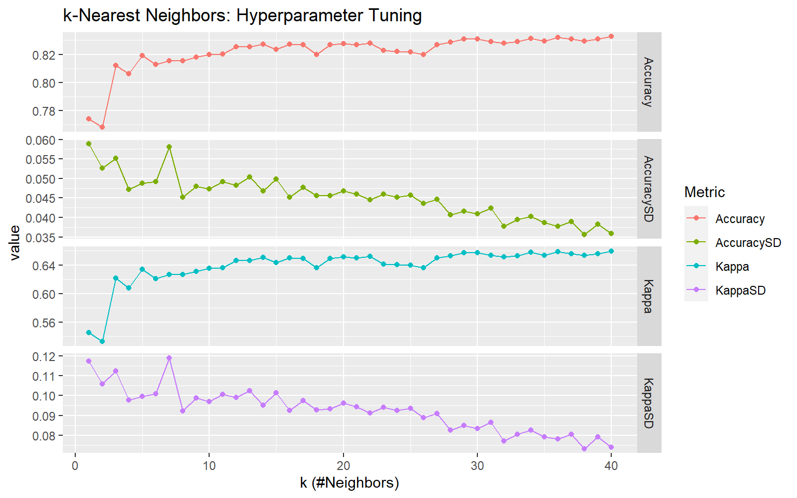
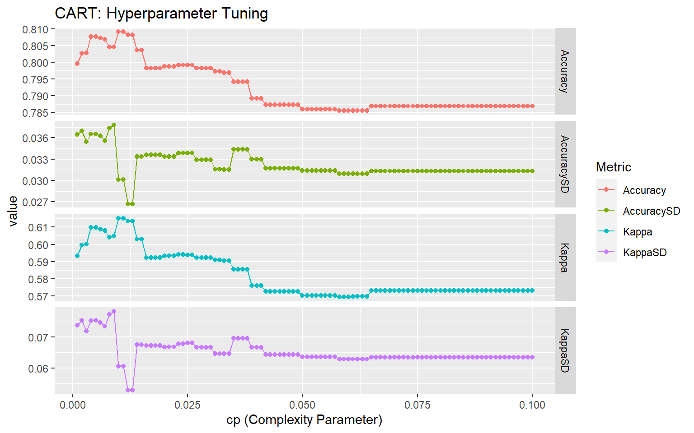
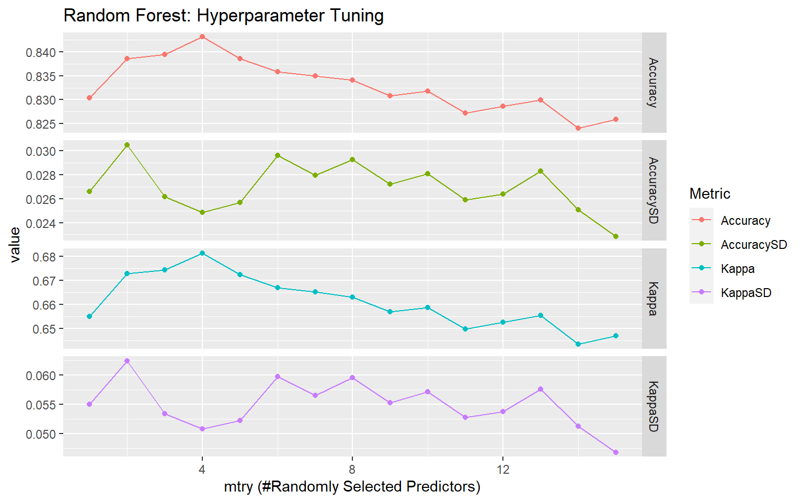
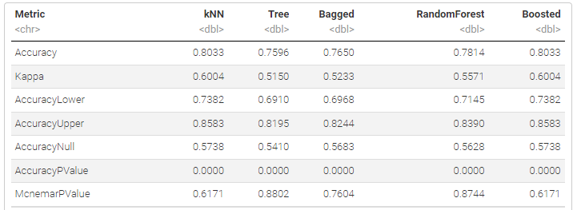

# KNN and Tree Based Ensemble Models

Fit kNN and tree based methods using the caret package to predict if a patient will have  heart disease or not.

[Project report](https://rpubs.com/clh2021/1119989)

Key features:

- Exploratory Data Analysis (EDA)
- Test/Train Data Split
- Cross Validation
- Hyperparameter Tuning
- K-Nearest Neighbors (KNN)
- Classification Tree
- Bagged Tree
- Random Forests
- Generalized Boosted Regression Models
- Confusion Matrix

R packages used:

- `here`: enables easy file referencing and builds file paths in a OS-independent way
- `stats`: loads this before loading `tidyverse` to avoid masking some `tidyverse` functions
- `tidyverse`: includes collections of useful packages like `dplyr` (data manipulation), `tidyr` (tidying data),  `ggplots` (creating graphs), etc.
- `glue`: embeds and evaluates R expressions into strings to be printed as messages
- `scales`: formats and labels scales nicely for better visualization
- `caret`: training and plotting classification and regression models
- `rpart`: recursive partitioning for classification, regression and survival trees. 
- `randomForest`: classification and regression based on a forest of trees using random inputs.
- `gbm`: gneralized boosted regression models

## Project Report

[Project report](https://rpubs.com/clh2021/1119989) ([Github Markdown](./KNN_Ensemble.md))([R Markdown](./KNN_Ensemble.Rmd))

The analysis results with all theoretical backgrounds and math derivations are included.

Author: Chien-Lan Hsueh (chienlan.hsueh at gmail.com)

## Overview and Project Goal

In this report, we conduct an exploratory data analysis (EDA) on the [Heart Failure Prediction Dataset](https://www.kaggle.com/datasets/fedesoriano/heart-failure-prediction). Then we fit KNN and ensemble models with repeated cross-validation on training data Test the models by finding the confusion matrix on the test data.

## Workflow

- Set up: Packages and Helper Functions
- Data
- Split the Data
- K-Nearest Neighbors (KNN)
- Ensemble Models
  - Classification Tree
  - Bagged Tree
  - Random Forests
  - Generalized Boosted Regression Models
- Model Comparison  

